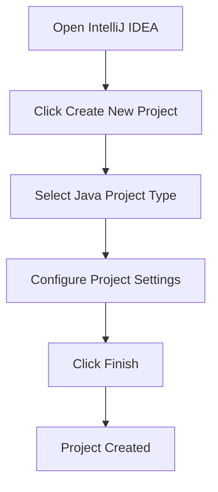
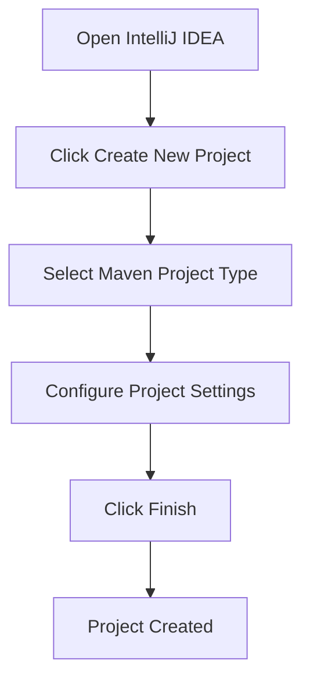

## Windows File System and Command Line Basics

### Introduction to Windows Command Line Interface

The Windows operating system, unlike Unix-based systems such as Linux and macOS, has historically been optimized for a graphical user interface (GUI) rather than a command-line interface (CLI). This means that many tasks that are straightforward in Unix-based systems require learning new commands and syntax in Windows. However, this does not mean that the command line is not useful or powerful in Windows; it simply requires a different approach and sometimes additional tools to make it more user-friendly.

#### Why Windows CLI is Different

Windows CLI, often referred to as the Command Prompt (CMD), has a different set of commands compared to Unix-based systems. This difference stems from the historical development of Windows, which was designed to provide a more accessible and user-friendly environment through GUIs. As a result, many operations that are typically performed via the command line in Unix-based systems are done through graphical interfaces in Windows.

However, the command line remains essential for advanced users and developers who need to automate tasks, manage files, and perform system administration. Understanding the Windows CLI is crucial for anyone working in a mixed environment or transitioning between different operating systems.

### Setting Up a More Unix-Like Environment on Windows

To bridge the gap between Windows and Unix-based systems, several terminal applications and tools can be installed to provide a more Unix-like experience. These tools allow users to leverage familiar Unix commands and scripting languages, making it easier to work with the command line on Windows.

#### Popular Terminal Applications

1. **Git Bash**: Git Bash provides a Unix-like environment for Windows, allowing users to run Unix commands such as `ls`, `cd`, and `grep`. It is particularly useful for developers working with Git repositories.
   
2. **Cmder**: Cmder is a powerful terminal emulator for Windows that includes ConEmu, a console emulator with tabs, splits, and other features. It supports both CMD and PowerShell, and can be configured to use Unix-like commands.

3. **Windows Subsystem for Linux (WSL)**: WSL allows users to run a Linux distribution directly on Windows, providing a full-fledged Unix environment. This is particularly useful for developers who need to work with Linux-specific tools and environments.

#### Installing and Configuring Git Bash

To install Git Bash, follow these steps:

1. Download Git for Windows from the official website: <https://gitforwindows.org/>
2. Run the installer and select the "Use Git from the Windows Command Prompt" option during installation.
3. Open Git Bash from the Start menu or by typing `bash` in the Windows search bar.

Once installed, you can use Unix-like commands in Git Bash. Here is an example of navigating directories and listing files:

```bash
# Navigate to the home directory
cd ~

# List files in the current directory
ls
```

### Setting Up IntelliJ IDEA

IntelliJ IDEA is a popular Integrated Development Environment (IDE) used for developing applications in various programming languages, including Java. It provides a comprehensive set of tools for coding, debugging, and managing projects.

#### Installing IntelliJ IDEA

To install IntelliJ IDEA, follow these steps:

1. Download IntelliJ IDEA Community Edition from the JetBrains website: <https://www.jetbrains.com/idea/download/>
2. Run the installer and follow the prompts to complete the installation.
3. Launch IntelliJ IDEA from the Start menu or desktop shortcut.

#### Creating a New Project

To create a new Java project in IntelliJ IDEA, follow these steps:

1. Open IntelliJ IDEA.
2. Click on "Create New Project".
3. Select "Java" from the list of available project types.
4. Configure the project settings, such as the project name and location.
5. Click "Finish" to create the project.

Here is a mermaid diagram illustrating the process of creating a new Java project in IntelliJ IDEA:



### Installing Java and Maven

Java is a widely-used programming language, and Maven is a build automation tool used primarily for Java projects. Both are essential for developing and building Java applications.

#### Installing Java

To install Java, follow these steps:

1. Download the latest version of the Java Development Kit (JDK) from the Oracle website: <https://www.oracle.com/java/technologies/javase-jdk11-downloads.html>
2. Run the installer and follow the prompts to complete the installation.
3. Set the `JAVA_HOME` environment variable to the installation directory of the JDK.

Here is an example of setting the `JAVA_HOME` environment variable in Windows:

```cmd
set JAVA_HOME=C:\Program Files\Java\jdk-11
```

#### Installing Maven

To install Maven, follow these steps:

1. Download the latest version of Maven from the Apache Maven website: <https://maven.apache.org/download.cgi>
2. Extract the downloaded archive to a directory of your choice.
3. Add the `bin` directory of the Maven installation to the `PATH` environment variable.

Here is an example of adding Maven to the `PATH` environment variable in Windows:

```cmd
set PATH=%PATH%;C:\path\to\apache-maven-3.8.6\bin
```

### Opening and Running a Java Maven Project in IntelliJ IDEA

Once Java and Maven are installed, you can open and run a Java Maven project in IntelliJ IDEA.

#### Creating a New Maven Project

To create a new Maven project in IntelliJ IDEA, follow these steps:

1. Open IntelliJ IDEA.
2. Click on "Create New Project".
3. Select "Maven" from the list of available project types.
4. Configure the project settings, such as the group ID, artifact ID, and packaging type.
5. Click "Finish" to create the project.

Here is a mermaid diagram illustrating the process of creating a new Maven project in IntelliJ IDEA:



#### Running a Maven Project

To run a Maven project in IntelliJ IDEA, follow these steps:

1. Open the project in IntelliJ IDEA.
2. Right-click on the `pom.xml` file and select "Run 'mvn clean install'".
3. The project will be compiled and packaged, and the output will be displayed in the console.

Here is an example of the `pom.xml` file for a simple Java Maven project:

```xml
<project xmlns="http://maven.apache.org/POM/4.0.0"
         xmlns:xsi="http://www.w3.org/2001/XMLSchema-instance"
         xsi:schemaLocation="http://maven.apache.org/POM/4.0.0 http://maven.apache.org/xsd/maven-4.0.0.xsd">
    <modelVersion>4.0.0</modelVersion>
    <groupId>com.example</groupId>
    <artifactId>my-project</artifactId>
    <version>1.0-SNAPSHOT</version>
    <dependencies>
        <dependency>
            <groupId>junit</groupId>
            <artifactId>junit</artifactId>
            <version>4.12</version>
            <scope>test</scope>
        </dependency>
    </dependencies>
</project>
```

### Common Pitfalls and How to Prevent Them

When working with the Windows command line and setting up development environments, there are several common pitfalls to be aware of. Here are some tips to avoid these issues:

#### Incorrect Environment Variables

One common issue is setting incorrect environment variables, such as `JAVA_HOME` and `PATH`. This can lead to errors when trying to run Java or Maven commands.

**How to Prevent:**

1. Ensure that the `JAVA_HOME` environment variable points to the correct installation directory of the JDK.
2. Ensure that the `PATH` environment variable includes the `bin` directory of the Maven installation.

Here is an example of setting the `JAVA_HOME` and `PATH` environment variables correctly:

```cmd
set JAVA_HOME=C:\Program Files\Java\jdk-11
set PATH=%PATH%;C:\path\to\apache-maven-3.8.6\bin
```

#### Incorrect Project Configuration

Another common issue is incorrect project configuration, such as missing dependencies or incorrect build settings. This can lead to compilation errors or runtime exceptions.

**How to Prevent:**

1. Ensure that the `pom.xml` file includes all necessary dependencies and plugins.
2. Ensure that the build settings in IntelliJ IDEA are correctly configured.

Here is an example of a correctly configured `pom.xml` file:

```xml
<project xmlns="http://maven.apache.org/POM/4.0.0"
         xmlns:xsi="http://www.w3.org/2001/XMLSchema-instance"
         xsi:schemaLocation="http://maven.apache.org/POM/4.0.0 http://maven.apache.org/xsd/maven-4.0.0.xsd">
    <modelVersion>4.0.0</modelVersion>
    <groupId>com.example</groupId>
    <artifactId>my-project</artifactId>
    <version>1.0-SNAPSHOT</version>
    <dependencies>
        <dependency>
            <groupId>junit</groupId>
            <artifactId>junit</artifactId>
            <version>4.12</version>
            <scope>test</scope>
        </dependency>
    </dependencies>
</project>
```

### Real-World Examples and Recent CVEs

While the primary focus of this chapter is on setting up a development environment on Windows, it is important to be aware of potential security vulnerabilities that can arise from improper configuration or usage of development tools.

#### CVE-2021-44228: Log4Shell

One of the most significant security vulnerabilities in recent years is the Log4Shell vulnerability (CVE-2021-44228). This vulnerability affects the Apache Log4j library, which is widely used in Java applications for logging purposes. An attacker could exploit this vulnerability to execute arbitrary code on a target system.

**How to Prevent:**

1. Ensure that all Java applications are using the latest version of Log4j.
2. Apply security patches and updates promptly.
3. Monitor logs for suspicious activity.

Here is an example of a secure configuration for Log4j:

```properties
log4j.appender.file=org.apache.log4j.FileAppender
log4j.appender.file.File=${catalina.base}/logs/app.log
log4j.appender.file.layout=org.apache.log4j.PatternLayout
log4j.appender.file.layout.ConversionPattern=%d{ABSOLUTE} %5p %c{1}:%L - %m%n
```

### Conclusion

Setting up a development environment on Windows requires understanding the differences between the Windows command line and Unix-based systems. By installing and configuring tools like Git Bash, Cmder, and WSL, you can create a more Unix-like environment on Windows. Additionally, setting up IntelliJ IDEA, Java, and Maven is essential for developing and building Java applications.

By following the steps outlined in this chapter and being aware of common pitfalls and security vulnerabilities, you can ensure a smooth and secure development experience on Windows.

### Practice Labs

For hands-on practice with setting up a development environment on Windows, consider the following labs:

- **PortSwigger Web Security Academy**: Provides interactive labs for web application security.
- **OWASP Juice Shop**: A deliberately insecure web application for practicing web security skills.
- **DVWA (Damn Vulnerable Web Application)**: A PHP/MySQL web application that is riddled with vulnerabilities for educational purposes.
- **WebGoat**: An interactive, gamified training application for learning about web application security.

These labs will help you gain practical experience with setting up and securing a development environment on Windows.

---
<!-- nav -->
[[05-Understanding the Windows File System and Command Line Basics|Understanding the Windows File System and Command Line Basics]] | [[DevOps/DevOps Bootcamp/01-Linux & OS Basics/07-Windows File System and Command Line Basics/00-Overview|Overview]] | [[07-Understanding Environment Variables and Java Home|Understanding Environment Variables and Java Home]]
