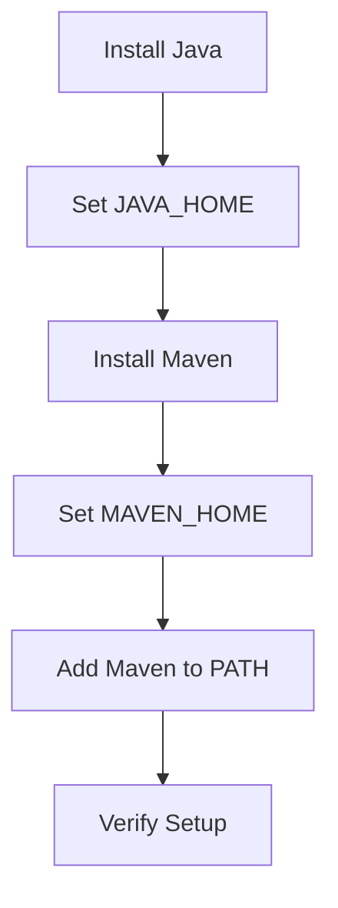
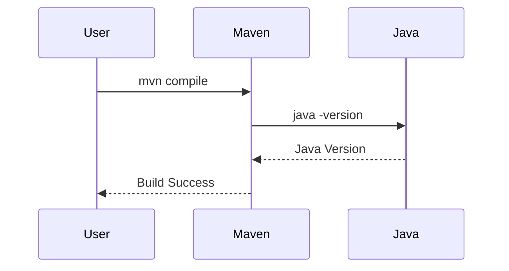

## Understanding Environment Variables and Java Home

### Background Theory

Environment variables are dynamic-named values that can affect the way running processes will behave on a computer. They are part of the environment in which a process runs. Environment variables are used to store information about the system, such as the path to important directories, the current user, and other settings.

One of the most commonly used environment variables in the context of Java development is `JAVA_HOME`. This variable specifies the root directory of a Java Development Kit (JDK) installation. It is crucial for many tools and applications that rely on Java, including Maven, Gradle, and various IDEs like IntelliJ IDEA.

### Setting JAVA_HOME

The `JAVA_HOME` variable should point to the root directory of the JDK installation, not the `bin` directory within it. The `bin` directory contains executable files like `java`, `javac`, and `jar`, but `JAVA_HOME` should point to the parent directory that contains these subdirectories.

#### Example Configuration

Suppose you have installed the OpenJDK at `C:\Program Files\OpenJDK`. The `JAVA_HOME` should be set to `C:\Program Files\OpenJDK`, not `C:\Program Files\OpenJDK\bin`.

```plaintext
JAVA_HOME=C:\Program Files\OpenJDK
```

### Setting Environment Variables in Windows

In Windows, environment variables can be set through the System Properties dialog or via the command line.

#### Using System Properties Dialog

1. Right-click on the `This PC` icon on the desktop or in the File Explorer.
2. Select `Properties`.
3. Click on `Advanced system settings`.
4. In the `System Properties` dialog, click on the `Environment Variables` button.
5. In the `Environment Variables` dialog, click on `New` under the `User variables` section.
6. Enter `JAVA_HOME` as the variable name and the path to your JDK installation as the variable value.
7. Click `OK` to close all dialogs.

#### Using Command Line

You can also set environment variables using the command line. However, changes made via the command line are temporary and will only persist for the duration of the current session.

```cmd
set JAVA_HOME=C:\Program Files\OpenJDK
```

To make the change permanent, you can add the `set` command to your system's startup scripts or use the `setx` command:

```cmd
setx JAVA_HOME "C:\Program Files\OpenJDK"
```

### Verifying JAVA_HOME

After setting `JAVA_HOME`, you can verify its value by opening a new command prompt window and typing:

```cmd
echo %JAVA_HOME%
```

If the variable is correctly set, the output will be the path to your JDK installation.

### Restarting the Session

It's important to note that changes to environment variables may not take effect immediately. You may need to restart your command prompt session or even your entire system to ensure the changes are applied.

### Installing Maven

Once `JAVA_HOME` is correctly set, you can proceed to install Maven. Maven is a build automation tool primarily used for Java projects, though it can be used for other languages as well.

#### Downloading Maven

Download the latest version of Maven from the official Apache Maven website. As of 2023, the latest version is Maven 3.9.x.

#### Extracting Maven

Extract the downloaded archive to a directory of your choice. For example, you might extract it to `C:\Program Files\Maven`.

#### Setting MAVEN_HOME

Similar to `JAVA_HOME`, you should set an environment variable `MAVEN_HOME` to point to the root directory of your Maven installation.

```plaintext
MAVEN_HOME=C:\Program Files\Maven
```

#### Adding Maven to PATH

To use Maven commands globally, you need to add the `bin` directory of your Maven installation to the `PATH` environment variable.

```plaintext
PATH=%PATH%;C:\Program Files\Maven\bin
```

### Verifying Maven Installation

After setting up `MAVEN_HOME` and updating the `PATH`, you can verify the installation by running:

```cmd
mvn --version
```

This command should display the version of Maven installed along with the version of Java being used.

### Real-World Examples and Pitfalls

#### Real-World Example: CVE-2021-44228 (Log4Shell)

The Log4Shell vulnerability (CVE-2021-44228) affected many Java applications. One of the ways to mitigate this vulnerability is to ensure that your Java environment is properly configured and up-to-date. Setting `JAVA_HOME` correctly ensures that your Java environment is consistent and predictable.

#### Pitfall: Incorrect JAVA_HOME Path

If `JAVA_HOME` is incorrectly set to the `bin` directory instead of the root directory, tools that rely on `JAVA_HOME` may fail to find necessary resources. For example, Maven might not be able to locate the `java` executable, leading to build failures.

### How to Prevent / Defend

#### Detection

To detect incorrect `JAVA_HOME` settings, you can check the value of `JAVA_HOME` and ensure it points to the correct directory. You can also run a simple Java program to verify that the correct Java version is being used.

```java
public class CheckJavaVersion {
    public static void main(String[] args) {
        System.out.println("Java Version: " + System.getProperty("java.version"));
    }
}
```

Compile and run this program:

```cmd
javac CheckJavaVersion.java
java CheckJavaVersion
```

#### Prevention

1. **Set `JAVA_HOME` Correctly**: Ensure `JAVA_HOME` points to the root directory of your JDK installation.
2. **Update Environment Variables**: Use the `setx` command to update environment variables permanently.
3. **Restart Sessions**: After setting environment variables, restart your command prompt session or system to ensure the changes take effect.
4. **Use Secure Coding Practices**: Follow secure coding practices to avoid vulnerabilities like Log4Shell.

### Complete Example

Here is a complete example of setting up `JAVA_HOME` and `MAVEN_HOME`:

1. **Install Java**:
   - Download and install OpenJDK from the official website.
   - Extract to `C:\Program Files\OpenJDK`.

2. **Set JAVA_HOME**:
   - Open the System Properties dialog.
   - Set `JAVA_HOME` to `C:\Program Files\OpenJDK`.

3. **Install Maven**:
   - Download and extract Maven to `C:\Program Files\Maven`.

4. **Set MAVEN_HOME**:
   - Set `MAVEN_HOME` to `C:\Program Files\Maven`.

5. **Add Maven to PATH**:
   - Add `C:\Program Files\Maven\bin` to the `PATH`.

6. **Verify Setup**:
   - Run `echo %JAVA_HOME%` and `echo %MAVEN_HOME%`.
   - Run `mvn --version`.

### Mermaid Diagrams

#### Environment Variable Setup



#### Maven Build Process



### Practice Labs

For hands-on practice with setting up environment variables and installing Maven, consider the following labs:

- **PortSwigger Web Security Academy**: Offers labs on setting up development environments.
- **OWASP Juice Shop**: Provides a comprehensive setup guide for developers.
- **DVWA**: Demonstrates secure coding practices and environment setup.

By following these steps and understanding the underlying concepts, you can ensure that your development environment is properly configured and secure.

---
<!-- nav -->
[[06-Windows File System and Command Line Basics|Windows File System and Command Line Basics]] | [[DevOps/DevOps Bootcamp/01-Linux & OS Basics/07-Windows File System and Command Line Basics/00-Overview|Overview]] | [[08-Understanding Environment Variables and the PATH Variable in Windows|Understanding Environment Variables and the PATH Variable in Windows]]
