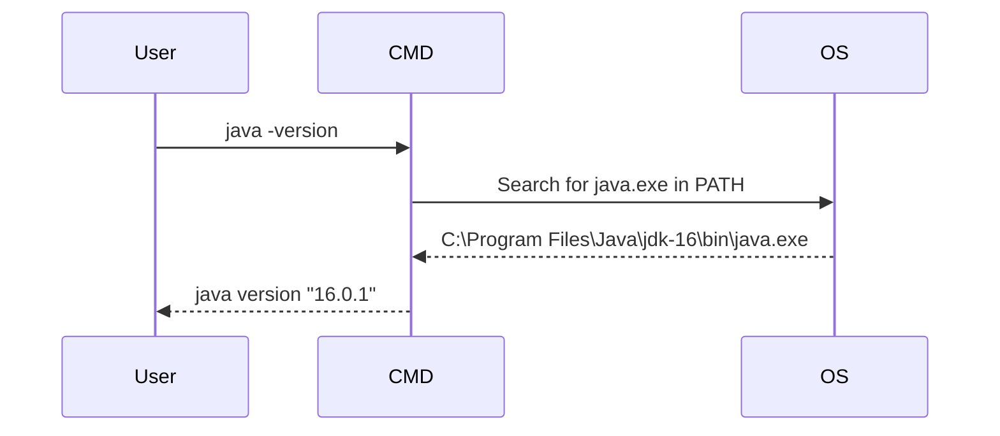

## Understanding Environment Variables and the PATH Variable in Windows

### Introduction to Environment Variables

Environment variables are dynamic named values that can affect the way running processes behave on a computer. They are used to store information about the system, such as the location of directories, the default language, and other system-specific settings. These variables can be accessed by applications and scripts to determine the environment in which they are running.

In Windows, environment variables are categorized into two types:

1. **User Variables**: These are specific to the current user account and do not affect other user accounts on the same machine.
2. **System Variables**: These are available to all users on the machine and are typically used for system-wide configurations.

### The PATH Variable

One of the most important environment variables in Windows is the `PATH` variable. This variable contains a list of directory paths where the operating system looks for executable files (such as `.exe`, `.com`, and `.bat` files) when a command is entered in the command prompt.

#### Why the PATH Variable Matters

The `PATH` variable is crucial because it allows you to run executables without specifying their full path. For example, instead of typing `C:\Program Files\Java\jdk-16\bin\java.exe`, you can simply type `java`. This makes the command line much more convenient and efficient.

#### How the PATH Variable Works

When you enter a command in the command prompt, Windows searches through the directories listed in the `PATH` variable to find an executable file that matches the command name. If it finds a match, it runs the corresponding program; otherwise, it returns an error indicating that the command was not found.

### Setting Up the PATH Variable

To set up the `PATH` variable, you need to modify the environment variables. Here’s how you can do it:

1. **Accessing Environment Variables**:
    - Open the Start menu and type "advanced system settings".
    - Click on "Advanced system settings" to open the System Properties dialog.
    - Click on the "Environment Variables" button.

2. **Modifying the PATH Variable**:
    - In the Environment Variables dialog, you will see two sections: User variables and System variables.
    - To modify the `PATH` variable, select the `Path` variable in either section (depending on whether you want the change to apply to the current user or all users) and click "Edit".

3. **Adding a New Directory**:
    - In the Edit Environment Variable dialog, click "New" and enter the path to the directory containing the executable you want to run.
    - Click "OK" to save the changes.

### Example: Adding Java to the PATH

Let's say you have installed Java and want to add the `java.exe` executable to your `PATH`.

1. **Locate the Java Installation Directory**:
    - Typically, Java is installed in a directory like `C:\Program Files\Java\jdk-16\bin`.

2. **Add the Directory to the PATH**:
    - Follow the steps above to open the Environment Variables dialog.
    - Select the `Path` variable and click "Edit".
    - Click "New" and enter `C:\Program Files\Java\jdk-16\bin`.
    - Click "OK" to save the changes.

### Verifying the Change

After modifying the `PATH` variable, you can verify that the change took effect by opening a new command prompt and typing `java -version`. If the `java` command is recognized, you should see the version information for Java.



### Common Pitfalls and How to Avoid Them

#### Overwriting Existing Paths

One common mistake is overwriting existing paths instead of appending new ones. Always ensure that you are adding a new entry rather than replacing an existing one.

#### Incorrect Path Syntax

Another pitfall is using incorrect path syntax. Ensure that the path is correctly formatted and does not contain any typos.

### Real-World Examples and Security Implications

#### CVE-2021-44228 (Log4Shell)

The Log4Shell vulnerability (CVE-2021-44228) is a critical security flaw in the Apache Log4j library. This vulnerability can be exploited by attackers to execute arbitrary code on a server. One way to mitigate this vulnerability is to ensure that the `PATH` variable does not include directories that could be manipulated by untrusted sources.

#### Secure Coding Practices

To prevent security issues related to the `PATH` variable, follow these best practices:

1. **Minimize the Number of Directories in PATH**: Only include necessary directories in the `PATH` variable.
2. **Use Absolute Paths**: When executing commands, use absolute paths instead of relying on the `PATH` variable.
3. **Validate Input**: Ensure that any input used to construct paths is properly validated to prevent injection attacks.

### How to Prevent / Defend

#### Detection

To detect potential issues with the `PATH` variable, you can use tools like `pathcheck` or manually inspect the `PATH` variable.

```bash
echo %PATH%
```

#### Prevention

To prevent security issues related to the `PATH` variable, follow these steps:

1. **Restrict Write Access**: Ensure that only trusted users have write access to directories included in the `PATH` variable.
2. **Use Least Privilege Principle**: Run applications with the least privilege necessary to perform their tasks.
3. **Regular Audits**: Regularly audit the `PATH` variable to ensure that it only includes necessary directories.

#### Secure-Coding Fixes

Here is an example of a vulnerable script and its secure counterpart:

**Vulnerable Script**

```bash
#!/bin/bash
java -version
```

**Secure Script**

```bash
#!/bin/bash
/usr/lib/jvm/java-16-openjdk/bin/java -version
```

### Hands-On Practice

For hands-on practice with setting up environment variables and the `PATH` variable, consider the following labs:

- **PortSwigger Web Security Academy**: This lab provides exercises on various aspects of web security, including setting up environment variables.
- **OWASP Juice Shop**: This lab includes exercises on securing web applications, which often involve configuring environment variables.
- **DVWA (Damn Vulnerable Web Application)**: This lab includes exercises on securing web applications, which often involve configuring environment variables.

By following these steps and best practices, you can effectively manage the `PATH` variable in Windows and ensure that your system remains secure and efficient.

---
<!-- nav -->
[[07-Understanding Environment Variables and Java Home|Understanding Environment Variables and Java Home]] | [[DevOps/DevOps Bootcamp/01-Linux & OS Basics/07-Windows File System and Command Line Basics/00-Overview|Overview]] | [[DevOps/DevOps Bootcamp/01-Linux & OS Basics/07-Windows File System and Command Line Basics/09-Practice Questions & Answers|Practice Questions & Answers]]
