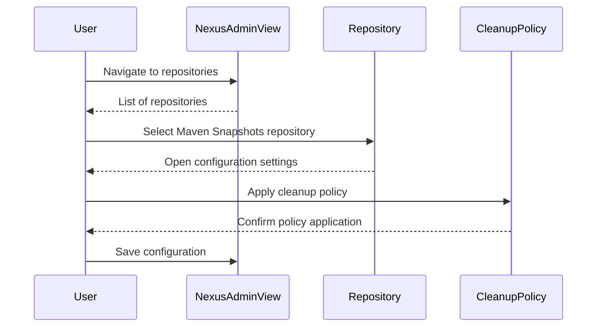
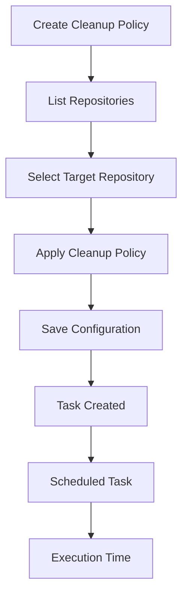
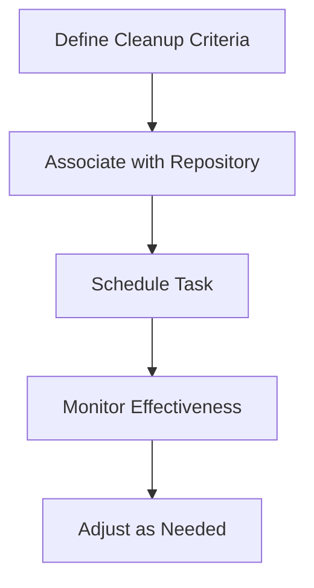

## Introduction to Cleanup Policies for Repository Management

In the realm of DevOps, managing repositories effectively is crucial for maintaining a clean and efficient environment. One key aspect of this management is the implementation of cleanup policies. These policies help automate the process of removing unnecessary or outdated artifacts from repositories, ensuring that the storage space is used efficiently and that the environment remains clutter-free.

### What Are Cleanup Policies?

Cleanup policies are automated rules that define when and how to remove artifacts from a repository. They are particularly useful in environments where artifacts are frequently updated or where temporary builds are generated. By automating the cleanup process, teams can focus on more critical tasks while ensuring that their repositories remain organized and efficient.

### Why Are Cleanup Policies Important?

Cleanup policies are important for several reasons:

1. **Space Efficiency**: Removing unnecessary artifacts frees up valuable storage space, which can be crucial in large-scale environments.
2. **Performance Optimization**: A clean repository can improve performance by reducing the time required to search for and retrieve necessary artifacts.
3. **Security**: Regularly cleaning up repositories can help mitigate security risks associated with outdated or vulnerable artifacts.
4. **Compliance**: Many organizations have compliance requirements that mandate regular cleanup of certain types of data. Cleanup policies can help ensure that these requirements are met.

### How Do Cleanup Policies Work?

Cleanup policies work by defining criteria for when artifacts should be removed from a repository. These criteria can include factors such as the age of the artifact, the number of versions retained, or specific patterns that identify artifacts to be cleaned up.

#### Example: Maven Snapshots Repository

Let's consider an example using the Maven Snapshots repository. In this scenario, the cleanup policy is designed to remove old snapshot versions of artifacts. Snapshots are typically used for development builds and are frequently updated. By implementing a cleanup policy, we can ensure that only the most recent snapshot versions are retained, freeing up space and improving performance.

### Associating Cleanup Policies with Repositories

To make a cleanup policy effective, it must be associated with the appropriate repository. In the context of Nexus, a popular artifact repository manager, this association is straightforward.

#### Steps to Associate a Cleanup Policy

1. **Create the Cleanup Policy**: First, create the cleanup policy in Nexus. This involves defining the criteria for when artifacts should be removed.
2. **List Repositories**: Navigate to the list of repositories in the Nexus admin view.
3. **Select the Target Repository**: Identify the repository to which the cleanup policy should be applied. In our example, we will use the Maven Snapshots repository.
4. **Apply the Cleanup Policy**: In the configuration settings of the selected repository, find the section for cleanup policies and apply the desired policy.
5. **Save the Configuration**: Save the changes to ensure that the cleanup policy is associated with the repository.

### Scheduling and Execution of Cleanup Tasks

Once a cleanup policy is associated with a repository, it needs to be scheduled for execution. Nexus automatically creates a task for the cleanup policy and schedules it to run at a specified time.

#### Default Execution Time

By default, the cleanup task is scheduled to run at the beginning of the day. This ensures that the cleanup process does not interfere with normal operations during peak hours.

#### Customizing the Schedule

While the default schedule is convenient, it may not always meet the needs of every organization. To customize the schedule, you can modify the task settings in Nexus.

### Real-World Examples and Case Studies

#### Example: Space Efficiency Improvement

Consider a large organization that uses Nexus to manage its Maven artifacts. Over time, the repository became cluttered with outdated snapshot versions, leading to inefficient use of storage space. By implementing a cleanup policy that removes snapshot versions older than 30 days, the organization was able to free up significant amounts of storage space, improving overall efficiency.

#### Example: Performance Optimization

Another organization experienced slow performance when searching for artifacts due to the large number of outdated versions in the repository. By applying a cleanup policy that retains only the most recent snapshot versions, the organization saw a noticeable improvement in search performance, allowing developers to quickly locate and retrieve necessary artifacts.

### Common Pitfalls and Best Practices

#### Pitfall: Overzealous Cleanup

One common pitfall is setting overly aggressive cleanup criteria, which can result in the removal of necessary artifacts. To avoid this, it is important to carefully define the criteria for the cleanup policy based on the specific needs of the organization.

#### Best Practice: Regular Review

Regularly review the effectiveness of the cleanup policy to ensure that it continues to meet the organization's needs. This may involve adjusting the criteria or scheduling as the environment evolves.

### How to Prevent / Defend

#### Detection

To detect issues related to cleanup policies, monitor the repository for signs of inefficiency, such as excessive storage usage or slow performance. Tools like Nexus provide built-in monitoring capabilities that can help identify potential problems.

#### Prevention

To prevent issues, follow best practices for defining and applying cleanup policies. Ensure that the criteria are appropriate for the organization's needs and that the policy is regularly reviewed and adjusted as necessary.

#### Secure Coding Fixes

When implementing cleanup policies, it is important to ensure that the process is secure. This includes protecting against unauthorized access to the repository and ensuring that sensitive data is properly handled.

### Conclusion

Cleanup policies are a powerful tool for managing repositories in a DevOps environment. By automating the process of removing unnecessary artifacts, these policies help ensure that repositories remain organized, efficient, and secure. Whether you are managing Maven snapshots or other types of artifacts, implementing a well-defined cleanup policy can significantly improve the overall performance and efficiency of your repository management.

### Hands-On Labs

For practical experience with cleanup policies, consider the following hands-on labs:

- **PortSwigger Web Security Academy**: Offers exercises on managing repositories and implementing cleanup policies.
- **OWASP Juice Shop**: Provides a real-world application environment where you can practice implementing and managing cleanup policies.
- **DVWA (Damn Vulnerable Web Application)**: Useful for practicing repository management in a controlled environment.

These labs will provide you with the hands-on experience needed to effectively implement and manage cleanup policies in your own DevOps environment.

---
<!-- nav -->
[[DevOps/DevOps Bootcamp/01-Linux & OS Basics/08-Cleanup Policies for Repository Management/00-Overview|Overview]] | [[02-Cleanup Policies for Repository Management|Cleanup Policies for Repository Management]]
