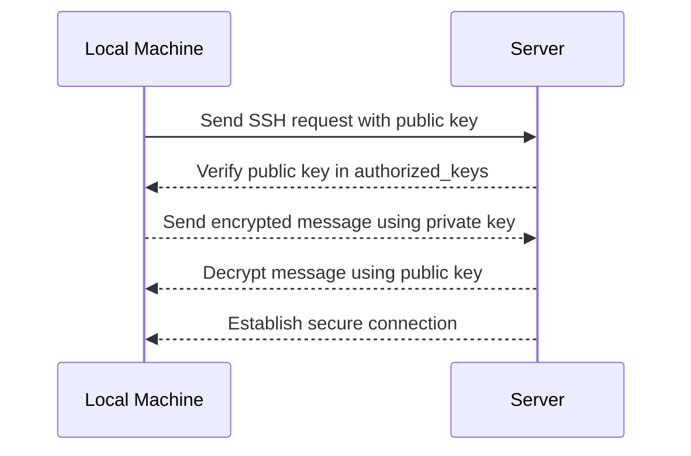

## Introduction to Secure Linux User Management for Server Administration

In the realm of DevOps, managing users securely on a Linux server is a critical task. This involves creating user accounts, setting up SSH access, and ensuring that these configurations are robust against potential security threats. In this chapter, we will delve deep into the process of creating secure Linux users for server administration, covering every aspect from theoretical foundations to practical implementation.

### Background Theory

Linux servers are often managed by multiple users, each with different levels of access and responsibilities. Proper user management ensures that only authorized personnel can access sensitive areas of the system, thereby reducing the risk of unauthorized access and potential security breaches.

#### User Accounts and Permissions

A user account in Linux consists of a username and associated permissions. Each user has a home directory where personal files and configurations are stored. Permissions are controlled through the file system's ownership and permission settings, which determine what actions a user can perform on files and directories.

#### SSH Access

Secure Shell (SSH) is a cryptographic network protocol used for secure communication between a client and a server. SSH allows users to log in to remote machines and execute commands on them. To enhance security, SSH supports public-key authentication, which eliminates the need for password-based login.

### Creating Secure Linux Users

To create a secure Linux user, follow these steps:

1. **Create a New User Account**
2. **Set Up SSH Key Authentication**
3. **Configure SSH Settings**

#### Step 1: Create a New User Account

Creating a new user account involves adding a new entry to the `/etc/passwd` file, which contains information about all users on the system. The `adduser` command simplifies this process by creating a home directory and setting up default configurations.

```bash
sudo adduser nana
```

This command prompts you to enter a password for the new user and provides options to set additional details such as the user's full name and phone number.

#### Step 2: Set Up SSH Key Authentication

SSH key authentication is more secure than password-based authentication because it uses a pair of cryptographic keys: a private key (kept secret) and a public key (shared with the server).

##### Generating SSH Keys

First, generate an SSH key pair on your local machine using the `ssh-keygen` command:

```bash
ssh-keygen -t rsa -b 4096 -C "nana@example.com"
```

This command generates an RSA key pair with a 4096-bit length and associates it with an email address for identification purposes. The generated keys are stored in the `~/.ssh` directory.

##### Copying Public Key to the Server

Next, copy the public key to the server using the `ssh-copy-id` command:

```bash
ssh-copy-id nana@server_ip
```

This command appends the public key to the `~/.ssh/authorized_keys` file on the server.

#### Step 3: Configure SSH Settings

To ensure that SSH is configured securely, modify the `/etc/ssh/sshd_config` file. Here are some important settings:

- **Disable Password Authentication**: This forces users to use SSH keys for authentication.
  
  ```plaintext
  PasswordAuthentication no
  ```

- **Allow Only Specific Users**: Restrict SSH access to specific users by specifying their usernames.
  
  ```plaintext
  AllowUsers nana
  ```

- **Enable Strict Mode**: This enhances security by enforcing strict checking of user permissions.
  
  ```plaintext
  StrictModes yes
  ```

After making changes, restart the SSH service to apply the new configuration:

```bash
sudo systemctl restart sshd
```

### Detailed Example: Setting Up SSH Key Authentication

Let's walk through a detailed example of setting up SSH key authentication for a user named `nana`.

#### Step 1: Generate SSH Keys

On the local machine, run the following command to generate an SSH key pair:

```bash
ssh-keygen -t rsa -b 4096 -C "nana@example.com"
```

This command creates two files in the `~/.ssh` directory:

- `id_rsa`: The private key (keep this secret)
- `id_rsa.pub`: The public key (share this with the server)

#### Step 2: Copy Public Key to the Server

Use the `ssh-copy-id` command to copy the public key to the server:

```bash
ssh-copy-id nana@server_ip
```

This command appends the public key to the `~/.ssh/authorized_keys` file on the server.

#### Step 3: Verify SSH Key Authentication

Log in to the server using SSH:

```bash
ssh nana@server_ip
```

If the setup is correct, you should be able to log in without being prompted for a password.

### Mermaid Diagram: SSH Key Authentication Flow



### Common Pitfalls and How to Avoid Them

#### Pitfall 1: Using Weak Passwords

Using weak passwords can make it easier for attackers to gain unauthorized access to the system. Always use strong, unique passwords for each user account.

#### Pitfall 2: Not Disabling Password Authentication

Disabling password authentication forces users to use SSH keys, which are more secure. Ensure that `PasswordAuthentication` is set to `no` in the `/etc/ssh/sshd_config` file.

#### Pitfall 3: Not Configuring Strict Modes

Enabling strict modes ensures that the SSH daemon checks user permissions strictly, preventing potential security vulnerabilities.

### Real-World Examples and Recent Breaches

#### Example 1: CVE-2021-20225

CVE-2021-20225 is a vulnerability in the OpenSSH server that allows an attacker to bypass authentication if the `PermitUserEnvironment` option is enabled. This highlights the importance of disabling unnecessary features and keeping the SSH configuration minimal.

#### Example 2: Capital One Data Breach (2019)

The Capital One data breach involved an attacker exploiting a misconfigured web application firewall to gain unauthorized access to sensitive data. Proper user management and secure SSH configurations could have prevented such an incident.

### How to Prevent / Defend

#### Detection

Regularly audit user accounts and SSH configurations to identify any unauthorized access attempts. Use tools like `fail2ban` to monitor failed login attempts and automatically block suspicious IP addresses.

#### Prevention

1. **Use Strong Passwords**: Enforce strong password policies and consider using multi-factor authentication (MFA).
2. **Disable Unnecessary Features**: Disable features like `PermitUserEnvironment` unless absolutely necessary.
3. **Keep Software Updated**: Regularly update the SSH server and other software to patch known vulnerabilities.

#### Secure Coding Fixes

Compare the insecure and secure versions of the SSH configuration:

**Insecure Configuration:**

```plaintext
PasswordAuthentication yes
```

**Secure Configuration:**

```plaintext
PasswordAuthentication no
```

#### Configuration Hardening

Hardening the SSH configuration involves disabling unnecessary features and enabling security-enhancing options. Here is a sample hardened configuration:

```plaintext
PasswordAuthentication no
PermitRootLogin no
AllowUsers nana
StrictModes yes
```

### Practice Labs

For hands-on practice, consider the following labs:

- **PortSwigger Web Security Academy**: Offers a comprehensive course on web security, including SSH key management.
- **OWASP Juice Shop**: A deliberately vulnerable web application for practicing security testing and penetration testing.
- **DVWA (Damn Vulnerable Web Application)**: A PHP/MySQL web application that is riddled with vulnerabilities for educational purposes.

By following these steps and best practices, you can ensure that your Linux server is securely managed and protected against potential security threats.

---
<!-- nav -->
[[DevOps/DevOps Bootcamp/01-Linux & OS Basics/09-Creating Secure Linux Users For Server Administration/00-Overview|Overview]] | [[02-Creating Secure Linux Users for Server Administration|Creating Secure Linux Users for Server Administration]]
