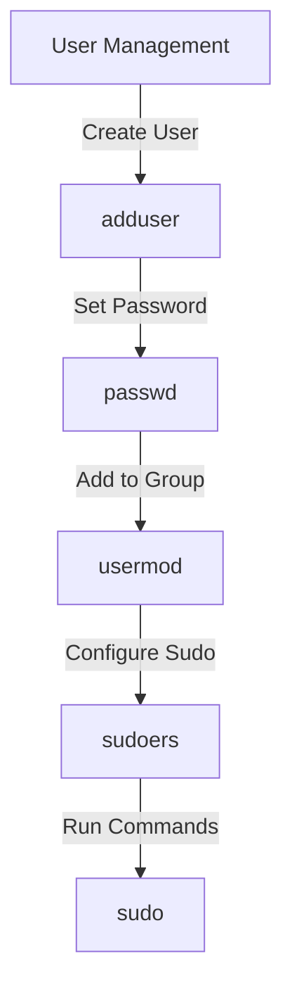

## Creating Secure Linux Users for Server Administration

When managing a Linux server, creating secure users is a fundamental aspect of maintaining system integrity and security. This section delves into the best practices for creating and managing Linux users, focusing on the importance of avoiding the use of the `root` user for regular operations and deploying applications with limited privileges.

### Why Avoid Using the Root User?

The `root` user, also known as the superuser, has unrestricted access to all files and commands on a Linux system. While this level of access is necessary for certain administrative tasks, using the `root` user for regular operations poses significant risks:

1. **Security Risks**: If an attacker gains access to the `root` account, they can potentially take control of the entire system. Limiting the use of `root` reduces the attack surface.
   
2. **Accidental Damage**: Regular users are less likely to accidentally perform destructive actions, such as deleting critical system files or modifying important configurations.

3. **Auditability**: Using separate accounts for different roles allows for better tracking and auditing of actions performed on the system.

### Best Practices for Creating Secure Users

#### Creating a New User

To create a new user, you can use the `adduser` command. Here’s a step-by-step guide:

1. **Create the User**:
    ```sh
    sudo adduser nana
    ```

2. **Set the Password**:
    After running the `adduser` command, you will be prompted to set a password for the new user. Ensure the password is strong and follows best practices for password security.

3. **Configure User Settings**:
    The `adduser` command will prompt you to configure additional settings for the user, such as the user's full name, room number, phone number, etc. These fields are optional but can be useful for identification purposes.

4. **Verify the User Creation**:
    To verify that the user has been created successfully, you can check the `/etc/passwd` file:
    ```sh
    cat /etc/passwd | grep nana
    ```

### Assigning Permissions to Users

Once a user is created, it is crucial to assign them only the necessary permissions to perform their tasks. This principle is known as the Principle of Least Privilege (PoLP).

#### Adding a User to a Group

To grant a user specific permissions, you can add them to a group that has those permissions. For example, to allow a user to execute certain commands that require elevated privileges, you can add them to the `sudo` group.

1. **Add User to the `sudo` Group**:
    ```sh
    sudo usermod -aG sudo nana
    ```

2. **Verify Group Membership**:
    To verify that the user has been added to the `sudo` group, you can check the `/etc/group` file:
    ```sh
    cat /etc/group | grep sudo
    ```

### Configuring Sudo Access

The `sudo` command allows users to execute commands with elevated privileges. By default, users in the `sudo` group can run commands with `root` privileges. However, it is often desirable to restrict the commands that a user can run.

1. **Edit the Sudoers File**:
    To configure `sudo` access, you need to edit the `/etc/sudoers` file. This file contains rules that define which users can run which commands with elevated privileges.

    ```sh
    sudo visudo
    ```

2. **Add Custom Rules**:
    For example, to allow the user `nana` to run only the `apt-get update` command with `sudo`, you can add the following rule:
    ```plaintext
    nana ALL=(ALL) NOPASSWD: /usr/bin/apt-get update
    ```

3. **Save and Exit**:
    After making changes, save the file and exit the editor.

### Real-World Examples and Breaches

#### Example: CVE-2019-19781

In 2019, a critical vulnerability was discovered in the Apache Struts framework, designated as CVE-2019-19781. This vulnerability allowed attackers to execute arbitrary code on affected systems. One of the key factors that exacerbated the impact of this vulnerability was the fact that many instances were running with elevated privileges, including the `root` user.

By ensuring that applications and services are run with limited privileges, the potential damage caused by such vulnerabilities can be significantly reduced.

### How to Prevent / Defend

#### Detection

1. **Audit Logs**:
    Regularly review audit logs to identify any unauthorized use of elevated privileges. Tools like `auditd` can be used to monitor and log system calls.

2. **Intrusion Detection Systems (IDS)**:
    Deploy IDS to monitor network traffic and system activity for signs of unauthorized access or malicious activity.

#### Prevention

1. **Principle of Least Privilege (PoLP)**:
    Ensure that all users and processes have only the minimum privileges required to perform their tasks.

2. **Regular Audits**:
    Conduct regular audits of user permissions and group memberships to ensure compliance with security policies.

3. **Secure Configuration Management**:
    Use tools like Ansible, Puppet, or Chef to manage user configurations and ensure consistency across systems.

### Secure Coding Fixes

#### Vulnerable Code Example

Consider a scenario where a script is run with `root` privileges unnecessarily:

```sh
#!/bin/bash
# Vulnerable script
echo "Running as root"
apt-get update
```

#### Secure Code Example

To mitigate this, the script can be modified to run with minimal privileges:

```sh
#!/bin/bash
# Secure script
echo "Running as non-root user"
sudo apt-get update
```

### Complete Example: Full HTTP Request and Response

While this section primarily deals with Linux user management, it is worth noting that similar principles apply to web applications and services. Here is an example of a full HTTP request and response for a service that requires elevated privileges:

#### HTTP Request

```http
POST /update HTTP/1.1
Host: example.com
Authorization: Bearer <access_token>
Content-Type: application/json

{
  "command": "apt-get update"
}
```

#### HTTP Response

```http
HTTP/1.1 200 OK
Date: Mon, 23 Jan 2023 12:00:00 GMT
Content-Type: application/json

{
  "status": "success",
  "message": "Update command executed successfully"
}
```

### Mermaid Diagrams

#### User Management Architecture



### Practice Labs

For hands-on experience with creating and managing secure Linux users, consider the following labs:

- **PortSwigger Web Security Academy**: Offers practical exercises on securing web applications, including user management.
- **OWASP Juice Shop**: Provides a vulnerable web application for practicing security techniques.
- **DVWA (Damn Vulnerable Web Application)**: Another excellent resource for learning about web application security.

By following these best practices and utilizing the provided resources, you can significantly enhance the security of your Linux server environment.

---
<!-- nav -->
[[01-Introduction to Secure Linux User Management for Server Administration|Introduction to Secure Linux User Management for Server Administration]] | [[DevOps/DevOps Bootcamp/01-Linux & OS Basics/09-Creating Secure Linux Users For Server Administration/00-Overview|Overview]] | [[DevOps/DevOps Bootcamp/01-Linux & OS Basics/09-Creating Secure Linux Users For Server Administration/03-Practice Questions & Answers|Practice Questions & Answers]]
