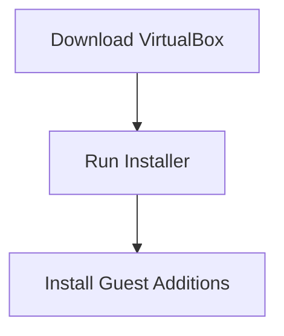
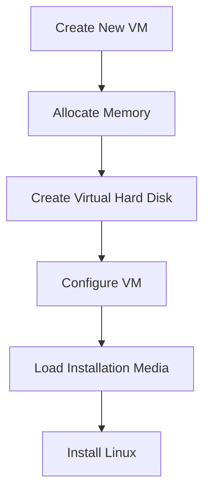
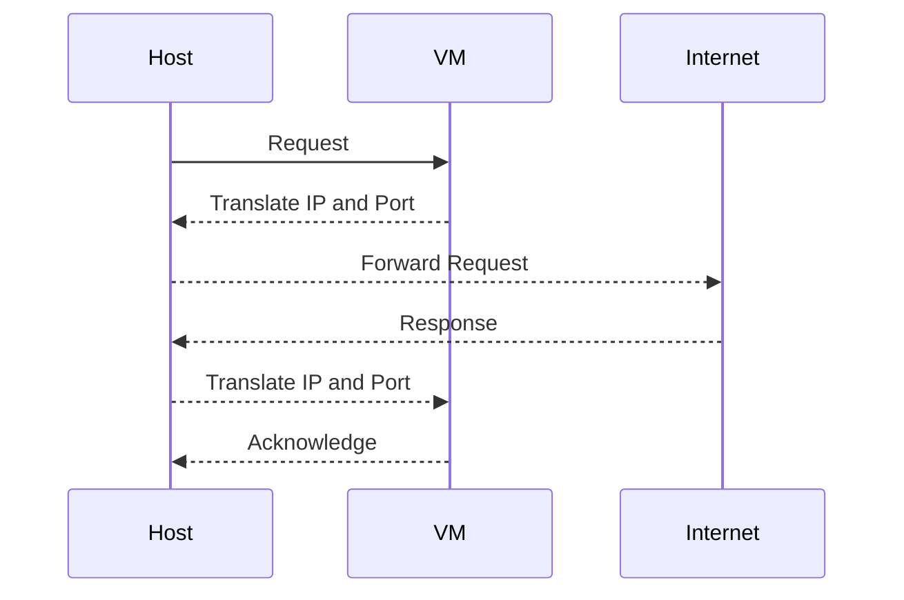
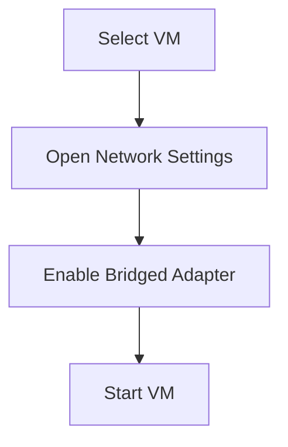
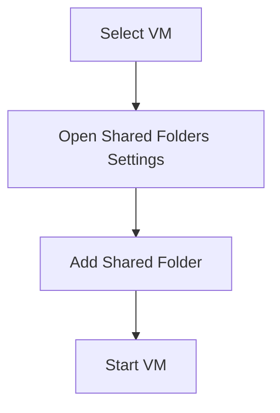
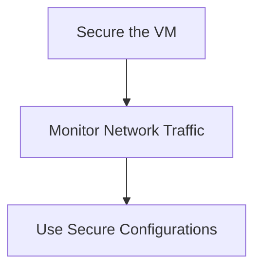
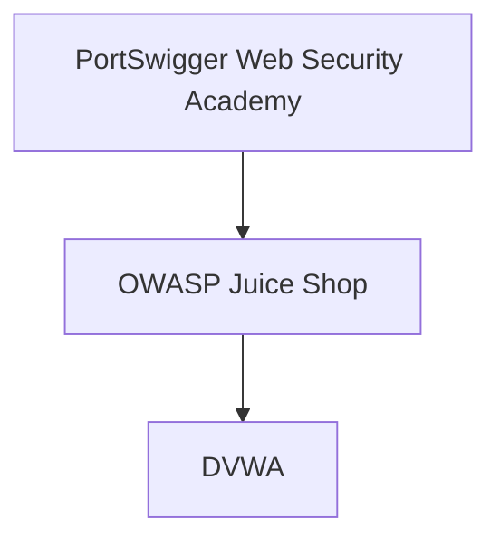

## Introduction to Virtual Machines and Network Isolation

Virtual machines (VMs) are a powerful tool for developers and administrators to test and run applications in a controlled environment. They allow you to create a separate computing environment that is isolated from the host operating system. This isolation is crucial for security and stability reasons. In this section, we will delve into the details of setting up a Linux VM using VirtualBox and explore the network isolation features that come with it.

### What is a Virtual Machine?

A virtual machine is a software emulation of a physical computer system. It allows you to run an operating system and applications within a simulated environment. This environment is created by a hypervisor, which is a layer of software that manages the allocation of resources to the VMs.

#### Why Use Virtual Machines?

1. **Testing and Development**: VMs provide a sandboxed environment to test new software, configurations, or updates without affecting the host system.
2. **Isolation**: VMs can be isolated from the host system, providing a level of security and preventing issues from spreading to the host.
3. **Resource Management**: VMs can be allocated specific amounts of CPU, memory, and storage, allowing for efficient resource management.
4. **Portability**: VMs can be easily moved between different physical hosts, making them ideal for cloud environments.

### VirtualBox Overview

VirtualBox is a popular open-source hypervisor that allows you to create and manage virtual machines. It supports various operating systems, including Windows, macOS, Linux, and Solaris. VirtualBox provides a user-friendly interface and a wide range of features for managing VMs.

#### Installing VirtualBox

To install VirtualBox, follow these steps:

1. **Download VirtualBox**: Visit the [VirtualBox website](https://www.virtualbox.org/) and download the appropriate version for your operating system.
2. **Install VirtualBox**: Run the installer and follow the prompts to install VirtualBox on your system.
3. **Install Guest Additions**: After installing VirtualBox, you should also install the Guest Additions, which provide additional functionality such as shared folders and improved graphics performance.

### Setting Up a Linux VM

Once VirtualBox is installed, you can proceed to set up a Linux VM. Here are the steps to create a new VM and install a Linux distribution:

1. **Create a New VM**:
    - Open VirtualBox and click on "New" to create a new VM.
    - Enter a name for your VM and select the type and version of the operating system you want to install.
    - Allocate memory (RAM) to your VM. A minimum of 2GB is recommended for most Linux distributions.
    - Create a virtual hard disk for your VM. You can choose between dynamically allocated or fixed size disks. Dynamically allocated disks grow as needed, while fixed size disks allocate the full amount of space upfront.

2. **Configure the VM**:
    - Set the amount of memory (RAM) and the number of processors for your VM.
    - Configure the virtual hard disk. Choose the file type (VDI is the default), storage type (dynamic or fixed), and the size of the disk.
    - Click "Create" to finalize the creation of your VM.

3. **Install Linux**:
    - Select your newly created VM and click "Start".
    - Load the installation media (ISO file) for your chosen Linux distribution.
    - Follow the installation instructions provided by the Linux distribution to complete the setup.

### Network Isolation in VirtualBox

One of the key features of VirtualBox is the ability to configure network settings for your VMs. By default, VirtualBox isolates the VM's network from the host's network, providing a secure environment for testing and development.

#### Default Network Configuration

By default, VirtualBox sets up the VM's network in a NAT (Network Address Translation) mode. This means that the VM is connected to a virtual network that is isolated from the host's network. The VM can access the internet through the host's network, but it cannot be accessed from the host's network.

##### How NAT Works

NAT works by translating the IP addresses and port numbers of the packets sent between the VM and the host. This translation ensures that the VM's network traffic is isolated from the host's network.

#### Benefits of Network Isolation

1. **Security**: Isolating the VM's network from the host's network prevents unauthorized access to the host's network.
2. **Stability**: Network isolation ensures that issues in the VM do not affect the host's network.
3. **Testing**: Network isolation allows you to test network configurations and applications in a controlled environment.

#### Changing Network Settings

While the default network configuration is sufficient for many use cases, you can also change the network settings to allow the VM to communicate with the host's network.

##### Bridged Networking

Bridged networking allows the VM to connect directly to the host's network. This means that the VM will get an IP address from the same network as the host.

To enable bridged networking:

1. **Select the VM**: In the VirtualBox Manager, select the VM you want to configure.
2. **Open Network Settings**: Go to the "Settings" menu and select "Network".
3. **Enable Bridged Adapter**: In the "Adapter 1" tab, select "Attached to: Bridged Adapter". Choose the network interface you want to bridge to.
4. **Start the VM**: Start the VM and it will now be connected to the host's network.

##### Shared Folders

VirtualBox also allows you to share folders between the host and the guest operating system. This feature can be useful for transferring files between the host and the VM.

To enable shared folders:

1. **Select the VM**: In the VirtualBox Manager, select the VM you want to configure.
2. **Open Shared Folders Settings**: Go to the "Settings" menu and select "Shared Folders".
3. **Add a Shared Folder**: Click "Add" and specify the folder path on the host and the mount point in the VM.
4. **Start the VM**: Start the VM and the shared folder will be accessible in the specified mount point.

### Pitfalls and Best Practices

While network isolation provides a secure environment, there are some pitfalls to be aware of:

1. **Security Risks**: If you enable bridged networking, ensure that the VM is properly secured to prevent unauthorized access to the host's network.
2. **Resource Management**: Ensure that the VM is allocated sufficient resources (CPU, memory, and storage) to avoid performance issues.
3. **Backup and Recovery**: Regularly back up your VMs to prevent data loss in case of hardware failure or other issues.

#### How to Prevent / Defend

1. **Secure the VM**: Ensure that the VM is properly secured by applying security patches, configuring firewalls, and using strong authentication methods.
2. **Monitor Network Traffic**: Monitor the network traffic between the VM and the host to detect any suspicious activity.
3. **Use Secure Configurations**: Use secure configurations for shared folders and other features to prevent unauthorized access.

### Real-World Examples and Recent Breaches

Recent breaches have highlighted the importance of securing virtual machines and their networks. For example, the SolarWinds breach in 2020 involved attackers compromising the build server used to compile SolarWinds Orion software. This allowed them to insert malicious code into the software, which was then distributed to customers.

In this case, proper network isolation and monitoring could have helped detect and prevent the breach. By isolating the build server and monitoring its network traffic, the attackers' activities could have been detected earlier.

### Conclusion

Setting up a Linux VM using VirtualBox provides a powerful tool for testing and development. By understanding the network isolation features and best practices, you can ensure that your VMs are secure and stable. Remember to regularly back up your VMs and monitor their network traffic to prevent unauthorized access.

### Practice Labs

For hands-on practice with VirtualBox and Linux VMs, consider the following labs:

- **PortSwigger Web Security Academy**: Offers a series of labs to practice web application security in a virtualized environment.
- **OWASP Juice Shop**: A deliberately insecure web application for practicing web security skills.
- **DVWA (Damn Vulnerable Web Application)**: A PHP/MySQL web application that is riddled with vulnerabilities for educational purposes.

These labs provide a practical way to apply the concepts learned in this chapter and gain hands-on experience with virtual machines and network isolation.

By following these steps and best practices, you can effectively set up and manage a Linux VM using VirtualBox, ensuring a secure and stable environment for testing and development.

---
<!-- nav -->
[[01-Introduction to Virtual Machines and Linux Installation|Introduction to Virtual Machines and Linux Installation]] | [[DevOps/DevOps Bootcamp/01-Linux & OS Basics/11-Installing VirtualBox And Setting Up A Linux VM/00-Overview|Overview]] | [[03-Introduction to Virtual Machines and VirtualBox|Introduction to Virtual Machines and VirtualBox]]
