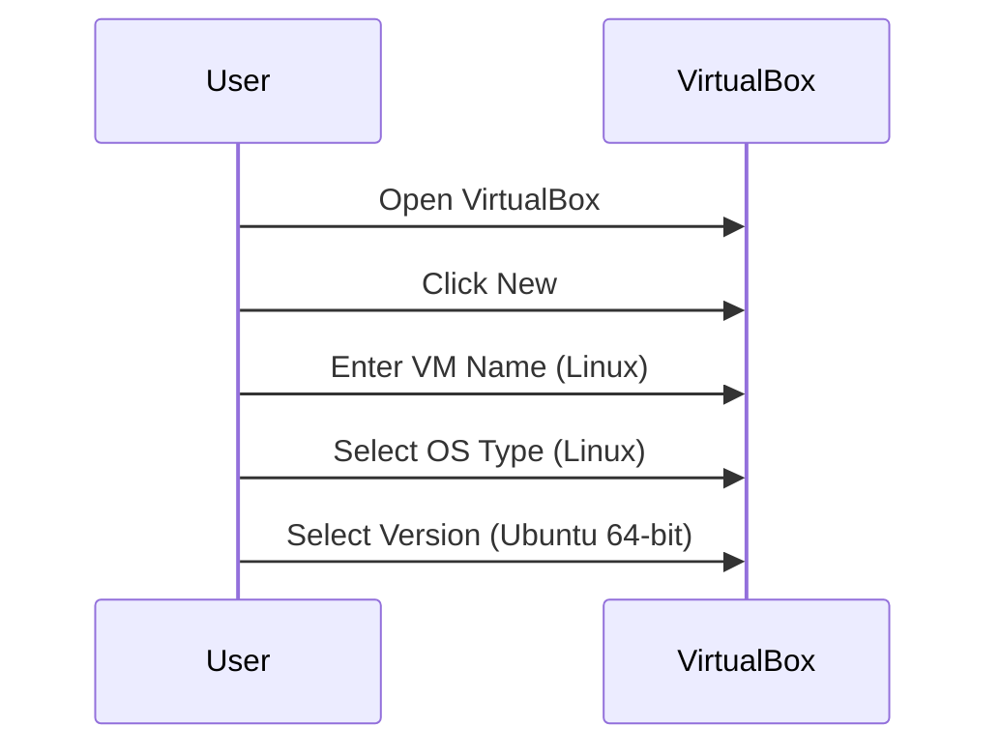
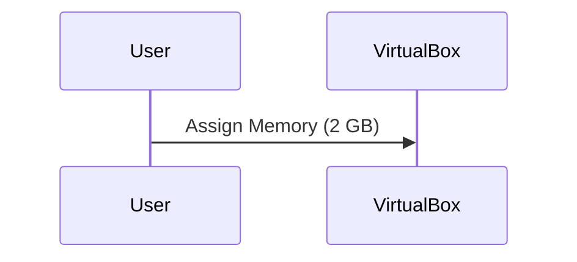
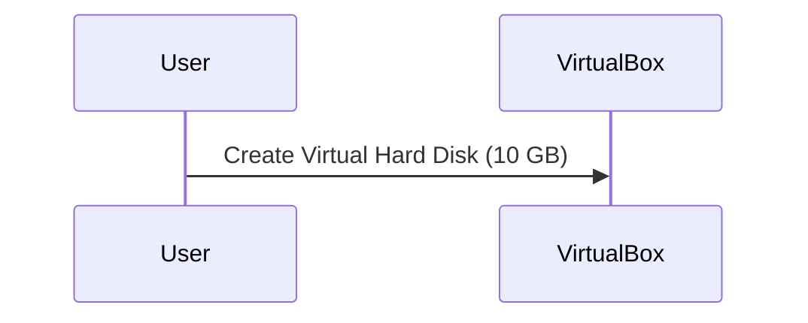
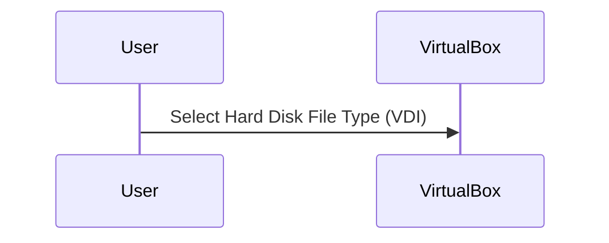
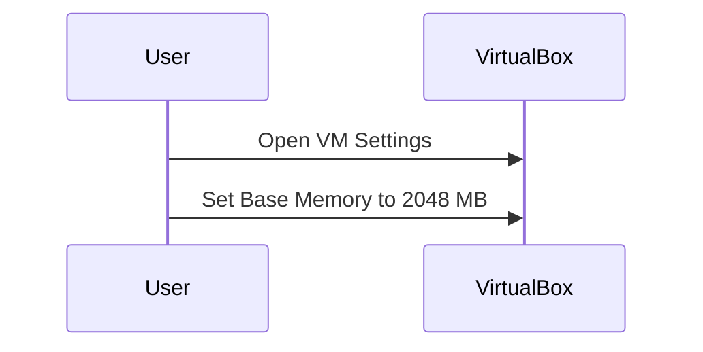
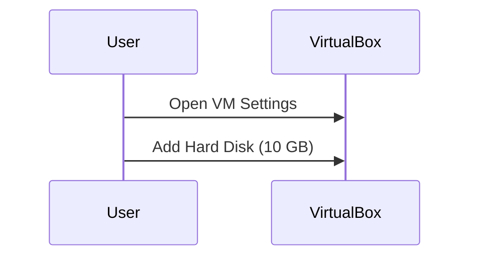
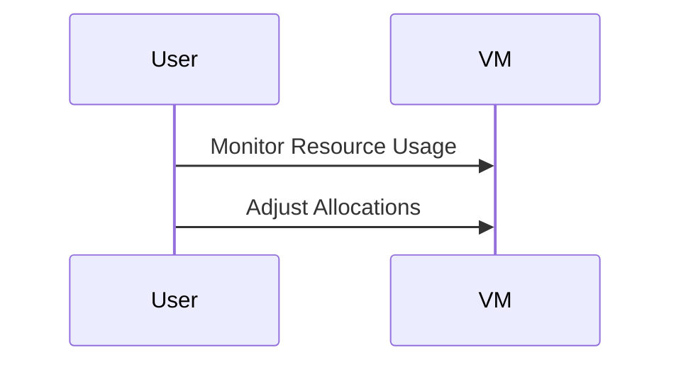
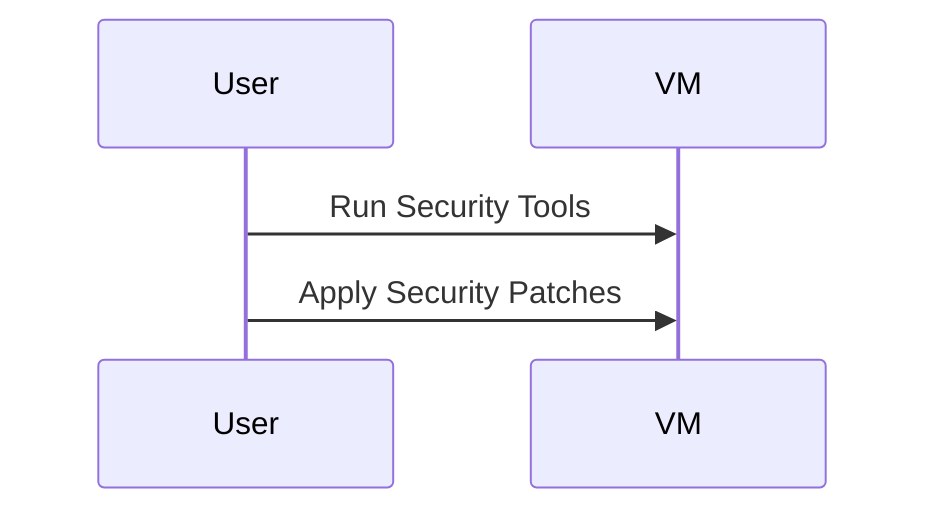
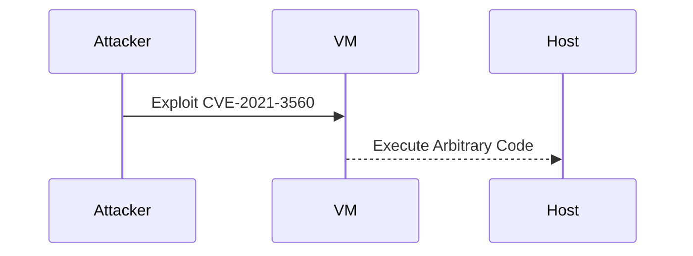

## Introduction to Virtual Machines and VirtualBox

Virtual machines (VMs) are a fundamental component of modern computing environments, particularly in the realm of DevOps. They allow developers and system administrators to run multiple operating systems simultaneously on a single physical machine, providing flexibility and isolation. One popular tool for managing VMs is Oracle VirtualBox, which is free and open-source software.

### Why Use Virtual Machines?

Virtual machines offer several advantages:

1. **Isolation**: Each VM runs independently of others, ensuring that issues in one VM do not affect others.
2. **Portability**: VMs can be easily moved between different physical machines.
3. **Testing and Development**: Developers can test applications in various environments without affecting their main system.
4. **Resource Management**: VMs allow for efficient allocation of system resources like CPU, RAM, and storage.

### System Requirements

Before setting up a VM, ensure your host machine meets the necessary requirements. The minimum recommended specifications are:

- **Processor**: Multi-core processor (Intel or AMD)
- **RAM**: At least 4 GB (preferably more)
- **Storage**: Adequate free space for the VM files

### Installing VirtualBox

To install VirtualBox, follow these steps:

1. **Download VirtualBox**: Visit the [Oracle VirtualBox website](https://www.virtualbox.org/) and download the latest version for your operating system.
2. **Install**: Run the installer and follow the on-screen instructions. Ensure you select the appropriate options for your system.

### Setting Up a Linux VM

#### Step-by-Step Guide

1. **Open VirtualBox**: Launch the VirtualBox application.
2. **Create a New VM**:
    - Click on `New` in the top menu.
    - Enter a name for the VM (e.g., `Linux`).
    - Select the type of operating system (`Linux`) and the version (`Ubuntu 64-bit`).

3. **Assign Memory (RAM)**:
    - Allocate at least 2 GB of RAM to the VM. This is crucial for smooth operation.
    - Note that the total RAM on your host machine will be shared between the host and the VM.

4. **Create Virtual Hard Disk**:
    - Specify the size of the virtual hard disk (e.g., 10 GB).
    - Choose to create a new virtual hard disk.

5. **Select Hard Disk File Type**:
    - Choose the type of virtual hard disk file (VDI, VMDK, etc.). VDI is the default and recommended format.

### Detailed Configuration

#### Memory Allocation

Memory allocation is critical for the performance of the VM. The recommended minimum is 2 GB, but more is better if available. Here’s how to configure it:

1. **Open VM Settings**:
    - Right-click on the VM in the VirtualBox window and select `Settings`.
    - Navigate to the `System` tab.
    - Under `Motherboard`, set the `Base Memory` to 2048 MB.

#### Storage Configuration

Storage allocation determines the amount of disk space available to the VM. Here’s how to configure it:

1. **Open VM Settings**:
    - Navigate to the `Storage` tab.
    - Under `Controller: IDE`, click on `Add Hard Disk`.
    - Choose `Create a new virtual hard disk now`.
    - Select the file type (VDI) and click `Next`.
    - Set the size to 10 GB and click `Create`.

### Common Pitfalls and How to Avoid Them

#### Insufficient Resources

**Problem**: Allocating too little RAM or disk space can lead to poor VM performance and instability.

**Solution**: Always allocate at least 2 GB of RAM and 10 GB of disk space. Monitor the VM’s resource usage and adjust as needed.

#### Incompatible Hardware

**Problem**: Using incompatible hardware settings can cause the VM to fail to start or operate incorrectly.

**Solution**: Ensure that the selected hardware settings match the capabilities of your host machine. Refer to the VirtualBox documentation for supported configurations.

### How to Prevent / Defend

#### Resource Monitoring

**Detection**: Regularly monitor the VM’s resource usage using tools like `htop` or `top` in Linux.

**Prevention**: Adjust resource allocations based on monitoring data to ensure optimal performance.

#### Secure Configuration

**Detection**: Use security tools like `chkrootkit` or `rkhunter` to check for rootkits and other security vulnerabilities.

**Prevention**: Harden the VM’s security by disabling unnecessary services, applying security patches, and configuring firewalls.

### Real-World Examples

#### CVE-2021-3560

This vulnerability affects VirtualBox and allows an attacker to execute arbitrary code on the host machine. Ensuring that VirtualBox is updated to the latest version helps mitigate this risk.

### Practice Labs

For hands-on practice with VirtualBox and Linux VMs, consider the following labs:

- **PortSwigger Web Security Academy**: Offers a series of labs focused on web security, including setting up a secure development environment.
- **OWASP Juice Shop**: A deliberately insecure web application for practicing web security skills.
- **DVWA (Damn Vulnerable Web Application)**: Another web application for learning web security.

These labs provide practical experience in setting up and securing VMs for various purposes.

### Conclusion

Setting up a Linux VM using VirtualBox is a straightforward process that requires careful consideration of system resources. By following the detailed steps outlined above, you can ensure optimal performance and security for your VM. Regular monitoring and updates are essential to maintaining a secure and efficient environment.

---
<!-- nav -->
[[02-Introduction to Virtual Machines and Network Isolation|Introduction to Virtual Machines and Network Isolation]] | [[DevOps/DevOps Bootcamp/01-Linux & OS Basics/11-Installing VirtualBox And Setting Up A Linux VM/00-Overview|Overview]] | [[04-Introduction to VirtualBox and Setting Up a Linux VM|Introduction to VirtualBox and Setting Up a Linux VM]]
