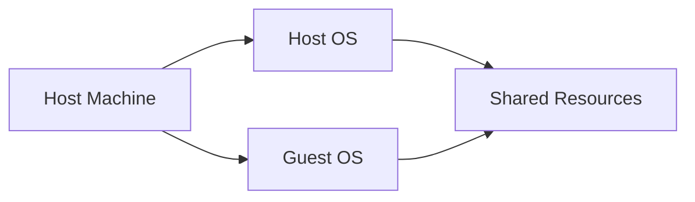
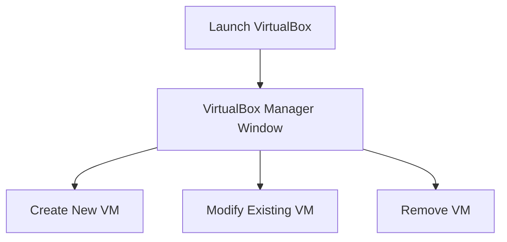

## Introduction to VirtualBox and Setting Up a Linux VM

### Overview of VirtualBox

VirtualBox is a powerful x86 and AMD64/Intel64 virtualization product for enterprise as well as home use. It is a free and open-source hypervisor that allows users to run multiple operating systems simultaneously on a single physical machine. This capability is particularly useful in a DevOps environment where developers and operations teams often need to test applications across different operating systems and configurations.

### Prerequisites for Installing VirtualBox

Before diving into the installation process, it is crucial to understand the prerequisites required for a successful setup. One of the most important prerequisites is the availability of sufficient hardware resources, specifically memory (RAM).

#### Memory Requirements

When setting up a virtual machine (VM), the host machine shares its hardware resources with the guest OS. Therefore, the host machine must have enough resources to support both the host OS and the guest OS. The minimum recommended amount of RAM for the host machine is 4 GB. However, for optimal performance, especially when running resource-intensive applications, it is advisable to have more than 4 GB of RAM.

### Installation Process on macOS

The installation process for VirtualBox on macOS involves several steps, including handling potential security prompts.

#### Security Prompts on macOS

During the installation process, macOS may prompt you to allow Oracle America (the company behind VirtualBox) to access your computer resources. This prompt is a security measure implemented by macOS to ensure that only trusted applications can access system resources.

To proceed with the installation:

1. Open the **Security & Privacy** settings on your Mac.
2. You will see a prompt asking if you want to allow Oracle America to access your computer resources.
3. Click **Allow** to proceed with the installation.

If you encounter an installation failure due to this prompt, you will need to go back to the **Security & Privacy** settings and allow Oracle America before retrying the installation.

### Launching VirtualBox

Once VirtualBox is installed, you can launch it from your Applications folder or by searching for it using Spotlight.

#### VirtualBox Manager Window

Upon launching VirtualBox, you will be presented with the VirtualBox Manager window. This graphical user interface (GUI) allows you to manage your virtual machines, including creating new VMs, modifying existing ones, and removing VMs.

### Creating a Linux VM

Creating a new virtual machine involves several steps, including specifying the type of OS, allocating resources, and installing the OS.

#### Step-by-Step Guide to Create a Linux VM

1. **Open VirtualBox Manager**: Launch VirtualBox from your Applications folder.
2. **Click on "New"**: This will start the process of creating a new virtual machine.
3. **Name Your VM**: Provide a name for your VM and select the type of operating system you wish to install (e.g., Linux).
4. **Allocate Memory**: Specify the amount of RAM to allocate to the VM. Ensure that the allocated memory does not exceed the available RAM on your host machine.
5. **Create a Virtual Hard Disk**: Choose to create a new virtual hard disk and specify the size and type of the disk.
6. **Install the OS**: Insert the ISO image of the Linux distribution you wish to install and start the VM. Follow the installation instructions provided by the Linux distribution.

### Example: Installing Ubuntu Linux

Here is a detailed example of how to set up a Linux VM using Ubuntu as the guest OS.

#### Step 1: Download Ubuntu ISO

Download the latest Ubuntu ISO from the official Ubuntu website.

#### Step 2: Create a New VM

1. Open VirtualBox Manager.
2. Click on **New**.
3. Name your VM (e.g., `Ubuntu-VM`).
4. Select **Linux** as the type and **Ubuntu (64-bit)** as the version.
5. Allocate memory (e.g., 2048 MB).
6. Create a new virtual hard disk (e.g., 20 GB).

#### Step 3: Configure the VM

1. Click on **Settings** for your newly created VM.
2. Under **Storage**, add the Ubuntu ISO to the virtual CD/DVD drive.
3. Ensure the VM is configured to boot from the CD/DVD drive.

#### Step 4: Start the VM and Install Ubuntu

1. Start the VM.
2. Follow the Ubuntu installation wizard to install the OS on the virtual hard disk.

### Common Pitfalls and How to Avoid Them

#### Insufficient Resources

One common pitfall is allocating insufficient resources to the VM. Ensure that the host machine has enough RAM and CPU power to support both the host OS and the guest OS.

#### Incorrect Boot Order

Another common issue is incorrect boot order settings. Make sure the VM is configured to boot from the CD/DVD drive first during the installation process.

### How to Prevent / Defend

#### Resource Management

To prevent issues related to insufficient resources:

1. **Monitor System Performance**: Use tools like `htop` or `top` to monitor the performance of your host machine.
2. **Adjust Resource Allocation**: Adjust the amount of RAM and CPU allocated to the VM based on the workload.

#### Secure Configuration

To ensure secure configuration:

1. **Use Strong Passwords**: Set strong passwords for the VM and the host machine.
2. **Enable Firewall**: Enable the firewall on both the host and guest OS to protect against unauthorized access.

### Conclusion

Setting up a Linux VM using VirtualBox is a straightforward process that requires careful planning and resource management. By following the steps outlined above and being mindful of potential pitfalls, you can successfully create and manage a Linux VM on your host machine.

### Practice Labs

For hands-on practice, consider the following labs:

- **PortSwigger Web Security Academy**: Offers a variety of labs to practice web security concepts.
- **OWASP Juice Shop**: A deliberately insecure web application for practicing web security skills.
- **DVWA (Damn Vulnerable Web Application)**: A PHP/MySQL web application that is riddled with vulnerabilities for educational purposes.

These labs provide practical experience in setting up and managing virtual environments, which is essential for mastering DevOps practices.

---
<!-- nav -->
[[03-Introduction to Virtual Machines and VirtualBox|Introduction to Virtual Machines and VirtualBox]] | [[DevOps/DevOps Bootcamp/01-Linux & OS Basics/11-Installing VirtualBox And Setting Up A Linux VM/00-Overview|Overview]] | [[05-Introduction to Virtualization and Hypervisors|Introduction to Virtualization and Hypervisors]]
