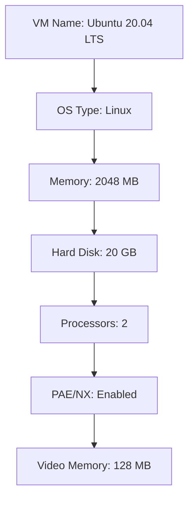

## Detailed Steps for Setting Up a Linux VM

### Step-by-Step Guide

Here is a detailed step-by-step guide to setting up a Linux VM using VirtualBox:

1. **Open VirtualBox**:
    ```mermaid
graph TD;
        A[Open VirtualBox] --> B[Click "New"];
```

2. **Create a New VM**:
    ```mermaid
graph TD;
        B --> C[Enter VM Name];
        C --> D[Choose OS Type];
        D --> E[Allocate Memory];
        E --> F[Create Virtual Hard Disk];
```

3. **Configure VM Settings**:
    ```mermaid
graph TD;
        F --> G[Set Number of Processors];
        G --> H[Enable PAE/NX];
        H --> I[Allocate Video Memory];
        I --> J[Add ISO Image];
```

4. **Start the VM**:
    ```mermaid
graph TD;
        J --> K[Select VM];
        K --> L[Click "Start"];
        L --> M[Boot from ISO];
```

5. **Install Ubuntu**:
    ```mermaid
graph TD;
        M --> N[Follow Installation Prompts];
        N --> O[Complete Installation];
```

### Example Configuration

Here is an example configuration for a Linux VM:



### Common Pitfalls and How to Avoid Them

1. **Insufficient Resources**: Ensure you allocate enough RAM and CPU cores to the VM. Insufficient resources can lead to slow performance.
2. **Incorrect ISO Selection**: Double-check that you are using the correct ISO image for the desired version of Ubuntu.
3. **Network Configuration**: Ensure the VM has proper network settings to access the internet and other resources.

### How to Prevent / Defend

1. **Secure Boot**: Enable Secure Boot in the BIOS settings to prevent unauthorized booting of malicious code.
2. **Firewall Configuration**: Configure the firewall within the VM to restrict unnecessary inbound and outbound traffic.
3. **Regular Updates**: Keep the VM and all installed software up to date with the latest security patches.

### Real-World Examples

Recent vulnerabilities such as the [CVE-2021-3156](https://nvd.nist.gov/vuln/detail/CVE-2021-3156) in QEMU/KVM highlight the importance of keeping virtualization software updated. This vulnerability allowed attackers to escape the VM and gain control of the host system.

### Conclusion

Setting up a Linux VM using VirtualBox is a straightforward process that provides a flexible and efficient way to run multiple operating systems on a single physical machine. By following the detailed steps and best practices outlined above, you can ensure a smooth and secure setup.

### Practice Labs

For hands-on practice, consider the following labs:

- **PortSwigger Web Security Academy**: Offers a variety of labs for learning web application security.
- **OWASP Juice Shop**: A deliberately insecure web application for practicing security testing.
- **DVWA (Damn Vulnerable Web Application)**: Another popular web application for security testing.

These labs provide practical experience in setting up and securing virtual machines, which is essential for mastering DevOps skills.

---
<!-- nav -->
[[07-Common Pitfalls and How to Prevent Them|Common Pitfalls and How to Prevent Them]] | [[DevOps/DevOps Bootcamp/01-Linux & OS Basics/11-Installing VirtualBox And Setting Up A Linux VM/00-Overview|Overview]] | [[09-Downloading and Installing Ubuntu|Downloading and Installing Ubuntu]]
