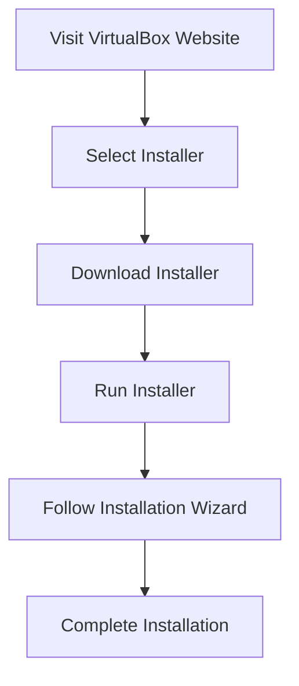

## Installing Oracle VirtualBox

Oracle VirtualBox is a popular Type 2 hypervisor that allows users to create and manage virtual machines on their local computers. In this section, we will walk through the process of downloading and installing VirtualBox on both Windows and macOS.

### Downloading VirtualBox

To begin, visit the official Oracle VirtualBox website at [https://www.virtualbox.org/wiki/Downloads](https://www.virtualbox.org/wiki/Downloads).

#### Windows Installation

1. **Download the Installer**:
   - Navigate to the "Downloads" section on the VirtualBox website.
   - Select the appropriate installer for your version of Windows (32-bit or 64-bit).

2. **Run the Installer**:
   - Double-click the downloaded `.exe` file to start the installation process.
   - Follow the prompts to install VirtualBox. By default, the installer will install VirtualBox in `C:\Program Files\Oracle\VirtualBox`.

3. **Installation Wizard**:
   - Click "Next" to proceed through the installation wizard.
   - Accept the license agreement and choose the installation location.
   - Click "Install" to begin the installation process.

4. **Completion**:
   - Once the installation is complete, click "Finish" to close the installer.

#### macOS Installation

1. **Download the Installer**:
   - Navigate to the "Downloads" section on the VirtualBox website.
   - Select the `.dmg` file for macOS.

2. **Mount the DMG File**:
   - Double-click the downloaded `.dmg` file to mount it.
   - Drag the VirtualBox application to your Applications folder.

3. **Install Extension Pack**:
   - Visit the VirtualBox website and download the extension pack.
   - Open the `.vbox-extpack` file and follow the prompts to install it.

4. **Complete Installation**:
   - Launch VirtualBox from your Applications folder to verify the installation.

### Full Installation Process Diagram



### Common Pitfalls and Solutions

- **Insufficient Disk Space**: Ensure that you have enough free disk space to complete the installation.
- **Firewall Blocking**: Disable your firewall temporarily during the installation process if you encounter issues.
- **Incorrect Version**: Make sure to download the correct version of VirtualBox for your operating system.

### How to Prevent / Defend Against Installation Issues

#### Detection

Use tools like `df -h` (Linux/macOS) or `System Information` (Windows) to check available disk space before installation.

#### Prevention

- **Disk Space Check**: Verify that you have sufficient disk space before starting the installation.
- **Firewall Settings**: Temporarily disable your firewall during the installation process.
- **Correct Version**: Always download the correct version of VirtualBox for your operating system.

### Secure Installation Example

```bash
# Example of checking disk space before installation on Linux/macOS
df -h

# Example of disabling firewall temporarily on Windows
netsh advfirewall set allprofiles state off
```

---
<!-- nav -->
[[09-Downloading and Installing Ubuntu|Downloading and Installing Ubuntu]] | [[DevOps/DevOps Bootcamp/01-Linux & OS Basics/11-Installing VirtualBox And Setting Up A Linux VM/00-Overview|Overview]] | [[11-Installing VirtualBox|Installing VirtualBox]]
