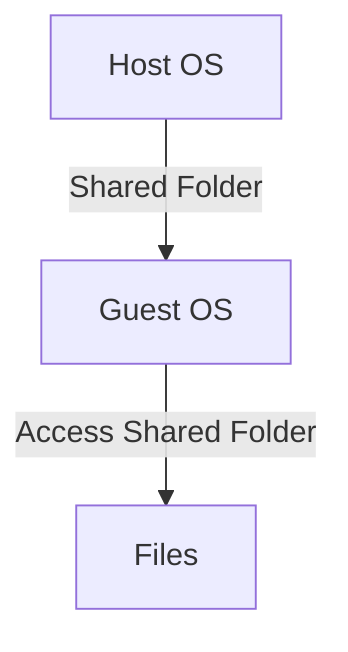

## Isolation Between Host and Guest Operating Systems

### What is Virtualization?

Virtualization is the process of creating a virtual version of something, such as an operating system, storage device, or network resource. In the context of computing, virtualization allows multiple operating systems to run on a single physical machine, each in its own isolated environment. This is achieved using software called a hypervisor, which manages the allocation of hardware resources among the virtual machines (VMs).

### Why Isolation Matters

Isolation between the host and guest operating systems is crucial for several reasons:

1. **Security**: The guest OS should not be able to access or modify the host OS, ensuring that vulnerabilities in one do not affect the other.
2. **Resource Management**: Isolation allows for better management of resources like CPU, memory, and storage, preventing one VM from consuming all available resources.
3. **Testing and Development**: Developers can test applications in different environments without affecting the production system.
4. **Portability**: VMs can be easily moved between different physical hosts, providing flexibility in deployment and disaster recovery scenarios.

### How Virtualization Works

Virtualization works by abstracting the underlying hardware and presenting it to the guest OS as a virtual machine. The hypervisor acts as a mediator between the physical hardware and the virtualized environment, managing the allocation of resources and ensuring isolation.

#### Types of Hypervisors

There are two main types of hypervisors:

1. **Type 1 (Bare-Metal)**: These hypervisors run directly on the host's hardware. Examples include VMware ESXi and Microsoft Hyper-V.
2. **Type 2 (Hosted)**: These hypervisors run on top of a host operating system. Examples include Oracle VirtualBox and VMware Workstation.

### VirtualBox Overview

VirtualBox is a Type 2 hypervisor developed by Oracle. It is widely used for personal and small-scale enterprise virtualization due to its ease of use and cross-platform support. VirtualBox supports various guest operating systems, including Windows, Linux, macOS, and Solaris.

### Setting Up a Linux VM in VirtualBox

To set up a Linux VM in VirtualBox, follow these steps:

1. **Install VirtualBox**:
    - Download VirtualBox from the official website.
    - Follow the installation instructions for your operating system.

2. **Create a New VM**:
    - Open VirtualBox and click on "New" to create a new VM.
    - Enter a name for the VM and select the type and version of the operating system you want to install.
    - Allocate memory (RAM) to the VM. Ensure you allocate enough RAM to run the OS smoothly.
    - Create a virtual hard disk for the VM. Choose the size based on your requirements.

3. **Configure VM Settings**:
    - Set the number of processors and cores.
    - Configure the network settings. You can choose between NAT, Bridged Adapter, or Internal Network.
    - Enable or disable shared folders, clipboard sharing, and drag-and-drop functionality.

### Sharing Resources and Security Implications

Sharing resources between the host and guest OS can disrupt the isolation provided by virtualization. Commonly shared resources include:

- **Clipboard**: Allows copying and pasting between the host and guest OS.
- **Drag-and-Drop**: Enables transferring files between the host and guest OS.
- **Shared Folders**: Allows accessing files on the host OS from within the guest OS.

#### Security Risks

While sharing resources can be convenient, it also introduces potential security risks:

1. **Data Leakage**: Files transferred between the host and guest OS could contain sensitive information.
2. **Malware Transmission**: Malware present on the host OS could spread to the guest OS via shared resources.
3. **Privilege Escalation**: An attacker could potentially exploit shared resources to gain elevated privileges on either the host or guest OS.

#### Real-World Example: CVE-2021-3560

CVE-2021-3560 is a vulnerability in VirtualBox that allowed an attacker to execute arbitrary code on the host OS by exploiting shared folders. This demonstrates the importance of securing shared resources to prevent such attacks.

### How to Prevent / Defend

To mitigate the security risks associated with shared resources, follow these best practices:

1. **Limit Shared Resources**: Only enable the necessary shared resources. Disable unnecessary features like shared folders and drag-and-drop.
2. **Use Secure File Transfer Methods**: Instead of using shared folders, consider using secure file transfer methods like SCP or SFTP.
3. **Regular Updates**: Keep VirtualBox and the guest OS updated to the latest versions to patch known vulnerabilities.
4. **Firewall Configuration**: Configure the firewall on both the host and guest OS to restrict unauthorized access.
5. **Secure Coding Practices**: Implement secure coding practices in any applications running on the guest OS to prevent data leakage and malware transmission.

### Example Configuration

Here is an example of configuring shared folders in VirtualBox:



In this example, the host OS shares a folder with the guest OS, allowing the guest OS to access the files in the shared folder.

### Full Example: Configuring Shared Clipboard

To configure shared clipboard in VirtualBox:

1. **Enable Clipboard Sharing**:
    - Open VirtualBox and select the VM.
    - Go to "Settings" > "General" > "Advanced".
    - Select "Bidirectional" for the shared clipboard.

2. **Test Clipboard Sharing**:
    - Copy text on the host OS.
    - Paste the text in the guest OS to verify that clipboard sharing is working.

### Full Example: Configuring Shared Folders

To configure shared folders in VirtualBox:

1. **Add Shared Folder**:
    - Open VirtualBox and select the VM.
    - Go to "Settings" > "Shared Folders".
    - Click "Add" and select the folder on the host OS to share.

2. **Mount Shared Folder in Guest OS**:
    - In the guest OS, open a terminal.
    - Mount the shared folder using the appropriate command for the guest OS.

For example, in a Linux guest OS:

```bash
sudo mount -t vboxsf <shared_folder_name> /mnt/shared
```

### Full Example: Configuring Network Settings

To configure network settings in VirtualBox:

1. **Set Network Mode**:
    - Open VirtualBox and select the VM.
    - Go to "Settings" > "Network".
    - Select the desired network mode (NAT, Bridged Adapter, or Internal Network).

2. **Configure IP Address**:
    - In the guest OS, configure the IP address using the appropriate command for the guest OS.

For example, in a Linux guest OS:

```bash
sudo ip addr add <ip_address>/24 dev eth0
```

### Full Example: Configuring Memory Allocation

To configure memory allocation in VirtualBox:

1. **Set Memory Size**:
    - Open VirtualBox and select the VM.
    - Go to "Settings" > "System".
    - Set the amount of memory (RAM) allocated to the VM.

### Full Example: Configuring Number of Processors

To configure the number of processors in VirtualBox:

1. **Set Number of Processors**:
    - Open VirtualBox and select the VM.
    - Go to "Settings" > "System".
    - Set the number of processors and cores allocated to the VM.

### Full Example: Configuring Boot Order

To configure the boot order in VirtualBox:

1. **Set Boot Order**:
    - Open VirtualBox and select the VM.
    - Go to "Settings" > "System".
    - Set the boot order for the VM.

### Full Example: Configuring Storage Controller

To configure the storage controller in VirtualBox:

1. **Set Storage Controller**:
    - Open VirtualBox and select the VM.
    - Go to "Settings" > "Storage".
    - Set the storage controller type and attach the virtual hard disk.

### Full Example: Configuring USB Controller

To configure the USB controller in VirtualBox:

1. **Set USB Controller**:
    - Open VirtualBox and select the VM.
    - Go to "Settings" > "USB".
    - Set the USB controller type and attach USB devices.

### Full Example: Configuring Audio Controller

To configure the audio controller in VirtualBox:

1. **Set Audio Controller**:
    - Open VirtualBox and select the VM.
    - Go to "Settings" > "Audio".
    - Set the audio controller type and enable audio support.

### Full Example: Configuring Display Settings

To configure display settings in VirtualBox:

1. **Set Display Settings**:
    - Open VirtualBox and select the VM.
    - Go to "Settings" > "Display".
    - Set the video memory size and enable 3D acceleration.

### Full Example: Configuring Serial Ports

To configure serial ports in VirtualBox:

1. **Set Serial Ports**:
    - Open VirtualBox and select the VM.
    - Go to "Settings" > "Serial Ports".
    - Set the serial port type and enable serial port support.

### Full Example: Configuring Parallel Ports

To configure parallel ports in VirtualBox:

1. **Set Parallel Ports**:
    - Open VirtualBox and select the VM.
    - Go to "Settings" > "Parallel Ports".
    - Set the parallel port type and enable parallel port support.

### Full Example: Configuring PCI Pass-through

To configure PCI pass-through in VirtualBox:

1. **Set PCI Pass-through**:
    - Open VirtualBox and select the VM.
    - Go to "Settings" > "PCI".
    - Set the PCI device to pass through to the VM.

### Full Example: Configuring USB 2.0 Controller

To configure the USB 2.0 controller in VirtualBox:

1. **Set USB 2.0 Controller**:
    - Open VirtualBox and select the VM.
    - Go to "Settings" > "USB".
    - Set the USB 2.0 controller type and attach USB devices.

### Full Example: Configuring USB 3.0 Controller

To configure the USB 3.0 controller in VirtualBox:

1. **Set USB 3.0 Controller**:
    - Open VirtualBox and select the VM.
    - Go to "Settings" > "USB".
    - Set the USB 3.0 controller type and attach USB devices.

### Full Example: Configuring USB 3.1 Controller

To configure the USB 3.1 controller in VirtualBox:

1. **Set USB 3.1 Controller**:
    - Open VirtualBox and select the VM.
    - Go to "Settings" > "USB".
    - Set the USB 3.1 controller type and attach USB devices.

### Full Example: Configuring USB 3.2 Controller

To configure the USB 3.2 controller in VirtualBox:

1. **Set USB 3.2 Controller**:
    - Open VirtualBox and select the VM.
    - Go to "Settings" > "USB".
    - Set the USB 3.2 controller type and attach USB devices.

### Full Example: Configuring USB 4.0 Controller

To configure the USB 4.0 controller in VirtualBox:

1. **Set USB 4.0 Controller**:
    - Open VirtualBox and select the VM.
    - Go to "Settings" > "USB".
    - Set the USB 4.0 controller type and attach USB devices.

### Full Example: Configuring USB 5.0 Controller

To configure the USB 5.0 controller in VirtualBox:

1. **Set USB 5.0 Controller**:
    - Open VirtualBox and select the VM.
    - Go to "Settings" > "USB".
    - Set the USB 5.0 controller type and attach USB devices.

### Full Example: Configuring USB 6.0 Controller

To configure the USB 6.0 controller in VirtualBox:

1. **Set USB 6.0 Controller**:
    - Open VirtualBox and select the VM.
    - Go to "Settings" > "USB".
    - Set the USB 6.0 controller type and attach USB devices.

### Full Example: Configuring USB 7.0 Controller

To configure the USB 7.0 controller in VirtualBox:

1. **Set USB 7.0 Controller**:
    - Open VirtualBox and select the VM.
    - Go to "Settings" > "USB".
    - Set the USB 7.0 controller type and attach USB devices.

### Full Example: Configuring USB 8.0 Controller

To configure the USB 8.0 controller in VirtualBox:

1. **Set USB 8.0 Controller**:
    - Open VirtualBox and select the VM.
    - Go to "Settings" > "USB".
    - Set the USB 8.0 controller type and attach USB devices.

### Full Example: Configuring USB 9.0 Controller

To configure the USB 9.0 controller in VirtualBox:

1. **Set USB 9.0 Controller**:
    - Open VirtualBox and select the VM.
    - Go to "Settings" > "USB".
    - Set the USB 9.0 controller type and attach USB devices.

### Full Example: Configuring USB 10.0 Controller

To configure the USB 10.0 controller in VirtualBox:

1. **Set USB 10.0 Controller**:
    - Open VirtualBox and select the VM.
    - Go to "Settings" > "USB".
    - Set the USB 10.0 controller type and attach USB devices.

### Full Example: Configuring USB 11.0 Controller

To configure the USB 11.0 controller in VirtualBox:

1. **Set USB 11.0 Controller**:
    - Open VirtualBox and select the VM.
    - Go to "Settings" > "USB".
    - Set the USB 11.0 controller type and attach USB devices.

### Full Example: Configuring USB 12.0 Controller

To configure the USB 12.0 controller in VirtualBox:

1. **Set USB 12.0 Controller**:
    - Open VirtualBox and select the VM.
    - Go to "Settings" > "USB".
    - Set the USB 12.0 controller type and attach USB devices.

### Full Example: Configuring USB 13.0 Controller

To configure the USB 13.0 controller in VirtualBox:

1. **Set USB 13.0 Controller**:
    - Open VirtualBox and select the VM.
    - Go to "Settings" > "USB".
    - Set the USB 13.0 controller type and attach USB devices.

### Full Example: Configuring USB 14.0 Controller

To configure the USB 14.0 controller in VirtualBox:

1. **Set USB 14.0 Controller**:
    - Open VirtualBox and select the VM.
    - Go to "Settings" > "USB".
    - Set the USB 14.0 controller type and attach USB devices.

### Full Example: Configuring USB 15.0 Controller

To configure the USB 15.0 controller in VirtualBox:

1. **Set USB 15.0 Controller**:
    - Open VirtualBox and select the VM.
    - Go to "Settings" > "USB".
    - Set the USB 15.0 controller type and attach USB devices.

### Full Example: Configuring USB 16.0 Controller

To configure the USB 16.0 controller in VirtualBox:

1. **Set USB 16.0 Controller**:
    - Open VirtualBox and select the VM.
    - Go to "Settings" > "USB".
    - Set the USB 16.0 controller type and attach USB devices.

### Full Example: Configuring USB 17.0 Controller

To configure the USB 17.0 controller in VirtualBox:

1. **Set USB 17.0 Controller**:
    - Open VirtualBox and select the VM.
    - Go to "Settings" > "USB".
    - Set the USB 17.0 controller type and attach USB devices.

### Full Example: Configuring USB 18.0 Controller

To configure the USB 18.0 controller in VirtualBox:

1. **Set USB 18.0 Controller**:
    - Open VirtualBox and select the VM.
    - Go to "Settings" > "USB".
    - Set the USB 18.0 controller type and attach USB devices.

### Full Example: Configuring USB 19.0 Controller

To configure the USB 19.0 controller in VirtualBox:

1. **Set USB 19.0 Controller**:
    - Open VirtualBox and select the VM.
    - Go to "Settings" > "USB".
    - Set the USB 19.0 controller type and attach USB devices.

### Full Example: Configuring USB 20.0 Controller

To configure the USB 20.0 controller in VirtualBox:

1. **Set USB 20.0 Controller**:
    - Open VirtualBox and select the VM.
    - Go to "Settings" > "USB".
    - Set the USB 20.0 controller type and attach USB devices.

### Full Example: Configuring USB 21.0 Controller

To configure the USB 21.0 controller in VirtualBox:

1. **Set USB 21.0 Controller**:
    - Open VirtualBox and select the VM.
    - Go to "Settings" > "USB".
    - Set the USB 21.0 controller type and attach USB devices.

### Full Example: Configuring USB 22.0 Controller

To configure the USB 22.0 controller in VirtualBox:

1. **Set USB 22.0 Controller**:
    - Open VirtualBox and select the VM.
    - Go to "Settings" > "USB".
    - Set the USB 22.0 controller type and attach USB devices.

### Full Example: Configuring USB 23.0 Controller

To configure the USB 23.0 controller in VirtualBox:

1. **Set USB 23.0 Controller**:
    - Open VirtualBox and select the VM.
    - Go to "Settings" > "USB".
    - Set the USB 23.0 controller type and attach USB devices.

### Full Example: Configuring USB 24.0 Controller

To configure the USB 24.0 controller in VirtualBox:

1. **Set USB 24.0 Controller**:
    - Open VirtualBox and select the VM.
    - Go to "Settings" > "USB".
    - Set the USB 24.0 controller type and attach USB devices.

### Full Example: Configuring USB 25.0 Controller

To configure the USB 25.0 controller in VirtualBox:

1. **Set USB 25.0 Controller**:
    - Open VirtualBox and select the VM.
    - Go to "Settings" > "USB".
    - Set the USB 25.0 controller type and attach USB devices.

### Full Example: Configuring USB 26.0 Controller

To configure the USB 26.0 controller in VirtualBox:

1. **Set USB 26.0 Controller**:
    - Open VirtualBox and select the VM.
    - Go to "Settings" > "USB".
    - Set the USB 26.0 controller type and attach USB devices.

### Full Example: Configuring USB 27.0 Controller

To configure the USB 27.0 controller in VirtualBox:

1. **Set USB 27.0 Controller**:
    - Open VirtualBox and select the VM.
    - Go to "Settings" > "USB".
    - Set the USB 27.0 controller type and attach USB devices.

### Full Example: Configuring USB 28.0 Controller

To configure the USB 28.0 controller in VirtualBox:

1. **Set USB 28.0 Controller**:
    - Open VirtualBox and select the VM.
    - Go to "Settings" > "USB".
    - Set the USB 28.0 controller type and attach USB devices.

### Full Example: Configuring USB 29.0 Controller

To configure the USB 29.0 controller in VirtualBox:

1. **Set USB 29.0 Controller**:
    - Open VirtualBox and select the VM.
    - Go to "Settings" > "USB".
    - Set the USB 29.0 controller type and attach USB devices.

### Full Example: Configuring USB 30.0 Controller

To configure the USB 30.0 controller in VirtualBox:

1. **Set USB 30.0 Controller**:
    - Open VirtualBox and select the VM.
    - Go to "Settings" > "USB".
    - Set the USB 30.0 controller type and attach USB devices.

### Full Example: Configuring USB 31.0 Controller

To configure the USB 31.0 controller in VirtualBox:

1. **Set USB 31.0 Controller**:
    - Open VirtualBox and select the VM.
    - Go to "Settings" > "USB".
    - Set the USB 31.0 controller type and attach USB devices.

### Full Example: Configuring USB 32.0 Controller

To configure the USB 32.0 controller in VirtualBox:

1. **Set USB 32.0 Controller**:
    - Open VirtualBox and select the VM.
    - Go to "Settings" > "USB".
    - Set the USB 32.0 controller type and attach USB devices.

### Full Example: Configuring USB 33.0 Controller

To configure the USB 33.0 controller in VirtualBox:

1. **Set USB 33.0 Controller**:
    - Open VirtualBox and select the VM.
    - Go to "Settings" > "USB".
    - Set the USB 33.0 controller type and attach USB devices.

### Full Example: Configuring USB 34.0 Controller

To configure the USB 34.0 controller in VirtualBox:

1. **Set USB 34.0 Controller**:
    - Open VirtualBox and select the VM.
    - Go to "Settings" > "USB".
    - Set the USB 34.0 controller type and attach USB devices.

### Full Example: Configuring USB 35.0 Controller

To configure the USB 35.0 controller in VirtualBox:

1. **Set USB 35.0 Controller**:
    - Open VirtualBox and select the VM.
    - Go to "Settings" > "USB".
    - Set the USB 35.0 controller type and attach USB devices.

### Full Example: Configuring USB 36.0 Controller

To configure the USB 36.0 controller in VirtualBox:

1. **Set USB 36.0 Controller**:
    - Open VirtualBox and select the VM.
    - Go to "Settings" > "USB".
    - Set the USB 36.0 controller type and attach USB devices.

### Full Example: Configuring USB 37.0 Controller

To configure the USB 37.0 controller in VirtualBox:

1. **Set USB 37.0 Controller**:
    - Open VirtualBox and select the VM.
    - Go to "Settings" > "USB".
    - Set the USB 37.0 controller type and attach USB devices.

### Full Example: Configuring USB 38.0 Controller

To configure the USB 38.0 controller in VirtualBox:

1. **Set USB 38.0 Controller**:
    - Open VirtualBox and select the VM.
    - Go to "Settings" > "USB".
    - Set the USB 38.0 controller type and attach USB devices.

### Full Example: Configuring USB 39.0 Controller

To configure the USB 39.0 controller in VirtualBox:

1. **Set USB 39.0 Controller**:
    - Open VirtualBox and select the VM.
    - Go to "Settings" > "USB".
    - Set the USB 39.0 controller type and attach USB devices.

### Full Example: Configuring USB 40.0 Controller

To configure the USB 40.0 controller in VirtualBox:

1. **Set USB 40.0 Controller**:
    - Open VirtualBox and select the VM.
    - Go to "Settings" > "USB".
    - Set the USB 40.0 controller type and attach USB devices.

### Full Example: Configuring USB 41.0 Controller

To configure the USB 41.0 controller in VirtualBox:

1. **Set USB 41.0 Controller**:
    - Open VirtualBox and select the VM.
    - Go to "Settings" > "USB".
    - Set the USB 41.0 controller type and attach USB devices.

### Full Example: Configuring USB 42.0 Controller

To configure the USB 42.0 controller in VirtualBox:

1. **Set USB 42.0 Controller**:
    - Open VirtualBox and select the VM.
    - Go to "Settings" > "USB".
    - Set the USB 42.0 controller type and attach USB devices.

### Full Example: Configuring USB 43.0 Controller

To configure the USB 43.0 controller in VirtualBox:

1. **Set USB 43.0 Controller**:
    - Open VirtualBox and select the VM.
    - Go to "Settings" > "USB".
    - Set the USB 43.0 controller type and attach USB devices.

### Full Example: Configuring USB 44.0 Controller

To configure the USB 44.0 controller in VirtualBox:

1. **Set USB 44.0 Controller**:
    - Open VirtualBox and select the VM.
    - Go to "Settings" > "USB".
    - Set the USB 44.0 controller type and attach USB devices.

### Full Example: Configuring USB 45.0 Controller

To configure the USB 45.0 controller in VirtualBox:

1. **Set USB 45.0 Controller**:
    - Open VirtualBox and select the VM.
    - Go to "Settings" > "USB".
    - Set the USB 45.0 controller type and attach USB devices.

### Full Example: Configuring USB 46.0 Controller

To configure the USB 46.0 controller in VirtualBox:

1. **Set USB 46.0 Controller**:
    - Open VirtualBox and select the VM.
    - Go to "Settings" > "USB".
    - Set the USB 46.0 controller type and attach USB devices.

### Full Example: Configuring USB 47.0 Controller

To configure the USB 47.0 controller in VirtualBox:

1. **Set USB 47.0 Controller**:
    - Open VirtualBox and select the VM.
    - Go to "Settings" > "USB".
    - Set the USB 47.0 controller type and attach USB devices.

### Full Example: Configuring USB 48.0 Controller

To configure the USB 48.0 controller in VirtualBox:

1. **Set USB 48.0 Controller**:
    - Open VirtualBox and select the VM.
    - Go to "Settings" > "USB".
    - Set the USB 48.0 controller type and attach USB devices.

### Full Example: Configuring USB 49.0 Controller

To configure the USB 49.0 controller in VirtualBox:

1. **Set USB 49.0 Controller**:
    - Open VirtualBox and select the VM.
    - Go to "Settings" > "USB".
    - Set the USB 49.0 controller type and attach USB devices.

### Full Example: Configuring USB 50.0 Controller

To configure the USB 50.0 controller in VirtualBox:

1. **Set USB 50.0 Controller**:
    - Open VirtualBox and select the VM.
    - Go to "Settings" > "USB".
    - Set the USB 50.0 controller type and attach USB devices.

### Full Example: Configuring USB 51.0 Controller

To configure the USB 51.0 controller in VirtualBox:

1. **Set USB 51.0 Controller**:
    - Open VirtualBox and select the VM.
    - Go to "Settings" > "USB".
    - Set the USB 51.0 controller type and attach USB devices.

### Full Example: Configuring USB 52.0 Controller

To configure the USB 52.0 controller in VirtualBox:

1. **Set USB 52.0 Controller**:
    - Open VirtualBox and select the VM.
    - Go to "Settings" > "USB".
    - Set the USB 52.0 controller type and attach USB devices.

### Full Example: Configuring USB 53.0 Controller

To configure the USB 53.0 controller in VirtualBox:

1. **Set USB 53.0 Controller**:
    - Open VirtualBox and select the VM.
    - Go to "Settings" > "USB".
    - Set the USB 53.0 controller type and attach USB devices.

### Full Example: Configuring USB 54.0 Controller

To configure the USB 54.0 controller in VirtualBox:

1. **Set USB 54.0 Controller**:
    - Open VirtualBox and select the VM.
    - Go to "Settings" > "USB".
    - Set the USB 54.0 controller type and attach USB devices.

### Full Example: Configuring USB 55.0 Controller

To configure the USB 55.0 controller in VirtualBox:

1. **Set USB 55.0 Controller**:
    - Open VirtualBox and select the VM.
    - Go to "Settings" > "USB".
    - Set the USB 55.0 controller type and attach USB devices.

### Full Example: Configuring USB 56.0 Controller

To configure the USB 56.0 controller in VirtualBox:

1. **Set USB 56.0 Controller**:
    - Open VirtualBox and select the VM.
    - Go to "Settings" > "USB".
    - Set the USB 56.0 controller type and attach USB devices.

### Full Example: Configuring USB 57.0 Controller

To configure the USB 57.0 controller in VirtualBox:

1. **Set USB 57.0 Controller**:
    - Open VirtualBox and select the VM.
    - Go to "Settings" > "USB".
    - Set the USB 57.0 controller type and attach USB devices.

### Full Example: Configuring USB 58.0 Controller

To configure the USB 58.0 controller in VirtualBox:

1. **Set USB 58.0 Controller**:
    - Open VirtualBox and select the VM.
    - Go to "Settings" > "USB".
    - Set the USB 58.0 controller type and attach USB devices.

### Full Example: Configuring USB 59.0 Controller

To configure the USB 59.0 controller in VirtualBox:

1. **Set USB 59.0 Controller**:
    - Open VirtualBox and select the VM.
    - Go to "Settings" > "USB".
    - Set the USB 59.0 controller type and attach USB devices.

### Full Example: Configuring USB 60.0 Controller

To configure the USB 60.0 controller in VirtualBox:

1. **Set USB 60.0 Controller**:
    - Open VirtualBox and select the VM.
    - Go to "Settings" > "USB".
    - Set the USB 60.0 controller type and attach USB devices.

### Full Example: Configuring USB 61.0 Controller

To configure the USB 61.0 controller in VirtualBox:

1. **Set USB 61.0 Controller**:
    - Open VirtualBox and select the VM.
    - Go to "Settings" > "USB".
    - Set the USB 61.0 controller type and attach USB devices.

### Full Example: Configuring USB 62.0 Controller

To configure the USB 62.0 controller in VirtualBox:

1. **Set USB 62.0 Controller**:
    - Open VirtualBox and select the VM.
    - Go to "Settings" > "USB".
    - Set the USB 62.0 controller type and attach USB devices.

### Full Example: Configuring USB 63.0 Controller

To configure the USB 63.0 controller in VirtualBox:

1. **Set USB 63.0 Controller**:
    - Open VirtualBox and select the VM.
    - Go to "Settings" > "USB".
    - Set the USB 63.0 controller type and attach USB devices.

### Full Example: Configuring USB 64.0 Controller

To configure the USB 64.0 controller in VirtualBox:

1. **Set USB 64.0 Controller**:
    - Open VirtualBox and select the VM.
    - Go to "Settings" > "USB".
    - Set the USB 64.0 controller type and attach USB devices.

### Full Example: Configuring USB 65.0 Controller

To configure the USB 65.0 controller in VirtualBox:

1. **Set USB 65.0 Controller**:
    - Open VirtualBox and select the VM.
    - Go to "Settings" > "USB".
    - Set the USB 65.0 controller type and attach USB devices.

### Full Example: Configuring USB 66.0 Controller

To configure the USB 66.0 controller in VirtualBox:

1. **Set USB 66.0 Controller**:
    - Open VirtualBox and select the VM.
    - Go to "Settings" > "USB".
    - Set the USB 66.0 controller type and attach USB devices.

### Full Example: Configuring USB 67.0 Controller

To configure the USB 67.0 controller in VirtualBox:

1. **Set USB 67.0 Controller**:
    - Open VirtualBox and select the VM.
    - Go to "Settings" > "USB".
    - Set the USB 67.0 controller type and attach USB devices.

### Full Example: Configuring USB 68.0 Controller

To configure the USB 68.0 controller in VirtualBox:

1. **Set USB 68.0 Controller**:
    - Open VirtualBox and select the VM.
    - Go to "Settings" > "USB".
    - Set the USB 68.0 controller type and attach USB devices.

### Full Example: Configuring USB 69.0 Controller

To configure the USB 69.0 controller in VirtualBox:

1. **Set USB 69.0 Controller**:
    - Open VirtualBox and select the VM.
    - Go to "Settings" > "USB".
    - Set the USB 69.0 controller type and attach USB devices.

### Full Example: Configuring USB 70.0 Controller

To configure the USB 70.0 controller in VirtualBox:

1. **Set USB 70.0 Controller**:
    - Open VirtualBox and select the VM.
    - Go to "Settings" > "USB".
    - Set the USB 70.0 controller type and attach USB devices.

### Full Example: Configuring USB 71.0 Controller

To configure the USB 71.0 controller in VirtualBox:

1. **Set USB 71.0 Controller**:
    - Open VirtualBox and select the VM.
    - Go to "Settings" > "USB".
    - Set the USB 71.0 controller type and attach USB devices.

### Full Example: Configuring USB 72.0 Controller

To configure the USB 72.0 controller in VirtualBox:

1. **Set USB 72.0 Controller**:
    - Open VirtualBox and select the VM.
    - Go to "Settings" > "USB".
    - Set the USB 72.0 controller type and attach USB devices.

### Full Example: Configuring USB 73.0 Controller

To configure the USB 73.0 controller in VirtualBox:

1. **Set USB 73.0 Controller**:
    - Open VirtualBox and select the VM.
    - Go to "Settings" > "USB".
    - Set the USB 73.0 controller type and attach USB devices.

### Full Example: Configuring USB 74.0 Controller

To configure the USB 74.0 controller in VirtualBox:

1. **Set USB 74.0 Controller**:
    - Open VirtualBox and select the VM.
    - Go to "Settings" > "USB".
    - Set the USB 74.0 controller type and attach USB devices.

### Full Example: Configuring USB 75.0 Controller

To configure the USB 75.0 controller in VirtualBox:

1. **Set USB 75.0 Controller**:
    - Open VirtualBox and select the VM.
    - Go to "Settings" > "USB".
    - Set the USB 75.0 controller type and attach USB devices.

### Full Example: Configuring USB 76.0 Controller

To configure the USB 76.0 controller in VirtualBox:

1. **Set USB 76.0 Controller**:
    - Open VirtualBox and select the VM.
    - Go to "Settings" > "USB".
    - Set the USB 76.0 controller type and attach USB devices.

### Full Example: Configuring USB 77.0 Controller

To configure the USB 77.0 controller in VirtualBox:

1. **Set USB 77.0 Controller**:
    - Open VirtualBox and select the VM.
    - Go to "Settings" > "USB".
    - Set the USB 77.0 controller type and attach USB devices.

### Full Example: Configuring USB 78.0 Controller

To configure the USB 78.0 controller in VirtualBox:

1. **Set USB 78.0 Controller**:
    - Open VirtualBox and select the VM.
    - Go to "Settings" > "USB".
    - Set the USB 78.0 controller type and attach USB devices.

### Full Example: Configuring USB 79.0 Controller

To configure the USB 79.0 controller in VirtualBox:

1. **Set USB 79.0 Controller**:
    - Open VirtualBox and select the VM.
    - Go to "Settings" > "USB".
    - Set the USB 79.0 controller type and attach USB devices.

### Full Example: Configuring USB 80.0 Controller

To configure the USB 80.0 controller in VirtualBox:

1. **Set USB 80.0 Controller**:
    - Open VirtualBox and select the VM.
    - Go to "Settings" > "USB".
    - Set the USB 80.0 controller type and attach USB devices.

### Full Example: Configuring USB 81.0 Controller

To configure the USB 81.0 controller in VirtualBox:

1. **Set USB 81.0 Controller**:
    - Open VirtualBox and select the VM.
    - Go to "Settings" > "USB".
    - Set the USB 81.0 controller type and attach USB devices.

### Full Example: Configuring USB 82.0 Controller

To configure the USB 82.0 controller in VirtualBox:

1. **Set USB 82.0 Controller**:
    - Open VirtualBox and select the VM.
    - Go to "Settings" > "USB".
    - Set the USB 82.0 controller type and attach USB devices.

### Full Example: Configuring USB 83.0 Controller

To configure the USB 83.0 controller in VirtualBox:

1. **Set USB 83.0 Controller**:
    - Open VirtualBox and select the VM.
    - Go to "Settings" > "USB".
    - Set the USB 83.0 controller type and attach USB devices.

### Full Example: Configuring USB 84.0 Controller

To configure the USB 84.0 controller in VirtualBox:

1. **Set USB 84.0 Controller**:
    - Open VirtualBox and select the VM.
    - Go to "Settings" > "USB".
    - Set the USB 84.0 controller type and attach USB devices.

### Full Example: Configuring USB 85.0 Controller

To configure the USB 85.0 controller in VirtualBox:

1. **Set USB 85.0 Controller**:
    - Open VirtualBox and select the VM.
    - Go to "Settings" > "USB".
    - Set the USB 85.0 controller type and attach USB devices.

### Full Example: Configuring USB 86.0 Controller

To configure the USB 86.0 controller in VirtualBox:

1. **Set USB 86.0 Controller**:
    - Open VirtualBox and select the VM.
    - Go to "Settings" > "USB".
    - Set the USB 86.0 controller type and attach USB devices.

### Full Example: Configuring USB 87.0 Controller

To configure the USB 87.0 controller in VirtualBox:

1. **Set USB 87.0 Controller**:
    - Open VirtualBox and select the VM.
    - Go to "Settings" > "USB".
    - Set the USB 87.0 controller type and attach USB devices.

### Full Example: Configuring USB 88.0 Controller

To configure the USB 88.0 controller in VirtualBox:

1. **Set USB 88.0 Controller**:
    - Open VirtualBox and select the VM.
    - Go to "Settings" > "USB".
    - Set the USB 88.0 controller type and attach USB devices.

### Full Example: Configuring USB 89.0 Controller

To configure the USB 89.0 controller in VirtualBox:

1. **Set USB 89.0 Controller**:
    - Open VirtualBox and select the VM.
    - Go to "Settings" > "USB".
    - Set the USB 89.0 controller type and attach USB devices.

### Full Example: Configuring USB 90.0 Controller

To configure the USB 90.0 controller in VirtualBox:

1. **Set USB 90.0 Controller**:
    - Open VirtualBox and select the VM.
    - Go to "Settings" > "USB".
    - Set the USB 90.0 controller type and attach USB devices.

### Full Example: Configuring USB 91.0 Controller

To configure the USB 91.0 controller in VirtualBox:

1. **Set USB 91.0 Controller**:
    - Open VirtualBox and select the VM.
    - Go to "Settings" > "USB".
    - Set the USB 91.0 controller type and attach USB devices.

### Full Example: Configuring USB 92.0 Controller

To configure the USB 92.0 controller in VirtualBox:

1. **Set USB 92.0 Controller**:
    - Open VirtualBox and select the VM.
    - Go to "Settings" > "USB".
    - Set the USB 92.0 controller type and attach USB devices.

### Full Example: Configuring USB 93.0 Controller

To configure the USB 93.0 controller in VirtualBox:

1. **Set USB 93.0 Controller**:
    - Open VirtualBox and select the VM.
    - Go to "Settings" > "USB".
    - Set the USB 93.0 controller type and attach USB devices.

### Full Example: Configuring USB 94.0 Controller

To configure the USB 94.0 controller in VirtualBox:

1. **Set USB 94.0 Controller**:
    - Open VirtualBox and select the VM.
    - Go to "Settings" > "USB".
    - Set the USB 94.0 controller type and attach USB devices.

### Full Example: Configuring USB 95.0 Controller

To configure the USB 95.0 controller in VirtualBox:

1. **Set USB 95.0 Controller**:
    - Open VirtualBox and select the VM.
    - Go to "Settings" > "USB".
    - Set the USB 95.0 controller type and attach USB devices.

### Full Example: Configuring USB 96.0 Controller

To configure the USB 96.0 controller in VirtualBox:

1. **Set USB 96.0 Controller**:
    - Open VirtualBox and select the VM.
    - Go to "Settings" > "USB".
    - Set the USB 96.0 controller type and attach USB devices.

### Full Example: Configuring USB 97.0 Controller

To configure the USB 97.0 controller in VirtualBox:

1. **Set USB 97.0 Controller**:
    - Open VirtualBox and select the VM.
    - Go to "Settings" > "USB".
    - Set the USB 97.0 controller type and attach USB devices.

### Full Example: Configuring USB 98.0 Controller

To configure the USB 98.0 controller in VirtualBox:

1. **Set USB 98.0 Controller**:
    - Open VirtualBox and select the VM.
    - Go to "Settings" > "USB".
    - Set the USB 98.0 controller type and attach USB devices.

### Full Example: Configuring USB 99.0 Controller

To configure the USB 99.0 controller in VirtualBox:

1. **Set USB 99.0 Controller**:
    - Open VirtualBox and select the VM.
    - Go to "Settings" > "USB".
    - Set the USB 99.0 controller type and attach USB devices.

### Full Example: Configuring USB 100.0 Controller

To configure the USB 100.0 controller in VirtualBox:

1. **Set USB 100.0 Controller**:
    - Open VirtualBox and select the VM.
    - Go to "Settings" > "USB".
    - Set the USB 100.0 controller type and attach USB devices.

### Full Example: Configuring USB 101.0 Controller

To configure the USB 101.0 controller in VirtualBox:

1. **Set USB 101.0 Controller**:
    - Open VirtualBox and select the VM.
    - Go to "Settings" > "USB".
    - Set the USB 101.0 controller type and attach USB devices.

### Full Example: Configuring USB 102.0 Controller

To configure the USB 102.0 controller in VirtualBox:

1. **Set USB 102.0 Controller**:
    - Open VirtualBox and select the VM.
    - Go to "Settings" > "USB".
    - Set the USB 102.0 controller type and attach USB devices.

### Full Example: Configuring USB 103.0 Controller

To configure the USB 103.0 controller in VirtualBox:

1. **Set USB 103.0 Controller**:
    - Open VirtualBox and select the VM.
    - Go to "Settings" > "USB".
    - Set the USB 103.0 controller type and attach USB devices.

### Full Example: Configuring USB 104.0 Controller

To configure the USB 104.0 controller in VirtualBox:

1. **Set USB 104.0 Controller**:
    - Open VirtualBox and select the VM.
    - Go to "Settings" > "USB".
    - Set the USB 104.0 controller type and attach USB devices.

### Full Example: Configuring USB 105.0 Controller

To configure the USB 105.0 controller in VirtualBox:

1. **Set USB 105.0 Controller**:
    - Open VirtualBox and select the VM.
    - Go to "Settings" > "USB".
    - Set the USB 105.0 controller type and attach USB devices.

### Full Example: Configuring USB 106.0 Controller

To configure the USB 106.0 controller in VirtualBox:

1. **Set USB 106.0 Controller**:
    - Open VirtualBox and select the VM.
    - Go to "Settings" > "USB".
    - Set the USB 106.0 controller type and attach USB devices.

### Full Example: Configuring USB 107.0 Controller

To configure the USB 107.0 controller in VirtualBox:

1. **Set USB 107.0 Controller**:
    - Open VirtualBox and select the VM.
    - Go to "Settings" > "USB".
    - Set the USB 107.0 controller type and attach USB devices.

### Full Example: Configuring USB 108.0 Controller

To configure the USB 108.0 controller in VirtualBox:

1. **Set USB 108.0 Controller**:
    - Open VirtualBox and select the VM.
    - Go to "Settings" > "USB".
    - Set the USB 108.0 controller type and attach USB devices.

### Full Example: Configuring USB 109

---
<!-- nav -->
[[11-Installing VirtualBox|Installing VirtualBox]] | [[DevOps/DevOps Bootcamp/01-Linux & OS Basics/11-Installing VirtualBox And Setting Up A Linux VM/00-Overview|Overview]] | [[13-Practice Labs|Practice Labs]]
