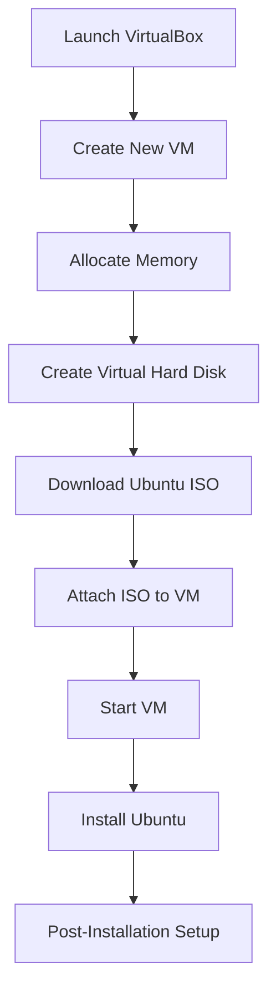

## Setting Up a Linux Ubuntu Virtual Machine

Once VirtualBox is installed, the next step is to set up a Linux Ubuntu virtual machine. This involves creating a new VM, allocating resources, and installing the Ubuntu operating system.

### Creating a New Virtual Machine

1. **Launch VirtualBox**:
   - Open VirtualBox from your Applications folder or desktop shortcut.

2. **Create a New VM**:
   - Click on "New" to create a new virtual machine.
   - Enter a name for your VM (e.g., "Ubuntu VM").
   - Choose the type of operating system (Linux) and version (Ubuntu 64-bit).

3. **Allocate Memory**:
   - Allocate memory (RAM) to your VM. A minimum of 2GB is recommended for a smooth experience.

4. **Create a Virtual Hard Disk**:
   - Choose to create a new virtual hard disk now.
   - Select the VDI (VirtualBox Disk Image) format.
   - Choose the dynamically allocated storage type.
   - Set the size of the virtual hard disk (e.g., 20GB).

### Installing Ubuntu

1. **Download Ubuntu ISO**:
   - Visit the official Ubuntu website at [https://ubuntu.com/download/desktop](https://ubuntu.com/download/desktop) and download the latest Ubuntu ISO file.

2. **Attach ISO to VM**:
   - In VirtualBox, select your VM and click on "Settings".
   - Go to the "Storage" tab and click on the "Empty" CD/DVD icon.
   - Click on "Choose Disk" and select the Ubuntu ISO file you downloaded.

3. **Start the VM**:
   - Click on "Start" to boot the VM from the attached ISO file.
   - Follow the on-screen instructions to install Ubuntu.

4. **Post-Installation Setup**:
   - Once the installation is complete, reboot the VM and remove the ISO file from the virtual CD/DVD drive.

### Full Installation Process Diagram



### Common Pitfalls and Solutions

- **Insufficient Resources**: Ensure that you allocate enough memory and disk space to the VM.
- **ISO Not Found**: Verify that the Ubuntu ISO file is correctly attached to the VM.
- **Installation Errors**: Follow the on-screen instructions carefully and ensure that all required steps are completed.

### How to Prevent / Defend Against Installation Issues

#### Detection

Use tools like `htop` (Linux) or Task Manager (Windows) to monitor resource usage during the installation process.

#### Prevention

- **Resource Allocation**: Allocate sufficient memory and disk space to the VM.
- **ISO Verification**: Verify that the Ubuntu ISO file is correctly attached to the VM.
- **Installation Steps**: Follow the on-screen instructions carefully and ensure that all required steps are completed.

### Secure Installation Example

```bash
# Example of monitoring resource usage during installation on Linux
htop

# Example of verifying ISO attachment in VirtualBox settings
# Go to Storage tab and ensure ISO is attached to VM
```

---
<!-- nav -->
[[14-Setting Up VirtualBox|Setting Up VirtualBox]] | [[DevOps/DevOps Bootcamp/01-Linux & OS Basics/11-Installing VirtualBox And Setting Up A Linux VM/00-Overview|Overview]] | [[DevOps/DevOps Bootcamp/01-Linux & OS Basics/11-Installing VirtualBox And Setting Up A Linux VM/16-Conclusion|Conclusion]]
