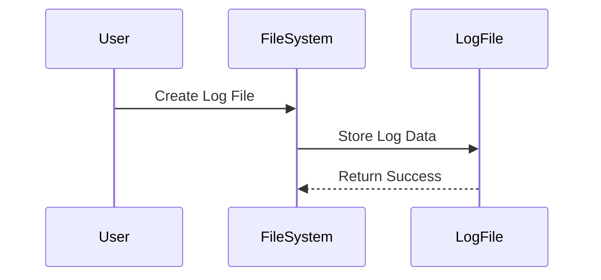

## Introduction to Linux File System Structure Compared to Windows

In this section, we will delve into the structure of the Linux file system and compare it to the Windows file system. Understanding these differences is crucial for anyone working in DevOps, as it affects how you manage and interact with files and directories across different operating systems.

### Overview of File Systems

A file system is a method for storing and organizing data in a computer. It defines how data is stored and retrieved. Both Linux and Windows use file systems, but they differ significantly in their structure and organization.

#### Linux File System Structure

The Linux file system is based on a hierarchical structure, where the root directory (`/`) is the topmost directory. All other directories and files are organized under this root directory. Each user on a Linux system has their own home directory, typically located under `/home`.

#### Windows File System Structure

Windows uses a more segmented approach, with drives (like `C:\`, `D:\`, etc.) as the top-level directories. Each drive can contain multiple directories and files. The root of each drive is the topmost directory, and all other directories and files are organized under this root.

### Home Directory in Linux

In Linux, each user has their own home directory, which is a private space for that user. The home directory is typically located under `/home`. For example, if the username is `nana`, the home directory would be `/home/nana`.

```mermaid
graph TD
    A[Root Directory (/)] --> B[Home Directory]
    B --> C[Nana's Home Directory]
```

#### Default Directories in Home Directory

When a new user is created, several default directories are automatically created within their home directory. These directories include:

- **Desktop**: Contains files and shortcuts placed on the user's desktop.
- **Documents**: Used for storing documents and other important files.
- **Downloads**: Stores files downloaded from the internet.
- **Music**: Used for storing music files.
- **Pictures**: Used for storing image files.
- **Videos**: Used for storing video files.

These directories provide a structured way to organize files and make it easier for users to find and manage their files.

### Accessing the Root Directory

To access the root directory in Linux, you can navigate through the file explorer or use the terminal. In the file explorer, you can click on "Other Locations" and then select "Computer" to access the root directory.

In the terminal, you can use the `cd` command to change to the root directory:

```bash
cd /
```

Once you are in the root directory, you can see the home directory and other top-level directories.

### Root User in Linux

The root user is a special user account in Linux that has full administrative privileges. The root user's home directory is located at `/root`, which is separate from the home directories of regular users.

```mermaid
graph TD
    A[Root Directory (/)] --> B[Home Directory]
    B --> C[Nana's Home Directory]
    A --> D[Root User Home Directory (/root)]
```

### Comparison with Windows

In Windows, the equivalent of the root directory is the drive letter (e.g., `C:\`). Each user also has a home directory, typically located under `C:\Users\<username>`. However, unlike Linux, there is no separate root user home directory; the administrator account shares the same structure as regular user accounts.

### Real-World Examples

Understanding the file system structure is essential for managing files and directories securely. For example, in the case of the Log4j vulnerability (CVE-2021-44228), attackers could exploit the vulnerability by manipulating log files, which are often stored in specific directories within the file system.

#### Secure Coding Practices

To prevent such vulnerabilities, it is crucial to follow secure coding practices. For instance, ensure that log files are stored in secure directories and that appropriate permissions are set to restrict access.



### How to Prevent / Defend

#### Detection

Regularly monitor file system changes using tools like `auditd` or `inotifywait`. These tools can help detect unauthorized modifications to critical files and directories.

```bash
sudo auditctl -w /var/log -p wa -k log_changes
```

#### Prevention

Set appropriate file permissions to restrict access to sensitive files and directories. Use the `chmod` and `chown` commands to manage permissions and ownership.

```bash
chmod 600 /var/log/application.log
chown root:root /var/log/application.log
```

#### Secure-Coding Fixes

Compare the vulnerable and secure versions of code to understand the necessary changes.

**Vulnerable Code:**
```python
import logging
logging.basicConfig(filename='/var/log/application.log', level=logging.DEBUG)
```

**Secure Code:**
```python
import logging
import os
if os.access('/var/log/application.log', os.W_OK):
    logging.basicConfig(filename='/var/log/application.log', level=logging.DEBUG)
else:
    logging.basicConfig(level=logging.DEBUG)
```

### Conclusion

Understanding the file system structure in Linux and comparing it to Windows is essential for effective file management and security. By following secure coding practices and implementing proper detection and prevention mechanisms, you can protect your systems from potential vulnerabilities.

### Practice Labs

For hands-on experience with Linux file system management, consider the following labs:

- **PortSwigger Web Security Academy**: Offers practical exercises on web application security, including file system manipulation.
- **OWASP Juice Shop**: Provides a vulnerable web application for practicing security testing and exploitation techniques.
- **DVWA (Damn Vulnerable Web Application)**: A deliberately insecure web application for practicing penetration testing and security assessments.

By engaging with these labs, you can gain practical experience in managing and securing file systems in a Linux environment.

---
<!-- nav -->
[[DevOps/DevOps Bootcamp/01-Linux & OS Basics/12-Linux File System Structure Compared To Windows/00-Overview|Overview]] | [[02-Hidden Files in Linux File Systems|Hidden Files in Linux File Systems]]
