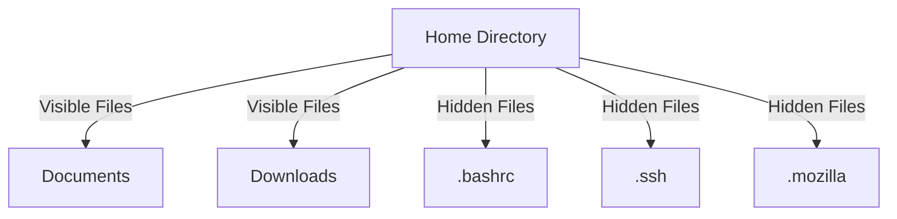

## Hidden Files in Linux File Systems

### Introduction to Hidden Files

In both Linux and Windows operating systems, hidden files play a crucial role in storing configuration data, application-specific information, and various other metadata. However, the way these hidden files are managed and accessed differs significantly between the two operating systems. Understanding the concept of hidden files is essential for anyone working with file systems, especially in a DevOps context.

#### What Are Hidden Files?

Hidden files are files that are not visible by default in the file system. They are typically used to store configuration settings, application data, and other metadata that should not clutter the user interface. In Unix-based systems like Linux, hidden files are denoted by a leading dot (`.`) in their filenames. This convention makes it easy to identify and manage these files programmatically.

For example, consider the following hidden files:

```bash
.hiddenfile.txt
.config
```

These files are not visible when using the `ls` command in a terminal unless the `-a` flag is used to show all files, including hidden ones.

### Hidden Files in Linux

#### How Hidden Files Work in Linux

In Linux, hidden files are files whose names begin with a dot (`.`). This naming convention is widely adopted across Unix-like operating systems. When a file starts with a dot, it becomes invisible to standard directory listing commands such as `ls`. To view hidden files, you need to use the `-a` option with `ls`.

```bash
# List all files, including hidden ones
ls -a
```

This command will display all files in the current directory, including those that are hidden.

#### Purpose of Hidden Files

Hidden files serve several purposes:

1. **Configuration Storage**: Many applications use hidden files to store configuration settings. For example, the `.bashrc` file contains configuration settings for the Bash shell.
   
2. **Application Data**: Applications often store temporary data or logs in hidden directories. For instance, the `.mozilla` directory stores configuration and log files for the Firefox browser.

3. **User-Specific Settings**: Hidden files can store user-specific settings and preferences. For example, the `.ssh` directory contains SSH keys and configurations for the current user.

#### Example: Hidden Files in User Home Directory

Let's explore the hidden files in a typical user home directory. Suppose we are in the home directory of a user named `john`.

```bash
cd ~john
ls -a
```

The output might look like this:

```bash
.
..
.bash_history
.bash_logout
.bash_profile
.bashrc
.mozilla
.ssh
```

Here, the `.bash_history`, `.bash_logout`, `.bash_profile`, and `.bashrc` files are configuration files for the Bash shell. The `.mozilla` directory contains configuration and log files for the Firefox browser, and the `.ssh` directory contains SSH keys and configurations.

### Hidden Files in Windows

#### How Hidden Files Work in Windows

In Windows, hidden files are marked with a special attribute rather than a naming convention. To hide a file in Windows, you can set the "Hidden" attribute using the `attrib` command or through the file properties dialog in the File Explorer.

For example, to hide a file named `example.txt`, you can use the following command:

```cmd
attrib +h example.txt
```

To unhide the file, you can use:

```cmd
attrib -h example.txt
```

#### Viewing Hidden Files in Windows

By default, Windows does not show hidden files in the File Explorer. To view hidden files, you need to change the settings in the File Explorer options.

1. Open File Explorer.
2. Click on the "View" tab.
3. Check the "Hidden items" checkbox.

Alternatively, you can use the `dir` command in the Command Prompt to list all files, including hidden ones.

```cmd
dir /ah
```

This command lists all files with the "Hidden" attribute.

### Comparison Between Linux and Windows

#### Naming Convention vs. Attribute

One of the key differences between Linux and Windows is how hidden files are identified:

- **Linux**: Hidden files are identified by a leading dot (`.`) in their filenames.
- **Windows**: Hidden files are identified by a special attribute.

#### Management and Access

- **Linux**: Hidden files can be managed using standard Unix commands like `ls`, `mv`, `rm`, etc.
- **Windows**: Hidden files can be managed using the `attrib` command or through the File Explorer.

### Real-World Examples and Security Implications

#### Recent CVEs and Breaches

Hidden files can sometimes be exploited in security breaches. For example, in the case of the Heartbleed bug (CVE-2014-0160), attackers could access sensitive information stored in memory, which might include hidden configuration files.

Another example is the WannaCry ransomware (CVE-2017-0144), which exploited a vulnerability in the SMB protocol to spread across networks. Hidden files containing configuration data for network services were often targeted by such attacks.

### How to Prevent / Defend Against Hidden File Exploits

#### Detection

To detect hidden files that may contain sensitive information, you can use tools like `find` in Linux or `dir` in Windows.

```bash
# Find all hidden files in the current directory and its subdirectories
find . -name ".*"
```

```cmd
# List all hidden files in the current directory and its subdirectories
dir /ah /s
```

#### Prevention

1. **Secure Configuration Files**: Ensure that configuration files are properly secured and not accessible to unauthorized users. Use appropriate file permissions and encryption where necessary.

2. **Regular Audits**: Regularly audit hidden files to ensure they do not contain sensitive information that could be exploited.

3. **Least Privilege Principle**: Follow the principle of least privilege by ensuring that users and processes have the minimum permissions required to perform their tasks.

#### Secure Coding Practices

When writing code that interacts with hidden files, follow secure coding practices to prevent vulnerabilities. For example, avoid hardcoding sensitive information in configuration files and use environment variables or secure vaults instead.

```bash
# Vulnerable code: Hardcoding sensitive information
echo "password=secret" > ~/.config/app.conf

# Secure code: Using environment variables
echo "password=$APP_PASSWORD" > ~/.config/app.conf
```

### Mermaid Diagrams

#### File System Structure

A mermaid diagram can help visualize the structure of a typical user home directory in Linux, showing both visible and hidden files.



### Conclusion

Understanding hidden files is crucial for managing file systems effectively and securely. By knowing how hidden files work in both Linux and Windows, you can better protect sensitive information and prevent potential security breaches. Always follow secure coding practices and regularly audit hidden files to ensure they are not exploited.

### Practice Labs

For hands-on practice with hidden files in Linux, consider the following labs:

- **PortSwigger Web Security Academy**: Offers exercises on file system manipulation and hidden files.
- **OWASP Juice Shop**: Provides a web application with various security challenges, including file system management.
- **DVWA (Damn Vulnerable Web Application)**: Includes scenarios where hidden files can be exploited.

These labs will help you gain practical experience in managing and securing hidden files in a controlled environment.

---
<!-- nav -->
[[01-Introduction to Linux File System Structure Compared to Windows|Introduction to Linux File System Structure Compared to Windows]] | [[DevOps/DevOps Bootcamp/01-Linux & OS Basics/12-Linux File System Structure Compared To Windows/00-Overview|Overview]] | [[03-Linux File System Structure Compared to Windows|Linux File System Structure Compared to Windows]]
