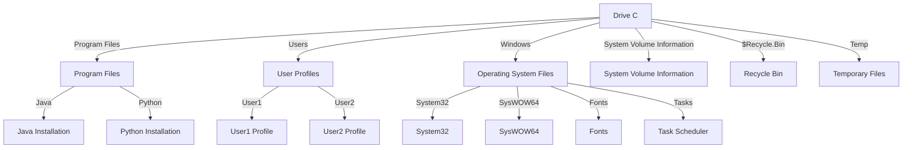
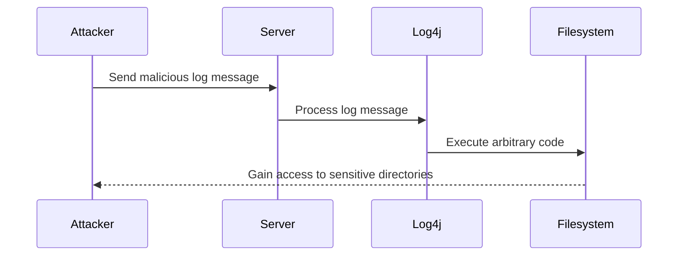

## Linux File System Structure Compared to Windows

### Introduction to Linux File System Structure

The Linux file system is a hierarchical tree structure, which means that all directories and files are organized in a way that resembles a tree. At the very top of this tree is the root directory, denoted by `/`. From the root directory, various subdirectories branch out, each serving a specific purpose. This structure allows for a logical and organized way to manage files and directories.

#### Root Directory (`/`)

The root directory is the highest level directory in the Linux file system hierarchy. All other directories and files are contained within this root directory. The root directory is crucial because it serves as the starting point for navigating through the file system. 

```mermaid
graph TD
    A[Root (/)] -->|bin| B[Binaries]
    A -->|boot| C[Bootloader Files]
    A -->|dev| D[Device Files]
    A -->|etc| E[System Configuration Files]
    A -->|home| F[User Home Directories]
    A -->|lib| G[Libraries]
    A -->|media| H[External Media Mount Points]
    A -->|mnt| I[Temporary Mount Points]
    A -->|opt| J[Optional Software Packages]
    A -->|proc| K[Process Information]
    A -->|root| L[System Administrator's Home Directory]
    A -->|run| M[Run-time Variable Data]
    A -->|sbin| N[System Binaries]
    A -->|srv| O[Service Data]
    A -->|sys| P[Kernel and Device Information]
    A -->|tmp| Q[Temporary Files]
    A -->|usr| R[User Programs and Files]
    A -->|var| S[Variable Data]
```

### Purpose of Subdirectories

Each subdirectory under the root directory has a specific purpose:

- **`/bin`**: Contains essential user commands.
- **`/boot`**: Contains static files required to boot the system.
- **`/dev`**: Contains device files.
- **`/etc`**: Contains system-wide configuration files.
- **`/home`**: Contains user home directories.
- **`/lib`**: Contains shared libraries.
- **`/media`**: Used for mounting external media.
- **`/mnt`**: Used for temporary mount points.
- **`/opt`**: Contains optional software packages.
- **`/proc`**: Contains process information.
- **`/root`**: Contains the system administrator's home directory.
- **`/run`**: Contains run-time variable data.
- **`/sbin`**: Contains system binaries.
- **`/srv`**: Contains service data.
- **`/sys`**: Contains kernel and device information.
- **`/tmp`**: Contains temporary files.
- **`/usr`**: Contains user programs and files.
- **`/var`**: Contains variable data.

### Comparison with Windows File System Structure

In contrast to the Linux file system, the Windows file system does not have a single root directory. Instead, it uses multiple root folders, typically represented by drive letters (e.g., `C:\`, `D:\`). This structure originated from the early days of personal computing when computers primarily used floppy disks. Each floppy disk was assigned a letter (e.g., `A:\`, `B:\`).

When hard drives were introduced, the next available letter (`C:\`) was assigned to the internal disk. Additional disks were given subsequent letters. This structure has remained largely unchanged, even though modern systems rarely use floppy disks.



### Graphical User Interface (GUI) View

In both Linux and Windows, graphical user interfaces (GUIs) provide a visual representation of the file system. This makes it easier for users to navigate and manage files and directories. In Linux, tools like Nautilus (GNOME) and Dolphin (KDE) provide a GUI view of the file system. Similarly, in Windows, File Explorer provides a GUI view.

### Real-World Examples and Security Implications

Understanding the file system structure is crucial for security reasons. For instance, in the context of Linux, the `/etc` directory contains critical configuration files. If an attacker gains access to this directory, they can modify system settings, potentially compromising the entire system.

#### Example: CVE-2021-4034 (Log4Shell)

The Log4Shell vulnerability (CVE-2021-4034) affected the Apache Log4j library, which is widely used in Java applications. This vulnerability allowed attackers to execute arbitrary code on the server by injecting malicious log messages. The impact of this vulnerability was severe because it could be exploited to gain unauthorized access to sensitive directories like `/etc`.



### How to Prevent / Defend Against File System Attacks

To prevent attacks that target the file system, several measures can be taken:

1. **Secure Configuration Management**:
   - Ensure that critical configuration files are properly secured.
   - Use permissions and access controls to restrict access to sensitive directories.

2. **Regular Audits and Monitoring**:
   - Regularly audit file system permissions and configurations.
   - Monitor file system changes using tools like `auditd`.

3. **Patch Management**:
   - Keep all software and libraries up-to-date to mitigate known vulnerabilities.
   - Apply security patches promptly.

4. **Secure Coding Practices**:
   - Implement secure coding practices to prevent injection attacks.
   - Validate and sanitize input data to prevent malicious log messages.

#### Secure Coding Example

Consider a scenario where a Java application logs user input. Without proper validation, an attacker could inject a malicious log message.

**Vulnerable Code**:
```java
import org.apache.logging.log4j.LogManager;
import org.apache.logging.log4j.Logger;

public class VulnerableApp {
    private static final Logger logger = LogManager.getLogger(VulnerableApp.class);

    public void logUserInput(String userInput) {
        logger.info("User input: {}", userInput);
    }
}
```

**Secure Code**:
```java
import org.apache.logging.log4j.LogManager;
import org.apache.logging.log4j.Logger;

public class SecureApp {
    private static final Logger logger = LogManager.getLogger(SecureApp.class);

    public void logUserInput(String userInput) {
        // Sanitize user input to prevent injection attacks
        String sanitizedInput = userInput.replaceAll("[^a-zA-Z0-9 ]", "");
        logger.info("Sanitized user input: {}", sanitizedInput);
    }
}
```

### Conclusion

Understanding the Linux file system structure is essential for effective management and security. By comparing it with the Windows file system, we can appreciate the differences and similarities between these two operating systems. Proper configuration, regular audits, and secure coding practices are key to preventing file system attacks. Hands-on practice with tools like PortSwigger Web Security Academy, OWASP Juice Shop, and DVWA can help reinforce these concepts.

---
<!-- nav -->
[[02-Hidden Files in Linux File Systems|Hidden Files in Linux File Systems]] | [[DevOps/DevOps Bootcamp/01-Linux & OS Basics/12-Linux File System Structure Compared To Windows/00-Overview|Overview]] | [[04-User Preferences and Configuration Files in Linux|User Preferences and Configuration Files in Linux]]
