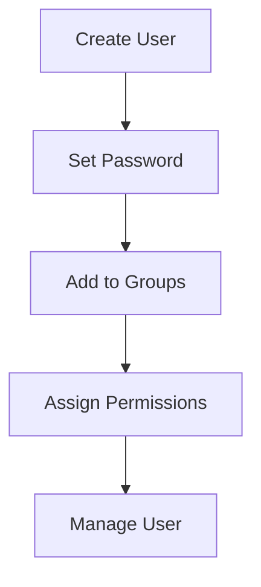

## Introduction to Linux User Management

In the context of Linux systems, user management is a critical aspect of system administration. This involves creating, modifying, and deleting user accounts, as well as assigning permissions and roles to these users. Each user account is specific to the hardware on which it is created; thus, if you log onto another machine, you will encounter a different set of user accounts registered on that particular device. This setup is particularly useful in environments where multiple users share the same computer, such as in a corporate setting or a school.

### Why Multiple User Accounts Matter

Multiple user accounts are especially significant in server environments. Servers are often managed by teams of administrators or engineers, and each member of the team requires access to the server. However, simply sharing a single user account among all team members is not advisable due to several reasons:

1. **Accountability**: With individual user accounts, it is easier to track who performed which actions on the server. This is crucial for maintaining logs and ensuring accountability.
2. **Security**: Sharing a single user account increases the risk of unauthorized access. If the shared account credentials are compromised, all team members' access could be at risk.
3. **Permissions Management**: Individual user accounts allow for fine-grained control over permissions. Different team members might require different levels of access to various resources on the server.

### Example Scenario

Consider a company with two servers managed by a team of three system administrators. These administrators need to perform various tasks on the servers, such as deploying applications, monitoring system performance, and troubleshooting issues. To ensure proper management and security, each administrator should have their own user account on the servers.

#### Why Not Share a Single User Account?

Let's delve deeper into why sharing a single user account is not ideal:

1. **Root Access Risks**: Giving all team members root access is highly risky. Root users have unrestricted privileges and can modify any file or execute any command on the system. If a malicious actor gains access to the root account, they can cause significant damage.
2. **Accountability Issues**: If all team members share a single user account, it becomes difficult to determine who performed specific actions on the server. This lack of accountability can lead to security breaches and operational issues.
3. **Permission Conflicts**: Different team members might require different levels of access to various resources. A shared user account would either grant too much access to some team members or too little access to others, leading to inefficiencies and potential security risks.

### Creating User Accounts in Linux

To create a new user account in Linux, you can use the `useradd` command. Here’s a step-by-step guide:

1. **Create a New User**:
    ```sh
    sudo useradd <username>
    ```

2. **Set a Password for the New User**:
    ```sh
    sudo passwd <username>
    ```

3. **Add the User to Specific Groups**:
    ```sh
    sudo usermod -aG <groupname> <username>
    ```

For example, to create a user named `admin1`, set a password, and add them to the `sudo` group:
```sh
sudo useradd admin1
sudo passwd admin1
sudo usermod -aG sudo admin1
```

### Managing User Permissions

Linux uses a permission model based on the Unix tradition, where each file and directory has permissions associated with three categories: owner, group, and others. These permissions can be modified using the `chmod` command.

#### Setting File Permissions

To set permissions for a file, you can use the `chmod` command. For example, to set read, write, and execute permissions for the owner, and read and execute permissions for the group and others:
```sh
chmod 755 <filename>
```

Here’s a breakdown of the permissions:
- `7`: Owner has read, write, and execute permissions (`rwx`).
- `5`: Group has read and execute permissions (`rx`).
- `5`: Others have read and execute permissions (`rx`).

### Mermaid Diagram: User Management Flow

A visual representation of the user management process can help understand the flow better:



### Real-World Examples and CVEs

Recent breaches and vulnerabilities highlight the importance of proper user management:

1. **CVE-2021-21974**: This vulnerability in the Linux kernel allowed local users to gain root privileges through a race condition in the `proc` filesystem. Proper user management and least privilege principles could mitigate such risks.
2. **SolarWinds Supply Chain Attack (2020)**: This attack involved the compromise of SolarWinds’ software update mechanism, leading to the installation of backdoor malware on thousands of organizations' networks. Proper user and permission management could have helped detect and prevent such attacks.

### How to Prevent / Defend

#### Detection

1. **Audit Logs**: Regularly review audit logs to identify unauthorized access attempts or suspicious activities.
2. **Intrusion Detection Systems (IDS)**: Deploy IDS to monitor network traffic and detect potential intrusions.

#### Prevention

1. **Least Privilege Principle**: Ensure that users have only the minimum necessary permissions to perform their tasks.
2. **Two-Factor Authentication (2FA)**: Implement 2FA to add an extra layer of security to user accounts.
3. **Regular Audits**: Conduct regular audits of user accounts and permissions to ensure compliance with security policies.

#### Secure Coding Fixes

Here’s an example of how to securely manage user permissions in a script:

**Vulnerable Code**:
```sh
#!/bin/bash
# Vulnerable script that grants root access to all users
echo "Granting root access to all users"
for user in $(cat /etc/passwd | cut -d: -f1); do
    usermod -aG root $user
done
```

**Secure Code**:
```sh
#!/bin/bash
# Secure script that grants root access only to specific users
echo "Granting root access to specific users"
specific_users=("admin1" "admin2")
for user in "${specific_users[@]}"; do
    usermod -aG root $user
done
```

### Conclusion

Proper user management is essential for maintaining security and accountability in Linux environments. By creating individual user accounts, setting appropriate permissions, and following best practices, you can significantly reduce the risk of security breaches and ensure efficient operations.

### Practice Labs

For hands-on practice with Linux user management, consider the following labs:

- **PortSwigger Web Security Academy**: Offers modules on Linux fundamentals and user management.
- **OWASP Juice Shop**: Provides a simulated environment to practice securing web applications, including user management.
- **DVWA (Damn Vulnerable Web Application)**: Allows you to practice securing web applications and understanding user permissions.

By engaging with these labs, you can gain practical experience in managing Linux user accounts and permissions effectively.

---
<!-- nav -->
[[01-Core Concepts in Linux Users and Permissions|Core Concepts in Linux Users and Permissions]] | [[DevOps/DevOps Bootcamp/01-Linux & OS Basics/14-Linux Users Permissions And Management/00-Overview|Overview]] | [[03-Introduction to Linux Users and Permissions|Introduction to Linux Users and Permissions]]
