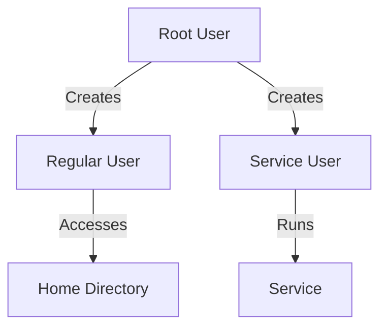
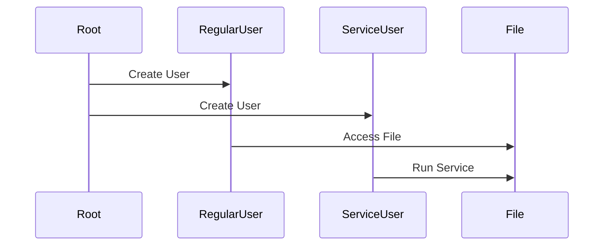

## Introduction to Linux Users and Permissions

In the realm of Linux systems, managing users and permissions is fundamental to ensuring both functionality and security. This chapter delves deep into the concepts of Linux users, permissions, and management, providing a comprehensive understanding of how to effectively manage users and permissions in a Linux environment.

### Types of Users in Linux

Linux systems typically have three main types of users:

1. **Root User**: The superuser, also known as the root user, has absolute control over the system. This user can perform any administrative task, including modifying system files, installing software, and managing other users.
2. **Regular Users**: These are standard users who have limited permissions. They can perform tasks such as creating files, running applications, and accessing their home directories.
3. **Service Users**: These are special users created specifically for running services or applications. Each service runs under its own dedicated user account to ensure isolation and security.

#### Root User

The root user is the most powerful user on a Linux system. It has unrestricted access to all files and commands. However, using the root user for everyday tasks is highly discouraged due to the potential for accidental damage or security breaches.

**Example of Root User Usage:**

```bash
sudo su -
```

This command switches to the root user, allowing you to perform administrative tasks.

#### Regular Users

Regular users are created to provide a secure and isolated environment for individual users. Each regular user has a home directory and limited permissions to perform tasks within their scope.

**Creating a Regular User:**

```bash
sudo useradd -m -s /bin/bash newuser
sudo passwd newuser
```

This creates a new user named `newuser` and sets a password for them.

#### Service Users

Service users are created specifically for running services or applications. Each service runs under its own dedicated user account to ensure isolation and security. For example, the Apache web server might run under the `www-data` user, and MySQL might run under the `mysql` user.

**Creating a Service User:**

```bash
sudo useradd -r -s /sbin/nologin mysql
```

This creates a service user named `mysql` with no login shell.

### Importance of Isolation and Security

Running services with dedicated users ensures that each service operates within its own isolated environment. This prevents one service from affecting others and enhances overall system security.

#### Example: Apache and MySQL

Consider a scenario where both Apache and MySQL are running on the same server. If Apache were to run as the root user, it could potentially access and modify MySQL data, leading to security vulnerabilities. By running each service under its own dedicated user, such as `www-data` for Apache and `mysql` for MySQL, the risk is minimized.

**Apache Configuration:**

```apache
User www-data
Group www-data
```

**MySQL Configuration:**

```ini
[mysqld]
user = mysql
```

### Security Risks of Using Root User

Using the root user to run services poses significant security risks. If a service running as root is compromised, the attacker gains full control over the system, leading to severe damage.

#### Real-World Example: CVE-2021-44228 (Log4Shell)

The Log4Shell vulnerability (CVE-2021-44228) affected many Java applications running as root. If a service running as root was vulnerable to Log4Shell, an attacker could gain full control of the system, leading to widespread breaches.

**Secure Configuration:**

To mitigate such risks, services should run under dedicated users with minimal permissions. For example, a web server like Apache should run as `www-data`, and a database server like MySQL should run as `mysql`.

### How to Prevent / Defend

#### Detection

Regularly audit your system to ensure that services are running under the correct users. Tools like `ps` and `top` can help identify processes running as root.

**Audit Command:**

```bash
ps aux | grep root
```

#### Prevention

1. **Use Dedicated Service Users**: Always run services under dedicated users with minimal permissions.
2. **Limit Root Access**: Restrict root access to only necessary tasks and use tools like `sudo` to log and control root operations.
3. **Regular Audits**: Perform regular audits to ensure compliance with security policies.

#### Secure Coding Fixes

**Vulnerable Code:**

```bash
sudo service apache2 start
```

**Secure Code:**

```bash
sudo -u www-data service apache2 start
```

### Managing Users and Permissions

Managing users and permissions involves creating, modifying, and deleting user accounts, as well as setting appropriate permissions for files and directories.

#### Creating and Modifying Users

**Creating a User:**

```bash
sudo useradd -m -s /bin/bash newuser
sudo passwd newuser
```

**Modifying a User:**

```bash
sudo usermod -c "New Comment" newuser
```

#### Setting File and Directory Permissions

File and directory permissions in Linux are managed using the `chmod` and `chown` commands.

**Setting Permissions:**

```bash
chmod 755 /path/to/file
```

**Changing Ownership:**

```bash
chown www-data:www-data /path/to/file
```

### Mermaid Diagrams

#### User Management Architecture



#### Permission Flow



### Conclusion

Effective management of users and permissions in a Linux environment is crucial for maintaining system security and functionality. By following best practices such as using dedicated service users and limiting root access, you can significantly reduce the risk of security breaches and ensure a robust and secure system.

### Practice Labs

For hands-on experience with Linux user management and permissions, consider the following labs:

- **PortSwigger Web Security Academy**: Offers practical exercises on securing web applications.
- **OWASP Juice Shop**: Provides a vulnerable web application for practicing security techniques.
- **DVWA (Damn Vulnerable Web Application)**: A deliberately insecure web application for practicing penetration testing.

These labs will help you apply the concepts learned in this chapter to real-world scenarios.

---
<!-- nav -->
[[02-Introduction to Linux User Management|Introduction to Linux User Management]] | [[DevOps/DevOps Bootcamp/01-Linux & OS Basics/14-Linux Users Permissions And Management/00-Overview|Overview]] | [[04-Introduction to User Management in Linux and Windows|Introduction to User Management in Linux and Windows]]
