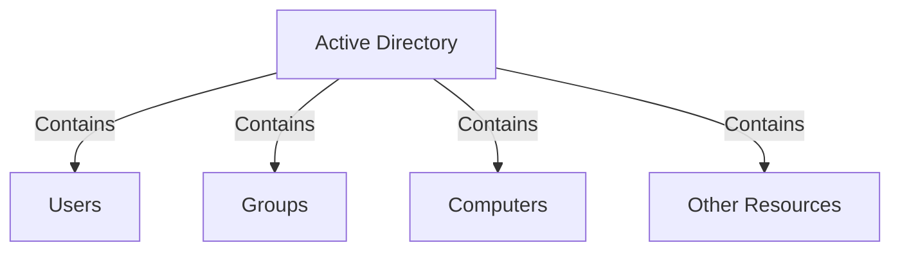
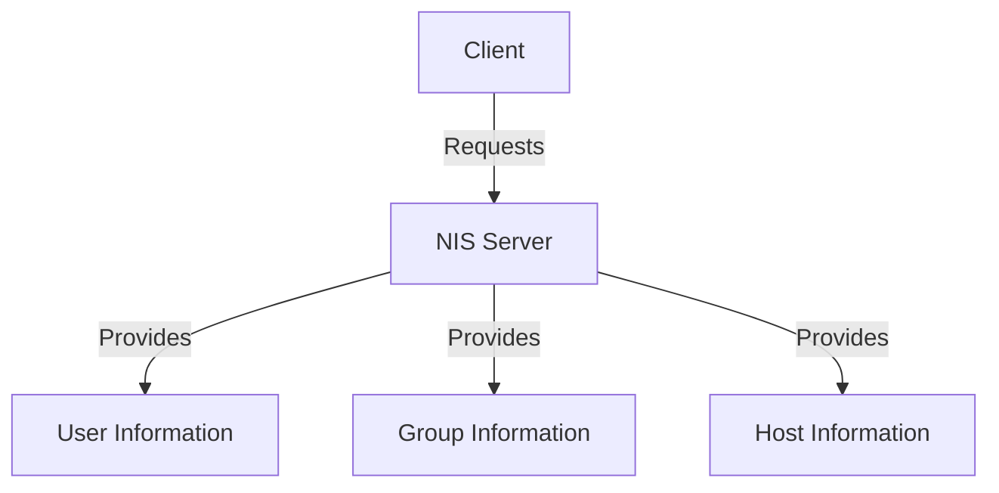
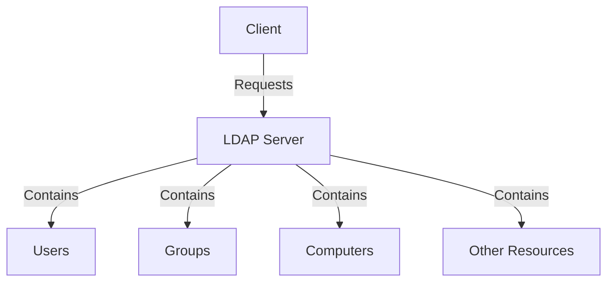
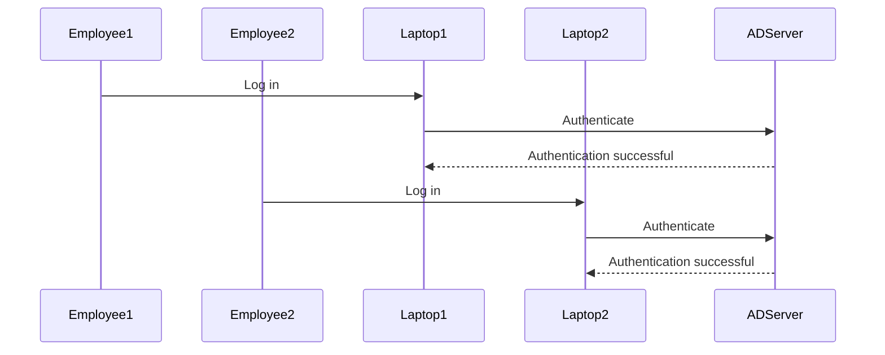
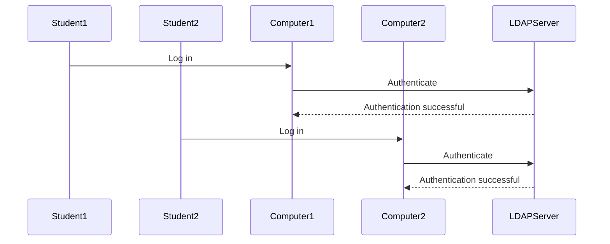

## Introduction to User Management in Linux and Windows

User management is a critical aspect of system administration, especially in environments where multiple users need to access shared resources. Whether it's a corporate setting or an educational institution, managing user accounts effectively ensures that each user has appropriate access to the necessary resources while maintaining security and compliance.

### Why Multiple Accounts?

The primary reason for having multiple accounts is to enable shared access to a system. This is particularly important in environments such as:

- **Corporate Settings**: Employees may need to access shared computers or laptops.
- **Educational Institutions**: Students may need to use computers in computer labs.

In both scenarios, each user should be able to log in with their own credentials, ensuring that their data and settings are preserved across different devices.

### Centralized User Management in Windows

Windows operating systems provide a mechanism for centralized user management through Active Directory (AD). AD allows administrators to manage user accounts, groups, and permissions from a central location. This is particularly useful in large organizations where multiple users need to access various resources.

#### How Active Directory Works

Active Directory is a directory service that stores information about objects in a network. These objects can be users, groups, computers, and other resources. AD provides a hierarchical structure for organizing these objects, making it easier to manage permissions and access control.



### Centralized User Management in Linux

Linux systems also support centralized user management, but the approach differs from Windows. In Linux, centralized user management is typically achieved through Network Information Service (NIS) or Lightweight Directory Access Protocol (LDAP).

#### Network Information Service (NIS)

NIS is a client-server directory service protocol used to store information about users, groups, and hosts in a central location. This allows multiple clients to access the same information without needing to maintain local copies.



#### Lightweight Directory Access Protocol (LDAP)

LDAP is a more modern and flexible alternative to NIS. It uses a hierarchical structure similar to Active Directory, allowing for efficient management of user accounts and permissions.



### Differences Between Windows and Linux User Management

While both Windows and Linux support centralized user management, there are some key differences:

- **Centralization**: Windows uses Active Directory, which is tightly integrated with the operating system. Linux uses NIS or LDAP, which are more flexible but require additional configuration.
- **Scalability**: Active Directory is designed for large-scale enterprise environments, while NIS and LDAP are more suitable for smaller networks.
- **Management Tools**: Windows provides comprehensive tools for managing Active Directory, while Linux relies on command-line tools like `ldapadd`, `ldapmodify`, and `nis`.

### Practical Examples and Real-World Scenarios

#### Example: Corporate Environment

Consider a corporate environment where employees need to access shared laptops. Each employee should be able to log in with their own credentials, regardless of which laptop they use.



#### Example: Educational Institution

In an educational institution, students need to access computers in computer labs. Each student should be able to log in with their own credentials, preserving their settings and data.



### Common Pitfalls and Best Practices

#### Pitfall: Inadequate User Management

Failing to properly manage user accounts can lead to security vulnerabilities. For example, if user accounts are not properly managed, unauthorized users may gain access to sensitive resources.

#### Best Practice: Strong Password Policies

Implement strong password policies to ensure that user accounts are protected. This includes requiring complex passwords, enforcing regular password changes, and using multi-factor authentication (MFA).

#### Best Practice: Regular Audits

Regularly audit user accounts to ensure that only authorized users have access. This includes reviewing user permissions, disabling inactive accounts, and removing unnecessary privileges.

### How to Prevent / Defend

#### Detection

To detect unauthorized access, implement logging and monitoring mechanisms. This includes logging user activities, monitoring access patterns, and alerting on suspicious behavior.

#### Prevention

To prevent unauthorized access, implement strong user management practices. This includes:

- **Strong Password Policies**: Require complex passwords and enforce regular password changes.
- **Multi-Factor Authentication (MFA)**: Use MFA to add an extra layer of security.
- **Regular Audits**: Regularly review user accounts and permissions to ensure that only authorized users have access.

#### Secure Coding Fixes

Here is an example of how to securely manage user accounts in a Linux environment using LDAP:

**Vulnerable Code:**

```bash
# Add a new user without proper validation
ldapadd -x -D "cn=admin,dc=example,dc=com" -w adminpassword <<EOF
dn: uid=newuser,ou=People,dc=example,dc=com
objectClass: inetOrgPerson
uid: newuser
sn: New
givenName: User
userPassword: weakpassword
EOF
```

**Secure Code:**

```bash
# Add a new user with proper validation
ldapadd -x -D "cn=admin,dc=example,dc=com" -w adminpassword <<EOF
dn: uid=newuser,ou=People,dc=example,dc=com
objectClass: inetOrgPerson
uid: newuser
sn: New
givenName: User
userPassword: $(slappasswd -h {SHA} -s strongpassword)
EOF
```

### Conclusion

Effective user management is crucial for maintaining security and compliance in shared environments. By understanding the differences between Windows and Linux user management, implementing strong password policies, and regularly auditing user accounts, you can ensure that your system remains secure and accessible to authorized users.

### Hands-On Labs

For practical experience in user management, consider the following labs:

- **PortSwigger Web Security Academy**: Offers hands-on labs for web application security.
- **OWASP Juice Shop**: Provides a vulnerable web application for practicing security skills.
- **DVWA (Damn Vulnerable Web Application)**: A deliberately insecure web application for practicing penetration testing.
- **WebGoat**: An interactive, gamified training application for learning web security.

These labs provide a comprehensive understanding of user management and security practices in real-world scenarios.

---
<!-- nav -->
[[03-Introduction to Linux Users and Permissions|Introduction to Linux Users and Permissions]] | [[DevOps/DevOps Bootcamp/01-Linux & OS Basics/14-Linux Users Permissions And Management/00-Overview|Overview]] | [[05-Introduction to User Permissions and Management in Linux|Introduction to User Permissions and Management in Linux]]
