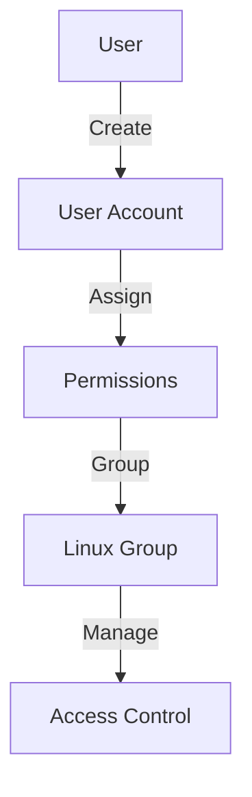
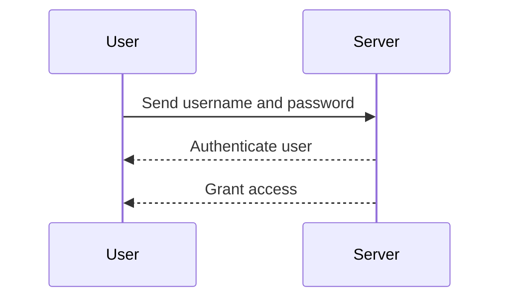

## Introduction to User Permissions and Management in Linux

In the realm of DevOps, managing user permissions and access control is crucial for maintaining the integrity and security of your systems. This chapter delves deep into the concepts of user management and permission handling in Linux environments, providing a comprehensive guide to ensure that your systems are both functional and secure.

### Why Manage User Permissions?

Managing user permissions is essential for several reasons:

1. **Role-Based Access Control**: Different team members often require different levels of access based on their roles. A senior administrator might need extensive privileges, whereas a junior developer might only need limited access.
   
2. **Traceability**: Tracking who performed what actions on the system is vital, especially for critical servers such as production servers. This helps in diagnosing issues and ensuring accountability.

3. **Security**: Properly managed permissions reduce the risk of unauthorized access and potential security breaches.

### Creating User Accounts

When setting up a new server, the first step is to create user accounts for each team member. This ensures that everyone has the appropriate level of access to perform their tasks.

#### Steps to Create a User Account

1. **Log in as Root**: You typically need root privileges to create a new user account.
   
2. **Use the `adduser` Command**: The `adduser` command simplifies the process of creating a new user.

```bash
sudo adduser nana
```

This command prompts you to enter additional details such as the user's password, full name, and other information.

3. **Verify the User**: Once the user is created, you can verify it using the `cat` command to check the `/etc/passwd` file.

```bash
cat /etc/passwd | grep nana
```

### Managing Permissions Directly

Permissions can be managed directly for individual users. This approach allows you to specify exactly what a user can and cannot do.

#### Setting Up Direct Permissions

1. **Granting Superuser Privileges**: To allow a user to execute commands with superuser privileges, you can add them to the `sudoers` file.

```bash
sudo visudo
```

Add the following line to grant `nana` sudo privileges:

```plaintext
nana ALL=(ALL) ALL
```

2. **File and Directory Permissions**: You can set file and directory permissions using the `chmod` command.

```bash
chmod 755 /path/to/directory
```

This sets the permissions to `rwxr-xr-x`, allowing the owner to read, write, and execute, while others can only read and execute.

### Group-Based Permission Management

Another method of managing permissions is by grouping users into Linux groups and assigning permissions to those groups.

#### Creating and Managing Groups

1. **Creating a Group**: Use the `groupadd` command to create a new group.

```bash
sudo groupadd developers
```

2. **Adding Users to a Group**: Use the `usermod` command to add a user to a group.

```bash
sudo usermod -aG developers nana
```

3. **Setting Group Permissions**: You can set permissions for files and directories to be accessible by a group.

```bash
chgrp developers /path/to/directory
chmod 775 /path/to/directory
```

This sets the permissions to `rwxrwxr-x`, allowing the owner and group members to read, write, and execute, while others can only read and execute.

### Real-World Examples and Recent Breaches

#### Example: CVE-2021-44228 (Log4j Vulnerability)

The Log4j vulnerability (CVE-2021-44228) highlighted the importance of proper permission management. Attackers exploited this vulnerability to gain unauthorized access to systems. By ensuring that only necessary users had access to sensitive directories and files, the impact could have been minimized.

#### Example: SolarWinds Supply Chain Attack (2020)

The SolarWinds supply chain attack demonstrated the importance of traceability and role-based access control. By maintaining detailed logs and ensuring that only authorized personnel had access to critical systems, organizations could have detected and mitigated the attack more effectively.

### How to Prevent / Defend

#### Detection

1. **Audit Logs**: Regularly review audit logs to monitor user activities and detect any unauthorized access attempts.

```bash
sudo cat /var/log/auth.log
```

2. **Intrusion Detection Systems (IDS)**: Implement IDS to monitor network traffic and alert on suspicious activities.

#### Prevention

1. **Least Privilege Principle**: Ensure that users have only the minimum permissions required to perform their tasks.

2. **Two-Factor Authentication (2FA)**: Implement 2FA to add an extra layer of security for user authentication.

3. **Regular Audits**: Conduct regular audits to ensure compliance with security policies and identify any potential vulnerabilities.

#### Secure Coding Fixes

**Vulnerable Code Example**

```bash
# Vulnerable script that allows any user to execute a command with sudo privileges
echo "ALL ALL=(ALL) NOPASSWD: ALL" > /etc/sudoers.d/vulnerable
```

**Secure Code Example**

```bash
# Secure script that grants sudo privileges only to specific users
echo "nana ALL=(ALL) ALL" > /etc/sudoers.d/secure
```

### Complete Examples and Code Blocks

#### Full HTTP Request and Response

```http
GET /api/users/nana HTTP/1.1
Host: example.com
Authorization: Bearer <token>
Content-Type: application/json

HTTP/1.1 200 OK
Date: Mon, 23 Jan 2023 12:00:00 GMT
Content-Type: application/json
Content-Length: 123

{
  "username": "nana",
  "permissions": ["read", "write"]
}
```

#### Full Policy/Config File

**IAM Policy JSON Example**

```json
{
  "Version": "2012-10-17",
  "Statement": [
    {
      "Effect": "Allow",
      "Action": [
        "ec2:DescribeInstances"
      ],
      "Resource": "*"
    }
  ]
}
```

### Mermaid Diagrams

#### User Management Architecture



#### Sequence Diagram for User Login



### Practice Labs

For hands-on practice, consider the following labs:

- **PortSwigger Web Security Academy**: Focuses on web application security.
- **OWASP Juice Shop**: Provides a vulnerable web application for learning.
- **DVWA (Damn Vulnerable Web Application)**: Offers various levels of difficulty for learning web security.
- **WebGoat**: An interactive web security training application.

These labs provide practical experience in managing user permissions and securing systems.

### Conclusion

Proper management of user permissions and access control is fundamental to maintaining the security and functionality of your systems. By understanding the principles and techniques covered in this chapter, you can ensure that your Linux environments are both secure and efficient.

---
<!-- nav -->
[[04-Introduction to User Management in Linux and Windows|Introduction to User Management in Linux and Windows]] | [[DevOps/DevOps Bootcamp/01-Linux & OS Basics/14-Linux Users Permissions And Management/00-Overview|Overview]] | [[06-Introduction to User and Group Management in Linux|Introduction to User and Group Management in Linux]]
