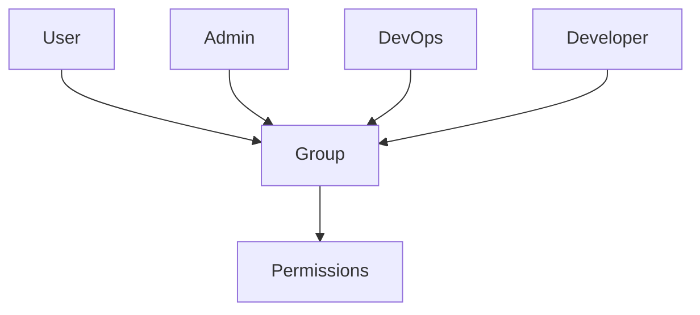

## Introduction to User and Group Management in Linux

In the realm of Linux system administration, managing users and their permissions is a fundamental task. This chapter delves deep into the concepts of user and group management, explaining the rationale behind these practices, their implementation, and the security implications involved. By the end of this chapter, you will have a comprehensive understanding of how to effectively manage users and groups in a Linux environment, ensuring both efficiency and security.

### What Are Users and Groups?

In Linux, a **user** is an individual account that allows access to the system. Each user has a unique username and password, and can be assigned specific permissions and privileges. A **group**, on the other hand, is a collection of users. Groups are used to simplify permission management, as permissions can be granted to a group rather than to individual users.

#### Why Use Groups?

Using groups simplifies the management of permissions, especially in environments with many users. Instead of setting permissions for each user individually, you can define permissions for a group and add users to that group. This approach is particularly useful in organizations with multiple teams, such as DevOps, development, and administrative teams.

### Creating and Managing Users

To manage users effectively, you need to understand how to create, modify, and delete user accounts. Here’s a step-by-step guide:

#### Creating a New User

To create a new user, you can use the `adduser` or `useradd` command. The `adduser` command is more interactive and sets up a home directory for the user, while `useradd` requires additional steps to set up the home directory.

```bash
sudo adduser newusername
```

This command prompts you to enter a password and additional information about the user.

#### Modifying User Information

To modify user information, such as changing the user's password or updating their details, you can use the `passwd` and `chfn` commands.

```bash
sudo passwd newusername
sudo chfn newusername
```

The `passwd` command changes the user's password, while `chfn` updates the user's finger information.

#### Deleting a User

To delete a user, you can use the `deluser` or `userdel` command. The `deluser` command removes the user and their home directory, while `userdel` requires additional flags to remove the home directory.

```bash
sudo deluser newusername
sudo userdel -r newusername
```

### Creating and Managing Groups

Groups are essential for managing permissions efficiently. Here’s how to create and manage groups:

#### Creating a New Group

To create a new group, you can use the `groupadd` command.

```bash
sudo groupadd devops
```

This command creates a new group named `devops`.

#### Adding a User to a Group

To add a user to a group, you can use the `usermod` command.

```bash
sudo usermod -aG devops newusername
```

This command adds the user `newusername` to the `devops` group.

#### Removing a User from a Group

To remove a user from a group, you can use the `gpasswd` command.

```bash
sudo gpasswd -d newusername devops
```

This command removes the user `newusername` from the `devops` group.

### Setting Permissions for Groups

Permissions in Linux are managed using the `chmod` command. You can set permissions for files and directories based on the owner, group, and others.

#### Basic File Permissions

File permissions are represented in three sets of three characters: `rwx`. The first set applies to the owner, the second to the group, and the third to others.

```bash
-rw-r--r--
```

- `rw-`: Owner has read and write permissions.
- `r--`: Group has read permission.
- `r--`: Others have read permission.

#### Setting Permissions for a Group

To set permissions for a group, you can use the `chmod` command.

```bash
sudo chmod 755 /path/to/directory
```

This command sets the permissions to `rwxr-xr-x`, allowing the owner to read, write, and execute, the group to read and execute, and others to read and execute.

### Real-World Examples and Security Implications

#### Recent CVEs and Breaches

One notable example is the CVE-2021-22555, which affected the sudo utility. This vulnerability allowed a user with low privileges to gain root access, bypassing the sudoers file restrictions. This highlights the importance of proper user and group management to mitigate such risks.

#### Secure Coding Practices

To prevent unauthorized access, ensure that users and groups are properly configured. For example, avoid giving unnecessary permissions to users and groups. Use the principle of least privilege, granting only the minimum permissions required for a user to perform their tasks.

### How to Prevent / Defend

#### Detection

Regularly audit user and group permissions to identify any unauthorized access. Tools like `auditd` can help monitor and log changes to user and group permissions.

#### Prevention

Implement strict policies for user and group management. Use tools like `sudo` to control user privileges and limit the damage in case of a breach.

#### Secure-Coding Fixes

Here’s an example of a vulnerable and secure configuration:

**Vulnerable Configuration:**

```bash
# Vulnerable sudoers file
newusername ALL=(ALL) NOPASSWD: ALL
```

**Secure Configuration:**

```bash
# Secure sudoers file
newusername ALL=(ALL) ALL
```

In the secure configuration, the user `newusername` is required to enter a password when using sudo, reducing the risk of unauthorized access.

### Complete Example: Creating and Managing Users and Groups

Let’s walk through a complete example of creating a user, adding them to a group, and setting permissions.

#### Step 1: Create a New User

```bash
sudo adduser newusername
```

#### Step 2: Create a New Group

```bash
sudo groupadd devops
```

#### Step 3: Add the User to the Group

```bash
sudo usermod -aG devops newusername
```

#### Step 4: Set Permissions for the Group

```bash
sudo chmod 755 /path/to/directory
```

### Mermaid Diagrams

#### User and Group Management Architecture



This diagram shows the relationship between users, groups, and permissions. Users are added to groups, and permissions are set for the group.

### Conclusion

Effective user and group management is crucial for maintaining security and efficiency in a Linux environment. By understanding the principles and practices outlined in this chapter, you can ensure that your system is well-managed and secure.

### Practice Labs

For hands-on experience, consider the following labs:

- **PortSwigger Web Security Academy**: Offers practical exercises on web application security.
- **OWASP Juice Shop**: A deliberately insecure web application for practicing security skills.
- **DVWA (Damn Vulnerable Web Application)**: A PHP/MySQL web application that is riddled with vulnerabilities for educational purposes.

These labs provide real-world scenarios to apply the concepts learned in this chapter.

---
<!-- nav -->
[[05-Introduction to User Permissions and Management in Linux|Introduction to User Permissions and Management in Linux]] | [[DevOps/DevOps Bootcamp/01-Linux & OS Basics/14-Linux Users Permissions And Management/00-Overview|Overview]] | [[07-Linux Users Permissions and Management|Linux Users Permissions and Management]]
