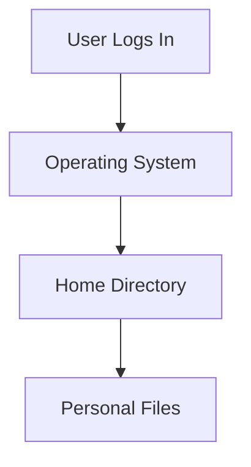
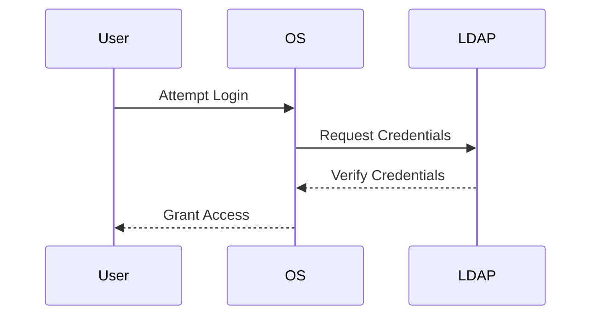
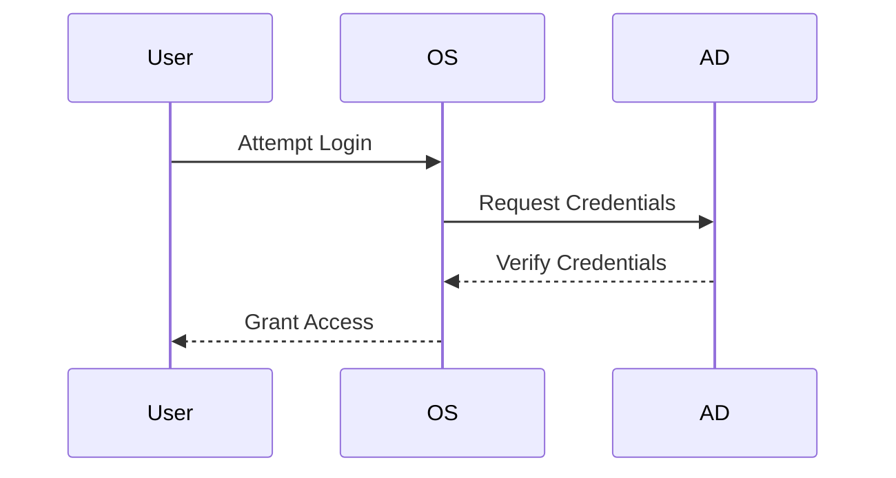
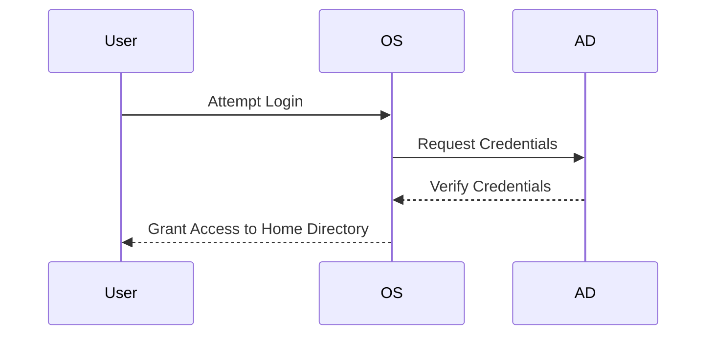
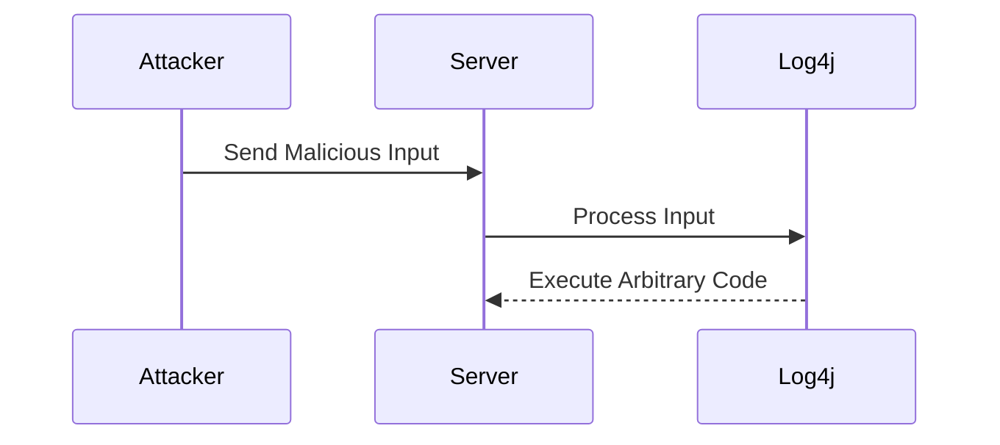

## Linux Users Permissions and Management

### Introduction to User Management in Linux

In the context of Linux systems, managing users and their permissions is crucial for maintaining security and ensuring that resources are accessed appropriately. This section delves into the intricacies of user management in Linux, covering concepts such as user accounts, permissions, and isolation mechanisms.

### User Accounts and Home Directories

When a user logs into a Linux system, they are assigned a unique user account. Each user account has a corresponding home directory where personal files and configurations are stored. This home directory is typically located in `/home/username`.



#### Example of Home Directory Structure

Consider a user named `john`. His home directory would be `/home/john`, and it might contain the following structure:

```bash
/home/john/
├── Documents
├── Downloads
├── Music
└── Pictures
```

### Centralized User Management Systems

In large organizations, centralized user management systems like LDAP (Lightweight Directory Access Protocol) or Active Directory (AD) are often employed. These systems manage user credentials and permissions across multiple machines.

#### Lightweight Directory Access Protocol (LDAP)

LDAP is a protocol for accessing and maintaining distributed directory information services over networks. It is commonly used for authentication and authorization in enterprise environments.



#### Active Directory (AD)

Active Directory is Microsoft's implementation of LDAP. It provides a centralized directory service for Windows-based networks.



### Isolation Mechanisms

Linux ensures that users can only access their own home directories and cannot interfere with system files or other users' data. This isolation is achieved through file permissions and ownership.

#### File Permissions

File permissions in Linux are represented using a combination of read (`r`), write (`w`), and execute (`x`) permissions for the owner, group, and others.

```bash
-rwxr-xr-x 1 john john 0 Mar 15 10:00 file.txt
```

- `rwx`: Owner (john) has read, write, and execute permissions.
- `r-x`: Group (john) has read and execute permissions.
- `r-x`: Others have read and execute permissions.

#### Setting File Permissions

Permissions can be set using the `chmod` command. For example, to set read and write permissions for the owner and read-only permissions for others:

```bash
chmod 644 file.txt
```

### Strict Permissions and Software Installation

In many corporate environments, user permissions are strictly controlled to prevent unauthorized modifications. This means users cannot install software outside their home directory.

#### Example of Restricted Permissions

Consider a user `jane` who attempts to install a package:

```bash
sudo apt-get install some-package
```

If `jane` does not have sudo privileges, she will receive an error:

```bash
jane is not in the sudoers file.  This incident will be reported.
```

### Comparison with Windows Systems

Windows systems also employ centralized user management, but they offer more flexibility in terms of software installation and file manipulation. This is one reason why Windows is often preferred in educational and corporate settings.

#### Example of Windows User Management

In Windows, a user can log into any machine connected to the domain and access their home directory:



### Multiple Users on Linux Machines

While Linux lacks the centralized user management capabilities of Windows, it still supports multiple user accounts. Each user can have their own home directory and permissions.

#### Example of Multiple Users

Consider two users, `alice` and `bob`, on a Linux machine:

```bash
/home/
├── alice
│   ├── Documents
│   └── Downloads
└── bob
    ├── Music
    └── Pictures
```

### Recent Real-World Examples

#### CVE-2021-44228 (Log4Shell)

The Log4Shell vulnerability (CVE-2021-44228) affected many applications using Apache Log4j. This vulnerability allowed attackers to execute arbitrary code on the server, bypassing typical permission controls.



#### How to Prevent / Defend

To mitigate such vulnerabilities, ensure that all software dependencies are up-to-date and apply security patches promptly.

```bash
# Example of updating Log4j
sudo apt-get update
sudo apt-get upgrade log4j
```

### Conclusion

Understanding user management and permissions in Linux is essential for maintaining a secure and efficient computing environment. By leveraging centralized user management systems and strict permission controls, organizations can ensure that users have appropriate access to resources while minimizing security risks.

### Practice Labs

For hands-on experience with Linux user management, consider the following labs:

- **PortSwigger Web Security Academy**: Offers exercises on securing web applications, including user management.
- **OWASP Juice Shop**: Provides a vulnerable web application for practicing security techniques.
- **DVWA (Damn Vulnerable Web Application)**: A deliberately insecure web application for learning about web application security.

These labs provide practical scenarios to reinforce the theoretical concepts covered in this chapter.

---
<!-- nav -->
[[06-Introduction to User and Group Management in Linux|Introduction to User and Group Management in Linux]] | [[DevOps/DevOps Bootcamp/01-Linux & OS Basics/14-Linux Users Permissions And Management/00-Overview|Overview]] | [[08-Logging In and Switching Users in Linux|Logging In and Switching Users in Linux]]
