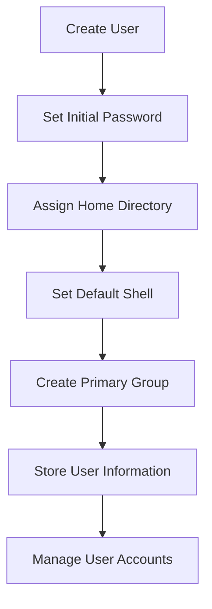
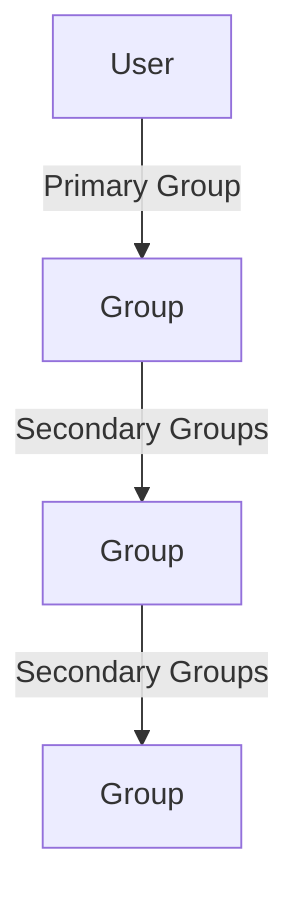

## User Management in Linux

### Introduction to User Management

User management is a fundamental aspect of system administration in Linux. It involves creating, modifying, and deleting user accounts, setting permissions, and managing groups. Understanding these concepts is crucial for maintaining security and ensuring proper access control within a system.

### Home Directory and Default Shell

Each user in a Linux system has a home directory, which is the default working directory when the user logs in. This directory typically contains personal files and configurations specific to the user. The default shell is the command-line interface used by the user to interact with the system. In most modern Linux distributions, `/bin/bash` is the default shell.

#### Example: Home Directory and Default Shell

```bash
# View the current user's home directory and default shell
echo $HOME
echo $SHELL
```

### Adding a New User

Adding a new user in Linux requires administrative privileges because it involves modifying system files and potentially granting access to sensitive resources. The `adduser` command is commonly used to create a new user account.

#### Syntax and Usage

The basic syntax for adding a new user is:

```bash
sudo adduser <username>
```

For example, to add a user named `Tom`, you would run:

```bash
sudo adduser Tom
```

Upon executing this command, you will be prompted to set the initial password and provide additional details such as the user's full name, room number, etc.

#### Example: Adding a New User

```bash
# Add a new user named Tom
sudo adduser Tom
```

### User Information and IDs

When a user is created, several pieces of information are stored in the system. These include the user's ID (UID), primary group ID (GID), home directory, and default shell. This information is typically stored in the `/etc/passwd` file.

#### Example: Viewing User Information

```bash
# View the contents of /etc/passwd
cat /etc/passwd
```

### Primary Group Creation

By default, when a user is created using the `adduser` command, a primary group with the same name as the user is also created. This group is assigned as the primary group for the user.

#### Example: Viewing Group Information

```bash
# View the contents of /etc/group
cat /etc/group
```

### Changing User Passwords

Administrators can change a user's password using the `passwd` command. This command also requires administrative privileges.

#### Syntax and Usage

The basic syntax for changing a user's password is:

```bash
sudo passwd <username>
```

For example, to change the password for the user `Tom`, you would run:

```bash
sudo passwd Tom
```

#### Example: Changing a User's Password

```bash
# Change the password for the user Tom
sudo passwd Tom
```

### How to Prevent / Defend

#### Secure User Management Practices

1. **Use Strong Password Policies**: Enforce strong password policies to ensure that user passwords are difficult to guess or crack. Use tools like `pam_cracklib` or `pam_pwquality` to enforce complexity requirements.
   
2. **Limit Administrative Privileges**: Only grant administrative privileges to users who absolutely need them. Use tools like `sudo` to restrict the commands that non-administrative users can execute with elevated privileges.

3. **Regularly Audit User Accounts**: Regularly review user accounts to ensure that only necessary accounts exist and that their permissions are appropriate. Remove inactive or unused accounts.

4. **Enable Two-Factor Authentication (2FA)**: Implement two-factor authentication to add an extra layer of security to user logins.

5. **Monitor Login Attempts**: Monitor login attempts and failed login attempts to detect potential brute-force attacks or unauthorized access attempts.

#### Example: Configuring Password Policies

```bash
# Edit the PAM configuration file to enforce password complexity
sudo nano /etc/pam.d/common-password

# Add the following line to enforce password complexity
password requisite pam_cracklib.so retry=3 minlen=8 difok=3
```

### Real-World Examples and Breaches

#### CVE-2021-22205: Unauthenticated Access in OpenEMR

In 2021, a critical vulnerability was discovered in the OpenEMR healthcare software, allowing unauthenticated access to patient records. This breach highlights the importance of proper user management and access control.

#### Example: Exploiting Weak User Management

```bash
# Example of a weak user management setup
# Vulnerable configuration
cat /etc/shadow
```

#### Secure Configuration

```bash
# Secure configuration
# Ensure that the shadow file is properly protected
ls -l /etc/shadow
```

### Practice Labs

To gain hands-on experience with user management in Linux, consider the following practice labs:

- **PortSwigger Web Security Academy**: Offers interactive labs on various aspects of web security, including user management.
- **OWASP Juice Shop**: A deliberately insecure web application for practicing web security skills.
- **DVWA (Damn Vulnerable Web Application)**: A PHP/MySQL web application that is riddled with vulnerabilities for educational purposes.

### Conclusion

Proper user management is essential for maintaining the security and integrity of a Linux system. By understanding how to create, modify, and manage user accounts, administrators can ensure that only authorized users have access to system resources. Additionally, implementing strong security practices and regularly auditing user accounts can help prevent unauthorized access and mitigate potential security risks.

### Diagrams

#### User Management Flowchart



#### User and Group Relationships



### Summary

In this chapter, we covered the fundamentals of user management in Linux, including creating new users, setting passwords, and managing user information. We also discussed the importance of proper user management practices and provided real-world examples and practice labs to reinforce these concepts. By following these guidelines, administrators can ensure that their systems remain secure and well-managed.

---
<!-- nav -->
[[08-Logging In and Switching Users in Linux|Logging In and Switching Users in Linux]] | [[DevOps/DevOps Bootcamp/01-Linux & OS Basics/14-Linux Users Permissions And Management/00-Overview|Overview]] | [[DevOps/DevOps Bootcamp/01-Linux & OS Basics/14-Linux Users Permissions And Management/10-Practice Questions & Answers|Practice Questions & Answers]]
