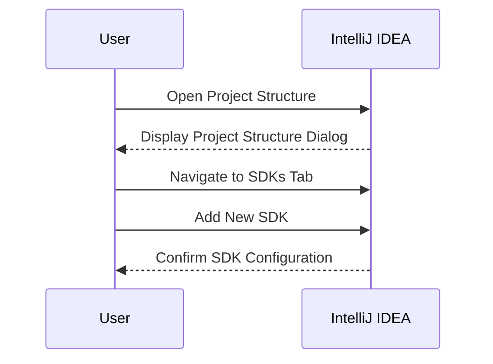
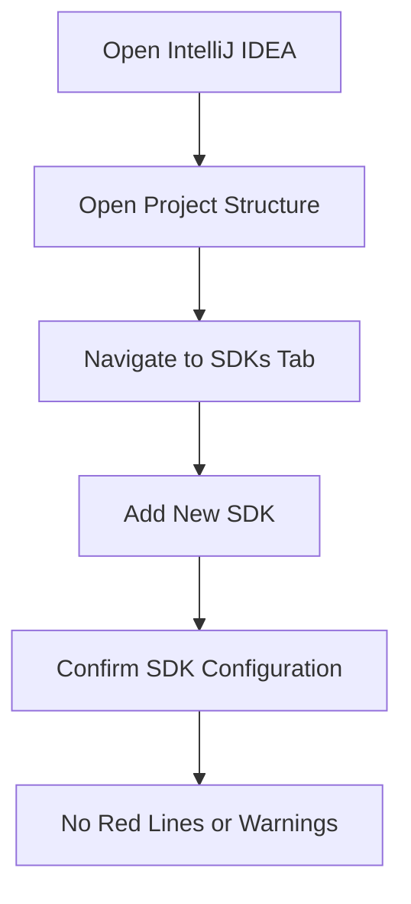

## Introduction to Development Environments and IDEs

In the realm of software development, Integrated Development Environments (IDEs) play a crucial role in streamlining the coding process. An IDE is a software application that provides comprehensive facilities to computer programmers for software development. These facilities typically include code editing, building, testing, debugging, and sometimes even deployment tools. One of the most popular IDEs used today is IntelliJ IDEA, which is particularly favored for Java development due to its robust features and intelligent automation capabilities.

### What is IntelliJ IDEA?

IntelliJ IDEA is an IDE developed by JetBrains specifically for Java developers. It supports a wide range of programming languages and frameworks, making it a versatile tool for various development environments. IntelliJ IDEA offers features such as code completion, refactoring, debugging, and integration with version control systems like Git.

### Maven Integration in IntelliJ IDEA

Maven is a build automation tool primarily used for Java projects. It simplifies the build process by managing project dependencies and providing a consistent build environment across different systems. IntelliJ IDEA has excellent support for Maven projects, which makes it easier to manage and develop complex applications.

#### Maven Dependencies Management

When you create a new Maven project in IntelliJ IDEA, the IDE automatically detects the project type and downloads all the dependencies specified in the `pom.xml` file. This automated dependency management saves developers significant time and effort compared to manually downloading and configuring each library.

```xml
<!-- Example pom.xml file -->
<project xmlns="http://maven.apache.org/POM/4.0.0"
         xmlns:xsi="http://www.w3.org/2001/XMLSchema-instance"
         xsi:schemaLocation="http://maven.apache.org/POM/4.0.0 http://maven.apache.org/xsd/maven-4.0.0.xsd">
    <modelVersion>4.0.0</modelVersion>
    <groupId>com.example</groupId>
    <artifactId>my-project</artifactId>
    <version>1.0-SNAPSHOT</version>
    <dependencies>
        <dependency>
            <groupId>junit</groupId>
            <artifactId>junit</artifactId>
            <version>4.12</version>
            <scope>test</scope>
        </dependency>
        <!-- Add more dependencies as needed -->
    </dependencies>
</project>
```

### IntelliJ IDEA Project Structure

IntelliJ IDEA creates several files and directories to manage the project effectively. These include:

- **Generated Files**: IntelliJ IDEA generates certain files and directories for internal use. For example, the `.idea` directory contains configuration files specific to the project.
- **Project Configuration Files**: These files help IntelliJ IDEA understand the project structure and dependencies.

#### Example of Generated Files

```plaintext
.my-project/
├── .idea/
│   ├── .name
│   ├── modules.xml
│   └── workspace.xml
├── src/
│   ├── main/
│   │   └── java/
│   │       └── com/example/Main.java
│   └── test/
│       └── java/
│           └── com/example/MainTest.java
└── pom.xml
```

### Setting Up the Java Development Kit (JDK)

One of the critical steps in setting up a Java project in IntelliJ IDEA is ensuring that the JDK is correctly configured. The JDK is essential for compiling and running Java programs. Without a properly configured JDK, IntelliJ IDEA cannot interpret the Java code correctly, leading to errors.

#### Configuring the JDK in IntelliJ IDEA

To configure the JDK in IntelliJ IDEA, follow these steps:

1. Open IntelliJ IDEA.
2. Go to `File` > `Project Structure`.
3. In the `Project Structure` dialog, navigate to the `SDKs` tab.
4. Click on the `+` button to add a new SDK.
5. Select the appropriate JDK installation path.



### Common Pitfalls and How to Prevent Them

#### Missing JDK Configuration

One common issue is forgetting to configure the JDK, which results in errors like "Project JDK not defined." To prevent this, ensure that the JDK is correctly set up in the project settings.

##### Vulnerable Code Example

```java
// Main.java
public class Main {
    public static void main(String[] args) {
        System.out.println("Hello, World!");
    }
}
```

Without a configured JDK, IntelliJ IDEA will display red lines and warnings indicating that the JDK is not defined.

##### Secure Code Example

Ensure the JDK is configured:



### Real-World Examples and Recent Breaches

While IntelliJ IDEA itself is not typically associated with security breaches, the lack of proper configuration and dependency management can lead to vulnerabilities. For instance, using outdated or insecure versions of libraries can expose the application to known vulnerabilities.

#### Example: CVE-2021-44228 (Log4Shell)

The Log4Shell vulnerability (CVE-2021-44228) affected many Java applications due to the use of an insecure version of the Apache Log4j library. Ensuring that all dependencies are up-to-date and secure is crucial.

##### Vulnerable Dependency Example

```xml
<!-- Vulnerable pom.xml -->
<dependency>
    <groupId>org.apache.logging.log4j</groupId>
    <artifactId>log4j-core</artifactId>
    <version>2.14.1</version>
</dependency>
```

##### Secure Dependency Example

```xml
<!-- Secure pom.xml -->
<dependency>
    <groupId>org.apache.logging.log4j</groupId>
    <artifactId>log4j-core</artifactId>
    <version>2.17.1</version>
</dependency>
```

### Hands-On Labs

For practical experience with IntelliJ IDEA and Maven setup, consider the following labs:

- **PortSwigger Web Security Academy**: Focuses on web application security but includes sections on setting up development environments.
- **OWASP Juice Shop**: A deliberately insecure web application for security training. It uses Maven and can be configured in IntelliJ IDEA.
- **DVWA (Damn Vulnerable Web Application)**: Another web application for security training that can be set up in IntelliJ IDEA.

These labs provide real-world scenarios to practice setting up and securing development environments.

### Conclusion

Setting up a development environment with IntelliJ IDEA and Maven is a foundational skill for Java developers. By understanding how IntelliJ IDEA manages dependencies and configurations, developers can streamline their workflow and avoid common pitfalls. Properly configuring the JDK and ensuring dependencies are up-to-date are key steps in maintaining a secure and efficient development environment.

---
<!-- nav -->
[[01-Introduction to Development Environment Setup on macOS|Introduction to Development Environment Setup on macOS]] | [[DevOps/DevOps Bootcamp/01-Linux & OS Basics/15-MacOS Tool Setup for Development Environment/00-Overview|Overview]] | [[03-Introduction to Development Environments on macOS|Introduction to Development Environments on macOS]]
