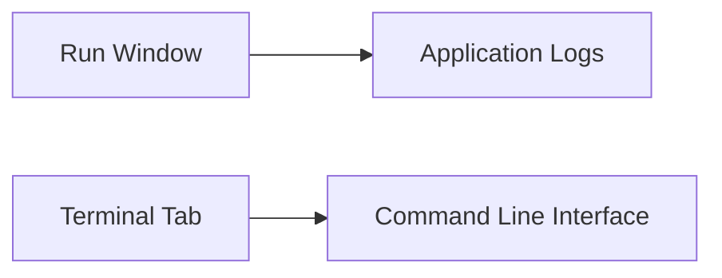
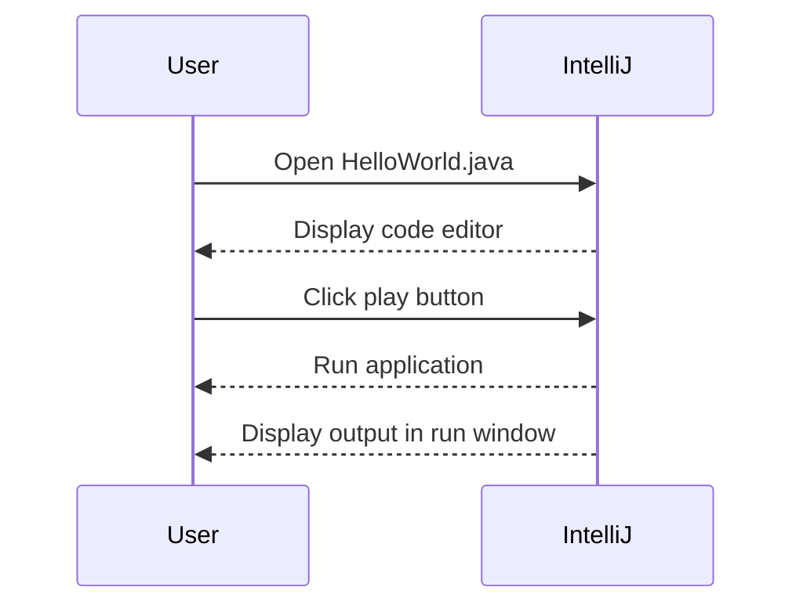
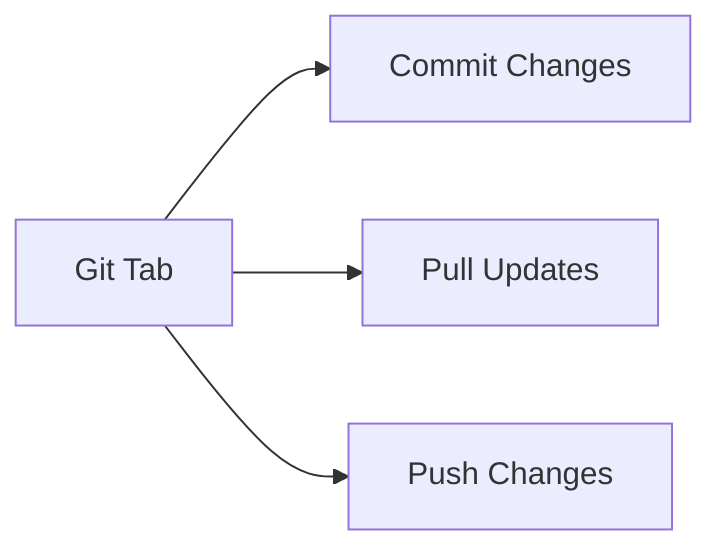
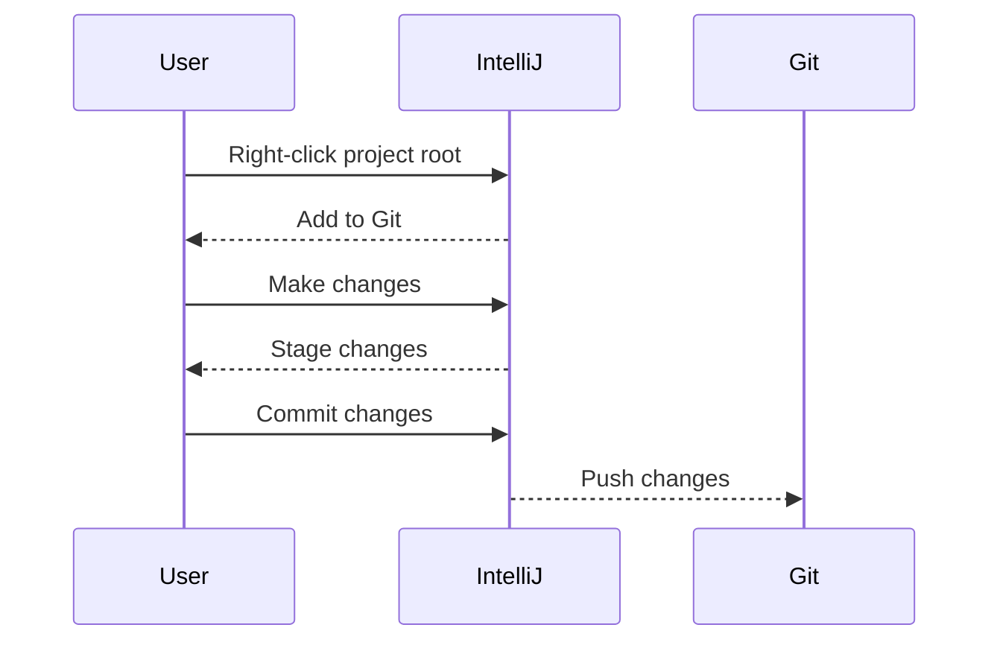
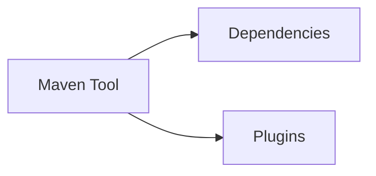
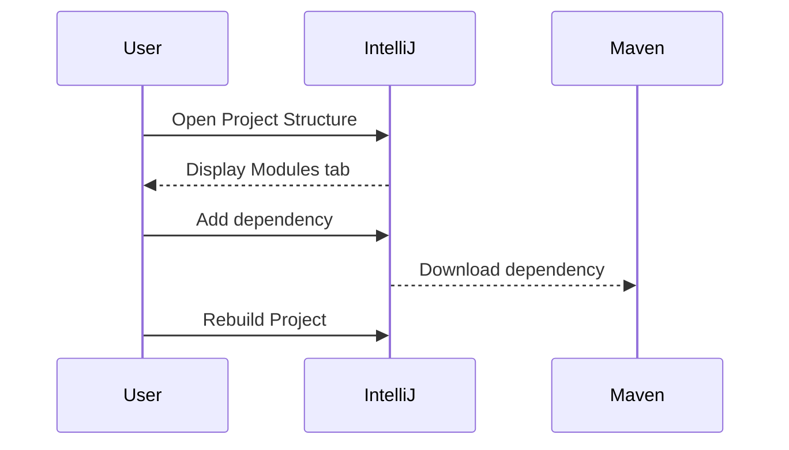
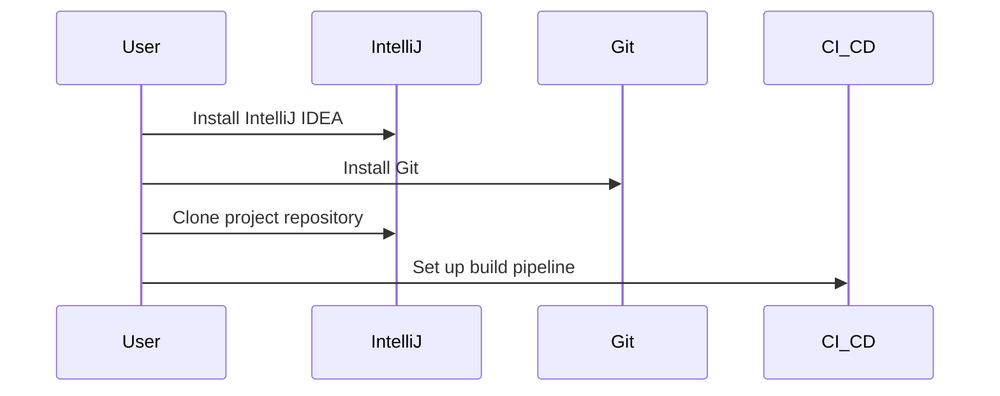
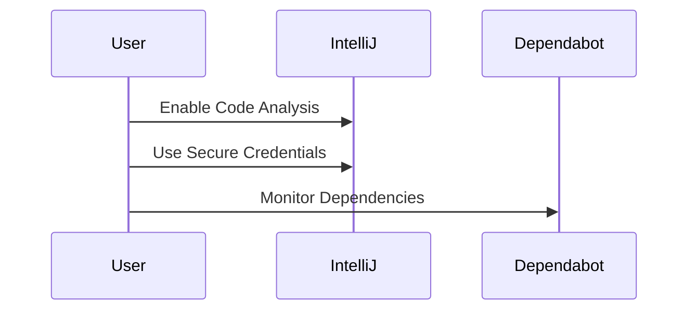

## Introduction to Development Environments on macOS

In this section, we will delve into setting up a development environment on macOS using popular tools such as IntelliJ IDEA. We'll cover the basics of the integrated development environment (IDE), including its features and how it integrates with other tools like Git and Maven. This setup is crucial for DevOps engineers who need to configure and manage development environments efficiently.

### Integrated Development Environment (IDE)

An IDE is a software application that provides comprehensive facilities to computer programmers for software development. An IDE typically consists of a code editor, build automation tools, and a debugger. IntelliJ IDEA is one of the most popular IDEs, especially for Java and Kotlin development.

#### IntelliJ IDEA Overview

IntelliJ IDEA is a powerful IDE developed by JetBrains. It supports a wide range of programming languages and frameworks, including Java, Kotlin, Python, JavaScript, and more. One of the key features of IntelliJ IDEA is its ability to integrate seamlessly with various tools and services, making it a versatile choice for developers.

#### Run Window vs. Terminal Tab

One of the first things you might notice when using IntelliJ IDEA is the distinction between the run window and the terminal tab.



- **Run Window**: This is where the application logs are displayed when the application runs. It provides a quick overview of the application's output and any errors that occur during execution. However, it is not a full-fledged terminal; it is specifically designed to show the output of the running application.

- **Terminal Tab**: This tab allows you to execute commands just like you would on a command line interface (CLI). It opens the terminal inside the project's main directory, providing easy access to the command line within the IDE.

#### Example: Running a Simple Application

Let's consider a simple Java application and see how it runs in IntelliJ IDEA.

```java
// HelloWorld.java
public class HelloWorld {
    public static void main(String[] args) {
        System.out.println("Hello, World!");
    }
}
```

To run this application in IntelliJ IDEA:

1. Open the `HelloWorld.java` file.
2. Click on the green play button next to the `main` method.
3. The output will be displayed in the run window.



### Git Integration in IntelliJ IDEA

Another powerful feature of IntelliJ IDEA is its integration with Git. Git is a distributed version control system that helps track changes in source code during software development. IntelliJ IDEA provides a visual interface for interacting with Git, making it easier for developers who prefer a graphical user interface over the command line.

#### Git Tab in IntelliJ IDEA

The Git tab in IntelliJ IDEA allows you to perform Git operations such as committing changes, pulling updates, and pushing changes to a remote repository.



#### Example: Using Git in IntelliJ IDEA

Let's walk through a simple example of using Git in IntelliJ IDEA.

1. **Initialize a Git Repository**:
   - Right-click on the project root directory.
   - Select `Git` > `Add`.
   - Commit the initial changes.

2. **Make Changes and Commit**:
   - Modify a file in the project.
   - Stage the changes by clicking on the `+` icon next to the file.
   - Enter a commit message and click `Commit`.

3. **Push Changes to Remote Repository**:
   - Click on the `Git` tab.
   - Click on the `Push` button.
   - Enter the remote repository URL and credentials if required.



### Maven Integration in IntelliJ IDEA

Maven is a build automation tool used primarily for Java projects. It manages project dependencies and builds the project according to a defined set of rules. IntelliJ IDEA integrates seamlessly with Maven, allowing you to manage dependencies and plugins directly from the IDE.

#### Maven Tool in IntelliJ IDEA

The Maven tool in IntelliJ IDEA provides a visual interface for managing dependencies and plugins. It shows the dependencies that Maven has downloaded and allows you to add new dependencies or update existing ones.



#### Example: Managing Dependencies with Maven in IntelliJ IDEA

Let's consider a simple example of adding a dependency using Maven in IntelliJ IDEA.

1. **Open the Project Structure**:
   - Go to `File` > `Project Structure`.
   - Navigate to the `Modules` tab.

2. **Add a Dependency**:
   - Click on the `+` icon to add a new dependency.
   - Search for the desired dependency (e.g., `junit`).
   - Select the dependency and click `OK`.

3. **Build the Project**:
   - Click on the `Build` menu.
   - Select `Rebuild Project`.



### Role of DevOps Engineer

As a DevOps engineer, your primary focus is not on writing code but on configuring and managing the development environment. This includes setting up tools, automating processes, and ensuring smooth collaboration among team members.

#### Configuring Tools and Installing Software

A significant part of a DevOps engineer's role involves configuring tools and installing software to run applications. This includes setting up development environments, configuring build pipelines, and ensuring that all necessary tools are installed and configured correctly.

#### Example: Setting Up a Development Environment

Let's consider a scenario where you need to set up a development environment for a Java project.

1. **Install IntelliJ IDEA**:
   - Download and install IntelliJ IDEA from the JetBrains website.
   - Configure the IDE settings according to your preferences.

2. **Set Up Git**:
   - Install Git on your machine.
   - Configure Git with your username and email.

3. **Clone the Project Repository**:
   - Open IntelliJ IDEA.
   - Clone the project repository using the Git tab.

4. **Configure Build Pipeline**:
   - Set up a build pipeline using a CI/CD tool like Jenkins or GitLab CI.
   - Configure the pipeline to automatically build and test the project.



### Conclusion

In this section, we covered the basics of setting up a development environment on macOS using IntelliJ IDEA. We explored the features of IntelliJ IDEA, including the run window, terminal tab, Git integration, and Maven integration. We also discussed the role of a DevOps engineer and the importance of configuring and managing development environments.

By understanding these concepts and tools, you will be better equipped to set up and manage development environments effectively, ensuring smooth collaboration and efficient software development.

### How to Prevent / Defend

#### Secure Configuration of Development Environments

To ensure the security of your development environment, follow these best practices:

1. **Use Secure Credentials**:
   - Avoid hardcoding credentials in your codebase.
   - Use environment variables or secure vaults to store sensitive information.

2. **Regularly Update Tools**:
   - Keep your development tools and dependencies up to date to mitigate vulnerabilities.
   - Regularly review and update your dependencies to ensure they are secure.

3. **Enable Security Features**:
   - Enable security features in your IDE, such as code analysis and security scanning.
   - Use tools like SonarQube or Checkmarx to scan your code for security vulnerabilities.

4. **Secure Build Pipelines**:
   - Ensure that your build pipelines are configured securely.
   - Use tools like Travis CI or CircleCI to automate security checks in your build process.

#### Example: Secure Configuration of IntelliJ IDEA

Here is an example of how to configure IntelliJ IDEA securely:

1. **Enable Code Analysis**:
   - Go to `Preferences` > `Editor` > `Inspections`.
   - Enable security-related inspections.

2. **Use Secure Credentials**:
   - Store sensitive information in environment variables.
   - Use a secure vault like HashiCorp Vault to manage credentials.

3. **Regularly Update Dependencies**:
   - Use tools like Dependabot to monitor and update your dependencies.
   - Regularly review your dependencies to ensure they are secure.



### Real-World Examples

#### Recent CVEs and Breaches

Recent CVEs and breaches highlight the importance of securing development environments. For example, the Log4Shell vulnerability (CVE-2021-44228) affected many Java applications, including those developed using IntelliJ IDEA. Ensuring that your development environment is secure can help mitigate such vulnerabilities.

#### Example: Log4Shell Vulnerability

The Log4Shell vulnerability was a critical security flaw in the Apache Log4j library. It allowed attackers to execute arbitrary code on affected systems. To mitigate this vulnerability, ensure that your development environment is configured securely and that all dependencies are up to date.

### Hands-On Labs

For hands-on practice, consider the following labs:

- **PortSwigger Web Security Academy**: Offers interactive labs to learn about web security.
- **OWASP Juice Shop**: A deliberately insecure web application for practicing web security skills.
- **DVWA (Damn Vulnerable Web Application)**: A PHP/MySQL web application that is riddled with vulnerabilities.

These labs provide practical experience in setting up and securing development environments, helping you to apply the concepts learned in this section.

### Summary

In this section, we covered the basics of setting up a development environment on macOS using IntelliJ IDEA. We explored the features of IntelliJ IDEA, including the run window, terminal tab, Git integration, and Maven integration. We also discussed the role of a DevOps engineer and the importance of configuring and managing development environments.

By understanding these concepts and tools, you will be better equipped to set up and manage development environments effectively, ensuring smooth collaboration and efficient software development.

---
<!-- nav -->
[[02-Introduction to Development Environments and IDEs|Introduction to Development Environments and IDEs]] | [[DevOps/DevOps Bootcamp/01-Linux & OS Basics/15-MacOS Tool Setup for Development Environment/00-Overview|Overview]] | [[04-Introduction to Development Tools on macOS|Introduction to Development Tools on macOS]]
