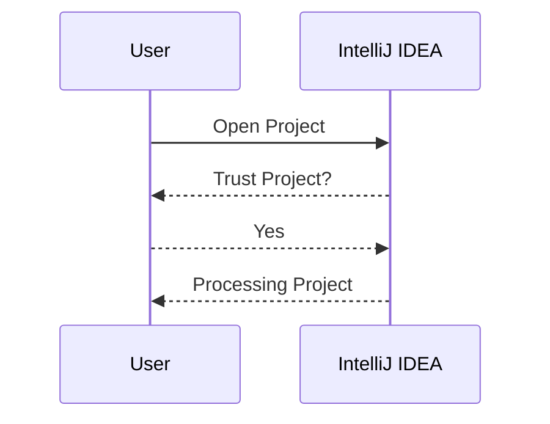
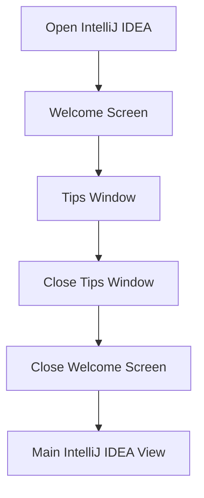
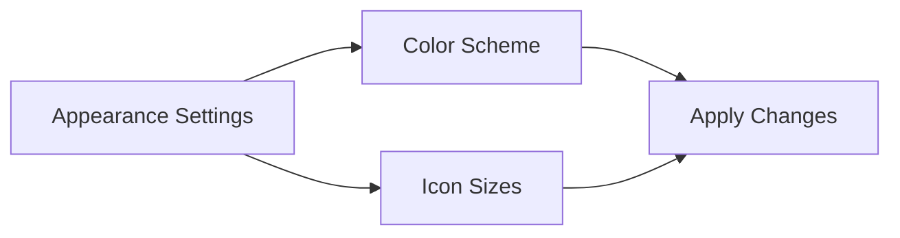
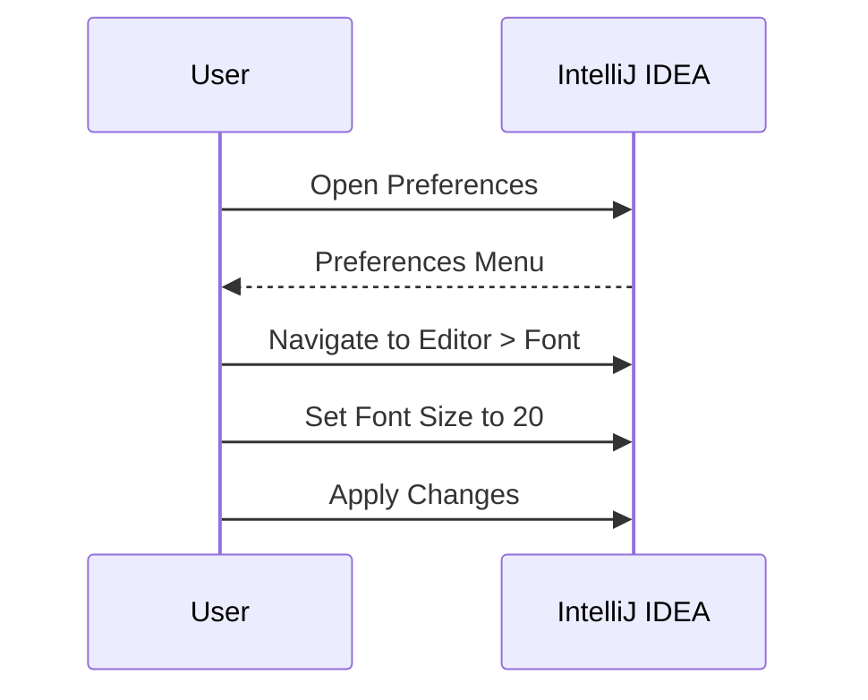
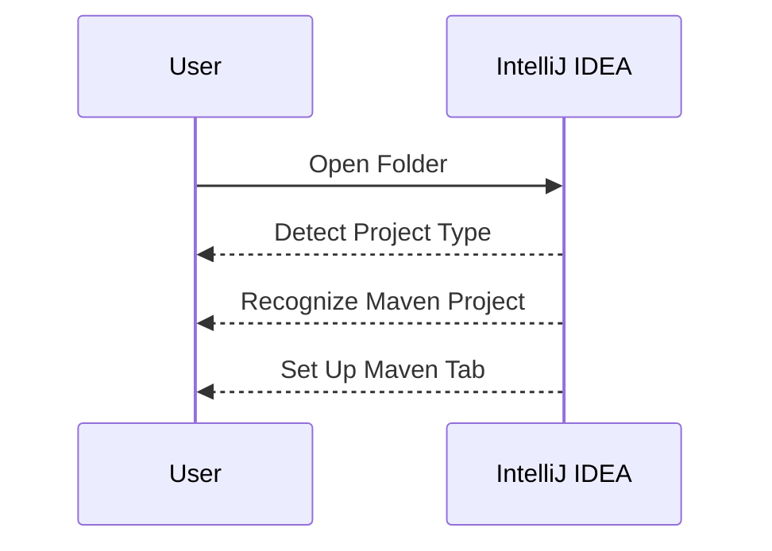
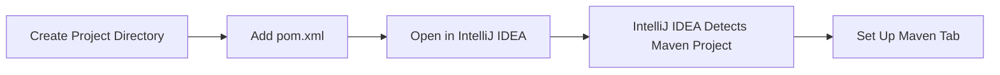
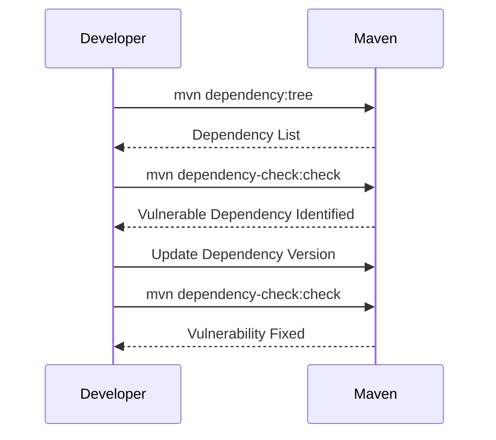

## Introduction to IntelliJ IDEA for Development Environment Setup

IntelliJ IDEA is a powerful Integrated Development Environment (IDE) developed by JetBrains. It supports a wide range of programming languages and frameworks, making it a versatile tool for developers working on various projects. In this section, we will focus on setting up IntelliJ IDEA for a development environment, specifically for a Java Maven project on macOS.

### Opening a Project in IntelliJ IDEA

When opening a project in IntelliJ IDEA, the IDE performs several background tasks to process and understand the project structure. This includes detecting the type of project (e.g., Maven, Gradle, Spring Boot) and setting up the necessary configurations.

#### Trusting the Project

Before opening the project, IntelliJ IDEA may prompt you to trust the project. This is particularly important for security reasons, as trusting a project allows IntelliJ IDEA to access and process the project files. Since this is your own project, you can safely trust it.



### IntelliJ IDEA Welcome Screen and Tips

Upon opening IntelliJ IDEA, you might encounter a welcome screen and a tips window. These features provide useful information about shortcuts and other functionalities within the IDE.

#### Closing the Welcome Screen and Tips Window

To proceed with your work, you can choose to close these windows. The tips window can be dismissed by clicking through the tips or simply closing it.



### Customizing IntelliJ IDEA Settings

IntelliJ IDEA offers extensive customization options to tailor the IDE to your preferences. This includes adjusting the color scheme, font size, and icon sizes.

#### Appearance Settings

In the `Appearance` settings, you can adjust the color scheme and icon sizes. Increasing the icon sizes can make the interface more user-friendly, especially for those with visual impairments.



#### Editor Settings

The `Editor` settings allow you to customize the font size and other display properties. Increasing the font size can improve readability, especially for longer coding sessions.


### Example: Increasing Font Size

Let's walk through an example of increasing the font size in the editor.

1. **Navigate to Settings**:
   - Go to `Preferences` (Cmd + ,) on macOS.
   - Navigate to `Editor` > `Font`.

2. **Adjust Font Size**:
   - Set the font size to 20.
   - Apply the changes.



### Project Detection and Configuration

When opening a project, IntelliJ IDEA automatically detects the project type and sets up the necessary configurations. This includes recognizing Maven projects and setting up the Maven tab.

#### Maven Project Detection

IntelliJ IDEA uses heuristics to detect the project type based on the project structure and files. For a Maven project, it looks for the `pom.xml` file and sets up the Maven tab accordingly.



### Example: Maven Project Setup

Let's consider a simple Maven project setup.

1. **Project Structure**:
   - Create a new directory for the project.
   - Add a `pom.xml` file with basic Maven configuration.

2. **Opening the Project**:
   - Open the project directory in IntelliJ IDEA.
   - IntelliJ IDEA will automatically detect the Maven project and set up the necessary configurations.



### Maven Configuration Example

Here is an example of a basic `pom.xml` file:

```xml
<project xmlns="http://maven.apache.org/POM/4.0.0"
         xmlns:xsi="http://www.w3.org/2001/XMLSchema-instance"
         xsi:schemaLocation="http://maven.apache.org/POM/4.0.0 http://maven.apache.org/xsd/maven-4.0.0.xsd">
    <modelVersion>4.0.0</modelVersion>
    <groupId>com.example</groupId>
    <artifactId>my-maven-project</artifactId>
    <version>1.0-SNAPSHOT</version>
    <dependencies>
        <dependency>
            <groupId>junit</groupId>
            <artifactId>junit</artifactId>
            <version>4.12</version>
            <scope>test</scope>
        </dependency>
    </dependencies>
</project>
```

### Common Pitfalls and Best Practices

While setting up IntelliJ IDEA and Maven projects, there are several common pitfalls to avoid:

1. **Incorrect Project Detection**:
   - Ensure that the project directory contains the correct files (e.g., `pom.xml` for Maven projects).
   - Verify that the project structure matches the expected format.

2. **Configuration Conflicts**:
   - Avoid conflicts between different project configurations (e.g., conflicting dependencies in `pom.xml`).

3. **Security Considerations**:
   - Always trust the project only if you are certain of its origin and contents.
   - Regularly update IntelliJ IDEA and Maven to the latest versions to mitigate security vulnerabilities.

### How to Prevent / Defend

#### Detection

To detect potential issues in your project setup:

1. **Review Project Files**:
   - Check the project directory for missing or incorrect files.
   - Verify the contents of `pom.xml` and other configuration files.

2. **Use IDE Tools**:
   - Utilize IntelliJ IDEA's built-in tools for detecting and resolving configuration issues.

#### Prevention

To prevent common pitfalls:

1. **Follow Best Practices**:
   - Adhere to standard project structures and configurations.
   - Regularly review and update project dependencies.

2. **Secure Coding Practices**:
   - Implement secure coding practices to minimize vulnerabilities.
   - Use tools like SonarQube for static code analysis.

#### Secure Code Fix Example

Consider a scenario where a Maven project has a dependency with a known vulnerability. Here is an example of how to identify and fix the issue:

1. **Identify Vulnerability**:
   - Use a tool like `mvn dependency:tree` to list all dependencies.
   - Identify the vulnerable dependency using a tool like `mvn dependency-check:check`.

2. **Fix Vulnerability**:
   - Update the vulnerable dependency to a secure version.
   - Verify the fix using the same tools.



### Conclusion

Setting up IntelliJ IDEA for a development environment involves several steps, including opening a project, customizing settings, and configuring project types. By following best practices and using the built-in tools, you can ensure a smooth and secure development experience. Regular updates and reviews of project configurations help mitigate potential issues and vulnerabilities.

### Practice Labs

For hands-on practice with IntelliJ IDEA and Maven projects, consider the following labs:

- **PortSwigger Web Security Academy**: Focuses on web application security but can be used to practice setting up development environments.
- **OWASP Juice Shop**: A deliberately insecure web application for practicing security testing and development.
- **DVWA (Damn Vulnerable Web Application)**: Another web application for practicing security testing and development.

These labs provide practical experience in setting up and managing development environments, including IntelliJ IDEA and Maven projects.

---
<!-- nav -->
[[04-Introduction to Development Tools on macOS|Introduction to Development Tools on macOS]] | [[DevOps/DevOps Bootcamp/01-Linux & OS Basics/15-MacOS Tool Setup for Development Environment/00-Overview|Overview]] | [[06-Introduction to IntelliJ and Development Environments|Introduction to IntelliJ and Development Environments]]
