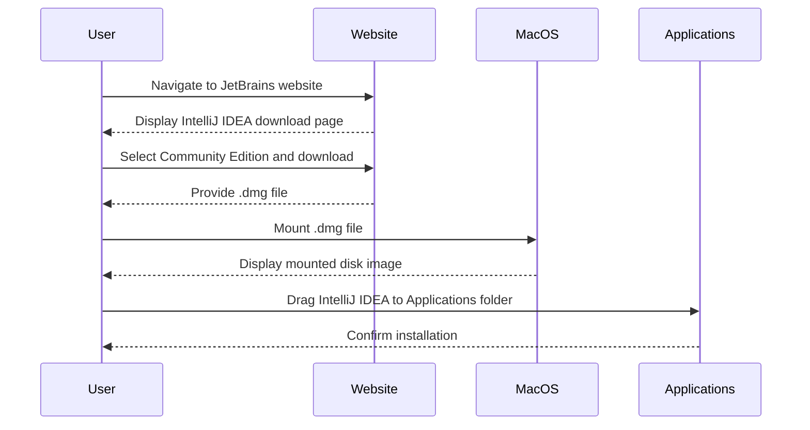
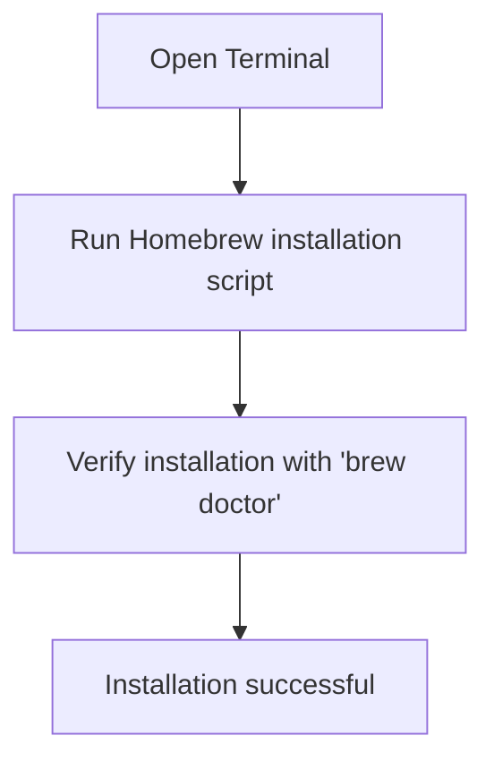
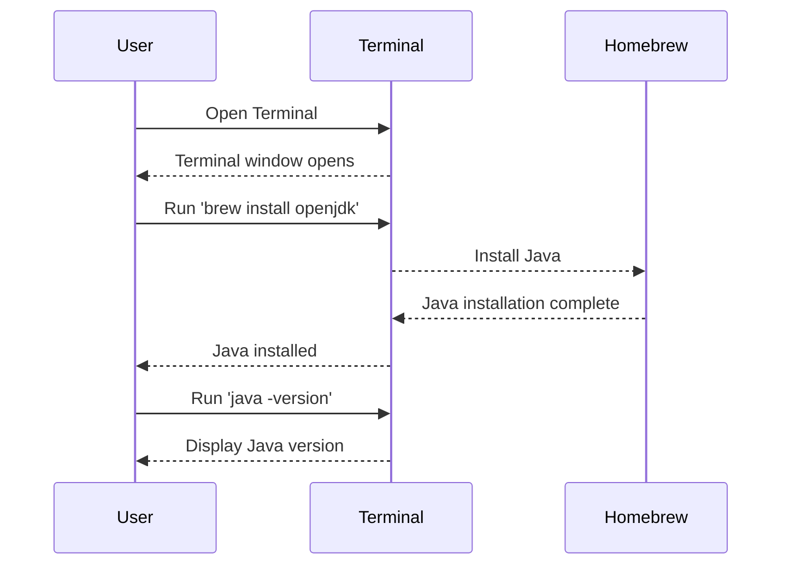
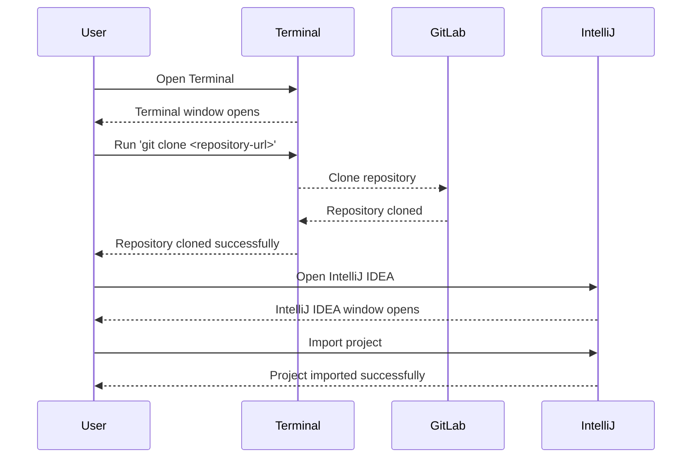
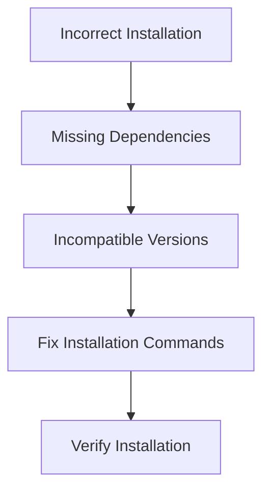
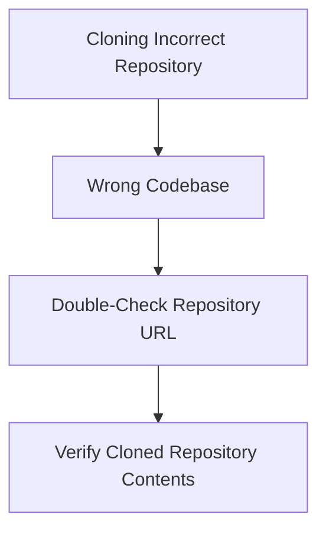

## Introduction to MacOS Tool Setup for Development Environment

In this section, we will cover the setup process for a development environment on a MacOS system. This includes installing essential tools such as IntelliJ IDEA, Homebrew Package Manager, and various development utilities like Java, Maven, Node.js, and npm. We will also discuss how to clone and open projects from GitLab repositories using these tools.

### Why Use MacOS for Development?

MacOS is a popular choice among developers due to its stability, user-friendly interface, and powerful built-in tools. It provides a robust environment for developing applications across different languages and frameworks. Additionally, MacOS supports a wide range of development tools and integrates well with other Apple products, making it a versatile platform for developers.

### Overview of Tools to Install

The primary tools we will install are:

1. **IntelliJ IDEA**: An Integrated Development Environment (IDE) used for coding.
2. **Homebrew Package Manager**: A package manager for MacOS that simplifies the installation of various development tools.
3. **Java**: A programming language commonly used for enterprise applications.
4. **Maven**: A build automation tool for Java projects.
5. **Node.js**: A JavaScript runtime built on Chrome's V8 JavaScript engine.
6. **npm**: A package manager for Node.js.

### Installing IntelliJ IDEA

#### What is IntelliJ IDEA?

IntelliJ IDEA is a powerful IDE developed by JetBrains. It supports multiple programming languages and frameworks, including Java, Kotlin, Python, and more. IntelliJ IDEA offers features such as intelligent code completion, on-the-fly error detection, and refactoring tools, making it a preferred choice for many developers.

#### Why Use IntelliJ IDEA?

IntelliJ IDEA provides a comprehensive development environment that streamlines the coding process. Its features help improve productivity and reduce errors, making it ideal for both beginners and experienced developers.

#### How to Install IntelliJ IDEA

1. **Download IntelliJ IDEA**:
    - Open your web browser and navigate to the JetBrains website.
    - Search for IntelliJ IDEA and select the Community Edition, which is free and sufficient for most development needs.
    - Click on the download link for MacOS.

2. **Install IntelliJ IDEA**:
    - Once the download is complete, locate the `.dmg` file in your Downloads folder.
    - Double-click the `.dmg` file to mount it.
    - Drag the IntelliJ IDEA icon to your Applications folder.
    - Eject the mounted disk image.



### Installing Homebrew Package Manager

#### What is Homebrew?

Homebrew is a package manager for MacOS that simplifies the installation of various software packages. It allows users to easily install, update, and manage software on their systems.

#### Why Use Homebrew?

Homebrew makes it easy to install and manage development tools and libraries. It provides a consistent and reliable way to keep your development environment up-to-date.

#### How to Install Homebrew

1. **Install Homebrew**:
    - Open Terminal on your MacOS system.
    - Run the following command to install Homebrew:

    ```bash
    /bin/bash -c "$(curl -fsSL https://raw.githubusercontent.com/Homebrew/install/HEAD/install.sh)"
    ```

2. **Verify Installation**:
    - After the installation is complete, run the following command to verify that Homebrew is installed correctly:

    ```bash
    brew doctor
    ```

    This command checks for any potential issues with your Homebrew installation and provides recommendations for resolving them.



### Installing Development Tools Using Homebrew

#### Installing Java

1. **Install Java**:
    - Use Homebrew to install Java:

    ```bash
    brew install openjdk
    ```

2. **Verify Installation**:
    - Check the installed Java version:

    ```bash
    java -version
    ```

#### Installing Maven

1. **Install Maven**:
    - Use Homebrew to install Maven:

    ```bash
    brew install maven
    ```

2. **Verify Installation**:
    - Check the installed Maven version:

    ```bash
    mvn --version
    ```

#### Installing Node.js and npm

1. **Install Node.js**:
    - Use Homebrew to install Node.js:

    ```bash
    brew install node
    ```

2. **Verify Installation**:
    - Check the installed Node.js version:

    ```bash
    node -v
    ```

    - Check the installed npm version:

    ```bash
    npm -v
    ```



### Cloning Projects from GitLab Repositories

#### What is GitLab?

GitLab is a web-based Git repository manager that provides a wide range of features for version control, issue tracking, and continuous integration. It is widely used by developers to collaborate on projects and manage code repositories.

#### Why Use GitLab?

GitLab offers a comprehensive set of tools for managing code repositories, including features for code review, issue tracking, and continuous integration. It is a popular choice among developers due to its ease of use and robust feature set.

#### How to Clone Projects from GitLab

1. **Clone Java Maven Application**:
    - Use the `git clone` command to clone the Java Maven application from the GitLab repository:

    ```bash
    git clone <repository-url>
    ```

2. **Clone Java Gradle Application**:
    - Use the `git clone` command to clone the Java Gradle application from the GitLab repository:

    ```bash
    git clone <repository-url>
    ```

3. **Clone Node.js Application**:
    - Use the `git clone` command to clone the Node.js application from the GitLab repository:

    ```bash
    git clone <repository-url>
    ```

4. **Open Projects in IntelliJ IDEA**:
    - Open IntelliJ IDEA and import the cloned projects by selecting `File > Open` and navigating to the project directories.



### Common Pitfalls and How to Prevent Them

#### Pitfall: Incorrect Installation of Development Tools

**Problem**: Incorrect installation of development tools can lead to issues such as missing dependencies or incompatible versions.

**Solution**:
- Ensure that you are using the correct installation commands provided by Homebrew.
- Verify the installation of each tool by checking its version.



#### Pitfall: Cloning Incorrect Repository

**Problem**: Cloning the incorrect repository can result in working with the wrong codebase.

**Solution**:
- Double-check the repository URL before cloning.
- Verify the contents of the cloned repository to ensure it matches the intended project.



### Hands-On Labs

To practice setting up your development environment, you can use the following labs:

- **PortSwigger Web Security Academy**: Offers hands-on labs for web application security.
- **OWASP Juice Shop**: Provides a vulnerable web application for practicing security testing.
- **DVWA (Damn Vulnerable Web Application)**: Another vulnerable web application for security testing.

These labs will help you gain practical experience in setting up and using development tools on a MacOS system.

By following this guide, you will be well-prepared to set up your development environment on a MacOS system and start working on your projects.

---
<!-- nav -->
[[06-Introduction to IntelliJ and Development Environments|Introduction to IntelliJ and Development Environments]] | [[DevOps/DevOps Bootcamp/01-Linux & OS Basics/15-MacOS Tool Setup for Development Environment/00-Overview|Overview]] | [[08-MacOS Tool Setup for Development Environment|MacOS Tool Setup for Development Environment]]
