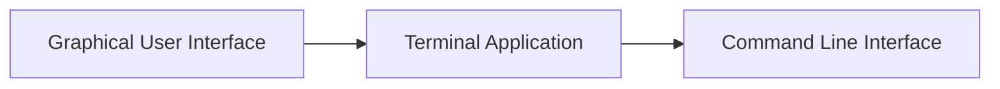

## Introduction to Linux Command Line Interface

In the realm of DevOps, mastering the Linux command line interface (CLI) is essential. This interface allows you to interact with the operating system using textual commands rather than graphical elements. Understanding the CLI is crucial because many servers run headless (without a monitor) and rely solely on the command line for administration and maintenance.

### Graphical User Interface (GUI) vs. Command Line Interface (CLI)

Before diving into the command line, let's understand the difference between a graphical user interface (GUI) and a command line interface (CLI).

#### Graphical User Interface (GUI)

A GUI is a visual interface that uses graphical elements such as icons, menus, and windows to interact with the operating system. It is designed to be intuitive and easy to use for most users. Here are some key points about GUI:

- **Visual Interaction**: Everything is visually represented, making it easier to navigate and perform tasks.
- **Ease of Use**: GUIs are generally more user-friendly and require less technical knowledge.
- **Common Applications**: Examples include Windows Explorer, macOS Finder, and GNOME on Linux.

#### Command Line Interface (CLI)

A CLI, on the other hand, uses text-based commands to interact with the operating system. It is more powerful and flexible but requires a deeper understanding of the underlying system. Key points about CLI:

- **Text-Based Interaction**: All commands are entered as text, and output is displayed as text.
- **Power and Flexibility**: CLI offers advanced features and automation capabilities that are difficult to achieve with a GUI.
- **Common Applications**: Examples include `bash`, `zsh`, and `fish` shells on Unix-like systems.

### Why DevOps Engineers Need CLI Skills

As a DevOps engineer, you will frequently interact with servers, which often lack a GUI. Servers are typically managed via SSH (Secure Shell) sessions, which provide a CLI environment. Therefore, proficiency in the CLI is essential for effective server management.

### Accessing the Terminal

To access the CLI, you need to open a terminal application. On most Linux distributions, you can find the terminal in the application menu or by pressing `Ctrl + Alt + T`.



### Basic Linux Commands

Let's explore some fundamental Linux commands that you will use frequently.

#### `ls` - List Directory Contents

The `ls` command lists the contents of a directory. It is one of the most commonly used commands in the CLI.

```bash
$ ls
```

This command displays the files and directories in the current working directory. You can use various options to modify the output:

- `-l`: Display detailed information (permissions, number of links, owner, group, size, modification date, and name).
- `-a`: Show hidden files (files starting with a dot).
- `-h`: Display sizes in human-readable format (e.g., KB, MB).

Example:

```bash
$ ls -lah
```

Output:

```plaintext
total 0
drwxr-xr-x 2 user user 4.0K Mar  1 12:00 .
drwxr-xr-x 3 user user 4.0K Mar  1 12:00 ..
```

#### `cd` - Change Directory

The `cd` command changes the current working directory.

```bash
$ cd <directory>
```

For example, to change to the `/home/user/Documents` directory:

```bash
$ cd /home/user/Documents
```

You can also use relative paths:

- `.`: Current directory
- `..`: Parent directory

Example:

```bash
$ cd ..
```

#### `mkdir` - Create Directory

The `mkdir` command creates a new directory.

```bash
$ mkdir <directory>
```

For example, to create a new directory named `projects`:

```bash
$ mkdir projects
```

#### `touch` - Create Empty File

The `touch` command creates an empty file or updates the timestamp of an existing file.

```bash
$ touch <file>
```

For example, to create an empty file named `notes.txt`:

```bash
$ touch notes.txt
```

#### `rm` - Remove Files and Directories

The `rm` command removes files and directories. Be cautious when using this command, as deleted items cannot be easily recovered.

```bash
$ rm <file>
```

For example, to remove the file `notes.txt`:

```bash
$ rm notes.txt
```

To remove a directory and its contents recursively, use the `-r` option:

```bash
$ rm -r <directory>
```

For example, to remove the `projects` directory and its contents:

```bash

$ rm -r projects
```

### How to Prevent / Defend Against Accidental Deletion

Accidental deletion of important files can be catastrophic. Here are some strategies to prevent and recover from such incidents:

1. **Use the `-i` Option**: The `-i` option prompts for confirmation before deleting each file.

    ```bash
    $ rm -i notes.txt
    ```

2. **Backup Regularly**: Implement regular backups of critical data using tools like `rsync`, `tar`, or cloud storage solutions.

3. **Use Version Control Systems**: For development environments, use version control systems like Git to track changes and recover previous versions of files.

4. **Educate Users**: Train users on the proper use of the CLI and the potential risks associated with commands like `rm`.

### Real-World Example: Accidental Deletion

Consider a scenario where a developer accidentally deletes a critical configuration file using the `rm` command. To mitigate this, the developer should have a backup strategy in place.

#### Vulnerable Code

```bash
$ rm -r /etc/nginx
```

#### Secure Code

```bash
$ sudo rsync -av /etc/nginx /backup/nginx
$ sudo rm -r /etc/nginx
```

In this example, the developer first backs up the `/etc/nginx` directory to `/backup/nginx` using `rsync`. Then, the original directory is removed.

### Conclusion

Mastering the Linux command line interface is a foundational skill for DevOps engineers. By understanding and effectively using basic commands like `ls`, `cd`, `mkdir`, `touch`, and `rm`, you can efficiently manage files and directories on a server. Always practice caution when using destructive commands and implement robust backup strategies to prevent data loss.

### Practice Labs

To gain hands-on experience with Linux command line basics, consider the following labs:

- **PortSwigger Web Security Academy**: Offers interactive labs that cover various aspects of web security, including command injection.
- **OWASP Juice Shop**: A deliberately insecure web application for practicing web security skills, including command line usage.
- **DVWA (Damn Vulnerable Web Application)**: Provides a range of vulnerabilities to practice exploiting and securing web applications.

By completing these labs, you can reinforce your understanding of Linux command line basics and apply them in real-world scenarios.

---
<!-- nav -->
[[DevOps/DevOps Bootcamp/01-Linux & OS Basics/16-Mastering Basic Linux Commands For DevOps/00-Overview|Overview]] | [[02-Introduction to Terminal Windows and Command Line Interface (CLI)|Introduction to Terminal Windows and Command Line Interface (CLI)]]
