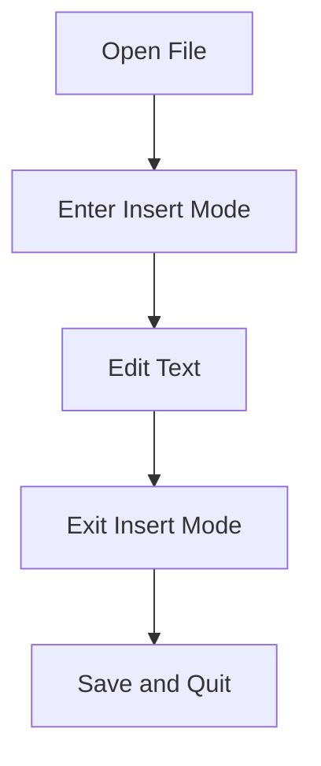

## Introduction to VIM

VIM (Vi IMproved) is a highly configurable text editor built to enable efficient text editing. It is an improved version of the original Vi editor created by Bill Joy in 1976. VIM is widely used in Unix-based systems and is available on almost all modern operating systems. Its popularity stems from its efficiency, flexibility, and extensive feature set.

### Why Use VIM?

Despite the availability of graphical text editors, VIM remains a preferred choice for many developers and system administrators due to several key advantages:

1. **Speed and Efficiency**: VIM allows users to perform complex editing tasks with minimal keystrokes. This makes it incredibly fast for experienced users.
2. **Portability**: VIM is included in most Linux distributions and is available on various platforms, including macOS and Windows.
3. **Customizability**: VIM is highly customizable through its configuration files and plugins, allowing users to tailor it to their specific needs.
4. **Consistency**: Since VIM is widely used across different environments, learning VIM can provide a consistent experience across various systems.

### Main Advantages of Using VIM

1. **Command Line Integration**: VIM integrates seamlessly with the command line, making it ideal for quick edits and scripting.
2. **Rich Feature Set**: VIM supports features such as syntax highlighting, auto-completion, and powerful search capabilities.
3. **Extensive Plugin Ecosystem**: VIM has a vast ecosystem of plugins that extend its functionality, covering everything from language-specific support to advanced project management tools.
4. **Cross-Platform Compatibility**: VIM is available on multiple platforms, ensuring consistency across different environments.

### Hands-On Part: Learning VIM Editor

Before diving into the hands-on part, let's understand the basic structure and modes of VIM.

#### Modes in VIM

VIM operates in different modes, each serving a specific purpose:

1. **Normal Mode**: This is the default mode where you can issue commands to manipulate text.
2. **Insert Mode**: In this mode, you can insert text into the document.
3. **Visual Mode**: This mode allows you to select text visually for operations like copying, cutting, or pasting.
4. **Command-Line Mode**: Used to enter commands like `:w` to save the file or `:q` to quit.

#### Basic Commands in VIM

Here are some essential commands to get started with VIM:

- **Opening a File**:
  ```sh
  vim filename.txt
  ```

- **Entering Insert Mode**:
  Press `i` to start inserting text.

- **Exiting Insert Mode**:
  Press `Esc` to return to Normal Mode.

- **Saving a File**:
  Type `:w` and press `Enter`.

- **Quitting VIM**:
  Type `:q` and press `Enter`. If you have unsaved changes, you can force quit with `:q!`.

- **Combining Save and Quit**:
  Type `:wq` and press `Enter`.

### Creating, Renaming, and Copying Files

Before diving into VIM, let's review how to create, rename, and copy files in the command line.

#### Creating a File

To create a new file, you can use the `touch` command:
```sh
touch newfile.txt
```

#### Renaming a File

To rename a file, use the `mv` command:
```sh
mv oldfile.txt newfile.txt
```

#### Copying a File

To copy a file, use the `cp` command:
```sh
cp sourcefile.txt destinationfile.txt
```

### Displaying File Contents

To display the contents of a file, use the `cat` command:
```sh
cat filename.txt
```

### Writing to a File Using VIM

Now, let's see how to write to a file using VIM.

#### Opening a File in VIM

To open a file in VIM, use the following command:
```sh
vim filename.txt
```

If the file does not exist, VIM will create it for you.

#### Entering Insert Mode

Once in VIM, press `i` to enter Insert Mode. You can now type your text.

#### Exiting Insert Mode

Press `Esc` to exit Insert Mode and return to Normal Mode.

#### Saving and Quitting

To save your changes and quit VIM, type `:wq` and press `Enter`.

### Real-World Example: Editing Configuration Files

One common use case for VIM is editing configuration files. Let's consider a scenario where you need to edit a configuration file to change a setting.

#### Scenario: Editing a Configuration File

Suppose you have a configuration file named `config.ini` with the following content:
```ini
[settings]
debug_mode = true
```

You want to change the `debug_mode` setting to `false`.

1. Open the file in VIM:
   ```sh
   vim config.ini
   ```

2. Enter Insert Mode by pressing `i`.

3. Navigate to the line containing `debug_mode = true` and change it to `false`.

4. Exit Insert Mode by pressing `Esc`.

5. Save and quit by typing `:wq` and pressing `Enter`.

### Mermaid Diagram: VIM Workflow

Let's visualize the workflow using a mermaid diagram:



### Common Pitfalls and How to Avoid Them

1. **Forgetting to Exit Insert Mode**: Always remember to press `Esc` to exit Insert Mode before issuing commands.
2. **Accidentally Overwriting Files**: Always double-check before saving and quitting to avoid unintended changes.

### How to Prevent / Defend

#### Detection

To detect unintended changes, you can use version control systems like Git. For example, you can check the status of your files before and after editing:
```sh
git status
```

#### Prevention

1. **Use Version Control**: Always use version control systems like Git to track changes and revert if necessary.
2. **Backup Files**: Before making significant changes, create a backup of the file.

#### Secure Coding Fixes

Here’s an example of how to securely edit a configuration file:

**Vulnerable Code:**
```ini
[settings]
debug_mode = true
```

**Secure Code:**
```ini
[settings]
debug_mode = false
```

### Conclusion

VIM is a powerful and efficient text editor that integrates seamlessly with the command line. By mastering VIM, you can significantly enhance your productivity and efficiency in managing files and configurations.

### Practice Labs

For hands-on practice with VIM, consider the following resources:

- **PortSwigger Web Security Academy**: Offers interactive labs that often involve editing configuration files using VIM.
- **OWASP Juice Shop**: Provides a web application that can be configured using VIM for security testing purposes.

By practicing these exercises, you can gain a deeper understanding of how to effectively use VIM in real-world scenarios.

---
<!-- nav -->
[[02-Introduction to VIM for Efficient Command Line Editing|Introduction to VIM for Efficient Command Line Editing]] | [[DevOps/DevOps Bootcamp/01-Linux & OS Basics/17-Mastering VIM for Efficient Command Line Editing/00-Overview|Overview]] | [[04-Mastering VIM for Efficient Command Line Editing|Mastering VIM for Efficient Command Line Editing]]
