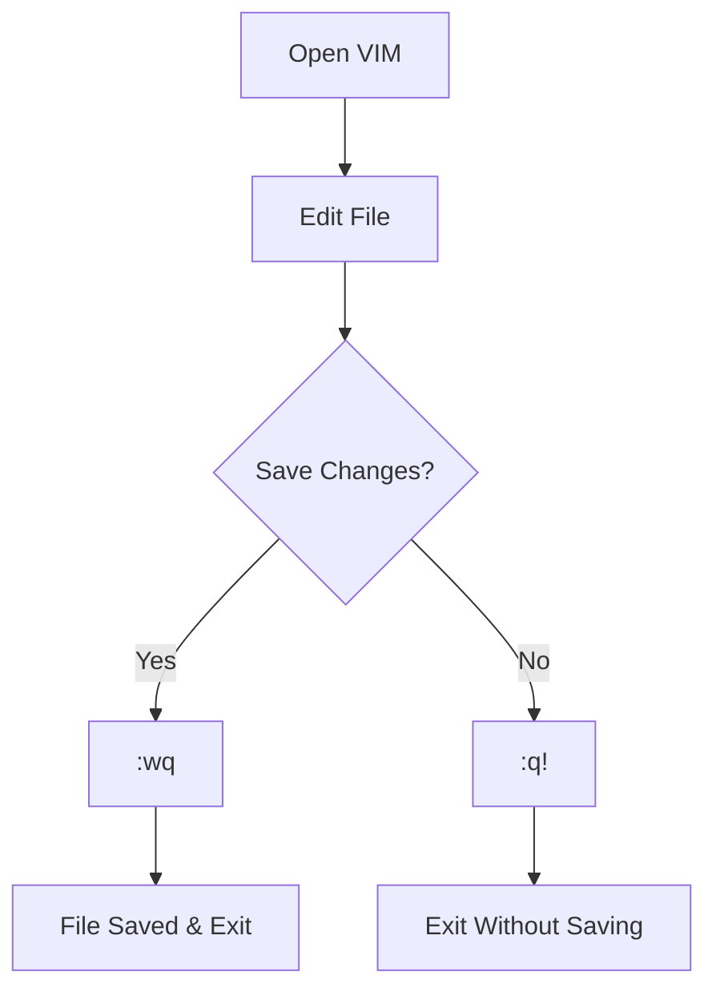

## Mastering VIM for Efficient Command Line Editing

### Introduction to VIM

VIM (Vi IMproved) is a highly configurable text editor built to enable efficient text editing. It is an improved version of the vi editor distributed with Unix systems. VIM is widely used by developers and system administrators due to its powerful features and efficiency. Understanding how to use VIM effectively can significantly enhance your productivity in the command line environment.

### Basic Navigation and Commands

#### Exiting VIM

Exiting VIM is one of the most fundamental operations you'll perform frequently. There are several ways to exit VIM:

1. **Saving Changes and Quitting**: To save your changes and exit VIM, you would use the `:wq` command. This stands for "write" and "quit". Here’s how it works:
    - Press `Esc` to enter command mode.
    - Type `:wq` and press `Enter`.

2. **Discarding Changes and Quitting**: If you want to discard any changes made and exit VIM, you would use the `:q!` command. This stands for "quit" followed by an exclamation mark to force the operation. Here’s how it works:
    - Press `Esc` to enter command mode.
    - Type `:q!` and press `Enter`.

Let's break down these commands further:

- **`:wq`**:
  - **Purpose**: Saves the current buffer and exits VIM.
  - **Syntax**: `:wq`
  - **Example**:
    ```vim
    :wq
    ```
  - **Security Impact**: Ensures that your changes are saved, preventing data loss.

- **`:q!`**:
  - **Purpose**: Exits VIM without saving any changes.
  - **Syntax**: `:q!`
  - **Example**:
    ```vim
    :q!
    ```
  - **Security Impact**: Prevents accidental saving of unintended changes, which could lead to data corruption or security vulnerabilities.

#### Example Scenario

Consider a scenario where you are editing a configuration file for a server. You make some changes but realize they are incorrect. You want to discard these changes and exit VIM without affecting the original file.

```vim
:q!
```

This command ensures that the original file remains unchanged, preserving the integrity of your configuration.

### Navigating VIM

To navigate VIM effectively, you need to know a few basic commands:

1. **Moving the Cursor**:
   - `h`: Move left.
   - `j`: Move down.
   - `k`: Move up.
   - `l`: Move right.

2. **Jumping to Specific Lines**:
   - `G`: Jump to the last line.
   - `gg`: Jump to the first line.
   - `:n`: Jump to line number `n`.

3. **Searching for Text**:
   - `/text`: Search forward for `text`.
   - `?text`: Search backward for `text`.

4. **Insert Mode**:
   - `i`: Insert text before the cursor.
   - `a`: Insert text after the cursor.
   - `o`: Open a new line below the cursor.
   - `O`: Open a new line above the cursor.

### Creating New Files with VIM

Creating new files using VIM is straightforward. You simply specify the filename when invoking VIM. For example:

```bash
vim newfile.txt
```

This command opens VIM with a new file named `newfile.txt`. If the file does not exist, VIM creates it. If the file already exists, VIM opens it for editing.

### Common Pitfalls and How to Avoid Them

#### Accidentally Saving Unintended Changes

One common pitfall is accidentally saving unintended changes. This can happen if you are not careful about which command you use to exit VIM.

**How to Prevent / Defend**:

1. **Double-check Before Saving**:
   - Always review your changes before saving.
   - Use `:q!` to discard changes if you are unsure.

2. **Use Version Control Systems**:
   - Utilize version control systems like Git to manage changes.
   - Regularly commit changes to track history and revert if necessary.

### Real-World Examples

#### CVE-2021-44228: Log4Shell

The Log4Shell vulnerability (CVE-2021-44228) is a critical security flaw in Apache Log4j, a Java logging library. This vulnerability allows attackers to execute arbitrary code on the server, leading to remote code execution (RCE).

In the context of VIM, consider a scenario where you are editing a configuration file for a server that uses Log4j. You might inadvertently introduce a vulnerable configuration setting. Using VIM effectively can help you avoid such mistakes:

1. **Review Configuration Files**:
   - Use VIM to carefully review and edit configuration files.
   - Ensure that you do not save unintended changes by using `:q!` if necessary.

2. **Automate Security Checks**:
   - Integrate automated security checks into your workflow.
   - Use tools like `grep` to search for known vulnerable patterns in your files.

### Mermaid Diagrams

#### VIM Workflow Diagram

A visual representation of the VIM workflow can help understand the process better:



### Conclusion

Mastering VIM is essential for efficient command line editing. By understanding the basic navigation commands, learning how to exit VIM correctly, and creating new files, you can significantly enhance your productivity. Additionally, being aware of common pitfalls and how to avoid them can prevent unintended changes and security vulnerabilities.

### Practice Labs

For hands-on practice with VIM, consider the following resources:

- **PortSwigger Web Security Academy**: Offers interactive labs to practice various aspects of web security, including command line editing.
- **OWASP Juice Shop**: A deliberately insecure web application for security training. It includes scenarios where you might need to use VIM for configuration file editing.
- **DVWA (Damn Vulnerable Web Application)**: Another resource for practicing web security skills, including command line editing.

By combining theoretical knowledge with practical experience, you can become proficient in using VIM for efficient command line editing.

---
<!-- nav -->
[[03-Introduction to VIM|Introduction to VIM]] | [[DevOps/DevOps Bootcamp/01-Linux & OS Basics/17-Mastering VIM for Efficient Command Line Editing/00-Overview|Overview]] | [[DevOps/DevOps Bootcamp/01-Linux & OS Basics/17-Mastering VIM for Efficient Command Line Editing/05-Practice Questions & Answers|Practice Questions & Answers]]
