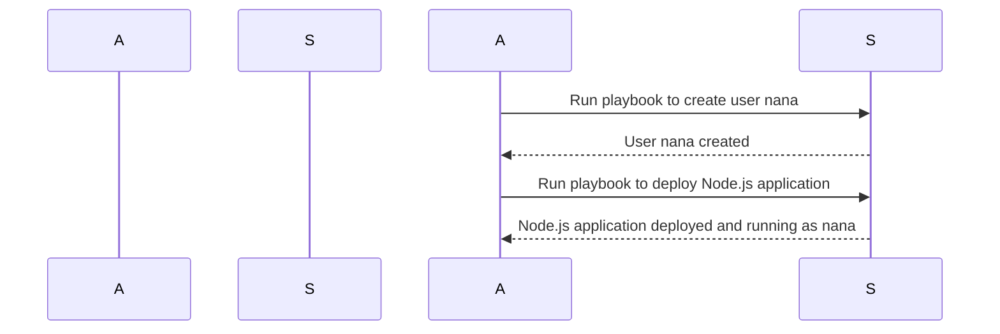
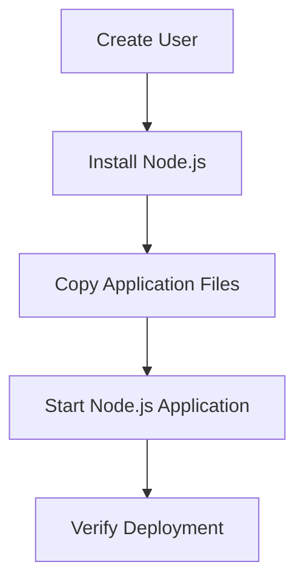

## Understanding User Management in Node.js Deployments

When deploying a Node.js application, it is crucial to ensure that the application runs with the least privilege necessary. This means avoiding the use of the `root` user, which has full access to the system, and instead using a non-root user. This approach significantly reduces the potential damage in case of a security breach. In this section, we will delve into the details of creating and managing non-root users for Node.js deployments, including the theoretical background, practical steps, and security implications.

### Theoretical Background

#### Why Use Non-Root Users?

Using a non-root user for your Node.js application is a fundamental principle of the Principle of Least Privilege (PoLP). This principle states that a process should run with the minimum set of permissions necessary to perform its task. By running your application as a non-root user, you limit the potential damage an attacker could cause if they were to exploit a vulnerability in your application.

For example, consider a scenario where an attacker finds a vulnerability in your Node.js application that allows them to execute arbitrary commands on the server. If the application is running as the `root` user, the attacker would have full control over the system, potentially leading to data theft, system compromise, or even complete takeover. However, if the application is running as a non-root user, the attacker's capabilities would be severely limited, reducing the overall impact of the breach.

#### How Does It Work Under the Hood?

In Unix-based systems, each process runs with a specific user ID (UID) and group ID (GID). The `root` user has UID 0, which grants it full administrative privileges. A non-root user, on the other hand, has a UID greater than 0 and typically limited permissions. When you create a new user and run your Node.js application under that user, the application inherits the permissions associated with that user.

### Creating a New User

To create a new user, you typically use the `adduser` or `useradd` command. Here’s an example of how to create a new user named `nana`:

```bash
sudo adduser nana
```

This command will prompt you to enter a password and additional information for the new user. Once the user is created, you can switch to that user using the `su` command:

```bash
su - nana
```

### Configuring Your Node.js Application to Run as a Non-Root User

To ensure that your Node.js application runs as the newly created user, you need to modify your deployment scripts or configuration files accordingly. This can be done in several ways depending on your deployment setup.

#### Example Using a Deployment Script

Suppose you have a simple deployment script that starts your Node.js application:

```bash
#!/bin/bash

# Start the Node.js application
node /path/to/app.js
```

To run this script as the `nana` user, you can modify it as follows:

```bash
#!/bin/bash

# Switch to the nana user
sudo -u nana node /path/to/app.js
```

Here, the `sudo -u nana` command switches to the `nana` user before executing the `node` command.

#### Example Using a Systemd Service

If you are using a systemd service to manage your Node.js application, you can specify the user in the service file:

```ini
[Unit]
Description=Node.js Application

[Service]
User=nana
ExecStart=/usr/bin/node /path/to/app.js
Restart=always

[Install]
WantedBy=multi-user.target
```

In this example, the `User=nana` directive specifies that the service should run as the `nana` user.

### Ensuring Proper Permissions

Once your application is running as a non-root user, it is essential to ensure that the user has the correct permissions to access the necessary files and directories. This can be achieved by setting appropriate file and directory permissions.

#### Setting File and Directory Permissions

You can use the `chown` and `chmod` commands to set ownership and permissions. For example, to set the ownership of a directory to the `nana` user:

```bash
sudo chown -R nana:nana /path/to/directory
```

To set the permissions of a file to allow read and write access for the owner:

```bash
sudo chmod 600 /path/to/file
```

### Real-World Examples and Recent Breaches

#### Example: CVE-2021-39142

CVE-2021-39142 is a vulnerability in the Express framework, a popular Node.js web application framework. An attacker could exploit this vulnerability to execute arbitrary code on the server. If the application was running as the `root` user, the attacker would have full control over the system. However, if the application was running as a non-root user, the attacker's capabilities would be limited, reducing the potential damage.

#### Example: MongoDB Breach

In 2019, a MongoDB database was breached due to misconfigured security settings. The database was accessible from the internet, and the attacker was able to delete data and demand a ransom. If the database had been running as a non-root user with limited permissions, the attacker would not have been able to delete data or cause significant damage.

### How to Prevent / Defend

#### Detection

To detect whether your Node.js application is running as a non-root user, you can check the process list using the `ps` command:

```bash
ps aux | grep node
```

Look for the `USER` column to verify that the process is running as the `nana` user.

#### Prevention

1. **Use Non-Root Users**: Always run your Node.js application as a non-root user.
2. **Set Proper Permissions**: Ensure that the non-root user has the correct permissions to access the necessary files and directories.
3. **Monitor Processes**: Regularly monitor the processes running on your system to ensure that they are running as the intended user.
4. **Secure Configuration Files**: Ensure that configuration files are properly secured and not accessible to unauthorized users.

#### Secure Coding Fixes

Here is an example of a vulnerable configuration and its secure counterpart:

**Vulnerable Configuration:**

```javascript
const express = require('express');
const app = express();

app.listen(3000);
```

**Secure Configuration:**

```javascript
const express = require('express');
const app = express();

// Ensure the application runs as the nana user
if (process.getuid() === 0) {
    console.error('Application should not run as root');
    process.exit(1);
}

app.listen(3000);
```

In this example, the application checks if it is running as the `root` user and exits if it is. This ensures that the application does not run with elevated privileges.

### Complete Example: Full Deployment with Ansible Playbook

Let's walk through a complete example of deploying a Node.js application using an Ansible playbook and ensuring it runs as a non-root user.

#### Step 1: Create the User

First, create the `nana` user using the `adduser` module in Ansible:

```yaml
---
- name: Create user nana
  hosts: all
  become: yes
  tasks:
    - name: Add user nana
      user:
        name: nana
        state: present
        shell: /bin/bash
```

#### Step 2: Deploy the Node.js Application

Next, deploy the Node.js application and ensure it runs as the `nana` user:

```yaml
---
- name: Deploy Node.js application
  hosts: all
  become: yes
  tasks:
    - name: Install Node.js
      apt:
        name: nodejs
        state: present

    - name: Copy application files
      copy:
        src: /path/to/local/app.js
        dest: /path/to/remote/app.js
        owner: nana
        group: nana
        mode: '0600'

    - name: Start Node.js application
      systemd:
        name: my-node-app
        enabled: yes
        state: started
        daemon_reload: yes
        user: nana
        exec_start: /usr/bin/node /path/to/remote/app.js
```

#### Step 3: Verify the Deployment

Finally, verify that the Node.js application is running as the `nana` user:

```bash
ps aux | grep node
```

### Mermaid Diagrams

#### User Creation Process



#### Node.js Application Deployment Flow



### Conclusion

Running your Node.js application as a non-root user is a critical security practice that significantly reduces the potential damage in case of a security breach. By following the steps outlined in this chapter, you can ensure that your application is deployed securely and runs with the least privilege necessary. Remember to regularly monitor your processes and ensure that proper permissions are set to maintain the security of your application.

### Practice Labs

For hands-on practice with securing Node.js deployments, consider the following labs:

- **PortSwigger Web Security Academy**: Offers interactive labs on securing web applications, including Node.js.
- **OWASP Juice Shop**: A deliberately insecure web application for practicing web security skills.
- **DVWA (Damn Vulnerable Web Application)**: Another intentionally vulnerable web application for learning web security.

These labs provide a safe environment to practice and reinforce the concepts covered in this chapter.

---
<!-- nav -->
[[03-Understanding Root User Privileges and Risks|Understanding Root User Privileges and Risks]] | [[DevOps/DevOps Bootcamp/01-Linux & OS Basics/18-Securing Node.js Deployments with Non-Root Users/00-Overview|Overview]] | [[DevOps/DevOps Bootcamp/01-Linux & OS Basics/18-Securing Node.js Deployments with Non-Root Users/05-Practice Questions & Answers|Practice Questions & Answers]]
