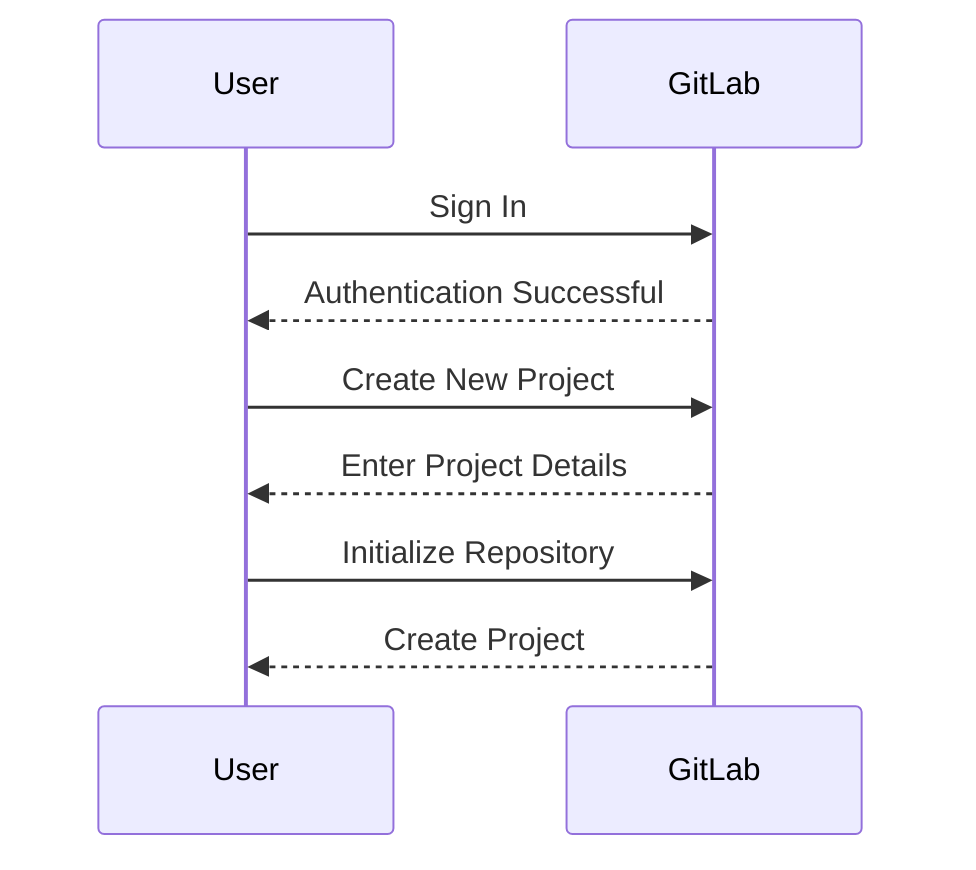
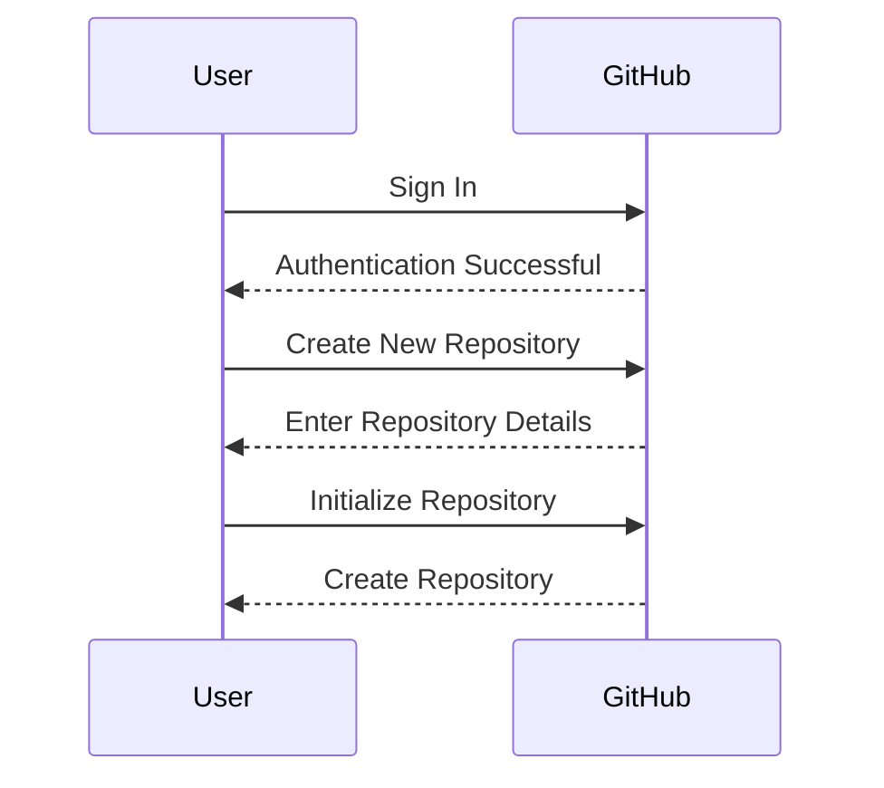
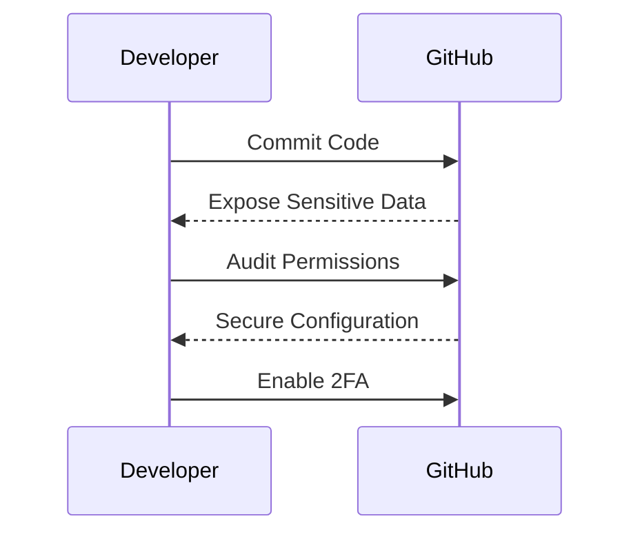
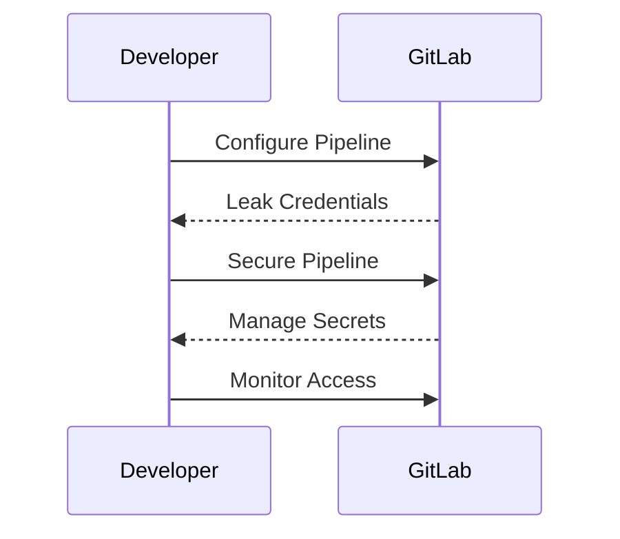

## Introduction to Remote Git Repositories

In the realm of modern software development, version control systems play a pivotal role in managing codebases effectively. Among these systems, Git stands out as the most widely used and powerful tool. Git allows developers to track changes in their code, collaborate with others, and maintain a history of modifications. However, Git alone is a distributed version control system, meaning that it operates locally on each developer's machine. To facilitate collaboration across teams and geographically dispersed developers, remote Git repositories are essential.

Remote Git repositories are centralized locations where developers can push their local changes, pull updates from others, and manage access controls. Popular platforms such as GitLab and GitHub provide robust interfaces and features to enhance the Git experience. This chapter delves into the intricacies of remote Git repositories, explaining their setup, usage, and security considerations.

### What Are Remote Git Repositories?

Remote Git repositories are central storage locations for Git repositories. They serve as hubs where developers can share and synchronize their work. Unlike local Git repositories, which reside on individual machines, remote repositories are accessible via the internet. This accessibility enables multiple developers to work on the same codebase simultaneously, making it easier to collaborate and manage large-scale projects.

#### Key Features of Remote Git Repositories

1. **Centralized Storage**: All team members can access the same codebase, ensuring consistency and reducing conflicts.
2. **Access Control**: Administrators can set permissions to control who can read, write, or modify the repository.
3. **Version History**: A complete history of changes is maintained, allowing developers to revert to previous states if necessary.
4. **Branch Management**: Multiple branches can be created to handle different features or bug fixes concurrently.
5. **Collaboration Tools**: Platforms like GitLab and GitHub offer additional tools such as issue tracking, pull requests, and continuous integration/continuous deployment (CI/CD).

### Popular Platforms: GitLab and GitHub

GitLab and GitHub are two of the most popular platforms for hosting remote Git repositories. While both platforms provide similar core functionalities, they differ in terms of user interface, additional features, and pricing models.

#### GitLab

GitLab is a web-based Git repository manager that provides a wide range of features for software development teams. It supports the entire software development lifecycle, from planning and source code management to CI/CD and monitoring. GitLab offers both free and paid plans, catering to individual developers and large enterprises.

**Key Features of GitLab:**
- **Integrated CI/CD**: GitLab provides built-in pipelines for automating testing and deployment processes.
- **Issue Tracking**: Comprehensive issue tracking system with Kanban boards and milestone management.
- **Security Scanning**: Automatic scanning for vulnerabilities and compliance issues.
- **Code Review**: Pull request functionality for peer reviews and approvals.

#### GitHub

GitHub is another leading platform for hosting Git repositories. Known for its extensive community and integrations, GitHub is widely used by open-source projects and commercial software development teams. GitHub offers a range of plans, including a free tier for public repositories and paid tiers for private repositories and advanced features.

**Key Features of GitHub:**
- **Social Coding**: GitHub emphasizes social aspects of coding, allowing users to follow other developers and contribute to open-source projects.
- **Pull Requests**: Streamlined process for reviewing and merging code changes.
- **Actions**: CI/CD workflows can be defined using GitHub Actions, enabling automation of various tasks.
- **Packages**: Support for hosting and managing software packages, such as npm packages and Docker images.

### Setting Up a Remote Repository

To start using a remote Git repository, you first need to create an account on your chosen platform (GitLab or GitHub). Once you have an account, you can proceed to create a new repository.

#### Creating a New Repository on GitLab

1. **Sign In**: Log in to your GitLab account.
2. **Create New Project**: Navigate to the "New Project" page.
3. **Project Details**: Fill in the required details such as project name, description, and visibility level (public or private).
4. **Initialize Repository**: Optionally, you can initialize the repository with a README file or a .gitignore template.
5. **Create Project**: Click the "Create project" button to finalize the creation.



#### Creating a New Repository on GitHub

1. **Sign In**: Log in to your GitHub account.
2. **Create New Repository**: Click on the "+" icon in the top-right corner and select "New repository".
3. **Repository Details**: Provide the repository name, description, and visibility settings.
4. **Initialize Repository**: Optionally, you can initialize the repository with a README file or a .gitignore template.
5. **Create Repository**: Click the "Create repository" button to complete the process.



### Managing Access Controls

One of the critical aspects of remote Git repositories is managing access controls. This ensures that only authorized individuals can view, modify, or delete the codebase. Both GitLab and GitHub provide granular permission settings to control access at various levels.

#### Access Levels in GitLab

GitLab offers several access levels, each with specific permissions:

- **Guest**: Can view the project but cannot make changes.
- **Reporter**: Can view the project and report issues.
- **Developer**: Can view, commit, and merge code.
- **Maintainer**: Can perform all actions and manage project settings.
- **Owner**: Full administrative rights over the project.

#### Access Levels in GitHub

GitHub also provides different access levels:

- **Read**: Can view the repository and its contents.
- **Write**: Can view and commit changes to the repository.
- **Admin**: Can perform all actions, including managing settings and deleting the repository.

### Working with Remote Repositories

Once a remote repository is set up, developers can interact with it using Git commands. The following sections cover the basic operations for working with remote repositories.

#### Cloning a Remote Repository

Cloning a remote repository creates a local copy of the repository on your machine. This allows you to work on the codebase locally and then push changes back to the remote repository.

```bash
# Clone a remote repository
git clone https://gitlab.com/username/repository.git
```

#### Pushing Changes to a Remote Repository

After making changes to the codebase locally, you can push these changes to the remote repository using the `git push` command.

```bash
# Add changes to the staging area
git add .

# Commit changes with a descriptive message
git commit -m "Add feature X"

# Push changes to the remote repository
git push origin main
```

#### Pulling Changes from a Remote Repository

To incorporate changes made by other developers, you can pull updates from the remote repository using the `git pull` command.

```bash
# Pull latest changes from the remote repository
git pull origin main
```

### Real-World Examples and Recent Breaches

Understanding the practical implications of remote Git repositories is crucial. Here are some recent examples of breaches involving Git repositories:

#### Example 1: GitHub Data Exposure

In 2021, a GitHub user accidentally exposed sensitive data, including API keys and credentials, due to misconfigured access controls. This incident highlights the importance of proper access management and regular audits.

**How to Prevent / Defend:**

1. **Regular Audits**: Conduct periodic reviews of repository permissions to ensure that only authorized users have access.
2. **Secure Configuration**: Use `.gitignore` files to exclude sensitive information from being committed to the repository.
3. **Two-Factor Authentication (2FA)**: Enable 2FA for all user accounts to add an extra layer of security.



#### Example 2: GitLab Credential Leakage

In 2022, a GitLab user inadvertently leaked credentials due to a misconfigured CI/CD pipeline. This incident underscores the need for secure pipeline configurations and proper handling of sensitive data.

**How to Prevent / Defend:**

1. **Pipeline Security**: Ensure that CI/CD pipelines are configured securely, avoiding hard-coded credentials and using environment variables instead.
2. **Secrets Management**: Utilize GitLab's built-in secrets management features to store and manage sensitive data securely.
3. **Regular Monitoring**: Implement monitoring tools to detect and respond to unauthorized access attempts promptly.



### Conclusion

Remote Git repositories are indispensable tools for modern software development. They enable collaboration, version control, and access management, facilitating efficient and secure codebase management. By understanding the setup, usage, and security considerations of remote repositories, developers can leverage these tools effectively to enhance productivity and maintain code integrity.

### Practice Labs

For hands-on practice with remote Git repositories, consider the following labs:

- **PortSwigger Web Security Academy**: Offers exercises on web application security, including Git-related challenges.
- **OWASP Juice Shop**: A deliberately insecure web application for practicing security skills, including Git usage.
- **DVWA (Damn Vulnerable Web Application)**: Provides a variety of web application vulnerabilities, including Git-related issues.
- **WebGoat**: An interactive training application for learning about web security, including Git practices.

These labs provide real-world scenarios and challenges to reinforce the concepts covered in this chapter.

---
<!-- nav -->
[[DevOps/DevOps Bootcamp/02-Version Control (Git)/01-Remote Git Repositories Overview/00-Overview|Overview]] | [[02-Remote Git Repositories Overview|Remote Git Repositories Overview]]
