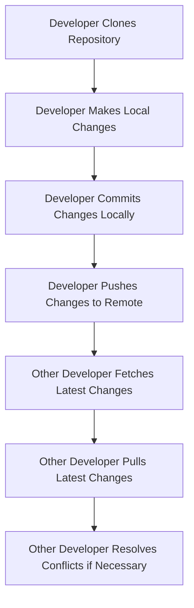

## Introduction to Version Control Systems

Version control systems (VCS) are essential tools for managing changes to source code in software development projects. They allow multiple developers to collaborate on the same codebase without stepping on each other's toes. In this section, we will delve into the fundamentals of version control, focusing on Git, which is one of the most widely used VCS today.

### Why Do We Need Version Control?

Imagine a scenario where a team of developers is working on a complex software project. Each developer might be responsible for different parts of the application—front-end, back-end, database connections, etc. Without a version control system, coordinating these changes would be extremely difficult. Here’s why:

1. **Coordination**: Multiple developers can work on the same codebase simultaneously without conflicts.
2. **History Tracking**: Every change made to the codebase is tracked, allowing developers to revert to previous versions if necessary.
3. **Branching and Merging**: Developers can work on separate features or bug fixes in isolation and merge them back into the main codebase when ready.
4. **Backup and Recovery**: Code repositories act as a centralized backup, ensuring that code is not lost due to hardware failures or accidental deletions.

### Centralized vs. Distributed Version Control

There are two primary types of version control systems: centralized and distributed.

#### Centralized Version Control Systems (CVCS)

In CVCS, there is a single central repository where all changes are stored. Developers check out the latest version of the code, make changes locally, and then commit those changes back to the central repository. Examples of CVCS include Subversion (SVN) and CVS.

#### Distributed Version Control Systems (DVCS)

In DVCS, every developer has a complete copy of the entire code history on their local machine. This allows developers to work independently and merge changes later. Git is the most popular DVCS, followed by Mercurial.

### The Role of Code Repositories

A code repository is the central location where the source code is stored. In Git, this repository is often hosted on a remote server, such as GitHub, GitLab, or Bitbucket. However, developers do not edit the code directly in the remote repository. Instead, they clone the repository to their local machine, make changes, and then push those changes back to the remote repository.

### Workflow Overview

The typical workflow in Git involves the following steps:

1. **Clone Repository**: Fetch the code from the remote repository to your local machine.
2. **Make Changes**: Edit the code locally.
3. **Commit Changes**: Save the changes to your local repository.
4. **Push Changes**: Send the committed changes to the remote repository.
5. **Fetch/Pull Changes**: Retrieve the latest changes from the remote repository to your local machine.

### Example Workflow

Let’s walk through an example using Git:

```bash
# Clone the repository to your local machine
git clone https://github.com/example/repo.git

# Navigate to the cloned directory
cd repo

# Make some changes to a file
echo "Hello, World!" > hello.txt

# Add the changed file to the staging area
git add hello.txt

# Commit the changes with a descriptive message
git commit -m "Add hello.txt"

# Push the changes to the remote repository
git push origin master
```

### Handling Conflicts

One of the challenges in collaborative development is handling conflicts when multiple developers modify the same file. Git provides mechanisms to resolve these conflicts.

#### Conflict Resolution Example

Consider a scenario where both you and Emily have modified the same file `config.json`. When you try to push your changes, Git will detect the conflict and prompt you to resolve it.

```bash
# Fetch the latest changes from the remote repository
git fetch origin

# Merge the remote changes into your local branch
git merge origin/master

# Resolve conflicts manually
# Open the conflicted file and resolve the differences
# Once resolved, add the file to the staging area
git add config.json

# Complete the merge
git commit -m "Resolved merge conflicts"
```

### Mermaid Diagrams for Workflow

To visualize the Git workflow, we can use a mermaid diagram:



### Real-World Examples and Security Implications

Recent breaches and vulnerabilities often involve mismanagement of version control systems. For instance, in 2021, a major breach occurred when a developer accidentally pushed sensitive credentials to a public GitHub repository. This highlights the importance of proper access controls and security practices.

#### Secure Coding Practices

To prevent such incidents, developers should follow these best practices:

1. **Use Private Repositories**: Ensure that sensitive code is stored in private repositories.
2. **Access Controls**: Implement strict access controls and permissions.
3. **Automated Scanning**: Use tools like GitGuardian or TruffleHog to scan for secrets in commits.
4. **Secure Coding Guidelines**: Follow secure coding guidelines to avoid committing sensitive data.

### How to Prevent / Defend

#### Detection

1. **Regular Audits**: Conduct regular audits of repositories to identify unauthorized access or sensitive data leaks.
2. **Monitoring Tools**: Use monitoring tools like GitHub Actions or GitLab CI/CD pipelines to detect unusual activity.

#### Prevention

1. **Educate Developers**: Train developers on secure coding practices and the risks associated with version control systems.
2. **Use .gitignore**: Utilize `.gitignore` files to exclude sensitive files from being committed.
3. **Two-Factor Authentication**: Enable two-factor authentication for repository access.

#### Secure-Coding Fixes

Here’s an example of a vulnerable vs. secure version of a `.gitignore` file:

**Vulnerable Version**

```plaintext
# .gitignore
```

**Secure Version**

```plaintext
# .gitignore
*.log
*.swp
*.bak
*.env
```

### Conclusion

Version control systems are indispensable tools for modern software development. By understanding the principles and best practices of version control, developers can effectively manage codebases, collaborate seamlessly, and maintain the security of their projects.

---
<!-- nav -->
[[01-Introduction to Version Control Systems (VCS)|Introduction to Version Control Systems (VCS)]] | [[DevOps/DevOps Bootcamp/02-Version Control (Git)/02-Version Control Fundamentals For Team Collaboration/00-Overview|Overview]] | [[03-Version Control Fundamentals for Team Collaboration|Version Control Fundamentals for Team Collaboration]]
