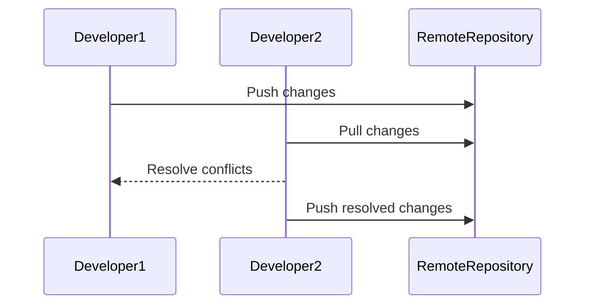
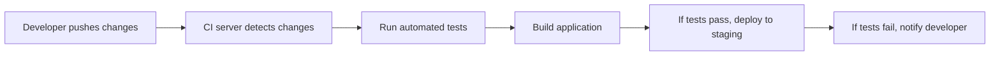

## Version Control Fundamentals for Team Collaboration

### Introduction to Version Control Systems (VCS)

Version control systems (VCS) are essential tools for managing changes to codebases in collaborative environments. They allow multiple developers to work on the same project simultaneously, track changes, and resolve conflicts. Git is one of the most popular VCS tools used today due to its flexibility and robustness.

### Understanding Conflicts in Git

When multiple developers work on the same codebase, conflicts can arise if they modify the same parts of the code. Let's delve into how conflicts occur and how to handle them effectively.

#### What Are Conflicts?

Conflicts happen when two or more developers make changes to the same lines of code in a file. Git tries to automatically merge these changes, but sometimes it cannot determine which changes should take precedence. In such cases, Git marks the file as having a conflict, and the developer must manually resolve it.

#### Example Scenario

Consider a scenario where you and another developer, Emily, are working on the same codebase. You both modify the same file, `main.py`, in different ways:

```python
# main.py
def calculate_sum(a, b):
    return a + b

# Your changes
def calculate_sum(a, b):
    return a + b + 1

# Emily's changes
def calculate_sum(a, b):
    return a + b * 2
```

When you try to merge your changes with Emily's, Git will encounter a conflict because both of you have modified the same function in different ways.

#### How Git Handles Conflicts

When Git encounters a conflict, it marks the conflicting sections in the file with special markers. Here’s an example of how a conflicted file might look:

```python
def calculate_sum(a, b):
<<<<<<< HEAD
    return a + b + 1
=======
    return a + b * 2
>>>>>>> emily's_branch
```

The `<<<<<<< HEAD` marker indicates the start of your changes, `=======` separates your changes from Emily's, and `>>>>>>> emily's_branch` marks the end of her changes.

#### Resolving Conflicts Manually

To resolve the conflict, you need to decide which changes to keep or combine. You can open the file in a text editor and manually edit the conflicting sections. Once you have resolved the conflict, you need to mark the file as resolved using the following commands:

```bash
git add main.py
git commit -m "Resolved conflict in main.py"
```

### Best Practices for Conflict Resolution

#### Frequent Pushes and Pulls

One of the best practices to avoid conflicts is to push and pull changes frequently. This ensures that your local copy of the codebase is always up-to-date with the latest changes from other developers.

```bash
# Pull the latest changes from the remote repository
git pull origin main

# Make your changes and commit them
git add .
git commit -m "Your changes"

# Push your changes to the remote repository
git push origin main
```

#### Continuous Integration (CI)

Continuous Integration (CI) is the practice of merging code changes into a shared repository frequently. This helps catch and resolve conflicts early, reducing the likelihood of major issues.



### Handling Broken Builds Due to Code Changes

Sometimes, changes made by developers can break the application. This is particularly common with junior developers who may not be familiar with the codebase.

#### Example Scenario

Imagine a junior developer accidentally checks in some changes that cause the application to fail to compile. This can be disastrous, especially if the changes are pushed to the production environment.

#### Detection and Prevention

To prevent such issues, it is crucial to implement automated testing and build processes. Continuous Integration (CI) tools like Jenkins, Travis CI, and GitHub Actions can automatically run tests and build the application whenever changes are pushed to the repository.



#### Secure Coding Practices

To ensure that code changes do not break the application, developers should follow secure coding practices. This includes writing unit tests, performing code reviews, and ensuring that all changes are thoroughly tested before being merged into the main branch.

#### Example of Vulnerable vs. Secure Code

Let's consider an example where a developer adds a new feature that introduces a SQL injection vulnerability.

**Vulnerable Code:**

```python
# Vulnerable code
def search_users(query):
    cursor.execute(f"SELECT * FROM users WHERE name LIKE '%{query}%'")
    results = cursor.fetchall()
    return results
```

**Secure Code:**

```python
# Secure code
def search_users(query):
    cursor.execute("SELECT * FROM users WHERE name LIKE ?", ('%' + query + '%',))
    results = cursor.fetchall()
    return results
```

In the secure version, parameterized queries are used to prevent SQL injection attacks.

### Real-World Examples

#### Recent Breaches and CVEs

One notable example is the Log4j vulnerability (CVE-2021-44228), which affected many applications due to insecure logging practices. This highlights the importance of secure coding practices and regular security audits.

#### Continuous Integration Tools

Continuous Integration tools like Jenkins and GitHub Actions provide robust solutions for automating builds and tests. These tools can be configured to run various types of tests, including unit tests, integration tests, and security scans.

### How to Prevent / Defend

#### Detection

Implementing automated testing and build processes can help detect issues early. Continuous Integration tools can run tests and build the application whenever changes are pushed to the repository.

#### Prevention

1. **Code Reviews:** Regularly review code changes to catch potential issues.
2. **Automated Testing:** Implement automated testing to ensure that changes do not break the application.
3. **Secure Coding Practices:** Follow secure coding practices to prevent vulnerabilities.
4. **Regular Audits:** Conduct regular security audits to identify and mitigate risks.

#### Secure-Coding Fixes

Show the vulnerable pattern and the corrected secure version side by side:

**Vulnerable Pattern:**

```python
# Vulnerable code
def search_users(query):
    cursor.execute(f"SELECT * FROM users WHERE name LIKE '%{query}%'")
    results = cursor.fetchall()
    return results
```

**Secure Pattern:**

```python
# Secure code
def search_users(query):
    cursor.execute("SELECT * FROM users WHERE name LIKE ?", ('%' + query + '%',))
    results = cursor.fetchall()
    return results
```

### Hands-On Labs

For practical experience with version control and conflict resolution, consider the following labs:

- **PortSwigger Web Security Academy:** Offers hands-on labs for web application security.
- **OWASP Juice Shop:** A deliberately insecure web application for practicing security skills.
- **DVWA (Damn Vulnerable Web Application):** A PHP/MySQL web application that is riddled with vulnerabilities.

These labs provide real-world scenarios to practice and improve your skills in version control and conflict resolution.

### Conclusion

Version control systems like Git are essential for managing code changes in collaborative environments. By understanding how conflicts occur and implementing best practices, you can ensure that your codebase remains stable and secure. Regular testing, code reviews, and secure coding practices are key to preventing issues and maintaining a robust codebase.

---
<!-- nav -->
[[02-Introduction to Version Control Systems|Introduction to Version Control Systems]] | [[DevOps/DevOps Bootcamp/02-Version Control (Git)/02-Version Control Fundamentals For Team Collaboration/00-Overview|Overview]] | [[DevOps/DevOps Bootcamp/02-Version Control (Git)/02-Version Control Fundamentals For Team Collaboration/04-Practice Questions & Answers|Practice Questions & Answers]]
