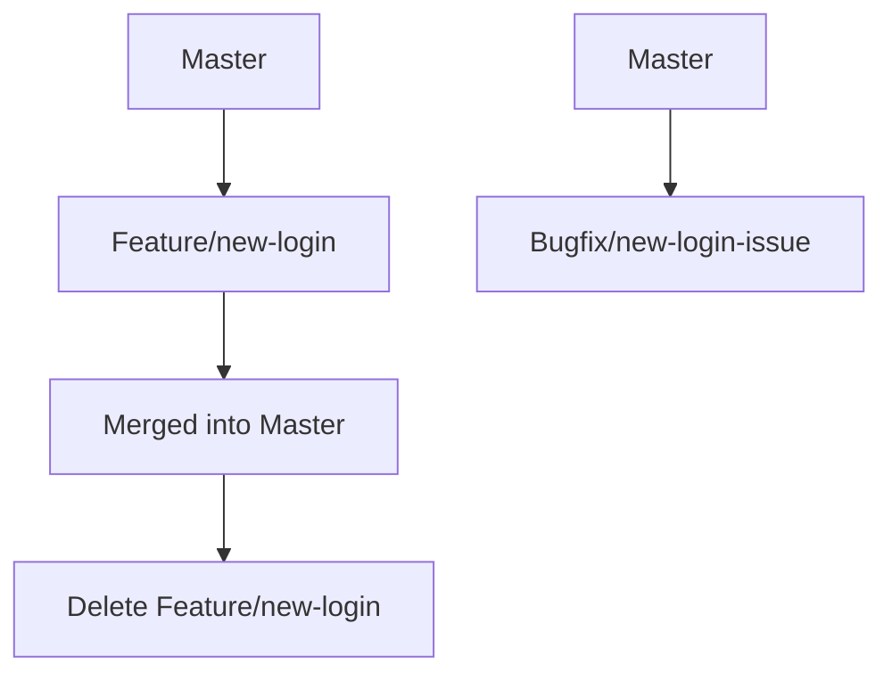

## Best Practices for Branch Management in DevOps

### Introduction to Branch Management

Branch management is a critical aspect of modern software development, especially within the context of DevOps. In a typical software development lifecycle, developers work on different features, bug fixes, and enhancements simultaneously. These tasks are often managed through separate branches in a version control system like Git. Proper branch management ensures that the codebase remains organized, maintainable, and free from conflicts.

### Understanding Branches

A branch in Git is essentially a pointer to a commit. Each branch represents a line of development, allowing multiple developers to work on different features or bug fixes concurrently. The main branch, often called `master` or `main`, typically holds the stable production-ready code.

#### Why Branch Management Matters

Effective branch management helps in several ways:

1. **Organization**: Keeps the codebase organized by separating different lines of development.
2. **Parallel Development**: Allows multiple developers to work on different features or bug fixes simultaneously.
3. **Code Review**: Facilitates code reviews by isolating changes into distinct branches.
4. **Conflict Resolution**: Helps in resolving merge conflicts by keeping changes isolated until they are ready to be integrated.

### Best Practices for Branch Management

#### Option 1: Leaving the Branch After Merge

One approach is to leave the branch intact even after it has been merged into the main branch. This method is useful for maintaining a history of changes and providing a fallback in case issues arise.

##### Advantages

- **Historical Record**: Maintains a record of all changes made during the development process.
- **Fallback Mechanism**: Provides a way to revert to previous versions if issues are discovered post-merge.

##### Disadvantages

- **Clutter**: Can lead to a cluttered repository with numerous inactive branches.
- **Maintenance Overhead**: Requires periodic cleanup to manage the number of branches.

##### Example Scenario

Consider a scenario where a team is developing a new feature in a branch named `feature/new-login`. Once the feature is complete and merged into `master`, the branch remains in the repository. If a bug is found in the new login feature, the team can easily reference the `feature/new-login` branch to identify and fix the issue.

```mermaid
graph TD
    A[Master] --> B[Feature/new-login]
    B --> C[Merged into Master]
    C --> D[Feature/new-login (inactive)]
```

#### Option 2: Deleting the Branch After Merge

The second approach is to delete the branch immediately after it has been merged into the main branch. This method helps keep the repository clean and reduces the overhead of managing inactive branches.

##### Advantages

- **Clean Repository**: Ensures the repository remains tidy and easy to navigate.
- **Reduced Maintenance**: Minimizes the effort required to manage and track branches.

##### Disadvantages

- **Loss of History**: Removes the historical record of the branch, which might be needed for debugging or auditing purposes.
- **Recreation Overhead**: Requires creating new branches for any future changes related to the merged feature.

##### Example Scenario

In this scenario, once the `feature/new-login` branch is merged into `master`, it is immediately deleted. If a bug is found in the new login feature, a new branch named `bugfix/new-login-issue` is created to address the problem.



### Real-World Examples and Case Studies

#### Recent Breaches and CVEs

Recent breaches and vulnerabilities often highlight the importance of proper branch management. For instance, the Log4j vulnerability (CVE-2021-44228) demonstrated the critical nature of maintaining a clean and well-managed codebase. In many cases, the vulnerability was exploited due to outdated or poorly maintained branches.

##### Example: Log4j Vulnerability

The Log4j vulnerability affected numerous applications because the vulnerable code was present in older branches that were not properly managed or cleaned up. This underscores the importance of regular branch cleanup and maintenance.

### How to Prevent / Defend

#### Detection

To detect issues related to improper branch management, teams can implement automated tools and practices:

1. **Branch Cleanup Scripts**: Automate the deletion of merged branches using scripts.
2. **Repository Audits**: Regularly audit the repository to identify and remove inactive branches.

##### Example Script

Here is an example script to automatically delete merged branches:

```bash
#!/bin/bash

# Fetch the latest changes from the remote repository
git fetch --all

# List all branches that have been merged into master
merged_branches=$(git branch --merged master)

# Loop through each merged branch and delete it
for branch in $merged_branches; do
    if [ "$branch" != "master" ]; then
        git branch -d $branch
        git push origin --delete $branch
    fi
done
```

#### Prevention

To prevent issues related to improper branch management, teams should adopt the following practices:

1. **Branch Naming Conventions**: Establish clear naming conventions for branches to ensure they are easily identifiable.
2. **Regular Code Reviews**: Conduct regular code reviews to catch and address issues early.
3. **Automated Testing**: Implement automated testing to ensure that changes in branches do not introduce new bugs.

##### Secure Coding Fixes

Here is an example of how to securely manage branches:

**Vulnerable Pattern**

```bash
# Merging a feature branch without deleting it
git checkout master
git merge feature/new-login
```

**Secure Pattern**

```bash
# Merging a feature branch and deleting it
git checkout master
git merge feature/new-login
git branch -d feature/new-login
git push origin --delete feature/new-login
```

### Complete Example: Full Workflow

#### Creating and Managing a Feature Branch

1. **Create a New Feature Branch**

```bash
git checkout -b feature/new-login
```

2. **Make Changes and Commit**

```bash
# Make changes to the code
git add .
git commit -m "Add new login feature"
```

3. **Merge the Feature Branch**

```bash
git checkout master
git merge feature/new-login
```

4. **Delete the Feature Branch**

```bash
git branch -d feature/new-login
git push origin --delete feature/new-login
```

#### Full HTTP Request and Response Example

When interacting with a Git server via HTTP, the requests and responses would look like this:

**HTTP Request to Create a Branch**

```http
POST /repos/user/repo/git/refs HTTP/1.1
Host: api.github.com
Authorization: token YOUR_ACCESS_TOKEN
Content-Type: application/json

{
  "ref": "refs/heads/feature/new-login",
  "sha": "commit_sha"
}
```

**HTTP Response**

```http
HTTP/1.1 201 Created
Content-Type: application/json

{
  "ref": "refs/heads/feature/new-login",
  "url": "https://api.github.com/repos/user/repo/git/refs/heads/feature/new-login",
  "object": {
    "type": "commit",
    "sha": "commit_sha",
    "url": "https://api.github.com/repos/user/repo/git/commits/commit_sha"
  }
}
```

### Common Pitfalls and Mistakes

#### Pitfall 1: Not Deleting Merged Branches

Failing to delete merged branches can lead to a cluttered repository and increased maintenance overhead.

#### Pitfall 2: Merging Without Review

Merging branches without proper review can introduce bugs and security vulnerabilities into the main codebase.

### Conclusion

Proper branch management is essential for maintaining a clean, organized, and secure codebase. By adopting best practices such as deleting merged branches and implementing automated tools, teams can ensure that their repositories remain manageable and free from conflicts. Regular audits and code reviews further enhance the security and reliability of the codebase.

### Practice Labs

For hands-on practice with branch management, consider the following labs:

- **PortSwigger Web Security Academy**: Offers exercises on version control and branch management.
- **OWASP Juice Shop**: Provides a web application environment where you can practice branch management in a real-world context.
- **DVWA (Damn Vulnerable Web Application)**: Useful for practicing secure coding and branch management in a web application environment.

By following these best practices and engaging in practical exercises, you can significantly improve your branch management skills and contribute to more robust and secure software development processes.

---
<!-- nav -->
[[01-Introduction to Branch Management in Git|Introduction to Branch Management in Git]] | [[DevOps/DevOps Bootcamp/02-Version Control (Git)/03-Best Practices for Branch Management/00-Overview|Overview]] | [[DevOps/DevOps Bootcamp/02-Version Control (Git)/03-Best Practices for Branch Management/03-Practice Questions & Answers|Practice Questions & Answers]]
