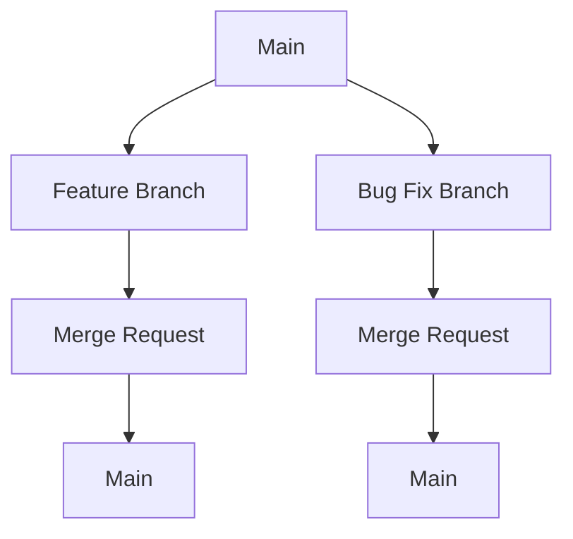

## Introduction to Branching Strategies in Version Control Systems

Branching strategies in version control systems (VCS) are essential for managing the development lifecycle of software projects. They allow teams to work concurrently on different features, bug fixes, and releases without interfering with each other. This chapter will delve into the concepts, best practices, and practical applications of branching strategies, using Git as the primary VCS.

### Understanding Branches

A branch in a version control system is essentially a pointer to a specific commit in the history of the project. Each branch represents a line of development that can diverge from the main branch (often called `master` or `main`). The purpose of branches is to isolate changes made by different developers or for different purposes, such as feature development, bug fixes, or experimental changes.

#### Why Use Branches?

Imagine a scenario where a development team is working on a complex application. Three developers are implementing new features, and two others are fixing bugs. Without branches, all these changes would be pushed directly to the main branch (`master` or `main`). This would result in a chaotic repository where it's difficult to determine the current state of the application:

- Are the bugs fully fixed?
- Are the features fully implemented?
- Can the application be built and deployed based on the current state of the repository?

By using branches, each developer can work on their own isolated line of development. This ensures that the main branch remains stable and ready for deployment at any time.

### Default Branch: Master/Main

When a new repository is created, a default branch is automatically generated. Historically, this branch was named `master`, but many organizations and tools have moved towards renaming it to `main` to avoid negative connotations. The default branch serves as the primary branch where the final, stable version of the codebase resides.

#### Example: Creating a Repository

Let's create a simple repository and initialize it with a default branch:

```bash
# Create a new directory and navigate into it
mkdir my-project
cd my-project

# Initialize a new Git repository
git init

# Check the status of the repository
git status
```

The output will show that the repository is initialized with a default branch (usually `master` or `main`):

```plaintext
On branch master
No commits yet
```

### Branch Naming Conventions

Branch naming conventions are crucial for maintaining a clear and organized repository. Common conventions include:

- **Feature branches**: Named after the feature being developed, e.g., `feature/new-login`.
- **Bug fix branches**: Named after the issue being fixed, e.g., `bugfix/login-issue`.
- **Release branches**: Named after the release version, e.g., `release/v1.0`.

#### Example: Creating Feature and Bug Fix Branches

To create a feature branch and a bug fix branch:

```bash
# Create a feature branch
git checkout -b feature/new-login

# Create a bug fix branch
git checkout -b bugfix/login-issue
```

### Workflow with Branches

A typical workflow involves creating branches for different tasks, making changes, and then merging them back into the main branch. Here’s a step-by-step guide:

1. **Create a Branch**:
    ```bash
    git checkout -b feature/new-login
    ```

2. **Make Changes**:
    Edit files and make necessary changes.

3. **Commit Changes**:
    ```bash
    git add .
    git commit -m "Add new login feature"
    ```

4. **Merge Back to Main**:
    ```bash
    git checkout main
    git merge feature/new-login
    ```

### Real-World Examples and Pitfalls

#### Example: GitHub Flow

GitHub Flow is a popular branching strategy used by many teams. It involves:

- Using `main` as the default branch.
- Creating feature branches for new features.
- Creating pull requests (PRs) to review changes before merging.
- Merging PRs into `main` after review.

#### Example: GitLab Flow

GitLab Flow extends GitHub Flow by introducing additional branches for different environments (development, staging, production).

#### Pitfall: Merge Conflicts

Merge conflicts occur when changes made in different branches conflict with each other. For example, if two developers modify the same line of code in different branches, a merge conflict will arise.

#### How to Prevent / Defend

1. **Regular Pulls**: Regularly pull changes from the main branch to your feature branch.
    ```bash
    git checkout feature/new-login
    git pull origin main
    ```

2. **Code Reviews**: Implement code reviews through pull requests to catch potential issues early.

3. **Automated Testing**: Use continuous integration (CI) to run automated tests on each branch before merging.

### Mermaid Diagrams

#### Branching Strategy Diagram



### Conclusion

Branching strategies are fundamental to effective version control and collaboration in software development. By understanding and implementing best practices, teams can maintain a clean, organized, and stable codebase. This chapter covered the basics of branches, naming conventions, workflows, and real-world examples, providing a comprehensive guide to branching strategies in version control systems.

### Practice Labs

For hands-on experience with branching strategies, consider the following labs:

- **PortSwigger Web Security Academy**: Offers exercises on Git and branching strategies.
- **OWASP Juice Shop**: Provides a real-world application where you can practice branching and merging.
- **DVWA (Damn Vulnerable Web Application)**: Useful for practicing branching in a web application context.

These labs will help solidify your understanding of branching strategies and their practical applications.

---
<!-- nav -->
[[DevOps/DevOps Bootcamp/02-Version Control (Git)/04-Branching Strategies In Version Control Systems/00-Overview|Overview]] | [[02-Branching Strategies in Version Control Systems|Branching Strategies in Version Control Systems]]
