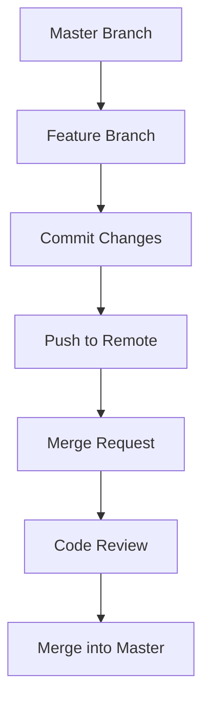
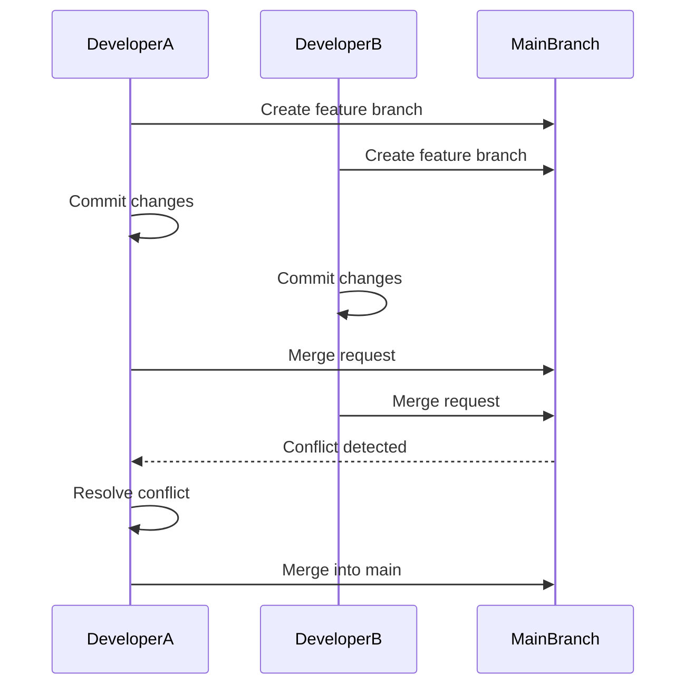

## Branching Strategies in Version Control Systems

### Introduction to Branching Strategies

Branching strategies in version control systems (VCS) are essential for managing code changes, especially in collaborative environments. A well-defined branching strategy helps maintain a clean and organized codebase, reduces conflicts, and ensures that developers can work independently without affecting others' work. This chapter delves into the details of branching strategies, focusing on feature and bug-fix branches, and provides a comprehensive guide to implementing these strategies effectively.

### Feature and Bug-Fix Branches

#### Naming Conventions

One of the most common naming conventions for branches is to prefix them with `feature` or `bugfix`, followed by a descriptive name. For example:

- **Feature Branch**: `feature/user-authentication`
- **Bug-Fix Branch**: `bugfix/user-authentication-error`

This naming convention serves multiple purposes:

1. **Clarity**: The branch name clearly indicates the type of work being done (feature development or bug fixing).
2. **Description**: The name provides a brief description of the feature or bug being addressed.
3. **Organization**: It helps in organizing branches logically, making it easier to track and manage them.

#### Purpose of Branches

Branches serve as a workspace for developers to make changes without affecting the main codebase. Here’s how they are used:

- **Feature Development**: Developers create a feature branch to work on a new feature. This allows them to commit changes frequently without disrupting the main codebase.
- **Bug Fixes**: Similarly, bug-fix branches are created to address specific issues. This isolates the fix from other ongoing work, reducing the risk of introducing new bugs.

### Best Practices for Branching

#### One Branch Per Feature/Bug Fix

A key best practice is to have one branch per feature or bug fix. This ensures that each piece of work is isolated and can be reviewed, tested, and merged independently. Here’s an example workflow:

1. **Create a Branch**:
    ```bash
    git checkout -b feature/user-authentication
    ```

2. **Commit Changes**:
    ```bash
    git add .
    git commit -m "Add initial user authentication logic"
    ```

3. **Push to Remote Repository**:
    ```bash
    git push origin feature/user-authentication
    ```

4. **Merge Back to Master**:
    Once the feature is fully implemented and tested, the branch can be merged back into the main branch (usually `master` or `main`).

    ```bash
    git checkout master
    git pull origin master
    git merge feature/user-authentication
    git push origin master
    ```

### Benefits of Branching Strategies

#### Clear Separation of Work

By using separate branches for different pieces of work, developers can avoid conflicts and ensure that their changes do not affect others' work. This is particularly useful in large teams where multiple developers might be working on different parts of the codebase simultaneously.

#### Frequent Commits Without Breaking Code

Developers can commit their changes frequently to their feature or bug-fix branches without worrying about breaking the main codebase. This allows for continuous integration and testing, ensuring that the code remains stable and functional.

### Challenges and Mitigation

#### Large Features and Conflicts

One of the challenges with branching strategies is managing large features that take a significant amount of time to implement. The longer a feature branch exists, the higher the chances of conflicts when merging it back into the main branch.

##### Example Scenario

Consider a scenario where two developers are working on large features:

- Developer A is working on `feature/payment-gateway`.
- Developer B is working on `feature/user-profile`.

Both features are complex and take several weeks to implement. During this time, both developers make frequent commits to their respective branches. When it comes time to merge these features back into the main branch, there is a high likelihood of conflicts due to overlapping changes.

##### Mitigation Strategies

To mitigate this issue, it is recommended to break down large features into smaller, manageable tasks. This approach ensures that each task can be completed and merged more quickly, reducing the risk of conflicts.

1. **Break Down Features**:
    - Instead of a single `feature/payment-gateway`, create multiple branches like `feature/payment-gateway-api`, `feature/payment-gateway-ui`, etc.
    - Each of these smaller branches can be merged independently, reducing the overall complexity and conflict risk.

2. **Regular Rebases**:
    - Regularly rebase feature branches onto the latest main branch to incorporate recent changes and reduce the likelihood of conflicts.
    ```bash
    git checkout feature/payment-gateway
    git rebase origin/master
    ```

3. **Code Reviews**:
    - Implement a robust code review process to catch potential conflicts early. This can be done through pull requests or code reviews in tools like GitHub, GitLab, or Bitbucket.

### Real-World Examples

#### Recent CVEs and Breaches

While branching strategies themselves do not directly cause security vulnerabilities, poor implementation can lead to issues. For example, if a developer merges a feature branch containing insecure code into the main branch without proper review, it could introduce vulnerabilities.

##### Example: CVE-2021-21972

In 2021, a critical vulnerability was discovered in the Log4j library (CVE-2021-21972). This vulnerability allowed attackers to execute arbitrary code on affected systems. If a developer had been working on a feature branch that included the vulnerable Log4j version and merged it without proper review, it could have exposed the application to attacks.

##### Secure Coding Practices

To prevent such issues, developers should follow secure coding practices and regularly review dependencies for known vulnerabilities. Tools like Snyk, Sonatype Nexus, and OWASP Dependency-Check can help identify and mitigate such risks.

### Mermaid Diagrams

#### Branching Workflow Diagram



#### Conflict Resolution Diagram



### How to Prevent / Defend

#### Detection

- **Automated Testing**: Implement automated tests (unit tests, integration tests, etc.) to catch issues early.
- **Dependency Scanning**: Use tools like Snyk or OWASP Dependency-Check to scan for known vulnerabilities in dependencies.
- **Code Review**: Conduct regular code reviews to catch potential issues before merging.

#### Prevention

- **Small Features**: Break down large features into smaller, manageable tasks.
- **Regular Rebases**: Regularly rebase feature branches onto the latest main branch to incorporate recent changes.
- **Secure Coding Practices**: Follow secure coding guidelines and regularly review dependencies for known vulnerabilities.

#### Secure-Coding Fixes

##### Vulnerable Code

```python
# Vulnerable code example
import os
import subprocess

def execute_command(command):
    subprocess.run(command, shell=True)
```

##### Secure Code

```python
# Secure code example
import subprocess

def execute_command(command):
    subprocess.run(command.split(), check=True)
```

### Complete Example

#### Full HTTP Request and Response

Here’s an example of a full HTTP request and response for creating a feature branch via an API:

```http
POST /api/v1/repositories/my-repo/branches HTTP/1.1
Host: api.example.com
Authorization: Bearer <access_token>
Content-Type: application/json

{
    "name": "feature/user-authentication",
    "start_point": "refs/heads/master"
}
```

```http
HTTP/1.1 201 Created
Date: Tue, 14 Mar 2023 12:00:00 GMT
Content-Type: application/json

{
    "branch": {
        "name": "feature/user-authentication",
        "commit": {
            "sha": "abc123def456ghi789jk0l1m2n3o4p5q6r7s8t9u0vwx1y2z3a4b5c6d7e8f9g0h1i2j3k4l5m6n7o8p9q0r1s2t3u4v5w6x7y8z9a0b1c2d3e4f5g6h7i8j9k0l1m2n3o4p5q6r7s8t9u0vwx1y2z3a4b5c6d7e8f9g0h1i2j3k4l5m6n7o8p9q0r1s2t3u4v5w6x7y8z9a0b1c2d3e4f5g6h7i8j9k0l1m2n3o4p5q6r7s8t9u0vwx1y2z3a4b5c6d7e8f9g0h1i2j3k4l5m6n7o8p9q0r1s2t3u4v5w6x7y8z9a0b1c2d3e4f5g6h7i8j9k0l1m2n3o4p5q6r7s8t9u0vwx1y2z3a4b5c6d7e8f9g0h1i2j3k4l5m6n7o8p9q0r1s2t3u4v5w6x7y8z9a0b1c2d3e4f5g6h7i8j9k0l1m2n3o4p5q6r7s8t9u0vwx1y2z3a4b5c6d7e8f9g0h1i2j3k4l5m6n7o8p9q0r1s2t3u4v5w6x7y8z9a0b1c2d3e4f5g6h7i8j9k0l1m2n3o4p5q6r7s8t9u0vwx1y2z3a4b5c6d7e8f9g0h1i2j3k4l5m6n7o8p9q0r1s2t3u4v5w6x7y8z9a0b1c2d3e4f5g6h7i8j9k0l1m2n3o4p5q6r7s8t9u0vwx1y2z3a4b5c6d7e8f9g0h1i2j3k4l5m6n7o8p9q0r1s2t3u4v5w6x7y8z9a0b1c2d3e4f5g6h7i8j9k0l1m2n3o4p5q6r7s8t9u0vwx1y2z3a4b5c6d7e8f9g0h1i2j3k4l5m6n7o8p9q0r1s2t3u4v5w6x7y8z9a0b1c2d3e4f5g6h7i8j9k0l1m2n3o4p5q6r7s8t9u0vwx1y2z3a4b5c6d7e8f9g0h1i2j3k4l5m6n7o8p9q0r1s2t3u4v5w6x7y8z9a0b1c2d3e4f5g6h7i8j9k0l1m2n3o4p5q6r7s8t9u0vwx1y2z3a4b5c6d7e8f9g0h1i2j3k4l5m6n7o8p9q0r1s2t3u4v5w6x7y8z9a0b1c2d3e4f5g6h7i8j9k0l1m2n3o4p5q6r7s8t9u0vwx1y2z3a4b5c6d7e8f9g0h1i2j3k4l5m6n7o8p9q0r1s2t3u4v5w6x7y8z9a0b1c2d3e4f5g6h7i8j9k0l1m2n3o4p5q6r7s8t9u0vwx1y2z3a4b5c6d7e8f9g0h1i2j3k4l5m6n7o8p9q0r1s2t3u4v5w6x7y8z9a0b1c2d3e4f5g6h7i8j9k0l1m2n3o4p5q6r7s8t9u0vwx1y2z3a4b5c6d7e8f9g0h1i2j3k4l5m6n7o8p9q0r1s2t3u4v5w6x7y8z9a0b1c2d3e4f5g6h7i8j9k0l1m2n3o4p5q6r7s8t9u0vwx1y2z3a4b5c6d7e8f9g0h1i2j3k4l5m6n7o8p9q0r1s2t3u4v5w6x7y8z9a0b1c2d3e4f5g6h7i8j9k0l1m2n3o4p5q6r7s8t9u0vwx1y2z3a4b5c6d7e8f9g0h1i2j3k4l5m6n7o8p9q0r1s2t3u4v5w6x7y8z9a0b1c2d3e4f5g6h7i8j9k0l1m2n3o4p5q6r7s8t9u0vwx1y2z3a4b5c6d7e8f9g0h1i2j3k4l5m6n7o8p9q0r1s2t3u4v5w6x7y8z9a0b1c2d3e4f5g6h7i8j9k0l1m2n3o4p5q6r7s8t9u0vwx1y2z3a4b5c6d7e8f9g0h1i2j3k4l5m6n7o8p9q0r1s2t3u4v5w6x7y8z9a0b1c2d3e4f5g6h7i8j9k0l1m2n3o4p5q6r7s8t9u0vwx1y2z3a4b5c6d7e8f9g0h1i2j3k4l5m6n7o8p9q0r1s2t3u4v5w6x7y8z9a0b1c2d3e4f5g6h7i8j9k0l1m2n3o4p5q6r7s8t9u0vwx1y2z3a4b5c6d7e8f9g0h1i2j3k4l5m6n7o8p9q0r1s2t3u4v5w6x7y8z9a0b1c2d3e4f5g6h7i8j9k0l1m2n3o4p5q6r7s8t9u0vwx1y2z3a4b5c6d7e8f9g0h1i2j3k4l5m6n7o8p9q0r1s2t3u4v5w6x7y8z9a0b1c2d3e4f5g6h7i8j9k0l1m2n3o4p5q6r7s8t9u0vwx1y2z3a4b5c6d7e8f9g0h1i2j3k4l5m6n7o8p9q0r1s2t3u4v5w6x7y8z9a0b1c2d3e4f5g6h7i8j9k0l1m2n3o4p5q6r7s8t9u0vwx1y2z3a4b5c6d7e8f9g0h1i2j3k4l5m6n7o8p9q0r1s2t3u4v5w6x7y8z9a0b1c2d3e4f5g6h7i8j9k0l1m2n3o4p5q6r7s8t9u0vwx1y2z3a4b5c6d7e8f9g0h1i2j3k4l5m6n7o8p9q0r1s2t3u4v5w6x7y8z9a0b1c2d3e4f5g6h7i8j9k0l1m2n3o4p5q6r7s8t9u0vwx1y2z3a4b5c6d7e8f9g0h1i2j3k4l5m6n7o8p9q0r1s2t3u4v5w6x7y8z9a0b1c2d3e4f5g6h7i8j9k0l1m2n3o4p5q6r7s8t9u0vwx1y2z3a4b5c6d7e8f9g0h1i2j3k4l5m6n7o8p9q0r1s2t3u4v5w6x7y8z9a0b1c2d3e4f5g6h7i8j9k0l1m2n3o4p5q6r7s8t9u0vwx1y2z3a4b5c6d7e8f9g0h1i2j3k4l5m6n7o8p9q0r1s2t3u4v5w6x7y8z9a0b1c2d3e4f5g6h7i8j9k0l1m2n3o4p5q6r7s8t9u0vwx1y2z3a4b5c6d7e8f9g0h1i2j3k4l5m6n7o8p9q0r1s2t3u4v5w6x7y8z9a0b1c2d3e4f5g6h7i8j9k0l1m2n3o4p5q6r7s8t9u0vwx1y2z3a4b5c6d7e8f9g0h1i2j3k4l5m6n7o8p9q0r1s2t3u4v5w6x7y8z9a0b1c2d3e4f5g6h7i8j9k0l1m2n3o4p5q6r7s8t9u0vwx1y2z3a4b5c6d7e8f9g0h1i2j3k4l5m6n7o8p9q0r1s2t3u4v5w6x7y8z9a0b1c2d3e4f5g6h7i8j9k0l1m2n3o4p5q6r7s8t9u0vwx1y2z3a4b5c6d7e8f9g0h1i2j3k4l5m6n7o8p9q0r1s2t3u4v5w6x7y8z9a0b1c2d3e4f5g6h7i8j9k0l1m2n3o4p5q6r7s8t9u0vwx1y2z3a4b5c6d7e8f9g0h1i2j3k4l5m6n7o8p9q0r1s2t3u4v5w6x7y8z9a0b1c2d3e4f5g6h7i8j9k0l1m2n3o4p5q6r7s8t9u0vwx1y2z3a4b5c6d7e8f9g0h1i2j3k4l5m6n7o8p9q0r1s2t3u4v5w6x7y8z9a0b1c2d3e4f5g6h7i8j9k0l1m2n3o4p5q6r7s8t9u0vwx1y2z3a4b5c6d7e8f9g0h1i2j3k4l5m6n7o8p9q0r1s2t3u4v5w6x7y8z9a0b1c2d3e4f5g6h7i8j9k0l1m2n3o4p5q6r7s8t9u0vwx1y2z3a4b5c6d7e8f9g0h1i2j3k4l5m6n7o8p9q0r1s2t3u4v5w6x7y8z9a0b1c2d3e4f5g6h7i8j9k0l1m2n3o4p5q6r7s8t9u0vwx1y2z3a4b5c6d7e8f9g0h1i2j3k4l5m6n7o8p9q0r1s2t3u4v5w6x7y8z9a0b1c2d3e4f5g6h7i8j9k0l1m2n3o4p5q6r7s8t9u0vwx1y2z3a4b5c6d7e8f9g0h1i2j3k4l5m6n7o8p9q0r1s2t3u4v5w6x7y8z9a0b1c2d3e4f5g6h7i8j9k0l1m2n3o4p5q6r7s8t9u0vwx1y2z3a4b5c6d7e8f9g0h1i2j3k4l5m6n7o8p9q0r1s2t3u4v5w6x7y8z9a0b1c2d3e4f5g6h7i8j9k0l1m2n3o4p5q6r7s8t9u0vwx1y2z3a4b5c6d7e8f9g0h1i2j3k4l5m6n7o8p9q0r1s2t3u4v5w6x7y8z9a0b1c2d3e4f5g6h7i8j9k0l1m2n3o4p5q6r7s8t9u0vwx1y2z3a4b5c6d7e8f9g0h1i2j3k4l5m6n7o8p9q0r1s2t3u4v5w6x7y8z9a0b1c2d3e4f5g6h7i8j9k0l1m2n3o4p5q6r7s8t9u0vwx1y2z3a4b5c6d7e8f9g0h1i2j3k4l5m6n7o8p9q0r1s2t3u4v5w6x7y8z9a0b1c2d3e4f5g6h7i8j9k0l1m2n3o4p5q6r7s8t9u0vwx1y2z3a4b5c6d7e8f9g0h1i2j3k4l5m6n7o8p9q0r1s2t3u4v5w6x7y8z9a0b1c2d3e4f5g6h7i8j9k0l1m2n3o4p5q6r7s8t9u0vwx1y2z3a4b5c6d7e8f9g0h1i2j3k4l5m6n7o8p9q0r1s2t3u4v5w6x7y8z9a0b1c2d3e4f5g6h7i8j9k0l1m2n3o4p5q6r7s8t9u0vwx1y2z3a4b5c6d7e8f9g0h1i2j3k4l5m6n7o8p9q0r1s2t3u4v5w6x7y8z9a0b1c2d3e4f5g6h7i8j9k0l1m2n3o4p5q6r7s8t9u0vwx1y2z3a4b5c6d7e8f9g0h1i2j3k4l5m6n7o8p9q0r1s2t3u4v5w6x7y8z9a0b1c2d3e4f5g6h7i8j9k0l1m2n3o4p5q6r7s8t9u0vwx1y2z3a4b5c6d7e8f9g0h1i2j3k4l5m6n7o8p9q0r1s2t3u4v5w6x7y8z9a0b1c2d3e4f5g6h7i8j9k0l1m2n3o4p5q6r7s8t9u0vwx1y2z3a4b5c6d7e8f9g0h1i2j3k4l5m6n7o8p9q0r1s2t3u4v5w6x7y8z9a0b1c2d3e4f5g6h7i8j9k0l1m2n3o4p5q6r7s8t9u0vwx1y2z3a4b5c6d7e8f9g0h1i2j3k4l5m6n7o8p9q0r1s2t3u4v5w6x7y8z9a0b1c2d3e4f5g6h7i8j9k0l1m2n3o4p5q6r7s8t9u0vwx1y2z3a4b5c6d7e8f9g0h1i2j3k4l5m6n7o8p9q0r1s2t3u4v5w6x7y8z9a0b1c2d3e4f5g6h7i8j9k0l1m2n3o4p5q6r7s8t9u0vwx1y2z3a4b5c6d7e8f9g0h1i2j3k4l5m6n7o8p9q0r1s2t3u4v5w6x7y8z9a0b1c2d3e4f5g6h7i8j9k0l1m2n3o4p5q6r7s8t9u0vwx1y2z3a4b5c6d7e8f9g0h1i2j3k4l5m6n7o8p9q0r1s2t3u4v5w6x7y8z9a0b1c2d3e4f5g6h7i8j9k0l1m2n3o4p5q6r7s8t9u0vwx1y2z3a4b5c6d7e8f9g0h1i2j3k4l5m6n7o8p9q0r1s2t3u4v5w6x7y8z9a0b1c2d3e4f5g6h7i8j9k0l1m2n3o4p5q6r7s8t9u0vwx1y2z3a4b5c6d7e8f9g0h1i2j3k4l5m6n7o8p9q0r1s2t3u4v5w6x7y8z9a0b1c2d3e4f5g6h7i8j9k0l1m2n3o4p5q6r7s8t9u0vwx1y2z3a4b5c6d7e8f9g0h1i2j3k4l5m6n7o8p9q0r1s2t3u4v5w6x7y8z9a0b1c2d3e4f5g6h7i8j9k0l1m2n3o4p5q6r7s8t9u0vwx1y2z3a4b5c6d7e8f9g0h1i2j3k4l5m6n7o8p9q0r1s2t3u4v5w6x7y8z9a0b1c2d3e4f5g6h7i8j9k0l1m2n3o4p5q6r7s8t9u0vwx1y2z3a4b5c6d7e8f9g0h1i2j3k4l5m6n7o8p9q0r1s2t3u4v5w6x7y8z9a0b1c2d3e4f5g6h7i8j9k0l1m2n3o4p5q6r7s8t9u0vwx1y2z3a4b5c6d7e8f9g0h1i2j3k4l5m6n7o8p9q0r1s2t3u4v5w6x7y8z9a0b1c2d3e4f5g6h7i8j9k0l1m2n3o4p5q6r7s8t9u0vwx1y2z3a4b5c6d7e8f9g0h1i2j3k4l5m6n7o8p9q0r1s2t3u4v5w6x7y8z9a0b1c2d3e4f5g6h7i8j9k0l1m2n3o4p5q6r7s8t9u0vwx1y2z3a4b5c6d7e8f9g0h1i2j3k4l5m6n7o8p9q0r1s2t3u4v5w6x7y8z9a0b1c2d3e4f5g6h7i8j9k0l1m2n3o4p5q6r7s8t9u0vwx1y2z3a4b5c6d7e8f9g0h1i2j3k4l5m6n7o8p9q0r1s2t3u4v5w6x7y8z9a0b1c2d3e4f5g6h7i8j9k0l1m2n3o4p5q6r7s8t9u0vwx1y2z3a4b5c6d7e8f9g0h1i2j3k4l5m6n7o8p9q0r1s2t3u4v5w6x7y8z9a0b1c2d3e4f5g6h7i8j9k0l1m2n3o4p5q6r7s8t9u0vwx1y2z3a4b5c6d7e8f9g0h1i2j3k4l5m6n7o8p9q0r1s2t3u4v5w6x7y8z9a0b1c2d3e4f5g6h7i8j9k0l1m2n3o4p5q6r7s8t9u0vwx1y2z3a4b5c6d7e8f9g0h1i2j3k4l5m6n7o8p9q0r1s2t3u4v5w6x7y8z9a0b1c2d3e4f5g6h7i8j9k0l1m2n3o4p5q6r7s8t9u0vwx1y2z3a4b5c6d7e8f9g0h1i2j3k4l5m6n7o8p9q0r1s2t3u4v5w6x7y8z9a0b1c2d3e4f5g6h7i8j9k0l1m2n3o4p5q6r7s8t9u0vwx1y2z3a4b5c6d7e8f9g0h1i2j3k4l5m6n7o8p9q0r1s2t3u4v5w6x7y8z9a0b1c2d3e4f5g6h7i8j9k0l1m2n3o4p5q6r7s8t9u0vwx1y2z3a4b5c6d7e8f9g0h1i2j3k4l5m6n7o8p9q0r1s2t3u4v5w6x7y8z9a0b1c2d3e4f5g6h7i8j9k0l1m2n3o4p5q6r7s8t9u0vwx1y2z3a4b5c6d7e8f9g0h1i2j3k4l5m6n7o8p9q0r1s2t3u4v5w6x7y8z9a0b1c2d3e4f5g6h7i8j9k0l1m2n3o4p5q6r7s8t9u0vwx1y2z3a4b5c6d7e8f9g0h1i2j3k4l5m6n7o8p9q0r1s2t3u4v5w6x7y8z9a0b1c2d3e4f5g6h7i8j9k0l1m2n3o4p5q6r7s8t9u0vwx1y2z3a4b5c6d7e8f9g0h1i2j3k4l5m6n7o8p9q0r1s2t3u4v5w6x7y8z9a0b1c2d3e4f5g6h7i8j9k0l1m2n3o4p5q6r7s8t9u0vwx1y2z3a4b5c6d7e8f9g0h1i2j3k4l5m6n7o8p9q0r1s2t3u4v5w6x7y8z9a0b1c2d3e4f5g6h7i8j9k0l1m2n3o4p5q6r7s8t9u0vwx1y2z3a4b5c6d7e8f9g0h1i2j3k4l5m6n7o8p9q0r1s2t3u4v5w6x7y8z9a0b1c2d3e4f5g6h7i8j9k0l1m2n3o4p5q6r7s8t9u0vwx1y2z3a4b5c6d7e8f9g0h1i2j3k4l5m6n7o8p9q0r1s2t3u4v5w6x7y8z9a0b1c2d3e4f5g6h7i8j9k0l1m2n3o4p5q6r7s8t9u0vwx1y2z3a4b5c6d7e8f9g0h1i2j3k4l5m6n7o8p9q0r1s2t3u4v5w6x7y8z9a0b1c2d3e4f5g6h7i8j9k0l1m2n3o4p5q6r7s8t9u0vwx1y2z3a4b5c6d7e8f9g0h1i2j3k4l5m6n7o8p9q0r1s2t3u4v5w6x7y8z9a0b1c2d3e4f5g6h7i8j9k0l1m2n3o4p5q6r7s8t9u0vwx1y2z3a4b5c6d7e8f9g0h1i2j3k4l5m6n7o8p9q0r1s2t3u4v5w6x7y8z9a0b1c2d3e4f5g6h7i8j9k0l1m2n3o4p5q6r7s8t9u0vwx1y2z3a4b5c6d7e8f9g0h1i2j3k4l5m6n7o8p9q0r1s2t3u4v5w6x7y8z9a0b1c2d3e4f5g6h7i8j9k0l1m2n3o4p5q6r7s8t9u0vwx1y2z3a4b5c6d7e8f9g0h1i2j3k4l5m6n7o8p9q0r1s2t3u4v5w6x7y8z9a0b1c2d3e4f5g6h7i8j9k0l1m2n3o4p5q6r7s8t9u0vwx1y2z3a4b5c6d7e8f9g0h1i2j3k4l5m6n7o8p9q0r1s2t3u4v5w6x7y8z9a0b1c2d3e4f5g6h7i8j9k0l1m2n3o4p5q6r7s8t9u0vwx1y2z3a4b5c6d7e8f9g0h1i2j3k4l5m6n7o8p9q0r1s2t3u4v5w6x7y8z9a0b1c2d3e4f5g6h7i8j9k0l1m2n3o4p5q6r7s8t9u0vwx1y2z3a4b5c6d7e8f9g0h1i2j3k4l5m6n7o8p9q0r1s2t3u4v5w6x7y8z9a0b1c2d3e4f5g6h7i8j9k0l1m2n3o4p5q6r7s8t9u0vwx1y2z3a4b5c6d7e8f9g0h1i2j3k4l5m6n7o8p9q0r1s2t3u4v5w6x7y8z9a0b1c2d3e4f5g6h7i8j9k0l1m2n3o4p5q6r7s8t9u0vwx1y2z3a4b5c6d7e8f9g0h1i2j3k4l5m6n7o8p9q0r1s2t3u4v5w6x7y8z9a0b1c2d3e4f5g6h7i8j9k0l1m2n3o4p5q6r7s8t9u0vwx1y2z3a4b5c6d7e8f9g0h1i2j3k4l5m6n7o8p9q0r1s2t3u4v5w6x7y8z9a0b1c2d3e4f5g6h7i8j9k0l1m2n3o4p5q6r7s8t9u0vwx1y2z3a4b5c6d7e8f9g0h1i2j3k4l5m6n7o8p9q0r1s2t3u4v5w6x7y8z9a0b1c2d3e4f5g6h7i8j9k0l1m2n3o4p5q6r7s8t9u0vwx1y2z3a4b5c6d7e8f9g0h1i2j3k4l5m6n7o8p9q0r1s2t3u4v5w6x7y8z9a0b1c2d3e4f5g6h7i8j9k0l1m2n3o4p5q6r7s8t9u0vwx1y2z3a4b5c6d7e8f9g0h1i2j3k4l5m6n7o8p9q0r1s2t3u4v5w6x7y8z9a0b1c2d3e4f5g6h7i8j9k0l1m2n3o4p5q6r7s8t9u0vwx1y2z3a4b5c6d7e8f9g0h1i2j3k4l5m6n7o8p9q0r1s2t3u4v5w6x7y8z9a0b1c2d3e4f5g6h7i8j9k0l1m2n3o4p5q6r7s8t9u0vwx1y2z3a4b5c6d7e8f9g0h1i2j3k4l5m6n7o8p9q0r1s2t3u4v5w6x7y8z9a0b1c2d3e4f5g6h7i8j9k0l1m2n3o4p5q6r7s8t9u0vwx1y2z3a4b5c6d7e8f9g0h1i2j3k4l5m6n7o8p9q0r1s2t3u4v5w6x7y8z9a0b1c2d3e4f5g6h7i8j9k0l1m2n3o4p5q6r7s8t9u0vwx1y2z3a4b5c6d7e8f9g0h1i2j3k4l5m6n7o8p9q0r1s2t3u4v5w6x7y8z9a0b1c2d3e4f5g6h7i8j9k0l1m2n3o4p5q6r7s8t9u0vwx1y2z3a4b5c6d7e8f9g0h1i2j3k4l5m6n7o8p9q0r1s2t3u4v5w6x7y8z9a0b1c2d3e4f5g6h7i8j9k0l1m2n3o4p5q6r7s8t9u0vwx1y2z3a4b5c6d7e8f9g0h1i2j3k4l5m6n7o8p9q0r1s2t3u4v5w6x7y8z9a0b1c2d3e4f5g6h7i8j9k0l1m2n3o4p5q6r7s8t9u0vwx1y2z3a4b5c6d7e8f9g0h1i2j3k4l5m6n7o8p9q0r1s2t3u4v5w6x7y8z9a0b1c2d3e4f5g6h7i8j9k0l1m2n3o4p5q6r7s8t9u0vwx1y2z3a4b5c6d7e8f9g0h1i2j3k4l5m6n7o8p9q0r1s2t3u4v5w6x7y8z9a0b1c2d3e4f5g6h7i8j9k0l1m2n3o4p5q6r7s8t9u0vwx1y2z3a4b5c6d7e8f9g0h1i2j3k4l5m6n7o8p9q0r1s2t3u4v5w6x7y8z9a0b1c2d3e4f5g6h7i8j9k0l1m2n3o4p5q6r7s8t9u0vwx1y2z3a4b5c6d7e8f9g0h1i2j3k4l5m6n7o8p9q0r1s2t3u4v5w6x7y8z9a0b1c2d3e4f5g6h7i8j9k0l1m2n3o4p5q6r7s8t9u0vwx1y2z3a4b5c6d7e8f9g0h1i2j3k4l5m6n7o8p9q0r1s2t3u4v5w6x7y8z9a0b1c2d3e4f5g6h7i8j9k0l1m2n3o4p5q6r7s8t9u0vwx1y2z3a4b5c6d7e8f9g0h1i2j3k4l5m6n7o8p9q0r1s2t3u4v5w6x7y8z9a0b1c2d3e4f5g6h7i8j9k0l1m2n3o4p5q6r7s8t9u0vwx1y2z3a4b5c6d7e8f9g0h1i2j3k4l5m6n7o8p9q0r1s2t3u4v5w6x7y8z9a0b1c2d3e4f5g6h7i8j9k0l1m2n3o4p5q6r7s8t9u0vwx1y2z3a4b5c6d7e8f9g0h1i2j3k4l5m6n7o8p9q0r1s2t3u4v5w6x7y8z9a0b1c2d3e4f5g6h7i8j9k0l1m2n3o4p5q6r7s8t9u0vwx1y2z3a4b5c6d7e8f9g0h1i2j3k4l5m6n7o8p9q0r1s2t3u4v5w6x7y8z9a0b1c2d3e4f5g6h7i8j9k0l1m2n3o4p5q6r7s8t9u0vwx1y2z3a4b5c6d7e8f9g0h1i2j3k4l5m6n7o8p9q0r1s2t3u4v5w6x7y8z9a0b1c2d3e4f5g6h7i8j9k0l1m2n3o4p5q6r7s8t9u0vwx1y2z3a4b5c6d7e8f9g0h1i2j3k4l5m6n7o8p9q0r1s2t3u4v5w6x7y8z9a0b1c2d3e4f5g6h7i8j9k0l1m2n3o4p5q6r7s8t9u0vwx1y2z3a4b5c2

---
<!-- nav -->
[[01-Introduction to Branching Strategies in Version Control Systems|Introduction to Branching Strategies in Version Control Systems]] | [[DevOps/DevOps Bootcamp/02-Version Control (Git)/04-Branching Strategies In Version Control Systems/00-Overview|Overview]] | [[DevOps/DevOps Bootcamp/02-Version Control (Git)/04-Branching Strategies In Version Control Systems/03-Practice Questions & Answers|Practice Questions & Answers]]
