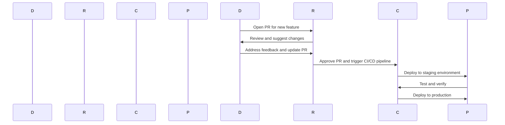

## Introduction to Code Review Practices with Git Pull Requests

Code review is an essential practice in modern software development, particularly within the context of DevOps. It ensures that the codebase remains robust, maintainable, and free from bugs. This chapter delves into the practice of code review using Git pull requests, explaining the concepts, benefits, and practical implementations in detail.

### What is Code Review?

Code review is the process of examining source code to identify potential issues, such as bugs, security vulnerabilities, and adherence to coding standards. The primary goal is to ensure that the code is of high quality and can be safely integrated into the main codebase.

#### Why is Code Review Important?

1. **Quality Assurance**: Code review helps catch bugs and logical errors that might otherwise go unnoticed.
2. **Security**: It identifies potential security vulnerabilities, reducing the risk of exploits.
3. **Knowledge Sharing**: Developers learn from each other’s expertise, improving overall team skills.
4. **Consistency**: Ensures that the code adheres to established coding standards and practices.
5. **Documentation**: Reviews often lead to better documentation, making the code easier to understand and maintain.

### Protecting the Master Branch

The master branch (or main branch in some repositories) is the primary branch where the stable, production-ready code resides. Protecting this branch is crucial because it represents the current state of the application that can be deployed to production at any time.

#### Why Protect the Master Branch?

1. **Stability**: Ensures that the master branch always contains a stable version of the code.
2. **Reliability**: Reduces the risk of deploying broken or incomplete features to production.
3. **Testing**: Allows thorough testing of the code before it is merged into the master branch.

### Common Use Cases for Code Review

Code review is especially important in several scenarios:

1. **Feature Implementation**: When a feature requires significant code changes, a review ensures that the changes are correct and do not introduce new issues.
2. **Junior Developer Contributions**: Senior developers can review and mentor junior developers, ensuring their contributions meet the required standards.
3. **Cross-Domain Changes**: When a backend developer makes changes to frontend code (or vice versa), a review ensures that the changes are correctly implemented and do not break existing functionality.

### The Role of Pull Requests

Pull requests (PRs) are a fundamental mechanism in Git for initiating code reviews. A pull request is essentially a request to merge changes from one branch into another, typically from a feature branch into the master branch.

#### How Pull Requests Work

1. **Branch Creation**: A developer creates a new branch for implementing a feature or fixing a bug.
2. **Committing Changes**: The developer commits the necessary changes to the new branch.
3. **Creating a PR**: The developer opens a pull request to propose merging the changes into the master branch.
4. **Review Process**: Other developers review the changes, provide feedback, and suggest improvements.
5. **Merging**: Once the changes are approved, they are merged into the master branch.

### Example of a Pull Request Workflow

Let's walk through a typical pull request workflow using a real-world example.

#### Step-by-Step Workflow

1. **Create a Feature Branch**:
    ```bash
    git checkout -b feature/new-feature
    ```

2. **Make Changes and Commit**:
    ```bash
    # Make changes to the code
    git add .
    git commit -m "Implement new feature"
    ```

3. **Push the Branch to Remote Repository**:
    ```bash
    git push origin feature/new-feature
    ```

4. **Open a Pull Request**:
    - Navigate to the repository on GitHub.
    - Click on "New pull request".
    - Select the base branch (usually `master` or `main`) and the compare branch (`feature/new-feature`).

5. **Review the Changes**:
    - Other developers review the changes, leave comments, and suggest improvements.

6. **Merge the Pull Request**:
    - Once the changes are reviewed and approved, the pull request can be merged into the master branch.

### Real-World Examples and Case Studies

#### Recent CVEs and Breaches Involving Code Review Failures

One notable example is the Log4j vulnerability (CVE-2021-44228), which was caused by a flaw in the logging library. This vulnerability could have been caught during a thorough code review process.



### Common Pitfalls in Code Review

Despite its benefits, code review can sometimes fall short due to various pitfalls:

1. **Inadequate Feedback**: Vague or insufficient feedback can lead to missed issues.
2. **Overlooking Edge Cases**: Failing to consider all possible scenarios can result in bugs.
3. **Lack of Consistency**: Inconsistent review processes can lead to varying levels of quality.
4. **Time Constraints**: Rushed reviews can miss critical issues.

### How to Prevent and Defend Against Code Review Issues

#### Detection

1. **Automated Tools**: Use static code analysis tools like SonarQube, ESLint, or PyLint to automatically detect common issues.
2. **Code Coverage**: Ensure that the code has sufficient test coverage to catch potential issues.

#### Prevention

1. **Standardized Review Processes**: Establish clear guidelines and checklists for code reviews.
2. **Training and Mentoring**: Provide training sessions and mentoring programs to improve review skills.
3. **Regular Audits**: Conduct regular audits to ensure that the codebase remains clean and secure.

#### Secure Coding Fixes

Here is an example of a vulnerable code snippet and its secure counterpart:

**Vulnerable Code:**
```python
def login(username, password):
    if username == "admin" and password == "password":
        return True
    else:
        return False
```

**Secure Code:**
```python
import hashlib

def hash_password(password):
    return hashlib.sha256(password.encode()).hexdigest()

def login(username, password):
    stored_password = "hashed_password_value"
    if username == "admin" and hash_password(password) == stored_password:
        return True
    else:
        return False
```

### Complete Example of a Pull Request

#### Full HTTP Request and Response

**HTTP Request:**
```http
POST /pull_requests HTTP/1.1
Host: github.com
Content-Type: application/json
Authorization: Bearer <access_token>

{
  "title": "Add new feature",
  "body": "This PR adds a new feature to the application.",
  "head": "feature/new-feature",
  "base": "master"
}
```

**HTTP Response:**
```http
HTTP/1.1 201 Created
Content-Type: application/json

{
  "id": 12345,
  "title": "Add new feature",
  "body": "This PR adds a new feature to the application.",
  "head": {
    "ref": "feature/new-feature",
    "sha": "abc123"
  },
  "base": {
    "ref": "master",
    "sha": "def456"
  }
}
```

### Hands-On Labs

For hands-on practice with code review using Git pull requests, consider the following labs:

- **PortSwigger Web Security Academy**: Offers exercises on secure coding practices.
- **OWASP Juice Shop**: Provides a vulnerable web application for practicing code reviews.
- **DVWA (Damn Vulnerable Web Application)**: Useful for learning about web application security.

These labs provide real-world scenarios and challenges that help reinforce the concepts learned in this chapter.

### Conclusion

Code review using Git pull requests is a critical practice in modern software development. By ensuring that the code is thoroughly reviewed and validated before being merged into the master branch, teams can maintain a high level of code quality and security. Through consistent and thorough code reviews, developers can learn from each other, share knowledge, and improve the overall quality of the codebase.

---
<!-- nav -->
[[DevOps/DevOps Bootcamp/02-Version Control (Git)/05-Code Review Practices With Git Pull Requests/00-Overview|Overview]] | [[02-Changes|Changes]]
