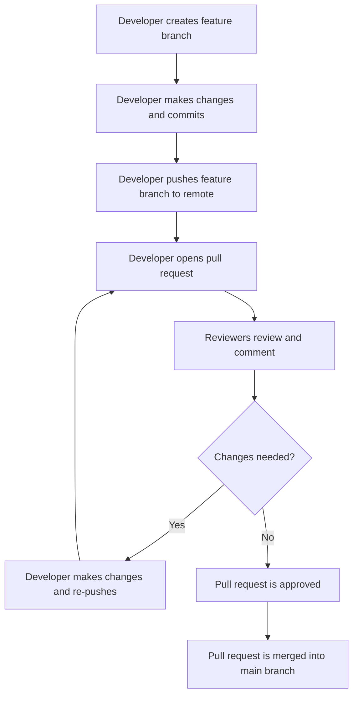

## Reviewers

@reviewer1 @reviewer2
```

### Revisions and Re-submissions

If the reviewers find issues or suggest improvements, the developer can make the necessary changes and re-submit the pull request. This iterative process continues until the pull request is approved and merged.

### Merging the Pull Request

Once the pull request is approved, it can be merged into the main branch:

```bash
# Merge the pull request
git checkout main
git pull origin main
git merge feature/new-feature
git push origin main
```

### Real-World Examples

#### Recent CVEs and Breaches

One notable example is the Log4j vulnerability (CVE-2021-44228), which affected many applications due to insecure logging practices. A thorough code review process could have helped identify and mitigate such vulnerabilities earlier.

#### Secure Coding Practices

Secure coding practices involve writing code that is free from security vulnerabilities. For example, ensuring proper input validation and sanitization can prevent SQL injection attacks. Here’s an example of insecure versus secure code:

**Insecure Code:**

```sql
SELECT * FROM users WHERE username = '$username';
```

**Secure Code:**

```sql
PreparedStatement stmt = connection.prepareStatement("SELECT * FROM users WHERE username = ?");
stmt.setString(1, username);
ResultSet rs = stmt.executeQuery();
```

### Common Pitfalls

1. **Ignoring Feedback**: Disregarding reviewer feedback can lead to suboptimal code quality.
2. **Overloading PRs**: Submitting large pull requests with unrelated changes can make reviews difficult.
3. **Neglecting Documentation**: Failing to update documentation alongside code changes can cause confusion.

### How to Prevent / Defend

#### Detection

Use static code analysis tools like SonarQube, ESLint, or PyLint to automatically detect potential issues in the codebase.

#### Prevention

Implement a robust code review process with clear guidelines and checklists. Ensure that all team members are trained in secure coding practices.

#### Secure-Coding Fixes

Show both the vulnerable and secure versions of code side by side, as demonstrated above.

#### Configuration Hardening

Ensure that your development environment is configured securely. For example, disable unnecessary services and apply the principle of least privilege.

### Complete Example

Here’s a complete example of a pull request process, including the full HTTP request and response:

#### HTTP Request

```http
POST /repos/username/repository/pulls HTTP/1.1
Host: api.github.com
Authorization: token YOUR_ACCESS_TOKEN
Content-Type: application/json

{
  "title": "Add New Feature",
  "head": "feature/new-feature",
  "base": "main"
}
```

#### HTTP Response

```http
HTTP/1.1 201 Created
Content-Type: application/json

{
  "html_url": "https://github.com/username/repository/pull/1",
  "title": "Add New Feature",
  "state": "open",
  "head": {
    "ref": "feature/new-feature",
    "sha": "abc123def456"
  },
  "base": {
    "ref": "main",
    "sha": "ghi789jkl012"
  }
}
```

### Mermaid Diagrams

#### Pull Request Workflow



### Practice Labs

For hands-on experience with code review practices, consider the following labs:

- **PortSwigger Web Security Academy**: Offers interactive labs to practice secure coding and code review techniques.
- **OWASP Juice Shop**: A deliberately insecure web application for practicing security testing and code review.

By following these practices and using the provided resources, you can significantly improve the quality and security of your codebase.

---
<!-- nav -->
[[03-Description|Description]] | [[DevOps/DevOps Bootcamp/02-Version Control (Git)/05-Code Review Practices With Git Pull Requests/00-Overview|Overview]] | [[05-Screenshots|Screenshots]]
