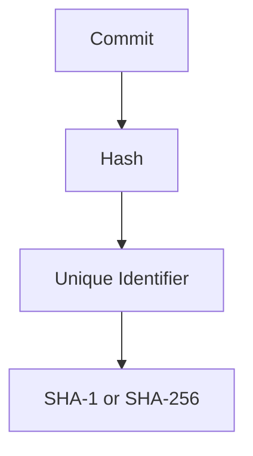
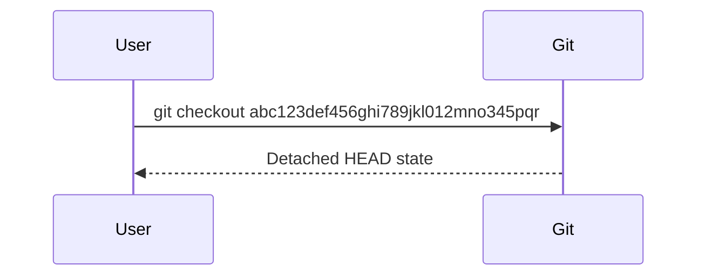
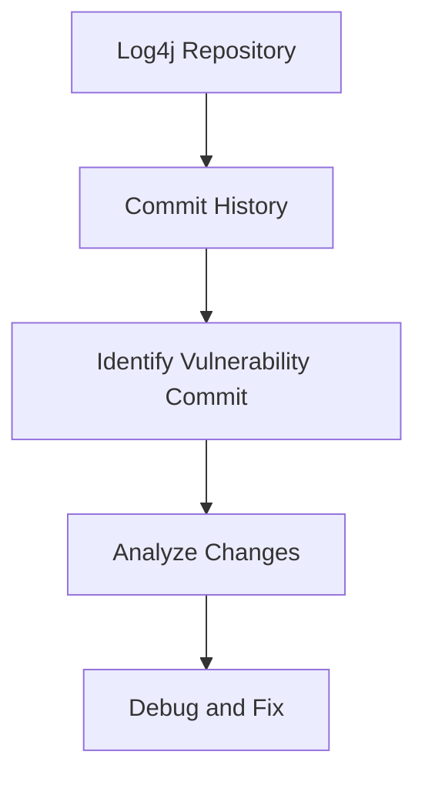

## Understanding Git Commit History for Bug Debugging

### Introduction to Git Commit History

In the world of software development, version control systems like Git play a crucial role in managing changes to codebases. One of the key features of Git is its ability to maintain a detailed history of all changes made to the codebase through a series of commits. Each commit represents a snapshot of the code at a particular point in time and includes a unique identifier called a commit hash. This commit hash is a cryptographic hash that uniquely identifies the commit, ensuring that no two commits can have the same hash.

#### What is a Commit Hash?

A commit hash is a string of characters that uniquely identifies a commit in a Git repository. It is generated using a cryptographic hash function, typically SHA-1 or SHA-256. The hash is computed based on the contents of the commit, including the author, committer, commit message, and the tree object that represents the state of the codebase at that point in time.



#### Why is the Commit Hash Important?

The commit hash is essential for several reasons:

1. **Uniqueness**: Each commit hash is unique, ensuring that no two commits can have the same hash. This property is crucial for maintaining the integrity of the commit history.
   
2. **Tracking Changes**: By referencing the commit hash, developers can easily track changes made to the codebase. This is particularly useful when debugging issues or understanding the evolution of the code.

3. **Branching and Merging**: Commit hashes are used extensively in branching and merging operations. They help in identifying the exact state of the codebase at different points in time, making it easier to manage branches and merge changes.

### Using Git Commit History for Bug Debugging

One of the primary uses of Git commit history is for debugging purposes. When a bug is discovered in the code, it is often necessary to understand when and how the bug was introduced. This is where the commit history comes into play.

#### Identifying the Bug

Let's consider a scenario where a tester notices that a bug appeared after a certain commit. To debug this issue, the following steps can be taken:

1. **Identify the Commit**: The first step is to identify the commit where the bug was introduced. This can be done by examining the commit history and looking for changes that might have caused the bug.

2. **Reproduce the Issue**: Once the suspect commit is identified, the next step is to reproduce the issue. This can be done by checking out the commit using its hash.

3. **Analyze the Code**: After checking out the commit, the developer can analyze the code to understand how the bug was introduced. This might involve reviewing the commit message, examining the changed files, and running tests.

#### Checking Out a Commit

To check out a specific commit, the `git checkout` command is used along with the commit hash. Here is an example:

```bash
# Copy the commit hash
commit_hash="abc123def456ghi789jkl012mno345pqr"

# Check out the commit
git checkout $commit_hash
```

When you check out a commit, Git puts you in a "detached HEAD" state. This means that you are no longer on a named branch, but rather on a specific commit. This state allows you to examine the code at that point in time without affecting the current branch.



### Handling Local Changes

If you have local changes in your working directory, Git will not allow you to check out another commit directly. In such cases, you need to either commit your changes or stash them temporarily.

#### Stashing Local Changes

Stashing is a feature in Git that allows you to save your local changes temporarily and apply them later. This is useful when you need to switch to a different commit or branch without losing your current work.

```bash
# Stash local changes
git stash

# Check out the commit
git checkout $commit_hash
```

After stashing your changes, you can check out the desired commit. Once you are done with your debugging, you can reapply your stashed changes.

```bash
# Reapply stashed changes
git stash pop
```

### Real-World Example: CVE-2021-21287

A real-world example of using Git commit history for debugging is the CVE-2021-21287 vulnerability in the Log4j library. This vulnerability allowed attackers to execute arbitrary code by injecting malicious input into log messages.

To understand how this vulnerability was introduced, developers examined the commit history of the Log4j repository. They identified the commit where the vulnerability was introduced and analyzed the changes made in that commit.



### How to Prevent / Defend Against Bugs

While Git commit history is a powerful tool for debugging, it is also important to take preventive measures to avoid introducing bugs in the first place. Here are some best practices:

#### Secure Coding Practices

1. **Code Reviews**: Regular code reviews help catch potential bugs before they are merged into the main branch. This ensures that the codebase remains clean and free of errors.

2. **Unit Testing**: Writing unit tests for your code helps ensure that individual components work as expected. Automated testing frameworks like JUnit for Java or PyTest for Python can be used to run these tests.

3. **Static Analysis Tools**: Static analysis tools like SonarQube or ESLint can automatically detect potential bugs and security vulnerabilities in the code. These tools can be integrated into the continuous integration pipeline to provide real-time feedback.

#### Configuration Hardening

1. **Secure Configurations**: Ensure that all configurations are set securely. For example, in a web application, sensitive data should be encrypted, and default credentials should be changed.

2. **Least Privilege Principle**: Follow the principle of least privilege by granting users and processes only the permissions they need to perform their tasks. This reduces the attack surface and limits the damage that can be caused by a compromised system.

#### Detection and Mitigation

1. **Monitoring and Logging**: Implement monitoring and logging mechanisms to detect unusual activity in the system. This can help in identifying and responding to potential security incidents quickly.

2. **Incident Response Plan**: Have a well-defined incident response plan in place to handle security incidents effectively. This should include steps for containment, eradication, recovery, and post-incident analysis.

### Complete Example: Debugging a Bug

Let's walk through a complete example of debugging a bug using Git commit history.

#### Scenario

Suppose you are working on a web application and a tester reports that a bug appeared after a certain commit. The tester provides the commit hash `abc123def456ghi789jkl012mno345pqr`.

#### Steps to Debug

1. **Check Out the Commit**:
   
   First, you need to check out the commit using its hash. Make sure to stash any local changes before proceeding.

   ```bash
   # Stash local changes
   git stash

   # Check out the commit
   git checkout abc123def456ghi789jkl012mno345pqr
   ```

2. **Examine the Code**:
   
   Once you are in the detached HEAD state, you can examine the code to understand how the bug was introduced. Review the commit message and the changed files.

   ```bash
   # View the commit message
   git show abc123def456ghi789jkl012mno345pqr

   # View the changed files
   git diff abc123def456ghi7789jkl012mno345pqr^ abc123def456ghi789jkl012mno345pqr
   ```

3. **Run Tests**:
   
   Run the tests to reproduce the issue. This will help you understand the behavior of the code at that point in time.

   ```bash
   # Run tests
   ./run_tests.sh
   ```

4. **Fix the Bug**:
   
   After identifying the root cause of the bug, make the necessary changes to fix it. Commit the changes and push them to the remote repository.

   ```bash
   # Make changes
   vi src/main.py

   # Commit the changes
   git commit -am "Fix bug introduced in abc123def456ghi789jkl012mno345pqr"

   # Push the changes
   git push origin main
   ```

5. **Reapply Stashed Changes**:
   
   Finally, reapply the stashed changes and continue with your work.

   ```bash
   # Reapply stashed changes
   git stash pop
   ```

### Hands-On Labs

For hands-on practice with Git commit history and bug debugging, consider the following resources:

- **PortSwigger Web Security Academy**: Offers interactive labs on web application security, including Git usage.
- **OWASP Juice Shop**: A deliberately insecure web application for practicing security testing and bug hunting.
- **DVWA (Damn Vulnerable Web Application)**: Another popular web application for learning web security concepts.

These labs provide practical experience in using Git for debugging and maintaining code quality.

### Conclusion

Understanding and utilizing Git commit history is a critical skill for developers. By leveraging the commit history, developers can efficiently debug issues, understand the evolution of the codebase, and maintain high-quality code. Following best practices for secure coding, configuration hardening, and incident response can further enhance the security and reliability of the codebase.

By mastering these concepts and techniques, you can become a more effective and efficient developer, capable of handling complex challenges in the ever-evolving landscape of software development.

---
<!-- nav -->
[[DevOps/DevOps Bootcamp/02-Version Control (Git)/06-Exploring Git Commit History For Bug Debugging/00-Overview|Overview]] | [[DevOps/DevOps Bootcamp/02-Version Control (Git)/06-Exploring Git Commit History For Bug Debugging/02-Practice Questions & Answers|Practice Questions & Answers]]
