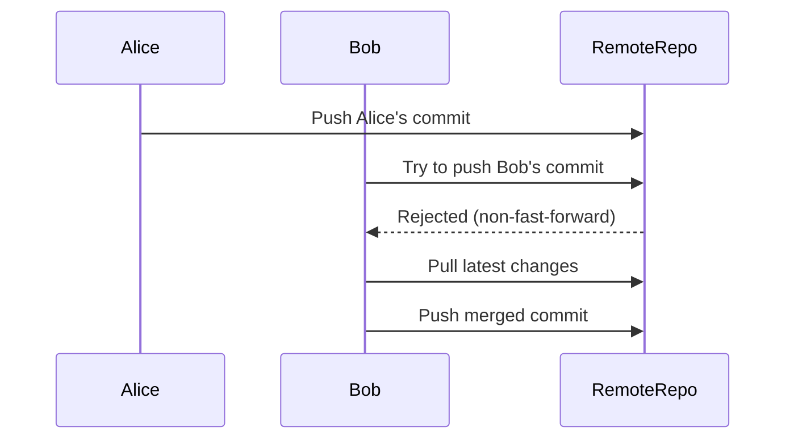

## Introduction to Git Branch Collaboration Conflicts

In the world of software development, collaboration among multiple developers is a common practice. Git, being one of the most widely used version control systems, provides robust mechanisms for managing such collaborations. However, when multiple developers work on the same branch simultaneously, conflicts can arise. This chapter will delve into the intricacies of Git branch collaboration conflicts, explaining the concepts, providing real-world examples, and offering preventive measures.

### Background Theory

Git is a distributed version control system designed to handle everything from small to very large projects with speed and efficiency. At its core, Git tracks changes in files and directories, allowing developers to collaborate effectively. A key feature of Git is branching, which allows developers to work on different features or bug fixes without interfering with each other.

#### What is a Branch?

A branch in Git is essentially a pointer to a specific commit. Each branch represents a line of development. When multiple developers work on the same branch, they can make changes independently, but these changes must eventually be integrated.

#### Why Branches Matter

Branches are crucial for several reasons:
1. **Isolation**: Developers can work on new features or bug fixes without affecting the main codebase.
2. **Parallel Development**: Multiple developers can work on different branches simultaneously.
3. **Merging**: Changes made in branches can be merged back into the main branch (usually `main` or `master`).

### Real-World Example: Recent Breaches and CVEs

One notable example of a breach involving Git collaboration issues is the SolarWinds supply chain attack in 2020. Although this attack did not directly involve Git branch conflicts, it highlights the importance of secure collaboration practices. In this case, attackers compromised the build environment, injecting malicious code into legitimate software updates. This underscores the need for robust collaboration and conflict resolution strategies.

### Detailed Explanation of the Scenario

Let's consider a scenario where two developers, Alice and Bob, are working on the same branch named `Buckfix`.

#### Step-by-Step Mechanics

1. **Initial Setup**:
    - Both Alice and Bob start with the same commit history on the `Buckfix` branch.
    - They both clone the repository to their local machines.

2. **Alice Makes Changes**:
    - Alice modifies the `README.md` file.
    - She stages and commits her changes locally.
    - She then pushes her changes to the remote repository.

3. **Bob Makes Changes**:
    - Meanwhile, Bob modifies the `app/server.js` file.
    - He stages and commits his changes locally.

4. **Conflict Arises**:
    - When Bob tries to push his changes, he encounters an error because Alice has already pushed her changes to the remote repository.

#### Code Examples

Here is a detailed breakdown of the commands and outputs:

```bash
# Alice's workflow
git checkout Buckfix
echo "Alice's changes" >> README.md
git add README.md
git commit -m "Alice's commit"
git push origin Buckfix

# Bob's workflow
git checkout Buckfix
echo "Bob's changes" >> app/server.js
git add app/server.js
git commit -m "Bob's commit"
git push origin Buckfix
```

When Bob tries to push his changes, he gets the following error:

```bash
To <remote-repo-url>
 ! [rejected]        Buckfix -> Buckfix (non-fast-forward)
error: failed to push some refs to '<remote-repo-url>'
hint: Updates were rejected because the tip of your current branch is behind
hint: its remote counterpart. Integrate the remote changes (e.g.
hint: 'git pull ...') before pushing again.
```

### Resolving the Conflict

To resolve the conflict, Bob needs to pull the latest changes from the remote repository and merge them into his local branch.

#### Pull and Merge

```bash
# Bob's workflow continued
git pull origin Buckfix
```

This command performs the following steps:
1. Fetches the latest changes from the remote repository.
2. Merges those changes into Bob's local branch.

If there are no conflicts, Bob can then push his changes:

```bash
git push origin Buckfix
```

### Mermaid Diagrams

Let's visualize the process using a mermaid diagram:



### Common Pitfalls and How to Avoid Them

#### Pitfall 1: Not Pulling Before Pushing

Developers often forget to pull the latest changes before pushing their own changes. This leads to non-fast-forward errors and potential conflicts.

**Prevention**:
- Always pull the latest changes before pushing.
- Use `git pull --rebase` to rebase your changes on top of the latest remote changes.

#### Pitfall 2: Ignoring Merge Conflicts

Sometimes, merge conflicts occur during the pull process. Ignoring these conflicts can lead to incorrect code integration.

**Prevention**:
- Resolve merge conflicts manually by editing the conflicting files.
- Use tools like `git mergetool` to help resolve conflicts.

### Secure Coding Practices

#### Vulnerable Code Example

Consider a scenario where Alice and Bob are working on a web application. Alice adds a new feature, while Bob fixes a security vulnerability. If they do not properly integrate their changes, the security fix might be lost.

```bash
# Alice's commit
echo "New feature added" >> app/newFeature.js
git add app/newFeature.js
git commit -m "Add new feature"

# Bob's commit
echo "Security fix applied" >> app/securityFix.js
git add app/securityFix.js
git commit -m "Apply security fix"
```

#### Secure Code Example

To ensure both changes are integrated correctly, they should follow proper merging practices:

```bash
# Alice's workflow
git checkout Buckfix
echo "New feature added" >> app/newFeature.js
git add app/newFeature.js
git commit -m "Add new feature"
git push origin Buckfix

# Bob's workflow
git checkout Buckfix
echo "Security fix applied" >> app/securityFix.js
git add app/securityFix.js
git commit -m "Apply security fix"
git pull origin Buckfix
git push origin Buckfix
```

### Detection and Prevention

#### Detection

Use tools like `git status` and `git diff` to check for unmerged changes and conflicts.

```bash
git status
git diff
```

#### Prevention

1. **Regular Pulls**: Encourage developers to pull the latest changes frequently.
2. **Code Reviews**: Implement code reviews to catch potential conflicts early.
3. **Automated Testing**: Use continuous integration (CI) to automatically test changes before merging.

### Hands-On Labs

For practical experience, consider the following labs:
- **PortSwigger Web Security Academy**: Focuses on web application security and includes scenarios involving Git collaboration.
- **OWASP Juice Shop**: A deliberately insecure web application for practicing security skills, including Git workflows.

### Conclusion

Collaboration in Git is essential for modern software development. Understanding how to manage branch conflicts ensures smooth and secure development processes. By following best practices and using the right tools, developers can avoid common pitfalls and maintain a robust codebase.

---
<!-- nav -->
[[DevOps/DevOps Bootcamp/02-Version Control (Git)/07-Git Branch Collaboration Conflicts/00-Overview|Overview]] | [[02-Introduction to Git Branch Collaboration and Conflicts|Introduction to Git Branch Collaboration and Conflicts]]
