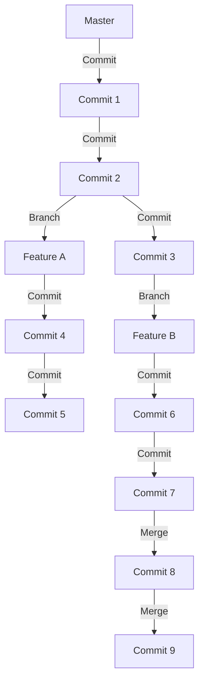
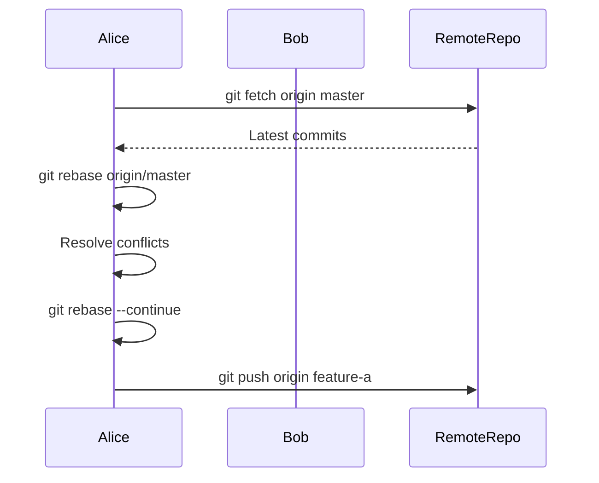

## Introduction to Git Branch Collaboration and Conflicts

In the realm of software development, collaboration among multiple developers is a common scenario. Git, being the most widely used version control system, provides robust mechanisms to manage such collaborations. One of the key aspects of Git is the ability to work with branches, which allows developers to work on different features or bug fixes simultaneously without interfering with each other's work. However, this collaborative environment often leads to conflicts when multiple developers make changes to the same parts of the codebase.

### What Are Git Branches?

A branch in Git is essentially a pointer to a specific commit in the repository. Each branch represents a line of development, allowing developers to work on different features or bug fixes independently. Once the work on a branch is completed, it can be merged back into the main branch (often called `master` or `main`).

#### Why Use Branches?

Branches provide several benefits:

1. **Isolation**: Developers can work on new features or bug fixes without affecting the main codebase.
2. **Parallel Development**: Multiple developers can work on different features simultaneously.
3. **Experimentation**: Developers can experiment with new ideas without worrying about breaking the main codebase.

### Common Scenarios Leading to Conflicts

When multiple developers work on the same codebase, conflicts can arise due to overlapping changes. This typically happens when two developers modify the same lines of code in different branches, and then attempt to merge their changes.

#### Example Scenario

Consider a scenario where two developers, Alice and Bob, are working on a project. Alice creates a branch called `feature-a` and makes changes to a file named `server.js`. Meanwhile, Bob creates a branch called `feature-b` and also modifies `server.js`. After both finish their work, they attempt to merge their branches into the `master` branch. If their changes overlap, Git will identify a conflict and require manual resolution.

### Best Practices for Managing Branches

To effectively manage branches and minimize conflicts, several best practices should be followed:

1. **Frequent Pulls**: Regularly pull changes from the main branch to keep your local branch up-to-date.
2. **Small, Frequent Commits**: Make small, frequent commits to ensure that changes are easily manageable and reviewable.
3. **Code Reviews**: Conduct regular code reviews to catch potential conflicts early.
4. **Use Feature Branches**: Work on feature branches and merge them back into the main branch once they are complete.

### Git Pull vs. Git Pull --rebase

One of the key strategies to avoid unnecessary merge commits is to use `git pull --rebase` instead of `git pull`.

#### What Is `git pull --rebase`?

`git pull --rebase` combines the functionality of `git fetch` and `git rebase` into a single command. Here’s how it works:

1. **Fetch Changes**: It fetches the latest changes from the remote repository.
2. **Rebase Local Changes**: It rebases your local commits on top of the fetched changes.

By doing this, `git pull --rebase` avoids creating a merge commit, resulting in a cleaner commit history.

#### How Does `git pull --rerebase` Work?

Let’s break down the process step-by-step:

1. **Fetch Remote Changes**:
    ```sh
    git fetch origin
    ```

2. **Rebase Local Commits**:
    ```sh
    git rebase origin/master
    ```

This sequence of commands ensures that your local commits are applied on top of the latest remote changes, avoiding a merge commit.

### Example Workflow Using `git pull --rebase`

Let’s walk through an example workflow to illustrate the use of `git pull --rebase`.

#### Initial Setup

Assume we have a repository with a `master` branch and a `feature-a` branch.

```sh
# Clone the repository
git clone https://github.com/user/repo.git

# Navigate to the repository directory
cd repo

# Create a feature branch
git checkout -b feature-a
```

#### Making Changes

Alice makes changes to `server.js` in her `feature-a` branch.

```sh
# Modify server.js
echo "console.log('Feature A');" >> server.js

# Commit the changes
git add server.js
git commit -m "Add feature A"
```

#### Simulating Remote Changes

Simulate changes made by another developer (Bob) in the `master` branch.

```sh
# Switch to master branch
git checkout master

# Make changes to server.js
echo "console.log('Remote Change');" >> server.js

# Commit the changes
git add server.js
git commit -m "Add remote change"

# Push the changes to the remote repository
git push origin master
```

#### Rebasing Local Changes

Now, Alice wants to push her changes to the remote repository but needs to incorporate the remote changes first.

```sh
# Switch back to feature-a branch
git checkout feature-a

# Pull and rebase the remote changes
git pull --rebase origin master
```

This command will fetch the latest changes from the remote `master` branch and rebase Alice’s local commits on top of these changes.

### Handling Conflicts During Rebase

During the rebase process, conflicts may arise if the remote changes overlap with Alice’s local changes. Git will pause the rebase process and allow Alice to resolve the conflicts manually.

#### Resolving Conflicts

1. **Identify Conflicts**: Git will mark the conflicting files.
2. **Edit Files**: Open the conflicting files and resolve the conflicts.
3. **Mark as Resolved**: Add the resolved files to the staging area.
    ```sh
    git add <conflicting-file>
    ```
4. **Continue Rebase**: Continue the rebase process.
    ```sh
    git rebase --continue
    ```

### Full Example with Code

Let’s go through a complete example with code to illustrate the entire process.

#### Initial Repository State

```sh
# Clone the repository
git clone https://github.com/user/repo.git

# Navigate to the repository directory
cd repo

# Check out the master branch
git checkout master
```

#### Creating a Feature Branch

```sh
# Create a feature branch
git checkout -b feature-a
```

#### Making Changes in Feature Branch

```sh
# Modify server.js
echo "console.log('Feature A');" >> server.js

# Commit the changes
git add server.js
git commit -m "Add feature A"
```

#### Simulating Remote Changes

```sh
# Switch to master branch
git checkout master

# Make changes to server.js
echo "console.log('Remote Change');" >> server.js

# Commit the changes
git add server.js
git commit -m "Add remote change"

# Push the changes to the remote repository
git push origin master
```

#### Rebasing Local Changes

```sh
# Switch back to feature-a branch
git checkout feature-a

# Pull and rebase the remote changes
git pull --rebase origin master
```

#### Handling Conflicts

If conflicts arise during the rebase process, Git will pause and allow you to resolve them.

```sh
# Edit the conflicting file
nano server.js

# Mark the file as resolved
git add server.js

# Continue the rebase process
git rebase --continue
```

### Full HTTP Request and Response Example

Here’s a full example of the HTTP requests and responses involved in the process:

#### Fetching Changes

```http
GET /repos/user/repo/git/refs/heads/master HTTP/1.1
Host: api.github.com
Authorization: Bearer <token>

HTTP/1.1 200 OK
Content-Type: application/json

{
  "ref": "refs/heads/master",
  "url": "https://api.github.com/repos/user/repo/git/refs/heads/master",
  "object": {
    "sha": "abc123def456ghi789jkl012mno345pqr678stu901vwxy234z567",
    "type": "commit",
    "url": "https://api.github.com/repos/user/repo/git/commits/abc123def456ghi789jkl012mno345pqr678stu901vwxy234z567"
  }
}
```

#### Rebasing Local Changes

```http
POST /repos/user/repo/git/commits HTTP/1.1
Host: api.github.com
Authorization: Bearer <token>
Content-Type: application/json

{
  "message": "Rebased onto remote changes",
  "parents": [
    "abc123def456ghi789jkl012mno345pqr678stu901vwxy234z567",
    "def456ghi789jkl012mno345pqr678stu901vwxy234z567abc123"
  ],
  "tree": "ghi789jkl012mno345pqr678stu901vwxy234z567abc123def456"
}

HTTP/1.1 201 Created
Content-Type: application/json

{
  "sha": "ghi789jkl012mno345pqr678stu901vwxy234z567abc123def456",
  "node_id": "MDM6Q29tbWl0ZTc4OTg=",
  "commit": {
    "author": {
      "name": "Alice",
      "email": "alice@example.com",
      "date": "2023-10-01T12:00:00Z"
    },
    "committer": {
      "name": "Alice",
      "email": "alice@example.com",
      "date": "2023-10-01T12:00:00Z"
    },
    "message": "Rebased onto remote changes",
    "tree": {
      "sha": "ghi789jkl012mno345pqr678stu901vwxy234z567abc123def456",
      "url": "https://api.github.com/repos/user/repo/git/trees/ghi789jkl012mno345pqr678stu901vwxy234z567abc123def456"
    },
    "parents": [
      {
        "sha": "abc123def456ghi789jkl012mno345pqr678stu901vwxy234z567",
        "url": "https://api.github.com/repos/user/repo/git/commits/abc123def456ghi789jkl012mno345pqr678stu901vwxy234z567"
      },
      {
        "sha": "def456ghi789jkl012mno345pqr678stu901vwxy234z567abc123",
        "url": "https://api.github.com/repos/user/repo/git/commits/def456ghi789jkl012mno345pqr678stu901vwxy234z567abc123"
      }
    ]
  },
  "url": "https://api.github.com/repos/user/repo/git/commits/ghi789jkl012mno345pqr678stu901vwxy234z567abc123def456"
}
```

### Mermaid Diagrams

#### Git Branching and Merging



#### Git Pull --rebase Process



### Real-World Examples and CVEs

#### Recent Breaches and CVEs

While Git itself is not typically the target of security vulnerabilities, improper use of Git can lead to security issues. For example, a recent breach at a major software company involved unauthorized access to their Git repositories, leading to the exposure of sensitive code and credentials.

#### Secure Coding Practices

To prevent such issues, follow these secure coding practices:

1. **Use Strong Authentication**: Always use strong authentication methods like SSH keys or OAuth tokens.
2. **Limit Access**: Restrict access to sensitive repositories and branches.
3. **Regular Audits**: Conduct regular audits of repository permissions and access logs.

### How to Prevent / Defend

#### Detection

1. **Audit Logs**: Regularly review audit logs to detect unauthorized access or suspicious activities.
2. **Monitoring Tools**: Use monitoring tools like GitGuardian or GitCop to detect and alert on potential security issues.

#### Prevention

1. **Strong Authentication**: Use strong authentication methods like SSH keys or OAuth tokens.
2. **Access Control**: Implement strict access control policies to limit who can access sensitive repositories and branches.
3. **Secure Coding Practices**: Follow secure coding practices to prevent accidental exposure of sensitive information.

#### Secure-Coding Fixes

##### Vulnerable Code

```sh
# Vulnerable code
git pull origin master
```

##### Fixed Code

```sh
# Fixed code
git pull --rebase origin master
```

### Conclusion

Effective management of Git branches is crucial for successful collaboration among developers. By following best practices and using tools like `git pull --rebase`, developers can maintain a clean and conflict-free commit history. Additionally, implementing secure coding practices and regular audits can help prevent security issues related to Git usage.

### Practice Labs

For hands-on experience with Git branching and conflict resolution, consider the following labs:

- **PortSwigger Web Security Academy**: Offers a comprehensive course on web security, including Git usage.
- **OWASP Juice Shop**: Provides a vulnerable web application for practicing various security techniques, including Git usage.
- **DVWA (Damn Vulnerable Web Application)**: Another popular lab for practicing web security techniques.

These labs provide practical scenarios to reinforce the concepts learned in this chapter.

---
<!-- nav -->
[[01-Introduction to Git Branch Collaboration Conflicts|Introduction to Git Branch Collaboration Conflicts]] | [[DevOps/DevOps Bootcamp/02-Version Control (Git)/07-Git Branch Collaboration Conflicts/00-Overview|Overview]] | [[03-Understanding Git Branch Collaboration and Conflicts|Understanding Git Branch Collaboration and Conflicts]]
