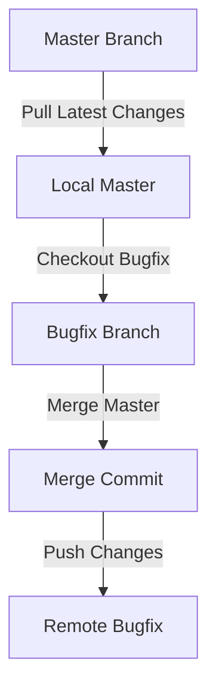

## Introduction to Git Merge Strategies for Branch Synchronization

In the world of software development, version control systems like Git play a crucial role in managing codebases and facilitating collaboration among developers. One of the key operations in Git is merging, which allows developers to integrate changes from one branch into another. This chapter delves deep into the concept of Git merge strategies, focusing specifically on synchronizing branches, particularly when dealing with a scenario where a feature or bug-fix branch is significantly behind the main branch (often referred to as `master`).

### What is Git Merge?

Git merge is a command used to combine the history of two branches. When you perform a merge, Git creates a new commit that represents the combined state of both branches. This process helps ensure that all changes made in one branch are reflected in another, maintaining consistency across the codebase.

#### Why Use Git Merge?

The primary reason for using Git merge is to keep branches synchronized. In a typical development workflow, multiple developers might work on different features or bug fixes simultaneously. Each developer might have their own branch, and changes from these branches need to be integrated into the main branch (`master`) at some point. By merging changes from the main branch into a feature or bug-fix branch, developers can ensure that their work is based on the latest codebase, reducing the likelihood of conflicts and ensuring that their changes are compatible with the rest of the project.

### Scenario: Synchronizing a Bug-Fix Branch

Let's consider a scenario where you have a `bugfix` branch that has been open for several days. During this time, many changes have been merged into the `master` branch, and you are now significantly behind the latest changes. Additionally, changes from other branches (created by other developers) are required to properly test your bug fix. To ensure that your bug fix works correctly, you need to merge the latest changes from `master` into your `bugfix` branch.

### Steps to Perform a Git Merge

To synchronize your `bugfix` branch with the `master` branch, follow these steps:

1. **Ensure Your Local `master` Branch is Up-to-Date:**
   Before merging changes from `master` into your `bugfix` branch, it's essential to ensure that your local `master` branch reflects the latest changes from the remote repository. You can achieve this by performing a `git pull` operation on the `master` branch.

   ```bash
   git checkout master
   git pull origin master
   ```

   This command checks out the `master` branch and pulls the latest changes from the remote repository (`origin`). The `origin` is typically the default name for the remote repository.

2. **Switch to Your `bugfix` Branch:**
   Once your local `master` branch is up-to-date, switch to your `bugfix` branch where you want to merge the latest changes.

   ```bash
   git checkout bugfix
   ```

3. **Merge Changes from `master`:**
   Now, you can merge the latest changes from the `master` branch into your `bugfix` branch using the `git merge` command.

   ```bash
   git merge master
   ```

   This command merges the changes from the `master` branch into your current branch (`bugfix`). Git will create a new commit that represents the combined state of both branches.

4. **Verify the Merge:**
   After performing the merge, it's a good practice to verify that the merge was successful and that there are no conflicts. You can check the commit history using the `git log` command.

   ```bash
   git log
   ```

   This command displays the commit history, showing the new merge commit along with the previous commits.

5. **Push the Merged Changes:**
   Finally, push the merged changes to the remote repository to ensure that others can access the updated `bugfix` branch.

   ```bash
   git push origin bugfix
   ```

### Detailed Example

Let's walk through a detailed example to illustrate the process of merging changes from `master` into a `bugfix` branch.

#### Initial Setup

Assume you have a Git repository with the following branches:

- `master`
- `bugfix`

Your local repository is currently checked out to the `bugfix` branch.

```bash
$ git branch
* bugfix
  master
```

#### Step 1: Update Local `master` Branch

First, update your local `master` branch to ensure it reflects the latest changes from the remote repository.

```bash
$ git checkout master
$ git pull origin master
```

This command switches to the `master` branch and pulls the latest changes from the remote repository.

#### Step 2: Switch to `bugfix` Branch

Next, switch back to the `bugfix` branch where you want to merge the latest changes.

```bash
$ git checkout bugfix
```

#### Step 3: Merge Changes from `master`

Now, merge the latest changes from the `master` branch into your `bugfix` branch.

```bash
$ git merge master
```

Git will create a new merge commit that combines the changes from both branches.

#### Step 4: Verify the Merge

Check the commit history to verify that the merge was successful.

```bash
$ git log
```

You should see a new merge commit in the log output, indicating that the changes from `master` have been successfully merged into your `bugfix` branch.

#### Step 5: Push the Merged Changes

Finally, push the merged changes to the remote repository.

```bash

$ git push origin bugfix
```

### Mermaid Diagrams

To better visualize the process, let's use a mermaid diagram to illustrate the flow of merging changes from `master` into a `bugfix` branch.



### Common Pitfalls and How to Avoid Them

While merging changes is a straightforward process, there are several common pitfalls that can lead to issues. Understanding these pitfalls and how to avoid them is crucial for maintaining a healthy and conflict-free codebase.

#### Conflict Resolution

One of the most common issues during a merge is encountering conflicts. Conflicts occur when the same lines of code have been modified in both branches, and Git cannot automatically determine which changes to keep.

##### How to Resolve Conflicts

When a conflict occurs, Git will mark the conflicting files and pause the merge process. You need to manually resolve the conflicts by editing the files and choosing which changes to keep.

1. **Identify Conflicting Files:**
   Git will list the conflicting files when a conflict occurs.

   ```bash
   $ git status
   ```

2. **Edit Conflicting Files:**
   Open the conflicting files in an editor and resolve the conflicts by choosing the correct changes.

3. **Mark Conflicts as Resolved:**
   After resolving the conflicts, mark the files as resolved using the `git add` command.

   ```bash
   $ git add <conflicting-file>
   ```

4. **Complete the Merge:**
   Once all conflicts are resolved, complete the merge using the `git commit` command.

   ```bash
   $ git commit
   ```

#### Preventing Conflicts

To minimize the chances of conflicts, it's important to keep your branches up-to-date regularly. Instead of waiting until the end of a feature or bug fix to merge changes, consider merging changes from the main branch more frequently. This approach ensures that your branch remains in sync with the latest changes, reducing the likelihood of conflicts.

### Real-World Examples

#### Recent CVEs and Breaches

While Git merge itself is not directly related to security vulnerabilities, improper use of Git can lead to security issues. For example, if sensitive information (such as API keys or passwords) is accidentally committed to a public repository, it can be exposed to unauthorized users.

**Example:**

In 2021, a popular open-source project accidentally committed a file containing API keys to a public GitHub repository. This led to a security breach where unauthorized users were able to access the project's resources.

**Prevention:**

To prevent such issues, it's important to:

1. **Use `.gitignore` Files:** Ensure that sensitive files are ignored by Git using a `.gitignore` file.
2. **Regularly Review Commits:** Regularly review commits to ensure that no sensitive information is accidentally committed.
3. **Use Secure Coding Practices:** Follow secure coding practices to avoid committing sensitive information.

### How to Prevent / Defend

#### Detection

To detect potential issues related to Git merge, you can use tools like:

- **Git Hooks:** Implement pre-commit hooks to check for sensitive information before committing changes.
- **Static Code Analysis Tools:** Use static code analysis tools to scan for sensitive information in your codebase.

#### Prevention

To prevent issues related to Git merge, follow these best practices:

1. **Keep Branches Up-to-Date:** Regularly merge changes from the main branch to keep your feature or bug-fix branches in sync.
2. **Resolve Conflicts Promptly:** Address conflicts promptly to avoid delays and ensure that your codebase remains healthy.
3. **Use Secure Coding Practices:** Follow secure coding practices to avoid committing sensitive information.

#### Secure Coding Fixes

Here's an example of a vulnerable code snippet and its secure counterpart:

**Vulnerable Code:**

```python
# Vulnerable code snippet
import os

API_KEY = os.getenv('API_KEY')
print(API_KEY)
```

**Secure Code:**

```python
# Secure code snippet
import os

def get_api_key():
    api_key = os.getenv('API_KEY')
    if api_key:
        return api_key
    else:
        raise ValueError("API_KEY environment variable not set")

try:
    api_key = get_api_key()
    print(api_key)
except ValueError as e:
    print(e)
```

### Hands-On Practice

To gain practical experience with Git merge strategies, consider the following hands-on labs:

- **PortSwigger Web Security Academy:** Offers a variety of labs that cover Git usage and version control best practices.
- **OWASP Juice Shop:** Provides a hands-on lab environment where you can practice Git merge and other version control operations.
- **DVWA (Damn Vulnerable Web Application):** Another excellent resource for practicing Git merge and other version control techniques.

By following these steps and best practices, you can effectively use Git merge strategies to keep your branches synchronized and maintain a healthy codebase.

---
<!-- nav -->
[[DevOps/DevOps Bootcamp/02-Version Control (Git)/08-Git Merge Strategies For Branch Synchronization/00-Overview|Overview]] | [[02-Introduction to Git Merge Strategies|Introduction to Git Merge Strategies]]
