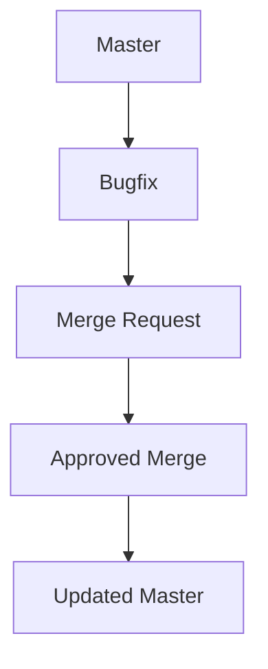

## Introduction to Git Merge Strategies

In the world of software development, version control systems like Git play a crucial role in managing changes to codebases. One of the most fundamental operations in Git is merging branches, which allows developers to integrate changes from one branch into another. This process is essential for maintaining a clean and organized codebase, especially in collaborative environments where multiple developers work on different features simultaneously.

### What is a Git Merge?

A Git merge is an operation that combines the changes from one branch into another. This process helps ensure that all the latest updates and fixes are integrated into the main branch, typically referred to as `master` or `main`. The merge operation can be performed using various strategies, each with its own advantages and use cases.

### Why Use Git Merge?

The primary reason for using Git merge is to keep the codebase synchronized across different branches. This ensures that all developers are working with the most up-to-date code and that any new features or bug fixes are properly integrated. Without proper merging, the codebase can become fragmented, leading to inconsistencies and potential conflicts.

### How Does Git Merge Work?

When you perform a Git merge, Git compares the commit history of the two branches and identifies the common ancestor. It then applies the changes from the source branch onto the target branch. This process can result in conflicts if the same lines of code have been modified in both branches. Resolving these conflicts is a critical part of the merge process.

### Example Scenario

Let's consider a scenario where you have a `bugfix` branch and a `master` branch. You've made several changes in the `bugfix` branch to fix a specific issue. Once you've tested your changes and confirmed that everything works correctly, you want to merge these changes into the `master` branch.



### Creating a Pull Request

Before merging, it's common practice to create a pull request (PR). This allows other team members to review the changes and provide feedback. In the given example, you would create a pull request from the `bugfix` branch to the `master` branch.

#### Steps to Create a Pull Request

1. **Switch to the Bugfix Branch**:
   ```sh
   git checkout bugfix
   ```

2. **Push the Bugfix Branch to Remote Repository**:
   ```sh
   git push origin bugfix
   ```

3. **Create a Pull Request**:
   - Navigate to your repository on the remote server (e.g., GitHub, GitLab).
   - Click on the "New Pull Request" button.
   - Select the base branch (`master`) and the compare branch (`bugfix`).

### Reviewing the Pull Request

Once the pull request is created, other team members can review the changes. They can comment on specific lines of code, suggest improvements, or approve the changes.

### Approving the Pull Request

If the changes are approved, the next step is to merge the `bugfix` branch into the `master` branch. This can be done via the user interface (UI) of the remote repository or through the command line.

#### Merging via UI

Most remote repositories provide a simple UI to merge branches. After reviewing the changes, you can click the "Merge" button to complete the process.

#### Merging via Command Line

Alternatively, you can perform the merge using the command line. Here’s how:

1. **Switch to the Master Branch**:
   ```sh
   git checkout master
   ```

2. **Fetch the Latest Changes**:
   ```sh
   git fetch origin
   ```

3. **Merge the Bugfix Branch**:
   ```sh
   git merge bugfix
   ```

4. **Push the Updated Master Branch**:
   ```sh
   git push origin master
   ```

### Handling Conflicts

During the merge process, conflicts may arise if the same lines of code have been modified in both branches. Git will mark these conflicts, and you'll need to resolve them manually.

#### Example Conflict Resolution

Consider the following scenario where the same line in `file.txt` has been modified in both branches:

**Original Code in `file.txt`:**
```txt
This is a test file.
```

**Changes in `master`:**
```txt
This is a test file for master.
```

**Changes in `bugfix`:**
```txt
This is a test file for bugfix.
```

When you attempt to merge, Git will mark the conflict:

```txt
<<<<<<< HEAD
This is a test file for master.
=======
This is a test file for bugfix.
>>>>>>> bugfix
```

To resolve this conflict, you need to edit the file and choose the correct version:

```txt
This is a test file for master and bugfix.
```

After resolving the conflict, you can continue with the merge process:

```sh
git add file.txt
git commit -m "Resolved merge conflict"
```

### Deleting the Source Branch

Once the merge is complete, it's common practice to delete the source branch to keep the repository clean. This can be done via the UI or the command line.

#### Deleting the Source Branch via Command Line

```sh
git branch -d bugfix
git push origin --delete bugfix
```

### Common Pitfalls and Best Practices

#### Common Pitfalls

1. **Merging Too Late**: Delaying merges can lead to more conflicts and make the merge process more difficult.
2. **Ignoring Reviews**: Skipping the review process can result in bugs or security vulnerabilities being merged into the main branch.
3. **Not Resolving Conflicts Properly**: Failing to resolve conflicts can leave the codebase in an inconsistent state.

#### Best Practices

1. **Regular Merges**: Regularly merge changes from the main branch into feature branches to keep them up-to-date.
2. **Thorough Reviews**: Ensure that all pull requests are thoroughly reviewed before merging.
3. **Automated Testing**: Use automated testing to catch issues early and reduce the likelihood of merging broken code.

### Real-World Examples

#### Recent CVEs and Breaches

One notable example of a breach related to improper branch management is the SolarWinds supply chain attack. In this case, attackers inserted malicious code into the SolarWinds Orion software, which was then distributed to thousands of organizations. This incident highlights the importance of thorough code reviews and regular merges to ensure that all changes are properly vetted.

### Secure Coding Practices

#### Vulnerable Code Example

Consider a scenario where a developer adds a new feature to a web application without properly sanitizing user input. This can lead to SQL injection vulnerabilities.

**Vulnerable Code:**
```python
def get_user_data(user_id):
    cursor.execute(f"SELECT * FROM users WHERE id = {user_id}")
    return cursor.fetchone()
```

#### Secure Code Example

To prevent SQL injection, the code should use parameterized queries.

**Secure Code:**
```python
def get_user_data(user_id):
    cursor.execute("SELECT * FROM users WHERE id = %s", (user_id,))
    return cursor.fetchone()
```

### Detection and Prevention

#### Detection

1. **Static Code Analysis**: Tools like SonarQube can help detect vulnerabilities in code.
2. **Dynamic Analysis**: Tools like Burp Suite can simulate attacks and identify weaknesses.

#### Prevention

1. **Code Reviews**: Regular code reviews can catch issues before they are merged.
2. **Automated Testing**: Automated tests can help ensure that all changes are properly validated.

### Conclusion

Git merge is a fundamental operation in version control that helps maintain a clean and organized codebase. By understanding the process, common pitfalls, and best practices, developers can effectively manage their codebases and prevent issues like security vulnerabilities. Regular merges, thorough reviews, and automated testing are key to ensuring a robust and secure codebase.

### Practice Labs

For hands-on experience with Git merge strategies, consider the following labs:

- **PortSwigger Web Security Academy**: Offers exercises on secure coding practices and vulnerability detection.
- **OWASP Juice Shop**: Provides a vulnerable web application for practicing secure coding and vulnerability identification.
- **DVWA (Damn Vulnerable Web Application)**: A deliberately insecure web application for learning about web application security.

By engaging in these labs, you can gain practical experience and deepen your understanding of Git merge strategies and secure coding practices.

---
<!-- nav -->
[[01-Introduction to Git Merge Strategies for Branch Synchronization|Introduction to Git Merge Strategies for Branch Synchronization]] | [[DevOps/DevOps Bootcamp/02-Version Control (Git)/08-Git Merge Strategies For Branch Synchronization/00-Overview|Overview]] | [[03-Understanding Git Merge Strategies for Branch Synchronization|Understanding Git Merge Strategies for Branch Synchronization]]
