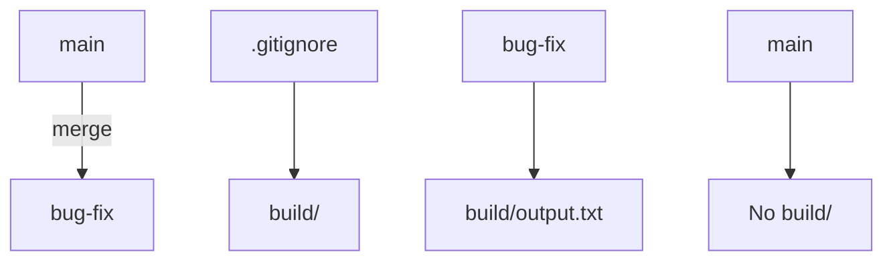

## Understanding Git Merge Strategies for Branch Synchronization

In the context of Git, merging branches is a fundamental operation that allows developers to integrate changes from one branch into another. This process is crucial for maintaining a coherent and up-to-date codebase. One of the key aspects of merging is handling ignored folders and ensuring that all changes from a specific branch are properly synchronized.

### What Are Ignored Folders?

Ignored folders are directories or files that are explicitly excluded from being tracked by Git. These are typically specified in a `.gitignore` file within the repository. The purpose of ignoring certain folders is to exclude files that are not relevant to the version control system, such as build artifacts, logs, or temporary files.

### Why Ignored Folders Matter During Merges

When merging branches, it's important to understand how Git handles ignored folders. If a folder is ignored, Git will not track changes to that folder. This means that if you merge a branch that contains changes to an ignored folder, those changes will not be reflected in the merged branch. This can lead to inconsistencies and unexpected behavior if not managed carefully.

### How Ignored Folders Are Handled During Merges

Let's consider a scenario where we have two branches: `main` and `bug-fix`. Suppose the `bug-fix` branch contains changes to a folder that is ignored in the `.gitignore` file. When we merge `bug-fix` into `main`, the ignored folder will not be included in the merge. This is because Git does not track changes to ignored folders.

#### Example Scenario

Suppose we have the following structure:

```
project/
├── .gitignore
├── src/
│   └── main.py
└── build/
    └── output.txt
```

The `.gitignore` file contains:

```plaintext
build/
```

This tells Git to ignore the `build` folder.

Now, let's say we have two branches: `main` and `bug-fix`. In the `bug-fix` branch, we make changes to the `build` folder:

```bash
# On branch bug-fix
mkdir build
echo "New output" > build/output.txt
```

When we merge `bug-fix` into `main`, the `build` folder will not be included in the merge because it is ignored.

### Full Example with Code

Let's walk through a complete example using Git commands.

#### Step 1: Initialize Repository and Create Branches

First, initialize a new Git repository and create the necessary branches:

```bash
mkdir project
cd project
git init
echo "build/" > .gitignore
git add .gitignore
git commit -m "Initial commit"
git checkout -b bug-fix
```

#### Step 2: Make Changes in `bug-fix` Branch

Next, make changes in the `bug-fix` branch:

```bash
mkdir build
echo "New output" > build/output.txt
git add .
git commit -m "Add build folder"
```

#### Step 3: Merge `bug-fix` into `main`

Now, switch back to the `main` branch and merge `bug-fix`:

```bash
git checkout main
git merge bug-fix
```

#### Step 4: Verify the Result

After the merge, verify that the `build` folder is not present in the `main` branch:

```bash
ls build
```

Since the `build` folder is ignored, it will not be present in the `main` branch after the merge.

### Mermaid Diagram for Branch Synchronization

To visualize the branch synchronization process, we can use a mermaid diagram:



### Pitfalls and Common Mistakes

One common mistake is assuming that ignored folders will be merged automatically. This can lead to unexpected behavior and inconsistencies in the codebase. To avoid this, it's important to review the `.gitignore` file and ensure that it accurately reflects the intended ignored folders.

### How to Prevent / Defend

#### Detection

To detect issues related to ignored folders during merges, you can use Git hooks or pre-commit scripts to check the contents of the `.gitignore` file and ensure that it aligns with your expectations.

#### Prevention

To prevent issues, follow these steps:

1. **Review `.gitignore`**: Regularly review the `.gitignore` file to ensure it correctly specifies the folders and files to be ignored.
2. **Use Pre-Commit Hooks**: Implement pre-commit hooks to check for changes in ignored folders and alert developers if they attempt to commit changes to ignored folders.
3. **Educate Developers**: Educate developers about the importance of ignored folders and the potential issues that can arise during merges.

#### Secure Coding Fix

Here is an example of a secure coding practice to handle ignored folders:

**Vulnerable Version:**

```bash
echo "build/" > .gitignore
mkdir build
echo "New output" > build/output.txt
git add .
git commit -m "Add build folder"
```

**Secure Version:**

```bash
echo "build/" > .gitignore
mkdir build
echo "New output" > build/output.txt
git add .
git commit -m "Add build folder"
git rm --cached build
```

By using `git rm --cached`, you ensure that the `build` folder is not tracked by Git, even if it was accidentally added.

### Real-World Examples

A real-world example of issues arising from ignored folders can be seen in various open-source projects where developers inadvertently commit changes to ignored folders. This can lead to confusion and inconsistencies in the codebase. For instance, in the Apache OpenOffice project, there were instances where developers committed changes to ignored build folders, leading to merge conflicts and inconsistencies.

### Practice Labs

For hands-on practice with Git merge strategies and branch synchronization, consider the following labs:

- **PortSwigger Web Security Academy**: Offers a section on Git and version control practices.
- **OWASP Juice Shop**: Provides a comprehensive set of challenges that involve Git operations and branch management.
- **DVWA (Damn Vulnerable Web Application)**: Includes scenarios where developers need to manage branches and merge strategies effectively.

By thoroughly understanding and practicing these concepts, you can ensure that your Git workflows are robust and free from common pitfalls.

---
<!-- nav -->
[[02-Introduction to Git Merge Strategies|Introduction to Git Merge Strategies]] | [[DevOps/DevOps Bootcamp/02-Version Control (Git)/08-Git Merge Strategies For Branch Synchronization/00-Overview|Overview]] | [[DevOps/DevOps Bootcamp/02-Version Control (Git)/08-Git Merge Strategies For Branch Synchronization/04-Practice Questions & Answers|Practice Questions & Answers]]
