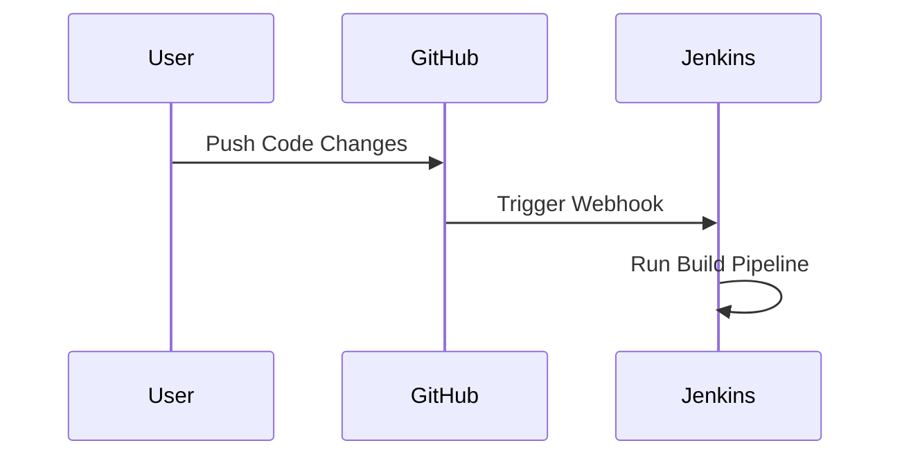

## Introduction to Git Integration with Build Automation Tools

In the realm of DevOps, one of the most critical aspects is the seamless integration between your build automation tools and your version control system, typically Git. This integration ensures that your development process is efficient, automated, and reliable. As a DevOps engineer, you will often be responsible for setting up and maintaining this integration. Understanding how this integration works is crucial for ensuring that your build processes are robust and secure.

### Background Theory

#### What is Git?

Git is a distributed version control system designed to handle everything from small to very large projects with speed and efficiency. It was created by Linus Torvalds in 2005 for Linux kernel development. Git allows developers to track changes in their codebase, collaborate with others, and maintain a history of all modifications.

#### What is Build Automation?

Build automation refers to the process of automating the creation of a software product, including compiling source code, running tests, and packaging the final product. This automation helps ensure consistency, reduces human error, and speeds up the development cycle.

### Integration Between Git and Build Automation Tools

The integration between Git and build automation tools like Jenkins, CircleCI, or Travis CI is essential for continuous integration and continuous delivery (CI/CD) pipelines. This integration allows the build automation tool to automatically trigger builds whenever changes are pushed to the Git repository.

#### Why is Integration Important?

1. **Consistency**: Automated builds ensure that the same steps are followed every time, reducing the chances of human error.
2. **Efficiency**: Builds can be triggered automatically, saving time and effort.
3. **Reliability**: Automated testing can catch issues early, improving the quality of the final product.
4. **Collaboration**: Multiple developers can work on the same project without conflicts, thanks to version control.

### Setting Up Integration

To set up integration between Git and a build automation tool, you need to configure the tool to listen for events from the Git repository. Here’s a step-by-step guide:

#### Step 1: Configure Webhooks

Most modern Git hosting services (like GitHub, GitLab, and Bitbucket) support webhooks. A webhook is a way for an app to provide other applications with real-time information. In this case, the webhook will notify the build automation tool whenever changes are pushed to the repository.



#### Step 2: Set Up Jenkins Job

In Jenkins, you can create a job that listens for webhook notifications from the Git repository. Here’s how to set it up:

1. **Create a New Job**:
   - Go to Jenkins dashboard.
   - Click on "New Item".
   - Enter a name for your job and select "Freestyle project".
   - Click "OK".

2. **Configure Source Code Management**:
   - Under "Source Code Management", select "Git".
   - Enter the URL of your Git repository.
   - Add credentials if required.

3. **Configure Build Triggers**:
   - Under "Build Triggers", check "GitHub hook trigger for GITScm polling".
   - Save the configuration.

#### Example Configuration

Here’s a complete example of a Jenkins job configuration:

```yaml
job:
  name: 'MyProject'
  scm:
    git:
      remote: 'https://github.com/myorg/myproject.git'
      credentials: 'my-github-credentials'
  triggers:
    - github:
        poll: true
  builders:
    - shell: |
        echo "Building project..."
        ./build.sh
```

### Git Commands Specific to Build Pipelines

In addition to setting up the integration, you may need to use specific Git commands within your build pipeline. These commands help you manage and interact with the Git repository programmatically.

#### Example Commands

1. **Getting Commit Hash of the Last Commit**

   To get the commit hash of the last commit, you can use the following command:

   ```bash
   git rev-parse HEAD
   ```

   This command returns the SHA-1 hash of the current commit.

2. **Checking for Changes in Frontend or Backend Code**

   You might want to check if changes have occurred in specific parts of your codebase to decide whether to run tests for those parts. You can use `git diff` to achieve this:

   ```bash
   git diff --name-only HEAD~1..HEAD | grep -E 'frontend|backend'
   ```

   This command checks the differences between the last two commits and filters the results to show only files related to the frontend or backend.

### Real-World Examples

#### Recent CVEs and Breaches

One notable example is the 2021 incident involving SolarWinds, where attackers exploited a supply chain vulnerability to inject malicious code into the company's software updates. This highlights the importance of robust CI/CD pipelines and the need to integrate Git with build automation tools to ensure that all changes are properly tested and validated.

### Pitfalls and Common Mistakes

1. **Manual Testing**: Relying solely on manual testing can lead to missed bugs and inconsistencies.
2. **Ignoring Webhooks**: Not setting up webhooks can result in delayed or missed build triggers.
3. **Incorrect Credentials**: Using incorrect or outdated credentials can cause authentication failures.

### How to Prevent / Defend

#### Detection

1. **Automated Testing**: Ensure that all changes are automatically tested before being merged into the main branch.
2. **Webhook Monitoring**: Monitor webhook notifications to ensure they are being received and processed correctly.

#### Prevention

1. **Secure Credentials**: Store credentials securely using Jenkins credentials management or environment variables.
2. **Regular Audits**: Regularly audit your CI/CD pipeline to identify and fix vulnerabilities.

#### Secure Coding Fixes

Here’s an example of a vulnerable and secure version of a script that uses Git commands:

**Vulnerable Version**

```bash
#!/bin/bash
git pull origin master
./build.sh
```

**Secure Version**

```bash
#!/bin/bash
# Ensure we are in the correct directory
cd /path/to/repo || exit

# Fetch latest changes
git fetch origin master

# Check if there are new changes
if ! git diff --quiet HEAD..origin/master; then
    # Pull changes
    git pull origin master

    # Run build script
    ./build.sh
fi
```

### Conclusion

Integrating Git with build automation tools is a fundamental aspect of modern DevOps practices. By setting up this integration and using specific Git commands within your build pipeline, you can ensure that your development process is efficient, automated, and secure. Always remember to follow best practices for detection and prevention to avoid common pitfalls.

### Practice Labs

For hands-on practice, consider the following labs:

- **PortSwigger Web Security Academy**: Offers comprehensive training on web security, including CI/CD pipelines.
- **OWASP Juice Shop**: A deliberately insecure web application for security training.
- **DVWA (Damn Vulnerable Web Application)**: Another popular web application for security training.

These labs will help you gain practical experience in setting up and managing Git integrations with build automation tools.

---
<!-- nav -->
[[DevOps/DevOps Bootcamp/02-Version Control (Git)/09-Git for DevOps Infrastructure Management/00-Overview|Overview]] | [[02-Introduction to Git for DevOps Infrastructure Management|Introduction to Git for DevOps Infrastructure Management]]
