## Introduction to Git Repositories and Branches

### What is a Git Repository?

A Git repository is a collection of files and directories that are tracked by Git, a distributed version control system. Each repository contains a history of changes made to the files, allowing developers to track modifications, revert to previous states, and collaborate effectively.

### Why Use Git?

Git is widely used because it provides robust tools for managing changes in codebases. It allows multiple developers to work on the same project simultaneously, merging their changes seamlessly. Additionally, Git supports branching and merging, which are essential for feature development and bug fixing.

### How Does Git Work Under the Hood?

At its core, Git uses a directed acyclic graph (DAG) to represent the history of changes. Each commit is a node in this graph, and the edges represent the parent-child relationships between commits. This structure allows Git to efficiently manage large histories and support complex workflows.

### Creating a Local Git Repository

To initialize a local Git repository, you use the `git init` command. This command creates a `.git` directory in your project folder, which contains all the necessary metadata for Git to track changes.

```bash
mkdir my_project
cd my_project
git init
```

### Adding Files to the Staging Area

Once you have initialized a Git repository, you can start tracking changes. To add files to the staging area, you use the `git add` command. This command marks the files for inclusion in the next commit.

```bash
# Add all files to the staging area
git add .

# Alternatively, add specific files
git add file1.txt file2.txt
```

### Committing Changes

After adding files to the staging area, you can commit the changes using the `git commit` command. A commit is a snapshot of the current state of the project.

```bash
git commit -m "Initial code"
```

### Checking the Status of Your Repository

The `git status` command shows the current state of your repository, including which files are staged, modified, or untracked.

```bash
git status
```

### Default Branch Name

When you initialize a Git repository, a default branch named `master` (or `main` in newer versions of Git) is created. This branch serves as the primary development branch.

```mermaid
graph TD
    A[Repository] --> B[Branch]
    B --> C[Commit]
    C --> D[Commit]
    D --> E[Commit]
    E --> F[Commit]
    F --> G[Commit]
    G --> H[Commit]
    H --> I[Commit]
    I --> J[Commit]
    J --> K[Commit]
    K --> L[Commit]
    L --> M[Commit]
    M --> N[Commit]
    N --> O[Commit]
    O --> P[Commit]
    P --> Q[Commit]
    Q --> R[Commit]
    R --> S[Commit]
    S --> T[Commit]
    T --> U[Commit]
    U --> V[Commit]
    V --> W[Commit]
    W --> X[Commit]
    X --> Y[Commit]
    Y --> Z[Commit]
    Z --> AA[Commit]
    AA --> AB[Commit]
    AB --> AC[Commit]
    AC --> AD[Commit]
    AD --> AE[Commit]
    AE --> AF[Commit]
    AF --> AG[Commit]
    AG --> AH[Commit]
    AH --> AI[Commit]
    AI --> AJ[Commit]
    AJ --> AK[Commit]
    AK --> AL[Commit]
    AL --> AM[Commit]
    AM --> AN[Commit]
    AN --> AO[Commit]
    AO --> AP[Commit]
    AP --> AQ[Commit]
    AQ --> AR[Commit]
    AR --> AS[Commit]
    AS --> AT[Commit]
    AT --> AU[Commit]
    AU --> AV[Commit]
    AV --> AW[Commit]
    AW --> AX[Commit]
    AX --> AY[Commit]
    AY --> AZ[Commit]
    AZ --> BA[Commit]
    BA --> BB[Commit]
    BB --> BC[Commit]
    BC --> BD[Commit]
    BD --> BE[Commit]
    BE --> BF[Commit]
    BF --> BG[Commit]
    BG --> BH[Commit]
    BH --> BI[Commit]
    BI --> BJ[Commit]
    BJ --> BK[Commit]
    BK --> BL[Commit]
    BL --> BM[[Branch]]
```



### Connecting to a Remote Repository

To push your local changes to a remote repository, you first need to establish a connection between the two repositories. This is done using the `git remote` command.

#### Adding a Remote Repository

You can add a remote repository using the `git remote add` command. The `origin` keyword is commonly used to refer to the main remote repository.

```bash
git remote add origin https://github.com/username/repo.git
```

### Pushing Changes to the Remote Repository

Once you have added a remote repository, you can push your local changes to it using the `git push` command.

```bash
git push origin master
```

### Handling Errors During Push

If you encounter an error during the push process, such as "no configuration for push destination," it means that Git does not know where to push the changes. Ensure that you have correctly set up the remote repository using the `git remote add` command.

### Real-World Example: GitHub Workflow

GitHub is one of the most popular platforms for hosting Git repositories. Here’s a step-by-step example of setting up a GitHub repository and pushing changes to it:

1. **Create a New Repository on GitHub**:
   - Log in to your GitHub account.
   - Click on the "+" icon in the top-right corner and select "New repository".
   - Fill in the repository details and click "Create repository".

2. **Clone the Repository Locally**:
   - Copy the URL of the newly created repository.
   - Clone the repository to your local machine using the `git clone` command.

   ```bash
   git clone https://github.com/username/repo.git
   ```

3. **Add and Commit Changes**:
   - Navigate to the cloned repository.
   - Make changes to the files and add them to the staging area.
   - Commit the changes.

   ```bash
   cd repo
   echo "Hello, World!" > hello.txt
   git add .
   git commit -m "Add hello.txt"
   ```

4. **Push Changes to the Remote Repository**:
   - Push the committed changes to the remote repository.

   ```bash
   git push origin master
   ```

### Common Pitfalls and How to Avoid Them

#### Forgetting to Stage Files

One common mistake is forgetting to stage files before committing. Always ensure that you have added the files to the staging area using `git add`.

#### Incorrect Branch Names

Ensure that you are working on the correct branch. Use `git branch` to check the current branch and `git checkout` to switch branches.

#### Conflicts During Push

Conflicts may occur if someone else has pushed changes to the remote repository since your last pull. Resolve conflicts by pulling the latest changes and merging them with your local changes.

### How to Prevent / Defend

#### Secure Coding Practices

Always follow secure coding practices when working with Git repositories. This includes:

- **Using Strong Authentication**: Use SSH keys or HTTPS with strong passwords for authentication.
- **Regularly Updating Dependencies**: Keep your dependencies up-to-date to avoid vulnerabilities.
- **Code Reviews**: Conduct regular code reviews to catch potential issues early.

#### Hardening Git Configurations

Hardening your Git configurations can help prevent unauthorized access and ensure the integrity of your repositories. Some steps include:

- **Enabling Two-Factor Authentication (2FA)**: Enable 2FA on your Git hosting service to add an extra layer of security.
- **Configuring Access Controls**: Use access controls to restrict who can push changes to the repository.
- **Monitoring Activity Logs**: Regularly monitor activity logs to detect any suspicious activity.

### Complete Example: Setting Up a Remote Repository

Here’s a complete example of setting up a remote repository and pushing changes to it:

1. **Initialize a Local Repository**:
   - Create a new directory and initialize a Git repository.

   ```bash
   mkdir my_project
   cd my_project
   git init
   ```

2. **Add and Commit Changes**:
   - Add files to the repository and commit the changes.

   ```bash
   echo "Hello, World!" > hello.txt
   git add .
   git commit -m "Initial code"
   ```

3. **Create a Remote Repository**:
   - Create a new repository on GitHub and copy the URL.

4. **Add the Remote Repository**:
   - Add the remote repository to your local repository.

   ```bash
   git remote add origin https://github.com/username/repo.git
   ```

5. **Push Changes to the Remote Repository**:
   - Push the committed changes to the remote repository.

   ```bash
   git push origin master
   ```

### Detection and Prevention

#### Detecting Unauthorized Access

Use tools like `git log` to review the commit history and detect any unauthorized changes.

```bash
git log --oneline
```

#### Preventing Unauthorized Access

Implement strict access controls and regularly review permissions to ensure that only authorized users have access to the repository.

### Conclusion

In this chapter, we covered the basics of initializing a local Git repository, adding and committing changes, connecting to a remote repository, and pushing changes. We also discussed common pitfalls and provided strategies for preventing unauthorized access and ensuring the security of your repositories.

### Practice Labs

For hands-on practice, consider the following labs:

- **PortSwigger Web Security Academy**: Offers a variety of labs focused on web application security.
- **OWASP Juice Shop**: A deliberately insecure web application for practicing web security skills.
- **DVWA (Damn Vulnerable Web Application)**: Another popular web application for learning web security.

These labs provide practical experience in working with Git repositories and securing your codebase.

---
<!-- nav -->
[[DevOps/DevOps Bootcamp/02-Version Control (Git)/11-Pushing Local Code to Remote Git Repository/00-Overview|Overview]] | [[02-Introduction to Git and Remote Repositories|Introduction to Git and Remote Repositories]]
