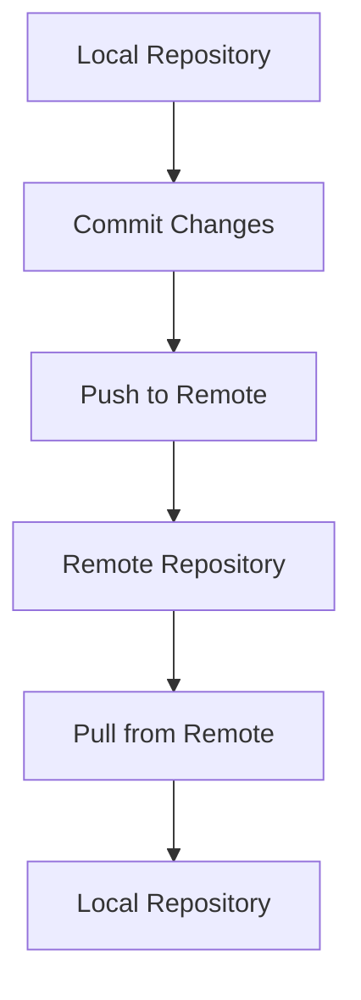

## Introduction to Git and Remote Repositories

Git is a distributed version control system designed to handle everything from small to very large projects with speed and efficiency. One of the key features of Git is its ability to work with remote repositories, which allows developers to collaborate on projects and share their code with others. In this section, we will delve into the process of pushing local code to a remote Git repository, explaining each step in detail and providing practical examples.

### What is a Remote Repository?

A remote repository is a Git repository located on a remote server. This server can be hosted on various platforms such as GitHub, GitLab, Bitbucket, or even a custom server. Remote repositories serve as a central location where multiple developers can push their changes and pull updates from other team members.

### Why Use Remote Repositories?

Remote repositories provide several benefits:

1. **Collaboration**: Multiple developers can work on the same project simultaneously.
2. **Backup**: Your code is stored on a remote server, providing an additional layer of protection against data loss.
3. **Version Control**: You can track changes and revert to previous versions if needed.
4. **Visibility**: Team members can review and comment on each other's code.

### Setting Up a Remote Repository

Before you can push your local code to a remote repository, you need to ensure that the remote repository is properly set up. This typically involves creating a new repository on a hosting platform and configuring it to accept pushes from your local machine.

#### Example: Creating a New Repository on GitHub

1. **Create a New Repository**:
    - Log in to your GitHub account.
    - Click on the "+" icon in the top-right corner and select "New repository".
    - Fill in the necessary details (repository name, description, etc.).
    - Click "Create repository".

2. **Configure the Remote Repository**:
    - Once the repository is created, GitHub provides a set of instructions to help you connect your local repository to the remote one.

```bash
# Clone the repository to your local machine
git clone https://github.com/username/repository.git

# Navigate to the cloned repository
cd repository
```

### Connecting Local Repository to Remote Repository

To connect your local repository to a remote repository, you need to specify the URL of the remote repository. This is done using the `git remote` command.

#### Command: `git remote add`

The `git remote add` command is used to add a new remote repository to your local repository.

```bash
# Add the remote repository
git remote add origin https://github.com/username/repository.git
```

Here, `origin` is the default name given to the remote repository. You can choose a different name if you prefer.

#### Explanation of the Command

- **`git remote add`**: This command adds a new remote repository to your local repository.
- **`origin`**: This is the name of the remote repository. By convention, the primary remote repository is named `origin`.
- **`https://github.com/username/repository.git`**: This is the URL of the remote repository.

### Pushing Changes to the Remote Repository

Once your local repository is connected to the remote repository, you can start pushing your changes. The `git push` command is used to send your local commits to the remote repository.

#### Command: `git push`

```bash
# Push the changes to the remote repository
git push origin master
```

Here, `origin` refers to the remote repository, and `master` is the name of the branch you want to push.

#### Explanation of the Command

- **`git push`**: This command sends your local commits to the remote repository.
- **`origin`**: This is the name of the remote repository.
- **`master`**: This is the name of the branch you want to push.

### Handling Branches

When you push your changes to a remote repository, you need to ensure that the branches are properly connected. If the remote repository does not have a corresponding branch, you may encounter errors.

#### Error: `the current branch master has no upstream branch`

This error occurs when the remote repository does not have a branch that corresponds to the local branch you are trying to push. To resolve this, you need to set the upstream branch.

#### Command: `git push --set-upstream`

```bash
# Set the upstream branch
git push --set-upstream origin master
```

Here, `--set-upstream` tells Git to set the upstream branch for the local branch.

#### Explanation of the Command

- **`git push --set-upstream`**: This command sets the upstream branch for the local branch.
- **`origin`**: This is the name of the remote repository.
- **`master`**: This is the name of the branch you want to push.

### Full Example: Pushing Local Code to Remote Repository

Let's walk through a complete example of pushing local code to a remote repository.

#### Step 1: Create a New Repository on GitHub

1. Log in to your GitHub account.
2. Click on the "+" icon in the top-right corner and select "New repository".
3. Fill in the necessary details and click "Create repository".

#### Step 2: Clone the Repository to Your Local Machine

```bash
# Clone the repository to your local machine
git clone https://github.com/username/repository.git

# Navigate to the cloned repository
cd repository
```

#### Step 3: Add Some Files and Commit Changes

```bash
# Create a new file
echo "Hello, World!" > hello.txt

# Add the file to the staging area
git add hello.txt

# Commit the changes
git commit -m "Add hello.txt"
```

#### Step 4: Connect Local Repository to Remote Repository

```bash
# Add the remote repository
git remote add origin https://github.com/username/repository.git
```

#### Step 5: Push the Changes to the Remote Repository

```bash
# Push the changes to the remote repository
git push --set-upstream origin master
```

### Raw HTTP Request and Response

When you run the `git push` command, Git communicates with the remote repository using HTTP or HTTPS. Here is an example of the raw HTTP request and response:

#### HTTP Request

```http
POST /repos/username/repository/git/refs/heads/master HTTP/1.1
Host: github.com
User-Agent: git/2.34.1
Content-Type: application/json
Authorization: token <your_token>
Accept: application/vnd.github.v3+json

{
  "sha": "commit_sha",
  "force": false
}
```

#### HTTP Response

```http
HTTP/1.1 201 Created
Date: Mon, 01 Jan 2024 00:00:00 GMT
Content-Type: application/json; charset=utf-8
Content-Length: 158
Connection: keep-alive
Server: GitHub.com

{
  "ref": "refs/heads/master",
  "url": "https://api.github.com/repos/username/repository/git/refs/heads/master",
  "object": {
    "type": "commit",
    "sha": "commit_sha",
    "url": "https://api.github.com/repos/username/repository/git/commits/commit_sha"
  }
}
```

### Mermaid Diagram: Git Workflow



### Common Pitfalls and How to Avoid Them

#### Pitfall 1: Incorrect Remote URL

Ensure that the URL of the remote repository is correct. An incorrect URL can lead to connection errors.

#### Pitfall 2: Untracked Branches

Make sure that the remote repository has a corresponding branch before pushing. Use `git push --set-upstream` to set the upstream branch.

#### Pitfall 3: Authentication Issues

Ensure that you have the necessary authentication credentials to access the remote repository. Use SSH keys or personal access tokens for secure authentication.

### How to Prevent / Defend

#### Detection

- **Use Git Hooks**: Implement pre-push hooks to validate changes before pushing them to the remote repository.
- **Continuous Integration (CI)**: Use CI tools like Jenkins, Travis CI, or GitHub Actions to automatically test and validate changes.

#### Prevention

- **Secure Authentication**: Use SSH keys or personal access tokens for secure authentication.
- **Branch Protection Rules**: Configure branch protection rules on the remote repository to restrict who can push to certain branches.

#### Secure Coding Fixes

##### Vulnerable Code

```bash
# Vulnerable code: Incorrect remote URL
git remote add origin https://github.com/incorrect/repo.git
```

##### Secure Code

```bash
# Secure code: Correct remote URL
git remote add origin https://github.com/username/repository.git
```

### Real-World Examples

#### Example: CVE-2021-22205

In 2021, a vulnerability was discovered in GitLab that allowed unauthorized users to bypass authentication and gain access to private repositories. This highlights the importance of securing your remote repositories and using strong authentication methods.

### Practice Labs

For hands-on practice with Git and remote repositories, consider the following labs:

- **PortSwigger Web Security Academy**: Offers a comprehensive course on web security, including Git and version control.
- **OWASP Juice Shop**: A deliberately insecure web application for security training.
- **DVWA (Damn Vulnerable Web Application)**: A PHP/MySQL web application that is riddled with vulnerabilities for educational purposes.

By following these steps and best practices, you can effectively manage your local and remote Git repositories, ensuring that your code is securely shared and collaborated upon.

---
<!-- nav -->
[[01-Introduction to Git Repositories and Branches|Introduction to Git Repositories and Branches]] | [[DevOps/DevOps Bootcamp/02-Version Control (Git)/11-Pushing Local Code to Remote Git Repository/00-Overview|Overview]] | [[03-Introduction to Local to Remote Git Workflow|Introduction to Local to Remote Git Workflow]]
