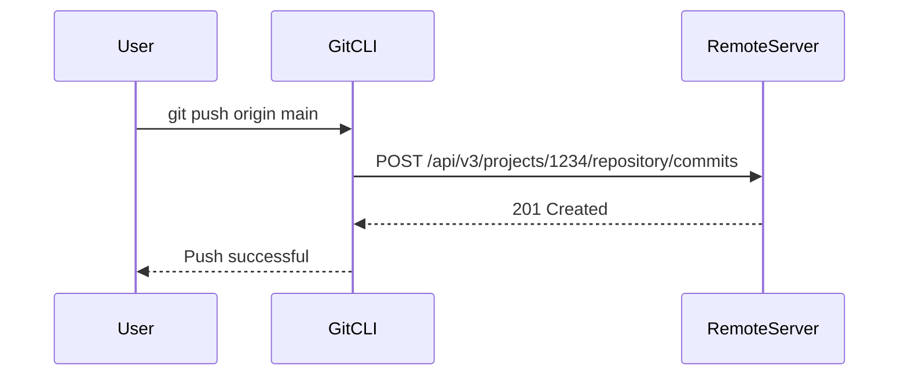

## Understanding Git Repositories and Remote Connections

### What is a Git Repository?

A Git repository is a directory that contains a `.git` folder. This folder holds all the metadata and objects necessary for Git to track changes to your files. The `.git` folder is the heart of a Git repository, storing information such as commit history, branches, tags, and more.

### The Role of the `.git` Folder

The `.git` folder is crucial because it maintains the connection between your local repository and the remote repository. It contains configuration files, references to commits, and other essential data. Here’s a breakdown of some key components within the `.git` folder:

- **config**: Contains configuration settings for the repository.
- **HEAD**: Points to the current branch or commit.
- **refs/heads**: Stores references to branches.
- **objects**: Holds the actual data of your commits.

### Connecting Local and Remote Repositories

When you initialize a Git repository (`git init`) or clone an existing one (`git clone`), Git sets up the `.git` folder. This folder includes information about how to connect to the remote repository, such as the URL and the branches that are tracked.

#### Example: Initializing a Git Repository

```bash
mkdir my-project
cd my-project
git init
```

This creates a new directory `my-project` and initializes a Git repository within it. The `.git` folder is created, and you can see its contents:

```bash
ls .git
```

### Deleting the `.git` Folder

If you delete the `.git` folder, your project will no longer be recognized as a Git repository. This means you lose all Git functionality, including the ability to track changes, commit, push, pull, and merge.

#### Example: Deleting the `.git` Folder

```bash
rm -rf .git
```

After deleting the `.git` folder, running `git status` will result in an error:

```bash
git status
# fatal: not a git repository (or any of the parent directories): .git
```

### Reconnecting to a Remote Repository

If you delete the `.git` folder and want to reconnect your local repository to a remote repository, you need to reinitialize the Git repository and set up the remote connection again.

#### Example: Reinitializing and Setting Up Remote Connection

```bash
git init
git remote add origin <remote-repository-url>
```

### Configuring Remote Repositories

To configure a remote repository, you use the `git remote` commands. These commands allow you to add, remove, and list remote repositories.

#### Adding a Remote Repository

```bash
git remote add origin <remote-repository-url>
```

#### Listing Remote Repositories

```bash
git remote -v
```

#### Removing a Remote Repository

```bash
git remote remove origin
```

### Real-World Example: CVE-2021-22205

In 2021, a critical vulnerability was discovered in GitLab, affecting versions 13.11 and earlier. The vulnerability allowed attackers to bypass authentication and gain unauthorized access to repositories. This highlights the importance of keeping your Git tools and servers up to date.

### How to Prevent / Defend

#### Detection

Regularly check for updates and security patches for your Git tools and servers. Use tools like `git log` to monitor changes and ensure no unauthorized modifications have been made.

#### Prevention

- **Keep Software Updated**: Ensure that all Git-related software is up to date.
- **Use Strong Authentication**: Implement strong authentication mechanisms, such as two-factor authentication (2FA).
- **Limit Access**: Restrict access to repositories based on roles and responsibilities.

#### Secure Coding Fixes

Here’s an example of how to securely configure a Git repository:

**Vulnerable Configuration:**

```bash
git config --global user.name "John Doe"
git config --global user.email "john.doe@example.com"
```

**Secure Configuration:**

```bash
git config --global user.name "John Doe"
git config --global user.email "john.doe@example.com"
git config --global core.editor "vim"
git config --global credential.helper "cache --timeout=3600"
```

### Complete Example: Full HTTP Request and Response

When pushing code to a remote repository, Git uses HTTP requests to communicate with the server. Here’s an example of a full HTTP request and response:

#### HTTP Request

```http
POST /api/v3/projects/1234/repository/commits HTTP/1.1
Host: gitlab.example.com
User-Agent: git/2.30.0
Accept: */*
Content-Type: application/json
Authorization: Bearer <access-token>
Content-Length: 123

{
  "branch": "main",
  "commit_message": "Add new feature",
  "actions": [
    {
      "action": "create",
      "file_path": "new-feature.txt",
      "content": "New feature content"
    }
  ]
}
```

#### HTTP Response

```http
HTTP/1.1 201 Created
Date: Mon, 01 Jan 2024 12:00:00 GMT
Server: nginx/1.18.0
Content-Type: application/json
Content-Length: 123

{
  "id": "abc123def456ghi789jkl012mno345stu678",
  "short_id": "abc123",
  "title": "Add new feature",
  "author_name": "John Doe",
  "created_at": "2024-01-01T12:00:00Z",
  "web_url": "https://gitlab.example.com/my-project/-/commit/abc123def456ghi789jkl012mno345stu678"
}
```

### Mermaid Diagrams

#### Sequence Diagram: Pushing Code to Remote Repository



### Hands-On Labs

For practical experience with Git and remote repositories, consider using the following labs:

- **PortSwigger Web Security Academy**: Offers exercises on securing Git repositories and handling sensitive data.
- **OWASP Juice Shop**: Provides a vulnerable web application where you can practice securing Git configurations.
- **DVWA (Damn Vulnerable Web Application)**: Includes scenarios where you can learn about securing Git repositories in a web application context.

By thoroughly understanding the role of the `.git` folder and how to manage connections between local and remote repositories, you can effectively maintain and secure your Git workflows.

---
<!-- nav -->
[[03-Introduction to Local to Remote Git Workflow|Introduction to Local to Remote Git Workflow]] | [[DevOps/DevOps Bootcamp/02-Version Control (Git)/11-Pushing Local Code to Remote Git Repository/00-Overview|Overview]] | [[DevOps/DevOps Bootcamp/02-Version Control (Git)/11-Pushing Local Code to Remote Git Repository/05-Practice Questions & Answers|Practice Questions & Answers]]
